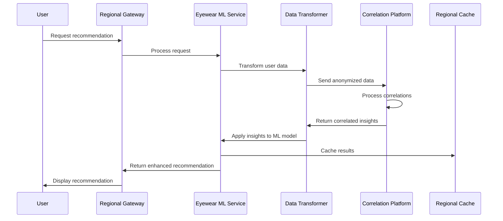

# Correlation Platform Integration

This documentation outlines the integration between the Eyewear ML Platform and the Correlation Platform, which provides advanced data analytics and customer behavior modeling capabilities.

## Overview

The Correlation Platform integration enables the Eyewear ML Platform to leverage sophisticated data correlation engines to identify patterns in customer behavior, product preferences, and regional trends. This integration supports the multi-region deployment architecture with specific data handling rules for NA and EU regions.

## Architecture

The integration follows a region-aware design pattern with the following components:

1. **Regional API Gateways**
   - NA Gateway (us-central1)
   - EU Gateway (europe-west1)

2. **Data Transformation Layer**
   - Handles region-specific data formats and compliance requirements
   - Standardizes data before sending to the Correlation Platform

3. **Secure Communication Channels**
   - Encrypted connections via VPC Peering
   - TLS 1.3 for all API communications
   - OAuth 2.0 token-based authentication

## Integration Flow



## Data Handling

The integration respects regional data sovereignty requirements:

- **NA Region**: Data processed in us-central1
- **EU Region**: Data processed in europe-west1 with GDPR compliance

Data transformation includes:
- Anonymization of personally identifiable information (PII)
- Aggregation of sensitive customer metrics
- Regional labeling to maintain data lineage

## API Endpoints

### Correlation Platform Endpoints

| Endpoint                    | Method | Description                            | Region       |
|-----------------------------|--------|----------------------------------------|--------------|
| `/api/v1/correlate/frames`  | POST   | Frame correlation analysis             | Multi-region |
| `/api/v1/correlate/styles`  | POST   | Style preference correlation           | Multi-region |
| `/api/v1/correlate/regions` | POST   | Regional trend analysis                | Multi-region |
| `/api/v1/correlate/events`  | POST   | Event-based behavior correlation       | Multi-region |

### Authentication

Correlation Platform API access requires:
- Client ID and Secret (stored in GCP Secret Manager)
- JWT tokens with 1-hour expiration
- Service account authentication for server-to-server communications

## Configuration

The integration leverages environment-specific configuration:

```yaml
correlation:
  platform:
    baseUrl: https://api.corr-platform.varai.ai
    timeout: 30000
    retries: 3
    regions:
      na:
        endpoint: https://na.api.corr-platform.varai.ai
        apiKey: ${CORR_PLATFORM_NA_API_KEY}
      eu:
        endpoint: https://eu.api.corr-platform.varai.ai
        apiKey: ${CORR_PLATFORM_EU_API_KEY}
```

## Error Handling

The integration implements robust error handling:
- Automatic retries for transient failures
- Circuit breaking for persistent errors
- Fallback to default recommendations when correlation service is unavailable
- Detailed error logging with correlation IDs

## Monitoring and Metrics

Key metrics tracked in the integration:
- Correlation API response times
- Success/failure rates
- Cache hit/miss ratios
- Regional data sovereignty compliance
- Data transformation performance

## Deployment Considerations

When deploying updates to the integration:
1. Ensure VPC connectors are properly configured in both regions
2. Verify Secret Manager contains up-to-date API credentials
3. Deploy changes first to NA region as a canary
4. Monitor performance before rolling out to EU region
5. Ensure Redis caches are properly sized for correlation data

## Future Enhancements

Planned improvements to the Correlation Platform integration:

1. Real-time correlation streaming for instant insights
2. Enhanced ML model feedback loops leveraging correlation data
3. Multi-dimensional correlation analysis for better recommendations
4. Integration with customer segmentation engines
5. Expanded regional support for APAC markets
