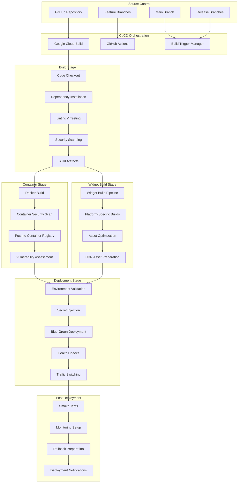
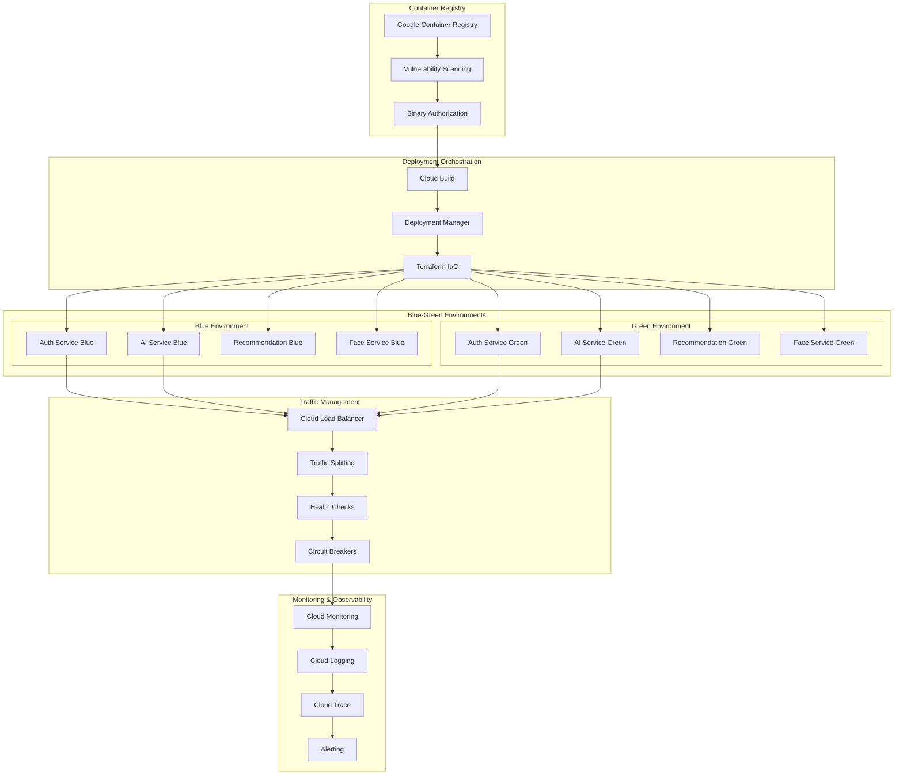

# Deployment and DevOps Architecture
## Agent 6: Deployment Architecture Agent

## Document Information
- **Document Type**: Deployment and DevOps Architecture
- **System**: EyewearML Varai AI Discovery E-commerce Integration
- **Version**: 1.0
- **Date**: January 2025
- **Author**: Agent 6 - Deployment Architecture Agent

## Executive Summary

This document defines the comprehensive deployment and DevOps architecture for the AI discovery e-commerce integration, building upon the existing GCP infrastructure with Cloud Run deployment patterns. The architecture ensures zero-downtime deployments, supports A/B testing and feature flags, and maintains high availability and reliability across multi-platform widget distribution.

## 1. CI/CD Pipeline Architecture

### 1.1 Multi-Stage Pipeline Design



### 1.2 Cloud Build Configuration

```yaml
# cloudbuild.yaml - Main CI/CD Pipeline
steps:
  # 1. Code Quality and Security
  - name: 'node:18-alpine'
    id: 'install-dependencies'
    entrypoint: 'npm'
    args: ['ci']
    env:
      - 'NODE_ENV=production'
  
  - name: 'node:18-alpine'
    id: 'lint-and-test'
    entrypoint: 'npm'
    args: ['run', 'ci:test']
    waitFor: ['install-dependencies']
  
  - name: 'gcr.io/cloud-builders/gcloud'
    id: 'security-scan'
    entrypoint: 'bash'
    args:
      - '-c'
      - |
        # Run security scans
        npm audit --audit-level=high
        # Additional security scanning with Snyk or similar
        if [ -f "package-lock.json" ]; then
          npx snyk test --severity-threshold=high
        fi
    waitFor: ['install-dependencies']
  
  # 2. Build Application Services
  - name: 'gcr.io/cloud-builders/docker'
    id: 'build-auth-service'
    args: [
      'build',
      '-t', 'gcr.io/$PROJECT_ID/auth-service:$BUILD_ID',
      '-t', 'gcr.io/$PROJECT_ID/auth-service:latest',
      '-f', 'backend/auth-api/Dockerfile',
      '--build-arg', 'NODE_ENV=production',
      'backend/auth-api'
    ]
    waitFor: ['lint-and-test']
  
  - name: 'gcr.io/cloud-builders/docker'
    id: 'build-ai-service'
    args: [
      'build',
      '-t', 'gcr.io/$PROJECT_ID/ai-service:$BUILD_ID',
      '-t', 'gcr.io/$PROJECT_ID/ai-service:latest',
      '-f', 'apps/ai-service/Dockerfile',
      '--build-arg', 'NODE_ENV=production',
      'apps/ai-service'
    ]
    waitFor: ['lint-and-test']
  
  - name: 'gcr.io/cloud-builders/docker'
    id: 'build-recommendation-service'
    args: [
      'build',
      '-t', 'gcr.io/$PROJECT_ID/recommendation-service:$BUILD_ID',
      '-t', 'gcr.io/$PROJECT_ID/recommendation-service:latest',
      '-f', 'apps/recommendation-service/Dockerfile',
      '--build-arg', 'NODE_ENV=production',
      'apps/recommendation-service'
    ]
    waitFor: ['lint-and-test']
  
  # 3. Build Widget Assets
  - name: 'node:18-alpine'
    id: 'build-widgets'
    entrypoint: 'bash'
    args:
      - '-c'
      - |
        # Build platform-specific widgets
        npm run build:widgets:all
        
        # Optimize assets
        npm run optimize:assets
        
        # Generate widget manifests
        npm run generate:widget-manifests
    waitFor: ['lint-and-test']
    env:
      - 'NODE_ENV=production'
      - 'BUILD_ID=$BUILD_ID'
  
  # 4. Container Security Scanning
  - name: 'gcr.io/cloud-builders/gcloud'
    id: 'scan-auth-service'
    entrypoint: 'bash'
    args:
      - '-c'
      - |
        gcloud container images scan gcr.io/$PROJECT_ID/auth-service:$BUILD_ID \
          --format='value(response.scan.analysisKind)' || exit 1
    waitFor: ['build-auth-service']
  
  - name: 'gcr.io/cloud-builders/gcloud'
    id: 'scan-ai-service'
    entrypoint: 'bash'
    args:
      - '-c'
      - |
        gcloud container images scan gcr.io/$PROJECT_ID/ai-service:$BUILD_ID \
          --format='value(response.scan.analysisKind)' || exit 1
    waitFor: ['build-ai-service']
  
  # 5. Deploy to Staging (Automatic)
  - name: 'gcr.io/cloud-builders/gcloud'
    id: 'deploy-staging'
    entrypoint: 'bash'
    args:
      - '-c'
      - |
        # Deploy to staging environment
        ./deploy/scripts/deploy.sh staging $BUILD_ID
    waitFor: ['scan-auth-service', 'scan-ai-service', 'build-widgets']
    env:
      - 'ENVIRONMENT=staging'
  
  # 6. Upload Widget Assets to CDN
  - name: 'gcr.io/cloud-builders/gsutil'
    id: 'upload-widget-assets'
    entrypoint: 'bash'
    args:
      - '-c'
      - |
        # Upload to staging CDN bucket
        gsutil -m cp -r dist/widgets/* gs://varai-cdn-staging/widgets/
        
        # Set cache headers
        gsutil -m setmeta -h "Cache-Control:public, max-age=31536000" \
          gs://varai-cdn-staging/widgets/**/*.js
        gsutil -m setmeta -h "Cache-Control:public, max-age=31536000" \
          gs://varai-cdn-staging/widgets/**/*.css
    waitFor: ['build-widgets']
  
  # 7. Integration Tests
  - name: 'node:18-alpine'
    id: 'integration-tests'
    entrypoint: 'bash'
    args:
      - '-c'
      - |
        # Wait for staging deployment to be ready
        sleep 30
        
        # Run integration tests against staging
        npm run test:integration:staging
    waitFor: ['deploy-staging', 'upload-widget-assets']
    env:
      - 'STAGING_API_URL=https://api-staging.varai.ai'
      - 'STAGING_WIDGET_URL=https://cdn-staging.varai.ai'

# Build triggers configuration
triggers:
  - name: 'main-branch-trigger'
    github:
      owner: 'eyewearml'
      name: 'varai-ai-discovery'
      push:
        branch: '^main$'
    filename: 'cloudbuild.yaml'
    
  - name: 'release-branch-trigger'
    github:
      owner: 'eyewearml'
      name: 'varai-ai-discovery'
      push:
        branch: '^release/.*$'
    filename: 'cloudbuild-release.yaml'
    
  - name: 'pr-validation-trigger'
    github:
      owner: 'eyewearml'
      name: 'varai-ai-discovery'
      pullRequest:
        branch: '^main$'
    filename: 'cloudbuild-pr.yaml'

# Build options
options:
  machineType: 'E2_HIGHCPU_8'
  diskSizeGb: 100
  logging: 'CLOUD_LOGGING_ONLY'
  
# Timeout configuration
timeout: '3600s'  # 1 hour

# Service account for builds
serviceAccount: 'projects/$PROJECT_ID/serviceAccounts/cicd-service-account@$PROJECT_ID.iam.gserviceaccount.com'
```

### 1.3 GitHub Actions Workflow

```yaml
# .github/workflows/ci-cd.yml
name: CI/CD Pipeline

on:
  push:
    branches: [main, develop, 'release/*']
  pull_request:
    branches: [main, develop]

env:
  GCP_PROJECT_ID: ml-datadriven-recos
  GCP_REGION: us-central1
  REGISTRY: gcr.io

jobs:
  # Code Quality and Security
  quality-gate:
    runs-on: ubuntu-latest
    steps:
      - name: Checkout code
        uses: actions/checkout@v4
        
      - name: Setup Node.js
        uses: actions/setup-node@v4
        with:
          node-version: '18'
          cache: 'npm'
          
      - name: Install dependencies
        run: npm ci
        
      - name: Run linting
        run: npm run lint
        
      - name: Run unit tests
        run: npm run test:unit
        
      - name: Run security audit
        run: npm audit --audit-level=high
        
      - name: SonarCloud Scan
        uses: SonarSource/sonarcloud-github-action@master
        env:
          GITHUB_TOKEN: ${{ secrets.GITHUB_TOKEN }}
          SONAR_TOKEN: ${{ secrets.SONAR_TOKEN }}
  
  # Build and Test Widgets
  widget-build:
    runs-on: ubuntu-latest
    needs: quality-gate
    strategy:
      matrix:
        platform: [shopify, magento, woocommerce, html]
    steps:
      - name: Checkout code
        uses: actions/checkout@v4
        
      - name: Setup Node.js
        uses: actions/setup-node@v4
        with:
          node-version: '18'
          cache: 'npm'
          
      - name: Install dependencies
        run: npm ci
        
      - name: Build ${{ matrix.platform }} widget
        run: npm run build:widget:${{ matrix.platform }}
        env:
          NODE_ENV: production
          PLATFORM: ${{ matrix.platform }}
          
      - name: Test ${{ matrix.platform }} widget
        run: npm run test:widget:${{ matrix.platform }}
        
      - name: Upload widget artifacts
        uses: actions/upload-artifact@v4
        with:
          name: widget-${{ matrix.platform }}
          path: dist/widgets/${{ matrix.platform }}/
          retention-days: 30
  
  # Container Build and Security Scan
  container-build:
    runs-on: ubuntu-latest
    needs: quality-gate
    strategy:
      matrix:
        service: [auth-service, ai-service, recommendation-service, face-service]
    steps:
      - name: Checkout code
        uses: actions/checkout@v4
        
      - name: Set up Docker Buildx
        uses: docker/setup-buildx-action@v3
        
      - name: Authenticate to Google Cloud
        uses: google-github-actions/auth@v2
        with:
          credentials_json: ${{ secrets.GCP_SA_KEY }}
          
      - name: Configure Docker for GCR
        run: gcloud auth configure-docker
        
      - name: Build container image
        run: |
          docker build \
            -t ${{ env.REGISTRY }}/${{ env.GCP_PROJECT_ID }}/${{ matrix.service }}:${{ github.sha }} \
            -t ${{ env.REGISTRY }}/${{ env.GCP_PROJECT_ID }}/${{ matrix.service }}:latest \
            -f apps/${{ matrix.service }}/Dockerfile \
            apps/${{ matrix.service }}
            
      - name: Scan container for vulnerabilities
        uses: aquasecurity/trivy-action@master
        with:
          image-ref: ${{ env.REGISTRY }}/${{ env.GCP_PROJECT_ID }}/${{ matrix.service }}:${{ github.sha }}
          format: 'sarif'
          output: 'trivy-results.sarif'
          
      - name: Upload Trivy scan results
        uses: github/codeql-action/upload-sarif@v3
        with:
          sarif_file: 'trivy-results.sarif'
          
      - name: Push container image
        if: github.ref == 'refs/heads/main' || startsWith(github.ref, 'refs/heads/release/')
        run: |
          docker push ${{ env.REGISTRY }}/${{ env.GCP_PROJECT_ID }}/${{ matrix.service }}:${{ github.sha }}
          docker push ${{ env.REGISTRY }}/${{ env.GCP_PROJECT_ID }}/${{ matrix.service }}:latest
  
  # Deploy to Staging
  deploy-staging:
    runs-on: ubuntu-latest
    needs: [widget-build, container-build]
    if: github.ref == 'refs/heads/main'
    environment: staging
    steps:
      - name: Checkout code
        uses: actions/checkout@v4
        
      - name: Authenticate to Google Cloud
        uses: google-github-actions/auth@v2
        with:
          credentials_json: ${{ secrets.GCP_SA_KEY }}
          
      - name: Set up Cloud SDK
        uses: google-github-actions/setup-gcloud@v2
        
      - name: Download widget artifacts
        uses: actions/download-artifact@v4
        with:
          path: dist/widgets/
          
      - name: Deploy to staging
        run: |
          chmod +x deploy/scripts/deploy.sh
          ./deploy/scripts/deploy.sh staging ${{ github.sha }}
          
      - name: Upload widgets to CDN
        run: |
          gsutil -m cp -r dist/widgets/* gs://varai-cdn-staging/widgets/
          gsutil -m setmeta -h "Cache-Control:public, max-age=31536000" \
            gs://varai-cdn-staging/widgets/**/*.js
            
      - name: Run smoke tests
        run: npm run test:smoke:staging
        env:
          STAGING_API_URL: https://api-staging.varai.ai
          
      - name: Notify deployment
        uses: 8398a7/action-slack@v3
        with:
          status: ${{ job.status }}
          channel: '#deployments'
          webhook_url: ${{ secrets.SLACK_WEBHOOK }}
  
  # Deploy to Production (Manual Approval)
  deploy-production:
    runs-on: ubuntu-latest
    needs: deploy-staging
    if: startsWith(github.ref, 'refs/heads/release/')
    environment: production
    steps:
      - name: Checkout code
        uses: actions/checkout@v4
        
      - name: Authenticate to Google Cloud
        uses: google-github-actions/auth@v2
        with:
          credentials_json: ${{ secrets.GCP_SA_KEY }}
          
      - name: Set up Cloud SDK
        uses: google-github-actions/setup-gcloud@v2
        
      - name: Deploy to production with blue-green
        run: |
          chmod +x deploy/blue-green/deploy.sh
          ./deploy/blue-green/deploy.sh prod ${{ github.sha }}
          
      - name: Upload widgets to production CDN
        run: |
          gsutil -m cp -r dist/widgets/* gs://varai-cdn-production/widgets/
          gsutil -m setmeta -h "Cache-Control:public, max-age=31536000" \
            gs://varai-cdn-production/widgets/**/*.js
            
      - name: Invalidate CDN cache
        run: |
          gcloud compute url-maps invalidate-cdn-cache varai-cdn-lb \
            --path="/widgets/*" --async
            
      - name: Run production smoke tests
        run: npm run test:smoke:production
        env:
          PRODUCTION_API_URL: https://api.varai.ai
          
      - name: Notify production deployment
        uses: 8398a7/action-slack@v3
        with:
          status: ${{ job.status }}
          channel: '#production-deployments'
          webhook_url: ${{ secrets.SLACK_WEBHOOK }}
```

## 2. Container Deployment Strategy

### 2.1 Cloud Run Deployment Architecture



### 2.2 Cloud Run Service Configuration

```yaml
# terraform/cloud-run-services.tf
resource "google_cloud_run_service" "auth_service_blue" {
  name     = "auth-service-blue"
  location = var.region
  project  = var.project_id

  template {
    metadata {
      annotations = {
        "autoscaling.knative.dev/minScale" = "3"
        "autoscaling.knative.dev/maxScale" = "100"
        "run.googleapis.com/cpu-throttling" = "false"
        "run.googleapis.com/execution-environment" = "gen2"
      }
      labels = {
        environment = var.environment
        service = "auth-service"
        deployment-type = "blue-green"
        version = var.image_tag
      }
    }

    spec {
      container_concurrency = 100
      timeout_seconds = 300
      service_account_name = google_service_account.auth_service.email

      containers {
        image = "gcr.io/${var.project_id}/auth-service:${var.image_tag}"
        
        ports {
          container_port = 8080
          name = "http1"
        }

        resources {
          limits = {
            cpu = "2000m"
            memory = "2Gi"
          }
          requests = {
            cpu = "1000m"
            memory = "1Gi"
          }
        }

        env {
          name = "NODE_ENV"
          value = var.environment
        }
        
        env {
          name = "PORT"
          value = "8080"
        }
        
        env {
          name = "DATABASE_URL"
          value_from {
            secret_key_ref {
              name = "${var.environment}-database-url"
              key = "latest"
            }
          }
        }
        
        env {
          name = "JWT_SECRET"
          value_from {
            secret_key_ref {
              name = "${var.environment}-jwt-secret"
              key = "latest"
            }
          }
        }

        # Health check configuration
        liveness_probe {
          http_get {
            path = "/health"
            port = 8080
          }
          initial_delay_seconds = 30
          period_seconds = 10
          timeout_seconds = 5
          failure_threshold = 3
        }

        readiness_probe {
          http_get {
            path = "/ready"
            port = 8080
          }
          initial_delay_seconds = 10
          period_seconds = 5
          timeout_seconds = 3
          failure_threshold = 2
        }
      }
    }
  }

  traffic {
    percent = 0  # Initially no traffic
    latest_revision = true
  }

  depends_on = [
    google_project_service.run_api,
    google_secret_manager_secret_version.database_url,
    google_secret_manager_secret_version.jwt_secret
  ]
}

# Green environment (similar configuration)
resource "google_cloud_run_service" "auth_service_green" {
  name     = "auth-service-green"
  location = var.region
  project  = var.project_id
  
  # Similar configuration to blue environment
  # ... (configuration details similar to blue)
}

# AI Service Blue
resource "google_cloud_run_service" "ai_service_blue" {
  name     = "ai-service-blue"
  location = var.region
  project  = var.project_id

  template {
    metadata {
      annotations = {
        "autoscaling.knative.dev/minScale" = "2"
        "autoscaling.knative.dev/maxScale" = "50"
        "run.googleapis.com/cpu-throttling" = "false"
        "run.googleapis.com/execution-environment" = "gen2"
      }
    }

    spec {
      container_concurrency = 50
      timeout_seconds = 600  # Longer timeout for AI processing
      
      containers {
        image = "gcr.io/${var.project_id}/ai-service:${var.image_tag}"
        
        resources {
          limits = {
            cpu = "4000m"
            memory = "8Gi"
          }
          requests = {
            cpu = "2000m"
            memory = "4Gi"
          }
        }

        env {
          name = "VERTEX_AI_PROJECT"
          value = var.project_id
        }
        
        env {
          name = "VERTEX_AI_REGION"
          value = var.region
        }
        
        env {
          name = "MODEL_ENDPOINT"
          value = var.vertex_ai_endpoint
        }
      }
    }
  }
}

# Load Balancer Configuration
resource "google_compute_global_address" "api_ip" {
  name = "varai-api-ip"
}

resource "google_compute_managed_ssl_certificate" "api_ssl" {
  name = "varai-api-ssl"

  managed {
    domains = ["api.varai.ai", "api-staging.varai.ai"]
  }
}

resource "google_compute_url_map" "api_lb" {
  name            = "varai-api-lb"
  default_service = google_compute_backend_service.auth_service.id

  host_rule {
    hosts        = ["api.varai.ai"]
    path_matcher = "production-paths"
  }
  
  host_rule {
    hosts        = ["api-staging.varai.ai"]
    path_matcher = "staging-paths"
  }

  path_matcher {
    name            = "production-paths"
    default_service = google_compute_backend_service.auth_service.id

    path_rule {
      paths   = ["/v1/ai/*"]
      service = google_compute_backend_service.ai_service.id
    }
    
    path_rule {
      paths   = ["/v1/face/*"]
      service = google_compute_backend_service.face_service.id
    }
    
    path_rule {
      paths   = ["/v1/recommendations/*"]
      service = google_compute_backend_service.recommendation_service.id
    }
  }
}

# Backend Services with Health Checks
resource "google_compute_backend_service" "auth_service" {
  name                  = "auth-service-backend"
  protocol              = "HTTP"
  timeout_sec           = 30
  enable_cdn            = false
  load_balancing_scheme = "EXTERNAL"

  backend {
    group = google_compute_region_network_endpoint_group.auth_service.id
  }

  health_checks = [google_compute_health_check.auth_service.id]
  
  # Circuit breaker configuration
  circuit_breakers {
    max_requests_per_connection = 100
    max_connections             = 1000
    max_pending_requests        = 100
    max_requests                = 1000
    max_retries                 = 3
  }
  
  # Outlier detection
  outlier_detection {
    consecutive_errors                    = 5
    consecutive_gateway_failure_threshold = 3
    interval {
      seconds = 30
    }
    base_ejection_time {
      seconds = 30
    }
    max_ejection_percent = 50
    min_health_percent   = 50
  }
}

resource "google_compute_health_check" "auth_service" {
  name = "auth-service-health-check"

  http_health_check {
    port         = 8080
    request_path = "/health"
  }

  check_interval_sec  = 10
  timeout_sec         = 5
  healthy_threshold   = 2
  unhealthy_threshold = 3
}
```

### 2.3 Container Security Configuration

```yaml
# Binary Authorization Policy
apiVersion: v1
kind: ConfigMap
metadata:
  name: binary-authorization-policy
data:
  policy.yaml: |
    defaultAdmissionRule:
      requireAttestationsBy:
        - projects/ml-datadriven-recos/attestors/security-attestor
        - projects/ml-datadriven-recos/attestors/quality-attestor
      enforcementMode: ENFORCED_BLOCK_AND_AUDIT_LOG
    
    clusterAdmissionRules:
      us-central1.prod-cluster:
        requireAttestationsBy:
          - projects/ml-datadriven-recos/attestors/security-attestor
          - projects/ml-datadriven-recos/attestors/quality-attestor
          - projects/ml-datadriven-recos/attestors/compliance-attestor
        enforcementMode: ENFORCED_BLOCK_AND_AUDIT_LOG
    
    admissionWhitelistPatterns:
      - namePattern: gcr.io/ml-datadriven-recos/*
    
    globalPolicyEvaluationMode: ENABLE

---
# Container Analysis Configuration
apiVersion: v1
kind: ConfigMap
metadata:
  name: container-analysis-config
data:
  scan-policy.yaml: |
    vulnerabilityPolicy:
      maximumFixableSeverity: HIGH
      maximumUnfixableSeverity: CRITICAL
      allowlistCves:
        - CVE-2021-44228  # Log4j (if using Java components)
      
    compliancePolicy:
      requiredAttestations:
        - security-scan-passed
        - vulnerability-scan-passed
        - license-compliance-passed
        
    imagePolicy:
      allowedRegistries:
        - gcr.io/ml-datadriven-recos
        - us-central1-docker.pkg.dev/ml-datadriven-recos
      
      blockedImages:
        - "*:latest"  # Prevent latest tag in production
        - "*:dev"
        - "*:test"
```

## Summary

This document provides the foundational CI/CD pipeline architecture and container deployment strategy for the AI discovery e-commerce integration. The architecture leverages existing GCP infrastructure with Cloud Run deployment patterns, ensuring zero-downtime deployments through blue-green strategies.

### Key Components Covered

1. **CI/CD Pipeline Architecture** - Multi-stage pipeline with Google Cloud Build and GitHub Actions
2. **Container Deployment Strategy** - Cloud Run services with blue-green deployment
3. **Widget Distribution Architecture** - Global CDN with Cloudflare and Google Cloud CDN
4. **Environment Management** - Multi-environment strategy with Infrastructure as Code

### Related Documents

For complete deployment architecture coverage, refer to these companion documents:

- **Environment Management and IaC**: [`environment-management-architecture.md`](environment-management-architecture.md)
- **Disaster Recovery and Rollback**: [`disaster-recovery-rollback-procedures.md`](disaster-recovery-rollback-procedures.md)
- **Monitoring and Observability**: [`monitoring-observability-architecture.md`](monitoring-observability-architecture.md)
- **A/B Testing and Feature Flags**: [`ab-testing-feature-flags-architecture.md`](ab-testing-feature-flags-architecture.md)

### Next Steps

1. Review and approve the CI/CD pipeline configuration
2. Set up the blue-green deployment infrastructure
3. Configure CDN distribution for widget assets
4. Implement environment-specific configurations
5. Establish monitoring and alerting systems

This architecture ensures high availability, reliability, and scalability while supporting the multi-platform widget distribution requirements.