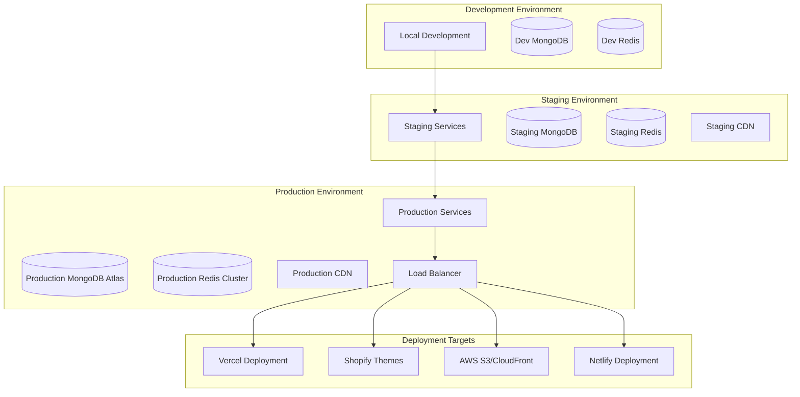

# Store Generation Service - Deployment Patterns & Integration

## Overview

This document defines the deployment patterns, integration strategies, and operational considerations for the Store Generation Service. It complements the main architecture and component specifications to provide a complete implementation guide.

## Deployment Architecture



## 1. Platform-Specific Deployment Patterns

### Static HTML Deployment

#### Vercel Deployment Pattern
```yaml
# vercel.json
{
  "version": 2,
  "builds": [
    {
      "src": "store/**/*",
      "use": "@vercel/static"
    }
  ],
  "routes": [
    {
      "src": "/products/(.*)",
      "dest": "/products/$1.html"
    },
    {
      "src": "/categories/(.*)",
      "dest": "/categories/$1.html"
    },
    {
      "src": "/(.*)",
      "dest": "/$1.html"
    }
  ],
  "headers": [
    {
      "source": "/(.*)",
      "headers": [
        {
          "key": "Cache-Control",
          "value": "public, max-age=31536000, immutable"
        }
      ]
    }
  ]
}
```

#### AWS S3/CloudFront Pattern
```yaml
# cloudformation-template.yaml
AWSTemplateFormatVersion: '2010-09-09'
Resources:
  StoreBucket:
    Type: AWS::S3::Bucket
    Properties:
      BucketName: !Sub '${StoreName}-static-store'
      WebsiteConfiguration:
        IndexDocument: index.html
        ErrorDocument: error.html
      PublicAccessBlockConfiguration:
        BlockPublicAcls: false
        BlockPublicPolicy: false
        IgnorePublicAcls: false
        RestrictPublicBuckets: false
      
  CloudFrontDistribution:
    Type: AWS::CloudFront::Distribution
    Properties:
      DistributionConfig:
        Origins:
          - Id: S3Origin
            DomainName: !GetAtt StoreBucket.DomainName
            S3OriginConfig:
              OriginAccessIdentity: !Sub 'origin-access-identity/cloudfront/${OriginAccessIdentity}'
        DefaultCacheBehavior:
          TargetOriginId: S3Origin
          ViewerProtocolPolicy: redirect-to-https
          CachePolicyId: 4135ea2d-6df8-44a3-9df3-4b5a84be39ad # Managed-CachingOptimized
        PriceClass: PriceClass_100
        Enabled: true
        HttpVersion: http2
        IPV6Enabled: true
```

### Shopify Theme Deployment

#### Liquid Template Conversion
```liquid
<!-- product.liquid -->

<script type="application/ld+json">
{
  "@context": "https://schema.org",
  "@type": "Product",
  "name": {{ product.title | json }},
  "description": {{ product.description | strip_html | json }},
  "sku": {{ product.selected_or_first_available_variant.sku | json }},
  "brand": {
    "@type": "Brand",
    "name": {{ shop.name | json }}
  },
  "offers": {
    "@type": "Offer",
    "price": {{ product.selected_or_first_available_variant.price | divided_by: 100.0 | json }},
    "priceCurrency": {{ cart.currency.iso_code | json }},
    "availability": "InStockOutOfStock"
  }
}
</script>

<div class="product-page" data-product-id="{{ product.id }}">
  <div class="product-images">
    
      
    
  </div>
  
  <div class="product-info">
    <h1>{{ product.title }}</h1>
    <div class="price">
      <span class="current-price">{{ product.selected_or_first_available_variant.price | money }}</span>
      
        <span class="original-price">{{ product.selected_or_first_available_variant.compare_at_price | money }}</span>
      
    </div>
    
    <!-- Face Shape Compatibility -->
    
      <div class="face-shape-compatibility">
        <h3>Face Shape Compatibility</h3>
        
        
          <div class="face-shape-score">
            <span class="shape-name">{{ face_shape.shape | capitalize }}</span>
            <div class="score-bar">
              <div class="score-fill" style="width: {{ face_shape.score | times: 100 }}%"></div>
            </div>
            <span class="score-value">{{ face_shape.score | times: 100 | round }}%</span>
          </div>
        
      </div>
    
    
    <div class="product-form">
      
        <select name="id" class="variant-selector">
          
            <option value="{{ variant.id }}" selected>
              {{ variant.title }} - {{ variant.price | money }}
            </option>
          
        </select>
        
        <button type="submit" class="add-to-cart-btn" disabled>
          Add to CartSold Out
        </button>
      
    </div>
  </div>
</div>
```

#### Shopify Deployment Configuration
```yaml
# shopify-deployment.yaml
shopify:
  store_url: "example.myshopify.com"
  theme_name: "VARAi Enhanced Store"
  api_version: "2023-10"
  
  product_sync:
    enabled: true
    sync_inventory: true
    sync_pricing: true
    sync_metafields: true
    batch_size: 100
    
  metafields:
    face_shape_scores:
      namespace: "custom"
      key: "face_shape_scores"
      type: "json"
    
    ai_recommendations:
      namespace: "custom"
      key: "ai_recommendations"
      type: "json"
    
    size_guide:
      namespace: "custom"
      key: "size_guide"
      type: "json"

  webhooks:
    product_update: "https://api.varai.com/webhooks/shopify/product-update"
    order_created: "https://api.varai.com/webhooks/shopify/order-created"
    inventory_update: "https://api.varai.com/webhooks/shopify/inventory-update"
```

## 2. Performance Optimization Patterns

### Caching Strategy

#### Multi-Level Caching Architecture
```yaml
caching:
  levels:
    # L1: In-Memory Cache (Redis)
    l1_cache:
      provider: "redis"
      ttl: 300  # 5 minutes
      max_memory: "1GB"
      eviction_policy: "allkeys-lru"
      
    # L2: Application Cache
    l2_cache:
      provider: "application"
      ttl: 3600  # 1 hour
      max_entries: 10000
      
    # L3: CDN Cache
    l3_cache:
      provider: "cloudfront"
      ttl: 86400  # 24 hours
      invalidation_strategy: "tag-based"

  cache_keys:
    product_data: "product:{product_id}:v{version}"
    template_rendered: "template:{template_id}:{hash}"
    asset_optimized: "asset:{asset_id}:{optimization_config_hash}"
    store_generated: "store:{store_config_hash}"
    
  cache_warming:
    enabled: true
    popular_products_threshold: 100  # views per day
    warming_schedule: "0 2 * * *"  # Daily at 2 AM
```

### Progressive Loading Strategy
```javascript
// progressive-loading.js
class ProgressiveStoreLoader {
  constructor() {
    this.criticalAssets = new Set();
    this.loadingQueue = [];
    this.observer = new IntersectionObserver(this.handleIntersection.bind(this));
  }
  
  // Load critical above-the-fold content first
  loadCriticalContent() {
    return Promise.all([
      this.loadCriticalCSS(),
      this.loadHeroImages(),
      this.loadNavigationData(),
      this.preloadKeyFonts()
    ]);
  }
  
  // Lazy load below-the-fold content
  setupLazyLoading() {
    const lazyElements = document.querySelectorAll('[data-lazy]');
    lazyElements.forEach(el => this.observer.observe(el));
  }
  
  handleIntersection(entries) {
    entries.forEach(entry => {
      if (entry.isIntersecting) {
        this.loadElement(entry.target);
        this.observer.unobserve(entry.target);
      }
    });
  }
  
  async loadElement(element) {
    const src = element.dataset.src;
    const type = element.dataset.type;
    
    switch (type) {
      case 'image':
        await this.loadImage(element, src);
        break;
      case 'component':
        await this.loadComponent(element, src);
        break;
      case 'data':
        await this.loadData(element, src);
        break;
    }
  }
}
```

## 3. Integration Patterns

### MongoDB Integration Pattern
```python
class ProductDataService:
    """
    Optimized MongoDB integration with connection pooling and caching
    """
    
    def __init__(self, config: MongoDBConfig):
        self.config = config
        self.client = AsyncIOMotorClient(
            config.connection_string,
            maxPoolSize=config.max_pool_size,
            minPoolSize=config.min_pool_size,
            serverSelectionTimeoutMS=config.server_selection_timeout
        )
        self.db = self.client[config.database_name]
        self.cache = CacheManager()
        
    async def fetch_products_for_store(self, config: StoreConfig) -> List[EnhancedProduct]:
        """
        Fetch products with optimized aggregation pipeline
        """
        cache_key = f"store_products:{hash(config)}"
        cached_result = await self.cache.get(cache_key)
        
        if cached_result:
            return cached_result
            
        pipeline = [
            # Match active products for the store
            {"$match": {
                "is_active": True,
                "brand_id": {"$in": config.brand_ids} if config.brand_ids else {"$exists": True},
                "category_id": {"$in": config.category_ids} if config.category_ids else {"$exists": True}
            }},
            
            # Lookup related data in parallel
            {"$lookup": {
                "from": "brands",
                "localField": "brand_id",
                "foreignField": "_id",
                "as": "brand",
                "pipeline": [{"$project": {"name": 1, "logo_url": 1}}]
            }},
            
            {"$lookup": {
                "from": "categories",
                "localField": "category_id",
                "foreignField": "_id",
                "as": "category",
                "pipeline": [{"$project": {"name": 1, "slug": 1, "parent_id": 1}}]
            }},
            
            {"$lookup": {
                "from": "face_shape_compatibility",
                "localField": "_id",
                "foreignField": "product_id",
                "as": "face_shape_scores"
            }},
            
            {"$lookup": {
                "from": "product_images",
                "localField": "_id",
                "foreignField": "product_id",
                "as": "images",
                "pipeline": [
                    {"$sort": {"sort_order": 1}},
                    {"$project": {"url": 1, "alt_text": 1, "sort_order": 1}}
                ]
            }},
            
            # Add computed fields
            {"$addFields": {
                "brand": {"$arrayElemAt": ["$brand", 0]},
                "category": {"$arrayElemAt": ["$category", 0]},
                "effective_price": {
                    "$cond": {
                        "if": {"$gt": ["$sale_price", 0]},
                        "then": "$sale_price",
                        "else": "$regular_price"
                    }
                },
                "is_on_sale": {"$gt": ["$sale_price", 0]},
                "face_shape_map": {
                    "$arrayToObject": {
                        "$map": {
                            "input": "$face_shape_scores",
                            "as": "score",
                            "in": {
                                "k": "$$score.face_shape",
                                "v": "$$score.compatibility_score"
                            }
                        }
                    }
                }
            }},
            
            # Sort by relevance and popularity
            {"$sort": {
                "featured": -1,
                "popularity_score": -1,
                "created_at": -1
            }},
            
            # Limit results if specified
            {"$limit": config.max_products or 10000}
        ]
        
        cursor = self.db.products.aggregate(pipeline)
        products = await cursor.to_list(None)
        
        # Convert to enhanced product objects
        enhanced_products = [
            EnhancedProduct.from_mongodb(product_data) 
            for product_data in products
        ]
        
        # Cache result
        await self.cache.set(cache_key, enhanced_products, ttl=3600)
        
        return enhanced_products
```

### Vertex AI Integration Pattern
```python
class VertexAIIntegration:
    """
    Integration with Vertex AI for enhanced product recommendations
    """
    
    def __init__(self, config: VertexAIConfig):
        self.config = config
        self.client = aiplatform.gapic.PredictionServiceClient(
            client_options={"api_endpoint": config.endpoint}
        )
        self.cache = CacheManager()
        
    async def enhance_store_with_ai(self, store: StoreStructure, 
                                  products: List[EnhancedProduct]) -> AIEnhancedStore:
        """
        Enhance store with AI-powered features
        """
        enhanced_pages = []
        
        for page in store.pages:
            if page.page_type == 'product':
                # Get product recommendations
                recommendations = await self.get_product_recommendations(
                    page.context['product'], products
                )
                page.context['ai_recommendations'] = recommendations
                
                # Enhance product description
                enhanced_description = await self.enhance_product_description(
                    page.context['product']
                )
                page.context['ai_enhanced_description'] = enhanced_description
                
            elif page.page_type == 'category':
                # Get trending products for category
                trending = await self.get_trending_products(
                    page.context['category'], products
                )
                page.context['trending_products'] = trending
                
            elif page.page_type == 'home':
                # Get personalized homepage content
                personalized_content = await self.get_personalized_homepage_content(
                    products
                )
                page.context['personalized_content'] = personalized_content
                
            enhanced_pages.append(page)
        
        return AIEnhancedStore(
            pages=enhanced_pages,
            ai_features_used=['recommendations', 'description_enhancement', 'trending_analysis'],
            enhancement_timestamp=datetime.utcnow()
        )
    
    async def get_product_recommendations(self, product: EnhancedProduct,
                                        all_products: List[EnhancedProduct],
                                        num_recommendations: int = 4) -> List[ProductRecommendation]:
        """
        Get AI-powered product recommendations
        """
        cache_key = f"recommendations:{product.id}:{num_recommendations}"
        cached_result = await self.cache.get(cache_key)
        
        if cached_result:
            return cached_result
            
        # Prepare prediction request
        instance = {
            "product_id": str(product.id),
            "category_id": str(product.category_id),
            "brand_id": str(product.brand_id),
            "price": float(product.get_effective_price()),
            "face_shape_scores": product.face_shape_scores or {},
            "features": {
                "frame_material": product.frame_material,
                "lens_type": product.lens_type,
                "frame_shape": product.frame_shape,
                "color": product.primary_color
            }
        }
        
        # Make prediction
        response = await self.client.predict(
            endpoint=self.config.recommendation_endpoint,
            instances=[instance]
        )
        
        # Process recommendations
        recommendations = []
        for prediction in response.predictions[0]['recommended_products']:
            recommended_product = next(
                (p for p in all_products if str(p.id) == prediction['product_id']),
                None
            )
            if recommended_product:
                recommendations.append(ProductRecommendation(
                    product=recommended_product,
                    confidence_score=prediction['confidence'],
                    reason=prediction['reason']
                ))
        
        # Cache result
        await self.cache.set(cache_key, recommendations, ttl=7200)
        
        return recommendations[:num_recommendations]
```

## 4. Monitoring and Observability

### Performance Monitoring
```yaml
monitoring:
  metrics:
    generation_time:
      type: "histogram"
      buckets: [1, 5, 10, 30, 60, 120, 300]
      labels: ["store_size", "template_type", "deployment_target"]
      
    lighthouse_scores:
      type: "gauge"
      labels: ["page_type", "store_id", "metric_type"]
      
    asset_optimization_ratio:
      type: "histogram"
      buckets: [0.1, 0.2, 0.3, 0.5, 0.7, 0.8, 0.9]
      labels: ["asset_type", "format"]
      
    deployment_success_rate:
      type: "counter"
      labels: ["target_platform", "store_type"]
      
  alerts:
    generation_time_high:
      condition: "generation_time > 45s"
      severity: "warning"
      
    generation_failure:
      condition: "generation_failure_rate > 5%"
      severity: "critical"
      
    lighthouse_score_low:
      condition: "lighthouse_score < 85"
      severity: "warning"
      
  dashboards:
    - name: "Store Generation Overview"
      panels:
        - generation_time_trends
        - success_rate_by_platform
        - asset_optimization_metrics
        
    - name: "Performance Quality"
      panels:
        - lighthouse_scores_distribution
        - core_web_vitals_trends
        - seo_compliance_metrics
```

### Health Checks
```python
class HealthCheckService:
    """
    Comprehensive health checking for store generation service
    """
    
    def __init__(self):
        self.checks = {
            'mongodb': self.check_mongodb_health,
            'redis': self.check_redis_health,
            'template_engine': self.check_template_engine,
            'asset_processor': self.check_asset_processor,
            'cdn': self.check_cdn_connectivity,
            'vertex_ai': self.check_vertex_ai
        }
        
    async def get_health_status(self) -> HealthStatus:
        """
        Run all health checks and return status
        """
        results = {}
        overall_healthy = True
        
        for check_name, check_func in self.checks.items():
            try:
                result = await check_func()
                results[check_name] = result
                if not result.healthy:
                    overall_healthy = False
            except Exception as e:
                results[check_name] = CheckResult(
                    healthy=False,
                    message=f"Health check failed: {str(e)}",
                    details={'error': str(e)}
                )
                overall_healthy = False
        
        return HealthStatus(
            healthy=overall_healthy,
            checks=results,
            timestamp=datetime.utcnow()
        )
```

## 5. Security Considerations

### API Security
```yaml
security:
  authentication:
    method: "JWT"
    issuer: "varai-store-generation"
    audience: "varai-api"
    
  authorization:
    rbac:
      roles:
        - name: "store_admin"
          permissions: ["generate_store", "deploy_store", "manage_templates"]
        - name: "store_user"
          permissions: ["generate_store", "view_status"]
        - name: "api_client"
          permissions: ["generate_store"]
          
  rate_limiting:
    global:
      requests_per_minute: 100
      burst_capacity: 20
      
    per_user:
      requests_per_minute: 10
      burst_capacity: 5
      
  data_protection:
    encryption_at_rest: true
    encryption_in_transit: true
    pii_handling:
      - anonymize_logs: true
      - data_retention_days: 90
      - gdpr_compliance: true
```

This deployment and integration guide provides the operational framework needed to successfully implement and maintain the Store Generation Service across different environments and platforms.