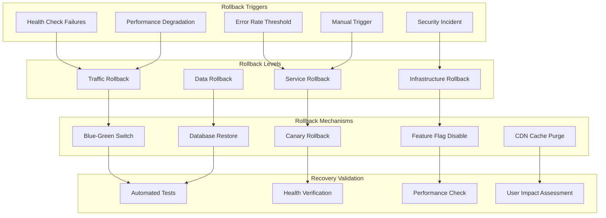
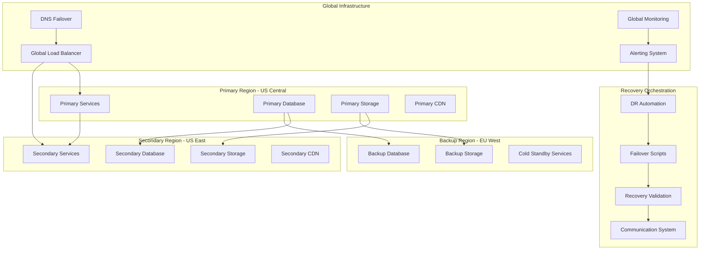

# Disaster Recovery and Rollback Procedures
## Agent 6: Deployment Architecture Agent - Part 3

## Document Information
- **Document Type**: Disaster Recovery and Rollback Procedures
- **System**: EyewearML Varai AI Discovery E-commerce Integration
- **Version**: 1.0
- **Date**: January 2025
- **Author**: Agent 6 - Deployment Architecture Agent
- **Parent Document**: [Deployment and DevOps Architecture](deployment-devops-architecture.md)

## Executive Summary

This document defines comprehensive disaster recovery and rollback procedures for the AI discovery e-commerce integration. It covers automated rollback mechanisms, disaster recovery strategies, backup procedures, and business continuity planning to ensure high availability and rapid recovery from failures.

## 1. Rollback Architecture

### 1.1 Multi-Level Rollback Strategy



### 1.2 Automated Rollback Configuration

```yaml
# rollback-config.yaml
rollback_policies:
  automatic_triggers:
    health_check_failures:
      threshold: 3
      time_window: "5m"
      action: "traffic_rollback"
      
    error_rate_threshold:
      threshold: "5%"
      time_window: "10m"
      action: "service_rollback"
      
    response_time_degradation:
      threshold: "p95 > 5s"
      time_window: "15m"
      action: "traffic_rollback"
      
    availability_threshold:
      threshold: "99%"
      time_window: "30m"
      action: "service_rollback"

  rollback_strategies:
    traffic_rollback:
      method: "blue_green_switch"
      execution_time: "30s"
      validation_period: "5m"
      
    service_rollback:
      method: "previous_revision"
      execution_time: "2m"
      validation_period: "10m"
      
    infrastructure_rollback:
      method: "terraform_state_rollback"
      execution_time: "10m"
      validation_period: "15m"

  validation_checks:
    post_rollback:
      - health_check_all_services
      - performance_baseline_verification
      - user_journey_smoke_tests
      - data_integrity_checks
      
    success_criteria:
      health_check_success_rate: "100%"
      error_rate: "< 1%"
      response_time_p95: "< 2s"
      user_journey_success_rate: "> 95%"
```

### 1.3 Blue-Green Rollback Implementation

```bash
#!/bin/bash
# deploy/blue-green/rollback.sh

set -euo pipefail

# Configuration
SCRIPT_DIR="$(cd "$(dirname "${BASH_SOURCE[0]}")" && pwd)"
DEPLOY_DIR="$(dirname "$SCRIPT_DIR")"
PROJECT_ROOT="$(dirname "$DEPLOY_DIR")"

# Colors for output
RED='\033[0;31m'
GREEN='\033[0;32m'
YELLOW='\033[1;33m'
BLUE='\033[0;34m'
NC='\033[0m'

log() {
    echo -e "${BLUE}[$(date +'%Y-%m-%d %H:%M:%S')]${NC} $1"
}

error() {
    echo -e "${RED}[ERROR]${NC} $1" >&2
}

success() {
    echo -e "${GREEN}[SUCCESS]${NC} $1"
}

warning() {
    echo -e "${YELLOW}[WARNING]${NC} $1"
}

# Load configuration
load_config() {
    local env=$1
    local config_file="$DEPLOY_DIR/config/$env.yaml"
    
    if [[ ! -f "$config_file" ]]; then
        error "Configuration file not found: $config_file"
        exit 1
    fi
    
    PROJECT_ID=$(grep "project_id:" "$config_file" | awk '{print $2}')
    REGION=$(grep "region:" "$config_file" | awk '{print $2}')
}

# Get current active environment
get_current_environment() {
    local service=$1
    
    # Check which environment is currently receiving traffic
    local current_traffic=$(gcloud run services describe "$service" \
        --region="$REGION" \
        --project="$PROJECT_ID" \
        --format="value(spec.traffic[0].revisionName)" 2>/dev/null || echo "")
    
    if [[ "$current_traffic" == *"-blue-"* ]]; then
        echo "blue"
    elif [[ "$current_traffic" == *"-green-"* ]]; then
        echo "green"
    else
        echo "unknown"
    fi
}

# Get previous environment
get_previous_environment() {
    local current_env=$1
    
    if [[ "$current_env" == "blue" ]]; then
        echo "green"
    elif [[ "$current_env" == "green" ]]; then
        echo "blue"
    else
        error "Cannot determine previous environment from: $current_env"
        exit 1
    fi
}

# Validate rollback target
validate_rollback_target() {
    local service=$1
    local target_env=$2
    
    log "Validating rollback target: $service-$target_env"
    
    # Check if target service exists
    if ! gcloud run services describe "$service-$target_env" \
        --region="$REGION" \
        --project="$PROJECT_ID" >/dev/null 2>&1; then
        error "Target service not found: $service-$target_env"
        return 1
    fi
    
    # Check if target service is healthy
    local target_url=$(gcloud run services describe "$service-$target_env" \
        --region="$REGION" \
        --project="$PROJECT_ID" \
        --format="value(status.url)")
    
    if ! curl -sf "$target_url/health" >/dev/null 2>&1; then
        error "Target service is not healthy: $service-$target_env"
        return 1
    fi
    
    success "Rollback target validated: $service-$target_env"
    return 0
}

# Execute traffic rollback
execute_traffic_rollback() {
    local service=$1
    local target_env=$2
    
    log "Executing traffic rollback for $service to $target_env environment"
    
    # Switch traffic to target environment
    gcloud run services update-traffic "$service" \
        --to-revisions="$service-$target_env=100" \
        --region="$REGION" \
        --project="$PROJECT_ID" \
        --quiet
    
    success "Traffic rollback completed for $service"
}

# Verify rollback success
verify_rollback() {
    local service=$1
    local target_env=$2
    local max_attempts=${3:-10}
    
    log "Verifying rollback success for $service-$target_env"
    
    local attempt=1
    while [[ $attempt -le $max_attempts ]]; do
        log "Verification attempt $attempt/$max_attempts"
        
        # Check service health
        local service_url=$(gcloud run services describe "$service" \
            --region="$REGION" \
            --project="$PROJECT_ID" \
            --format="value(status.url)")
        
        if curl -sf "$service_url/health" >/dev/null 2>&1; then
            # Run additional checks
            if run_post_rollback_tests "$service"; then
                success "Rollback verification passed for $service"
                return 0
            fi
        fi
        
        warning "Verification attempt $attempt failed, retrying in 30 seconds..."
        sleep 30
        ((attempt++))
    done
    
    error "Rollback verification failed after $max_attempts attempts"
    return 1
}

# Run post-rollback tests
run_post_rollback_tests() {
    local service=$1
    
    log "Running post-rollback tests for $service"
    
    # Get service URL
    local service_url=$(gcloud run services describe "$service" \
        --region="$REGION" \
        --project="$PROJECT_ID" \
        --format="value(status.url)")
    
    # Basic health check
    if ! curl -sf "$service_url/health" >/dev/null 2>&1; then
        error "Health check failed"
        return 1
    fi
    
    # Service-specific tests
    case $service in
        "auth-service")
            if ! curl -sf "$service_url/auth/status" >/dev/null 2>&1; then
                error "Auth status check failed"
                return 1
            fi
            ;;
        "ai-service")
            if ! curl -sf "$service_url/ai/status" >/dev/null 2>&1; then
                error "AI service status check failed"
                return 1
            fi
            ;;
        "recommendation-service")
            if ! curl -sf "$service_url/recommendations/status" >/dev/null 2>&1; then
                error "Recommendation service status check failed"
                return 1
            fi
            ;;
    esac
    
    success "Post-rollback tests passed for $service"
    return 0
}

# Create rollback record
create_rollback_record() {
    local env=$1
    local rollback_id=$2
    local services=("${@:3}")
    
    log "Creating rollback record"
    
    local rollback_record=$(cat <<EOF
{
  "rollback_id": "$rollback_id",
  "environment": "$env",
  "timestamp": "$(date -Iseconds)",
  "services": $(printf '%s\n' "${services[@]}" | jq -R . | jq -s .),
  "trigger": "${ROLLBACK_TRIGGER:-manual}",
  "executed_by": "$(whoami)",
  "status": "completed"
}
EOF
)
    
    # Save rollback record
    mkdir -p "$PROJECT_ROOT/data/rollbacks"
    echo "$rollback_record" > "$PROJECT_ROOT/data/rollbacks/rollback-$rollback_id.json"
    
    success "Rollback record created: rollback-$rollback_id.json"
}

# Send rollback notifications
send_notifications() {
    local env=$1
    local rollback_id=$2
    local services=("${@:3}")
    
    log "Sending rollback notifications"
    
    # Slack notification (if webhook configured)
    if [[ -n "${SLACK_WEBHOOK_URL:-}" ]]; then
        local message="🔄 Rollback executed in $env environment\nRollback ID: $rollback_id\nServices: ${services[*]}"
        curl -X POST -H 'Content-type: application/json' \
            --data "{\"text\":\"$message\"}" \
            "$SLACK_WEBHOOK_URL" >/dev/null 2>&1 || true
    fi
    
    # Email notification (if configured)
    if [[ -n "${EMAIL_NOTIFICATION_ENDPOINT:-}" ]]; then
        local email_data=$(cat <<EOF
{
  "subject": "Rollback Executed - $env Environment",
  "body": "Rollback ID: $rollback_id\nEnvironment: $env\nServices: ${services[*]}\nTimestamp: $(date)",
  "recipients": ["ops-team@varai.ai"]
}
EOF
)
        curl -X POST -H 'Content-type: application/json' \
            --data "$email_data" \
            "$EMAIL_NOTIFICATION_ENDPOINT" >/dev/null 2>&1 || true
    fi
    
    success "Notifications sent"
}

# Main rollback function
main() {
    local env=${1:-staging}
    local rollback_reason=${2:-"manual_rollback"}
    
    if [[ "$env" != "staging" && "$env" != "prod" ]]; then
        error "Rollback only supported for staging and prod environments"
        exit 1
    fi
    
    log "Starting rollback for environment: $env"
    log "Rollback reason: $rollback_reason"
    
    # Load configuration
    load_config "$env"
    
    # Services to rollback
    local services=("auth-service" "ai-service" "recommendation-service" "face-service")
    
    # Generate rollback ID
    local rollback_id="rb-$(date +%Y%m%d-%H%M%S)"
    
    log "Rollback ID: $rollback_id"
    
    # Set rollback trigger for record keeping
    export ROLLBACK_TRIGGER="$rollback_reason"
    
    # Execute rollback for each service
    local failed_services=()
    local successful_services=()
    
    for service in "${services[@]}"; do
        log "Processing rollback for service: $service"
        
        # Get current and target environments
        local current_env=$(get_current_environment "$service")
        if [[ "$current_env" == "unknown" ]]; then
            warning "Cannot determine current environment for $service, skipping"
            continue
        fi
        
        local target_env=$(get_previous_environment "$current_env")
        
        log "Rolling back $service from $current_env to $target_env"
        
        # Validate rollback target
        if ! validate_rollback_target "$service" "$target_env"; then
            error "Rollback validation failed for $service"
            failed_services+=("$service")
            continue
        fi
        
        # Execute rollback
        if execute_traffic_rollback "$service" "$target_env"; then
            # Verify rollback
            if verify_rollback "$service" "$target_env"; then
                success "Rollback completed successfully for $service"
                successful_services+=("$service")
            else
                error "Rollback verification failed for $service"
                failed_services+=("$service")
            fi
        else
            error "Rollback execution failed for $service"
            failed_services+=("$service")
        fi
    done
    
    # Create rollback record
    create_rollback_record "$env" "$rollback_id" "${successful_services[@]}"
    
    # Send notifications
    send_notifications "$env" "$rollback_id" "${successful_services[@]}"
    
    # Summary
    if [[ ${#failed_services[@]} -eq 0 ]]; then
        success "Rollback completed successfully for all services!"
        success "Rollback ID: $rollback_id"
        success "Services rolled back: ${successful_services[*]}"
    else
        error "Rollback completed with failures"
        error "Failed services: ${failed_services[*]}"
        success "Successful services: ${successful_services[*]}"
        exit 1
    fi
}

# Script entry point
if [[ "${BASH_SOURCE[0]}" == "${0}" ]]; then
    main "$@"
fi
```

## 2. Disaster Recovery Strategy

### 2.1 Multi-Region Disaster Recovery Architecture



### 2.2 Recovery Time and Point Objectives

```yaml
# disaster-recovery-objectives.yaml
recovery_objectives:
  service_tiers:
    critical:
      services: ["auth-service", "ai-service"]
      rto: "15 minutes"  # Recovery Time Objective
      rpo: "5 minutes"   # Recovery Point Objective
      availability_target: "99.9%"
      
    important:
      services: ["recommendation-service", "face-service"]
      rto: "30 minutes"
      rpo: "15 minutes"
      availability_target: "99.5%"
      
    standard:
      services: ["analytics-service", "reporting-service"]
      rto: "2 hours"
      rpo: "1 hour"
      availability_target: "99.0%"

  data_recovery:
    user_data:
      rto: "30 minutes"
      rpo: "5 minutes"
      backup_frequency: "continuous"
      
    analytics_data:
      rto: "4 hours"
      rpo: "1 hour"
      backup_frequency: "hourly"
      
    configuration_data:
      rto: "15 minutes"
      rpo: "1 minute"
      backup_frequency: "real-time"

  infrastructure_recovery:
    compute_services:
      rto: "20 minutes"
      method: "automated_provisioning"
      
    networking:
      rto: "10 minutes"
      method: "dns_failover"
      
    storage:
      rto: "5 minutes"
      method: "cross_region_replication"
```

### 2.3 Automated Disaster Recovery Implementation

```bash
#!/bin/bash
# scripts/disaster-recovery.sh

set -euo pipefail

# Configuration
SCRIPT_DIR="$(cd "$(dirname "${BASH_SOURCE[0]}")" && pwd)"
PROJECT_ROOT="$(dirname "$SCRIPT_DIR")"

# Colors for output
RED='\033[0;31m'
GREEN='\033[0;32m'
YELLOW='\033[1;33m'
BLUE='\033[0;34m'
NC='\033[0m'

log() {
    echo -e "${BLUE}[$(date +'%Y-%m-%d %H:%M:%S')]${NC} $1"
}

error() {
    echo -e "${RED}[ERROR]${NC} $1" >&2
}

success() {
    echo -e "${GREEN}[SUCCESS]${NC} $1"
}

warning() {
    echo -e "${YELLOW}[WARNING]${NC} $1"
}

# DR Configuration
PRIMARY_REGION="us-central1"
SECONDARY_REGION="us-east1"
BACKUP_REGION="europe-west1"

PRIMARY_PROJECT="ml-datadriven-recos"
SECONDARY_PROJECT="ml-datadriven-recos-dr"

# Check primary region health
check_primary_health() {
    log "Checking primary region health"
    
    local health_checks=(
        "https://api.varai.ai/health"
        "https://ai.varai.ai/health"
        "https://recommendations.varai.ai/health"
    )
    
    local failed_checks=0
    
    for endpoint in "${health_checks[@]}"; do
        if ! curl -sf "$endpoint" --max-time 10 >/dev/null 2>&1; then
            warning "Health check failed: $endpoint"
            ((failed_checks++))
        fi
    done
    
    if [[ $failed_checks -gt 1 ]]; then
        error "Primary region appears to be down ($failed_checks failed checks)"
        return 1
    fi
    
    success "Primary region is healthy"
    return 0
}

# Initiate failover to secondary region
initiate_failover() {
    local dr_reason=$1
    
    log "Initiating disaster recovery failover"
    log "Reason: $dr_reason"
    
    # Generate DR incident ID
    local dr_id="dr-$(date +%Y%m%d-%H%M%S)"
    log "DR Incident ID: $dr_id"
    
    # Step 1: Update DNS to point to secondary region
    log "Updating DNS to secondary region"
    update_dns_failover
    
    # Step 2: Scale up secondary region services
    log "Scaling up secondary region services"
    scale_secondary_services
    
    # Step 3: Promote secondary database to primary
    log "Promoting secondary database"
    promote_secondary_database
    
    # Step 4: Update CDN configuration
    log "Updating CDN configuration"
    update_cdn_failover
    
    # Step 5: Verify failover success
    log "Verifying failover success"
    if verify_failover; then
        success "Disaster recovery failover completed successfully"
        create_dr_record "$dr_id" "$dr_reason" "completed"
        send_dr_notifications "$dr_id" "failover_completed"
    else
        error "Disaster recovery failover verification failed"
        create_dr_record "$dr_id" "$dr_reason" "failed"
        send_dr_notifications "$dr_id" "failover_failed"
        return 1
    fi
}

# Update DNS for failover
update_dns_failover() {
    log "Updating DNS records for failover"
    
    # Update Cloud DNS records to point to secondary region
    gcloud dns record-sets transaction start \
        --zone="varai-ai-zone" \
        --project="$PRIMARY_PROJECT"
    
    # Remove primary region A records
    gcloud dns record-sets transaction remove \
        --zone="varai-ai-zone" \
        --name="api.varai.ai." \
        --type="A" \
        --ttl="300" \
        --rrdatas="$(gcloud compute addresses describe api-primary-ip --region=$PRIMARY_REGION --format='value(address)')" \
        --project="$PRIMARY_PROJECT"
    
    # Add secondary region A records
    gcloud dns record-sets transaction add \
        --zone="varai-ai-zone" \
        --name="api.varai.ai." \
        --type="A" \
        --ttl="60" \
        --rrdatas="$(gcloud compute addresses describe api-secondary-ip --region=$SECONDARY_REGION --format='value(address)')" \
        --project="$SECONDARY_PROJECT"
    
    gcloud dns record-sets transaction execute \
        --zone="varai-ai-zone" \
        --project="$PRIMARY_PROJECT"
    
    success "DNS records updated for failover"
}

# Scale up secondary region services
scale_secondary_services() {
    log "Scaling up secondary region services"
    
    local services=("auth-service" "ai-service" "recommendation-service" "face-service")
    
    for service in "${services[@]}"; do
        log "Scaling up $service in secondary region"
        
        gcloud run services update "$service" \
            --region="$SECONDARY_REGION" \
            --project="$SECONDARY_PROJECT" \
            --min-instances=3 \
            --max-instances=50 \
            --quiet
    done
    
    success "Secondary region services scaled up"
}

# Promote secondary database
promote_secondary_database() {
    log "Promoting secondary database to primary"
    
    # Stop replication and promote read replica
    gcloud sql instances promote-replica "varai-db-secondary" \
        --project="$SECONDARY_PROJECT" \
        --quiet
    
    # Update database connection strings in secrets
    local new_db_url="postgresql://varai_user:$(get_secret 'database-password' 'prod')@$(gcloud sql instances describe varai-db-secondary --project=$SECONDARY_PROJECT --format='value(ipAddresses[0].ipAddress)'):5432/varai_prod"
    
    echo "$new_db_url" | gcloud secrets versions add "prod-database-url" \
        --data-file=- \
        --project="$SECONDARY_PROJECT"
    
    success "Secondary database promoted"
}

# Update CDN for failover
update_cdn_failover() {
    log "Updating CDN configuration for failover"
    
    # Update backend service to point to secondary region
    gcloud compute backend-services update "varai-backend-service" \
        --global \
        --project="$SECONDARY_PROJECT"
    
    # Invalidate CDN cache
    gcloud compute url-maps invalidate-cdn-cache "varai-cdn-lb" \
        --path="/*" \
        --async \
        --project="$SECONDARY_PROJECT"
    
    success "CDN configuration updated"
}

# Verify failover success
verify_failover() {
    log "Verifying failover success"
    
    local max_attempts=10
    local attempt=1
    
    while [[ $attempt -le $max_attempts ]]; do
        log "Verification attempt $attempt/$max_attempts"
        
        # Check all critical endpoints
        local endpoints=(
            "https://api.varai.ai/health"
            "https://api.varai.ai/auth/status"
            "https://api.varai.ai/ai/status"
        )
        
        local all_healthy=true
        
        for endpoint in "${endpoints[@]}"; do
            if ! curl -sf "$endpoint" --max-time 10 >/dev/null 2>&1; then
                warning "Endpoint not healthy: $endpoint"
                all_healthy=false
                break
            fi
        done
        
        if [[ "$all_healthy" == "true" ]]; then
            success "All endpoints are healthy in secondary region"
            return 0
        fi
        
        warning "Some endpoints not healthy, retrying in 30 seconds..."
        sleep 30
        ((attempt++))
    done
    
    error "Failover verification failed after $max_attempts attempts"
    return 1
}

# Initiate failback to primary region
initiate_failback() {
    log "Initiating failback to primary region"
    
    # Verify primary region is healthy
    if ! check_primary_health; then
        error "Primary region is not healthy, cannot initiate failback"
        return 1
    fi
    
    # Generate failback ID
    local failback_id="fb-$(date +%Y%m%d-%H%M%S)"
    log "Failback ID: $failback_id"
    
    # Step 1: Sync data from secondary to primary
    log "Syncing data from secondary to primary"
    sync_data_to_primary
    
    # Step 2: Scale up primary region services
    log "Scaling up primary region services"
    scale_primary_services
    
    # Step 3: Update DNS back to primary
    log "Updating DNS back to primary region"
    update_dns_failback
    
    # Step 4: Scale down secondary region
    log "Scaling down secondary region services"
    scale_down_secondary_services
    
    # Step 5: Verify failback success
    log "Verifying failback success"
    if verify_failback; then
        success "Failback completed successfully"
        create_dr_record "$failback_id" "planned_failback" "completed"
        send_dr_notifications "$failback_id" "failback_completed"
    else
        error "Failback verification failed"
        create_dr_record "$failback_id" "planned_failback" "failed"
        send_dr_notifications "$failback_id" "failback_failed"
        return 1
    fi
}

# Get secret value
get_secret() {
    local secret_name=$1
    local env=$2
    
    gcloud secrets versions access latest \
        --secret="${env}-${secret_name}" \
        --project="$PRIMARY_PROJECT" 2>/dev/null
}

# Create DR record
create_dr_record() {
    local dr_id=$1
    local reason=$2
    local status=$3
    
    local dr_record=$(cat <<EOF
{
  "dr_id": "$dr_id",
  "timestamp": "$(date -Iseconds)",
  "reason": "$reason",
  "status": "$status",
  "primary_region": "$PRIMARY_REGION",
  "secondary_region": "$SECONDARY_REGION",
  "executed_by": "$(whoami)"
}
EOF
)
    
    mkdir -p "$PROJECT_ROOT/data/disaster-recovery"
    echo "$dr_record" > "$PROJECT_ROOT/data/disaster-recovery/dr-$dr_id.json"
    
    success "DR record created: dr-$dr_id.json"
}

# Send DR notifications
send_dr_notifications() {
    local dr_id=$1
    local event_type=$2
    
    log "Sending DR notifications for event: $event_type"
    
    # Critical alert to all channels
    if [[ -n "${SLACK_WEBHOOK_URL:-}" ]]; then
        local message="🚨 DISASTER RECOVERY EVENT 🚨\nEvent: $event_type\nDR ID: $dr_id\nTimestamp: $(date)"
        curl -X POST -H 'Content-type: application/json' \
            --data "{\"text\":\"$message\"}" \
            "$SLACK_WEBHOOK_URL" >/dev/null 2>&1 || true
    fi
    
    # Email to operations team
    if [[ -n "${EMAIL_NOTIFICATION_ENDPOINT:-}" ]]; then
        local email_data=$(cat <<EOF
{
  "subject": "CRITICAL: Disaster Recovery Event - $event_type",
  "body": "DR ID: $dr_id\nEvent Type: $event_type\nTimestamp: $(date)\nPrimary Region: $PRIMARY_REGION\nSecondary Region: $SECONDARY_REGION",
  "recipients": ["ops-team@varai.ai", "leadership@varai.ai"],
  "priority": "high"
}
EOF
)
        curl -X POST -H 'Content-type: application/json' \
            --data "$email_data" \
            "$EMAIL_NOTIFICATION_ENDPOINT" >/dev/null 2>&1 || true
    fi
    
    success "DR notifications sent"
}

# Main DR function
main() {
    local action=${1:-help}
    local reason=${2:-"manual_trigger"}
    
    case $action in
        "check")
            check_primary_health
            ;;
        "failover")
            if check_primary_health; then
                warning "Primary region appears healthy. Are you sure you want to failover?"
                read -p "Type 'yes' to confirm: " -r
                if [[ "$REPLY" != "yes" ]]; then
                    log "Failover cancelled"
                    exit 0
                fi
            fi
            initiate_failover "$reason"
            ;;
        "failback")
            initiate_failback
            ;;
        "help"|*)
            echo "Usage: $0 <action> [reason]"
            echo ""
            echo "Actions:"
            echo "  check    - Check primary region health"
            echo "  failover - Initiate failover to secondary region"
            echo "  failback - Initiate failback to primary region"
            echo ""
            echo "Examples:"
            echo "  $0 check"
            echo "  $0 failover 'primary_region_outage'"
            echo "  $0 failback"
            ;;
    esac
}

# Script entry point
if [[ "${BASH_SOURCE[0]}" == "${0}" ]]; then
    main "$@"
fi
```

## 3. Backup and Recovery Procedures

### 3.1 Comprehensive Backup Strategy

```yaml
# backup-strategy.yaml
backup_configuration:
  database_backups:
    automated_backups:
      frequency: "every_6_hours"
      retention: "30_days"
      compression: "gzip"
      encryption: "aes_256"
      
    point_in_time_recovery:
      enabled: true
      retention: "7_days"
      log_retention: "7_days"
      
    cross_region_backups:
      enabled: true
      destination_regions: ["us-east1", "europe-west1"]
      frequency: "daily"
      retention: "90_days"

  application_data_backups:
    user_profiles:
      frequency: "hourly"
      retention: "30_days"
      method: "incremental"
      
    conversation_history:
      frequency: "every_4_hours"
      retention: "90_days"
      method: "incremental"
      
    analytics_data:
      frequency: "daily"
      retention: "365_days"
      method: "full"

  configuration_backups:
    infrastructure_as_code:
      frequency: "on_change"
      retention: "indefinite"
      versioning: "git_based"
      
    application_configs:
      frequency: "on_change"
      retention: "90_days"
      versioning: "semantic"
      
    secrets_backup:
      frequency: "weekly"
      retention: "30_days"
      encryption: "customer_managed_keys"

  widget_assets_backup:
    cdn_assets:
      frequency: "on_deployment"
      retention: "180_days"
      versioning: "semantic"
      
    build_artifacts:
      frequency: "on_build"
      retention: "90_days"
      compression: "brotli"
```

### 3.2 Recovery Testing Procedures

```bash
#!/bin/bash
# scripts/recovery-testing.sh

set -euo pipefail

# Recovery testing configuration
RECOVERY_TEST_ENV="recovery-test"
TEST_DATA_SIZE="1GB"
RECOVERY_TIMEOUT="30m"

# Test database recovery
test_database_recovery() {
    log "Testing database recovery procedures"
    
    # Create test database instance
    gcloud sql instances create "recovery-test-db" \
        --database-version="POSTGRES_14" \
        --tier="db-f1-micro" \
        --region="us-central1" \
        --backup-start-time="03:00" \
        --enable-bin-log \
        --quiet
    
    # Restore from latest backup
    local latest_backup=$(gcloud sql backups list \
        --instance="varai-prod" \
        --limit=1 \
        --format="value(id)")
    
    gcloud sql backups restore "$latest_backup" \
        --restore-instance="recovery-test-db" \
        --backup-instance="varai-prod" \
        --quiet
    
    # Verify data integrity
    if verify_database_integrity "recovery-test-db"; then
        success "Database recovery test passed"
    else
        error "Database recovery test failed"
        return 1
    fi
    
    # Cleanup test instance
    gcloud sql instances delete "recovery-test-db" --quiet
}

# Test application recovery
test_application_recovery() {
    log "Testing application recovery procedures"
    
    # Deploy services to test environment
    ./deploy/scripts/deploy.sh "$RECOVERY_TEST_ENV" "recovery-test"
    
    # Run health checks
    if run_recovery_health_checks; then
        success "Application recovery test passed"
    else
        error "Application recovery test failed"
        return 1
    fi
    
    # Cleanup test environment
    ./scripts/cleanup-environment.sh "$RECOVERY_TEST_ENV"
}

# Verify database integrity
verify_database_integrity() {
    local instance_name=$1
    
    log "Verifying database integrity for $instance_name"
    
    # Connect to database and run integrity checks
    local connection_name=$(gcloud sql instances describe "$instance_name" \
        --format="value(connectionName)")
    
    # Run basic queries to verify data
    gcloud sql connect "$instance_name" --user="varai_user" <<EOF
SELECT COUNT(*) FROM users;
SELECT COUNT(*) FROM conversations;
SELECT COUNT(*) FROM recommendations;
\q
EOF
    
    return $?
}

# Run recovery health checks
run_recovery_health_checks() {
    log "Running recovery health checks"
    
    local services=("auth-service" "ai-service" "recommendation-service")
    
    for service in "${services[@]}"; do
        local service_url=$(gcloud run services describe "$service" \
            --region="us-central1" \
            --format="value(status.url)")
        
        if ! curl -sf "$service_url/health" --max-time 30; then
            error "Health check failed for $service"
            return 1
        fi
    done
    
    success "All recovery health checks passed"
    return 0
}

# Main recovery testing function
main() {
    local test_type=${1:-all}
    
    case $test_type in
        "database")
            test_database_recovery
            ;;
        "application")
            test_application_recovery
            ;;
        "all")
            test_database_recovery
            test_application_recovery
            ;;
        *)
            echo "Usage: $0 [database|application|all]"
            exit 1
            ;;
    esac
}

if [[ "${BASH_SOURCE[0]}" == "${0}" ]]; then
    main "$@"
fi
```

## Summary

This document provides comprehensive disaster recovery and rollback procedures for the AI discovery e-commerce integration. Key components include:

1. **Multi-Level Rollback Strategy** - Automated rollback mechanisms with traffic, service, and infrastructure rollback capabilities
2. **Disaster Recovery Architecture** - Multi-region DR strategy with automated failover and failback procedures
3. **Backup and Recovery Procedures** - Comprehensive backup strategy with regular recovery testing
4. **Business Continuity Planning** - Procedures to maintain operations during incidents

### Related Documents

- **Parent Document**: [Deployment and DevOps Architecture](deployment-devops-architecture.md)
- **Previous Document**: [Environment Management Architecture](environment-management-architecture.md)
- **Next Document**: [A/B Testing and Feature Flags Architecture](ab-testing-feature-flags-architecture.md)

### Key Features

- **Automated Rollback**: Triggered by health checks, error rates, and performance degradation
- **Multi-Region DR**: Primary, secondary, and backup regions with automated failover
- **Comprehensive Backups**: Database, application data, configuration, and asset backups
- **Recovery Testing**: Regular testing of recovery procedures to ensure reliability

This architecture ensures business continuity and rapid recovery from failures while maintaining high availability and data integrity.