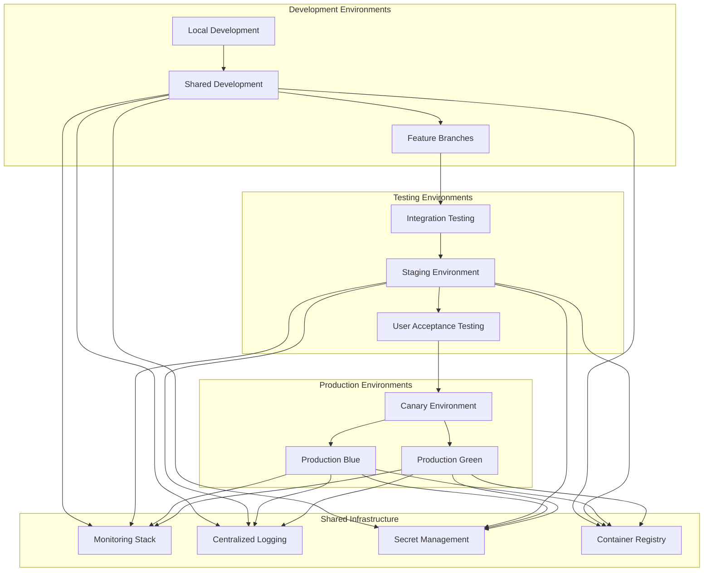

# Environment Management and Infrastructure as Code
## Agent 6: Deployment Architecture Agent - Part 2

## Document Information
- **Document Type**: Environment Management Architecture
- **System**: EyewearML Varai AI Discovery E-commerce Integration
- **Version**: 1.0
- **Date**: January 2025
- **Author**: Agent 6 - Deployment Architecture Agent
- **Parent Document**: [Deployment and DevOps Architecture](deployment-devops-architecture.md)

## Executive Summary

This document details the comprehensive environment management strategy and Infrastructure as Code (IaC) implementation for the AI discovery e-commerce integration. It covers multi-environment configurations, Terraform-based infrastructure provisioning, and automated environment lifecycle management.

## 1. Multi-Environment Strategy

### 1.1 Environment Hierarchy



### 1.2 Environment Configuration Matrix

```yaml
# environments/config-matrix.yaml
environments:
  local:
    purpose: "Local development and testing"
    infrastructure:
      compute: "Docker Compose"
      database: "Local MongoDB"
      storage: "Local filesystem"
      networking: "Host networking"
    
    characteristics:
      cost: "Free"
      availability: "Developer dependent"
      data_persistence: "Temporary"
      external_access: "None"
    
    resource_limits:
      cpu: "Host CPU"
      memory: "Host memory"
      storage: "Host storage"
      network: "Host network"

  development:
    purpose: "Shared development environment for team collaboration"
    infrastructure:
      compute: "Cloud Run (minimal instances)"
      database: "Cloud SQL (development tier)"
      storage: "Cloud Storage (standard)"
      networking: "VPC with public access"
    
    characteristics:
      cost: "Low ($50-100/month)"
      availability: "Business hours"
      data_persistence: "7 days"
      external_access: "Restricted IP ranges"
    
    resource_limits:
      cpu: "0.5-1 vCPU per service"
      memory: "512MB-1GB per service"
      storage: "10GB database, 50GB storage"
      network: "10Mbps"

  staging:
    purpose: "Pre-production testing and validation"
    infrastructure:
      compute: "Cloud Run (production-like)"
      database: "Cloud SQL (production tier)"
      storage: "Cloud Storage (standard)"
      networking: "VPC with load balancer"
    
    characteristics:
      cost: "Medium ($200-500/month)"
      availability: "24/7"
      data_persistence: "30 days"
      external_access: "Public with authentication"
    
    resource_limits:
      cpu: "1-2 vCPU per service"
      memory: "1-4GB per service"
      storage: "100GB database, 500GB storage"
      network: "100Mbps"

  production:
    purpose: "Live production environment serving customers"
    infrastructure:
      compute: "Cloud Run (auto-scaling)"
      database: "Cloud SQL (high availability)"
      storage: "Cloud Storage (multi-region)"
      networking: "Global load balancer with CDN"
    
    characteristics:
      cost: "High ($1000-5000/month)"
      availability: "99.9% SLA"
      data_persistence: "Indefinite with backups"
      external_access: "Public with full security"
    
    resource_limits:
      cpu: "2-8 vCPU per service"
      memory: "4-16GB per service"
      storage: "1TB database, 10TB storage"
      network: "1Gbps+"
```

## 2. Infrastructure as Code Implementation

### 2.1 Terraform Project Structure

```
terraform/
├── environments/
│   ├── development/
│   │   ├── main.tf
│   │   ├── variables.tf
│   │   ├── terraform.tfvars
│   │   └── outputs.tf
│   ├── staging/
│   │   ├── main.tf
│   │   ├── variables.tf
│   │   ├── terraform.tfvars
│   │   └── outputs.tf
│   └── production/
│       ├── main.tf
│       ├── variables.tf
│       ├── terraform.tfvars
│       └── outputs.tf
├── modules/
│   ├── cloud-run-service/
│   │   ├── main.tf
│   │   ├── variables.tf
│   │   └── outputs.tf
│   ├── database/
│   │   ├── main.tf
│   │   ├── variables.tf
│   │   └── outputs.tf
│   ├── networking/
│   │   ├── main.tf
│   │   ├── variables.tf
│   │   └── outputs.tf
│   ├── monitoring/
│   │   ├── main.tf
│   │   ├── variables.tf
│   │   └── outputs.tf
│   └── security/
│       ├── main.tf
│       ├── variables.tf
│       └── outputs.tf
├── shared/
│   ├── backend.tf
│   ├── providers.tf
│   └── versions.tf
└── scripts/
    ├── deploy.sh
    ├── destroy.sh
    └── validate.sh
```

### 2.2 Core Terraform Modules

```hcl
# modules/cloud-run-service/main.tf
terraform {
  required_providers {
    google = {
      source  = "hashicorp/google"
      version = "~> 4.0"
    }
  }
}

variable "service_name" {
  description = "Name of the Cloud Run service"
  type        = string
}

variable "environment" {
  description = "Environment name (dev, staging, prod)"
  type        = string
}

variable "project_id" {
  description = "GCP Project ID"
  type        = string
}

variable "region" {
  description = "GCP Region"
  type        = string
}

variable "image" {
  description = "Container image URL"
  type        = string
}

variable "service_config" {
  description = "Service configuration"
  type = object({
    min_instances = number
    max_instances = number
    cpu          = string
    memory       = string
    concurrency  = number
    timeout      = number
  })
}

variable "environment_variables" {
  description = "Environment variables for the service"
  type        = map(string)
  default     = {}
}

variable "secret_environment_variables" {
  description = "Secret environment variables"
  type = map(object({
    secret_name = string
    version     = string
  }))
  default = {}
}

locals {
  labels = {
    environment = var.environment
    service     = var.service_name
    managed-by  = "terraform"
  }
}

# Service Account
resource "google_service_account" "service_account" {
  account_id   = "${var.service_name}-sa"
  display_name = "${title(var.service_name)} Service Account"
  description  = "Service account for ${var.service_name} in ${var.environment}"
  project      = var.project_id
}

# IAM Bindings
resource "google_project_iam_member" "service_account_permissions" {
  for_each = toset([
    "roles/secretmanager.secretAccessor",
    "roles/monitoring.metricWriter",
    "roles/logging.logWriter",
    "roles/cloudtrace.agent"
  ])
  
  project = var.project_id
  role    = each.value
  member  = "serviceAccount:${google_service_account.service_account.email}"
}

# Cloud Run Service
resource "google_cloud_run_service" "service" {
  name     = var.service_name
  location = var.region
  project  = var.project_id

  template {
    metadata {
      annotations = {
        "autoscaling.knative.dev/minScale"        = tostring(var.service_config.min_instances)
        "autoscaling.knative.dev/maxScale"        = tostring(var.service_config.max_instances)
        "run.googleapis.com/cpu-throttling"       = "false"
        "run.googleapis.com/execution-environment" = "gen2"
      }
      
      labels = local.labels
    }

    spec {
      container_concurrency = var.service_config.concurrency
      timeout_seconds       = var.service_config.timeout
      service_account_name  = google_service_account.service_account.email

      containers {
        image = var.image

        ports {
          container_port = 8080
          name          = "http1"
        }

        resources {
          limits = {
            cpu    = var.service_config.cpu
            memory = var.service_config.memory
          }
        }

        # Regular environment variables
        dynamic "env" {
          for_each = var.environment_variables
          content {
            name  = env.key
            value = env.value
          }
        }

        # Secret environment variables
        dynamic "env" {
          for_each = var.secret_environment_variables
          content {
            name = env.key
            value_from {
              secret_key_ref {
                name = env.value.secret_name
                key  = env.value.version
              }
            }
          }
        }

        # Health checks
        liveness_probe {
          http_get {
            path = "/health"
            port = 8080
          }
          initial_delay_seconds = 30
          period_seconds        = 10
          timeout_seconds       = 5
          failure_threshold     = 3
        }

        readiness_probe {
          http_get {
            path = "/ready"
            port = 8080
          }
          initial_delay_seconds = 10
          period_seconds        = 5
          timeout_seconds       = 3
          failure_threshold     = 2
        }
      }
    }
  }

  traffic {
    percent         = 100
    latest_revision = true
  }

  depends_on = [
    google_project_iam_member.service_account_permissions
  ]
}

# IAM policy for public access (if needed)
resource "google_cloud_run_service_iam_member" "public_access" {
  count = var.environment == "production" ? 0 : 1
  
  service  = google_cloud_run_service.service.name
  location = google_cloud_run_service.service.location
  role     = "roles/run.invoker"
  member   = "allUsers"
}

# Outputs
output "service_url" {
  description = "URL of the Cloud Run service"
  value       = google_cloud_run_service.service.status[0].url
}

output "service_account_email" {
  description = "Email of the service account"
  value       = google_service_account.service_account.email
}
```

### 2.3 Database Module

```hcl
# modules/database/main.tf
variable "environment" {
  description = "Environment name"
  type        = string
}

variable "project_id" {
  description = "GCP Project ID"
  type        = string
}

variable "region" {
  description = "GCP Region"
  type        = string
}

variable "database_config" {
  description = "Database configuration"
  type = object({
    tier                   = string
    disk_size             = number
    disk_type             = string
    backup_enabled        = bool
    point_in_time_recovery = bool
    high_availability     = bool
    deletion_protection   = bool
  })
}

variable "network_id" {
  description = "VPC network ID"
  type        = string
}

locals {
  database_name = "varai-${var.environment}"
  labels = {
    environment = var.environment
    component   = "database"
    managed-by  = "terraform"
  }
}

# Private IP allocation for Cloud SQL
resource "google_compute_global_address" "private_ip_allocation" {
  name          = "${local.database_name}-private-ip"
  purpose       = "VPC_PEERING"
  address_type  = "INTERNAL"
  prefix_length = 16
  network       = var.network_id
  project       = var.project_id
}

# Private connection for Cloud SQL
resource "google_service_networking_connection" "private_vpc_connection" {
  network                 = var.network_id
  service                 = "servicenetworking.googleapis.com"
  reserved_peering_ranges = [google_compute_global_address.private_ip_allocation.name]
}

# Cloud SQL Instance
resource "google_sql_database_instance" "main" {
  name             = local.database_name
  database_version = "POSTGRES_14"
  region           = var.region
  project          = var.project_id

  deletion_protection = var.database_config.deletion_protection

  settings {
    tier              = var.database_config.tier
    availability_type = var.database_config.high_availability ? "REGIONAL" : "ZONAL"
    
    disk_size = var.database_config.disk_size
    disk_type = var.database_config.disk_type
    
    backup_configuration {
      enabled                        = var.database_config.backup_enabled
      start_time                     = "03:00"
      point_in_time_recovery_enabled = var.database_config.point_in_time_recovery
      backup_retention_settings {
        retained_backups = 30
        retention_unit   = "COUNT"
      }
    }

    ip_configuration {
      ipv4_enabled    = false
      private_network = var.network_id
      require_ssl     = true
    }

    database_flags {
      name  = "log_statement"
      value = "all"
    }

    database_flags {
      name  = "log_min_duration_statement"
      value = "1000"
    }

    user_labels = local.labels
  }

  depends_on = [google_service_networking_connection.private_vpc_connection]
}

# Database
resource "google_sql_database" "database" {
  name     = "varai_${var.environment}"
  instance = google_sql_database_instance.main.name
  project  = var.project_id
}

# Database user
resource "google_sql_user" "user" {
  name     = "varai_user"
  instance = google_sql_database_instance.main.name
  password = random_password.db_password.result
  project  = var.project_id
}

# Random password for database user
resource "random_password" "db_password" {
  length  = 32
  special = true
}

# Store database password in Secret Manager
resource "google_secret_manager_secret" "db_password" {
  secret_id = "${var.environment}-database-password"
  project   = var.project_id

  replication {
    automatic = true
  }

  labels = local.labels
}

resource "google_secret_manager_secret_version" "db_password" {
  secret      = google_secret_manager_secret.db_password.id
  secret_data = random_password.db_password.result
}

# Store database URL in Secret Manager
resource "google_secret_manager_secret" "db_url" {
  secret_id = "${var.environment}-database-url"
  project   = var.project_id

  replication {
    automatic = true
  }

  labels = local.labels
}

resource "google_secret_manager_secret_version" "db_url" {
  secret = google_secret_manager_secret.db_url.id
  secret_data = "postgresql://${google_sql_user.user.name}:${random_password.db_password.result}@${google_sql_database_instance.main.private_ip_address}:5432/${google_sql_database.database.name}"
}

# Outputs
output "instance_name" {
  description = "Name of the Cloud SQL instance"
  value       = google_sql_database_instance.main.name
}

output "database_name" {
  description = "Name of the database"
  value       = google_sql_database.database.name
}

output "private_ip_address" {
  description = "Private IP address of the database"
  value       = google_sql_database_instance.main.private_ip_address
}

output "connection_name" {
  description = "Connection name for the database"
  value       = google_sql_database_instance.main.connection_name
}
```

## 3. Environment Lifecycle Management

### 3.1 Automated Environment Provisioning

```bash
#!/bin/bash
# scripts/provision-environment.sh

set -euo pipefail

# Configuration
SCRIPT_DIR="$(cd "$(dirname "${BASH_SOURCE[0]}")" && pwd)"
TERRAFORM_DIR="$(dirname "$SCRIPT_DIR")"

# Colors for output
RED='\033[0;31m'
GREEN='\033[0;32m'
YELLOW='\033[1;33m'
BLUE='\033[0;34m'
NC='\033[0m'

log() {
    echo -e "${BLUE}[$(date +'%Y-%m-%d %H:%M:%S')]${NC} $1"
}

error() {
    echo -e "${RED}[ERROR]${NC} $1" >&2
}

success() {
    echo -e "${GREEN}[SUCCESS]${NC} $1"
}

warning() {
    echo -e "${YELLOW}[WARNING]${NC} $1"
}

# Validate environment
validate_environment() {
    local env=$1
    
    if [[ ! -d "$TERRAFORM_DIR/environments/$env" ]]; then
        error "Environment directory not found: $env"
        exit 1
    fi
    
    if [[ ! -f "$TERRAFORM_DIR/environments/$env/terraform.tfvars" ]]; then
        error "Terraform variables file not found for environment: $env"
        exit 1
    fi
    
    success "Environment validation passed for: $env"
}

# Initialize Terraform
init_terraform() {
    local env=$1
    
    log "Initializing Terraform for environment: $env"
    
    cd "$TERRAFORM_DIR/environments/$env"
    
    terraform init \
        -backend-config="bucket=ml-datadriven-recos-terraform-state" \
        -backend-config="prefix=environments/$env" \
        -reconfigure
    
    success "Terraform initialized for: $env"
}

# Plan Terraform changes
plan_terraform() {
    local env=$1
    
    log "Planning Terraform changes for environment: $env"
    
    cd "$TERRAFORM_DIR/environments/$env"
    
    terraform plan \
        -var-file="terraform.tfvars" \
        -out="tfplan-$env"
    
    success "Terraform plan completed for: $env"
}

# Apply Terraform changes
apply_terraform() {
    local env=$1
    local auto_approve=${2:-false}
    
    log "Applying Terraform changes for environment: $env"
    
    cd "$TERRAFORM_DIR/environments/$env"
    
    if [[ "$auto_approve" == "true" ]]; then
        terraform apply "tfplan-$env"
    else
        terraform apply "tfplan-$env"
    fi
    
    success "Terraform apply completed for: $env"
}

# Validate infrastructure
validate_infrastructure() {
    local env=$1
    
    log "Validating infrastructure for environment: $env"
    
    cd "$TERRAFORM_DIR/environments/$env"
    
    # Get outputs
    local api_url=$(terraform output -raw api_url 2>/dev/null || echo "")
    local database_name=$(terraform output -raw database_name 2>/dev/null || echo "")
    
    if [[ -n "$api_url" ]]; then
        log "Testing API endpoint: $api_url"
        if curl -sf "$api_url/health" >/dev/null 2>&1; then
            success "API health check passed"
        else
            warning "API health check failed"
        fi
    fi
    
    if [[ -n "$database_name" ]]; then
        success "Database provisioned: $database_name"
    fi
    
    success "Infrastructure validation completed for: $env"
}

# Main provisioning function
provision_environment() {
    local env=$1
    local auto_approve=${2:-false}
    
    log "Starting environment provisioning for: $env"
    
    validate_environment "$env"
    init_terraform "$env"
    plan_terraform "$env"
    apply_terraform "$env" "$auto_approve"
    validate_infrastructure "$env"
    
    success "Environment provisioning completed for: $env"
    
    # Display important outputs
    cd "$TERRAFORM_DIR/environments/$env"
    echo ""
    log "Environment outputs:"
    terraform output
}

# Destroy environment
destroy_environment() {
    local env=$1
    
    warning "This will destroy ALL resources in environment: $env"
    read -p "Are you sure? Type 'yes' to confirm: " -r
    
    if [[ "$REPLY" != "yes" ]]; then
        log "Operation cancelled"
        return 0
    fi
    
    log "Destroying environment: $env"
    
    cd "$TERRAFORM_DIR/environments/$env"
    
    terraform destroy \
        -var-file="terraform.tfvars" \
        -auto-approve
    
    success "Environment destroyed: $env"
}

# Main function
main() {
    local action=${1:-help}
    local env=${2:-}
    local auto_approve=${3:-false}
    
    case $action in
        "provision")
            if [[ -z "$env" ]]; then
                error "Environment required for provision action"
                exit 1
            fi
            provision_environment "$env" "$auto_approve"
            ;;
        "destroy")
            if [[ -z "$env" ]]; then
                error "Environment required for destroy action"
                exit 1
            fi
            destroy_environment "$env"
            ;;
        "validate")
            if [[ -z "$env" ]]; then
                error "Environment required for validate action"
                exit 1
            fi
            validate_environment "$env"
            validate_infrastructure "$env"
            ;;
        "help"|*)
            echo "Usage: $0 <action> <environment> [auto_approve]"
            echo ""
            echo "Actions:"
            echo "  provision <env> [auto_approve] - Provision environment infrastructure"
            echo "  destroy <env>                  - Destroy environment infrastructure"
            echo "  validate <env>                 - Validate environment configuration"
            echo ""
            echo "Environments:"
            echo "  development - Development environment"
            echo "  staging     - Staging environment"
            echo "  production  - Production environment"
            echo ""
            echo "Examples:"
            echo "  $0 provision development"
            echo "  $0 provision staging true"
            echo "  $0 destroy development"
            ;;
    esac
}

# Script entry point
if [[ "${BASH_SOURCE[0]}" == "${0}" ]]; then
    main "$@"
fi
```

## 4. Configuration Management

### 4.1 Environment-Specific Configurations

```yaml
# environments/development/terraform.tfvars
environment = "development"
project_id  = "ml-datadriven-recos-dev"
region      = "us-central1"

# Service configurations
services = {
  auth-service = {
    min_instances = 0
    max_instances = 5
    cpu          = "1000m"
    memory       = "1Gi"
    concurrency  = 50
    timeout      = 300
  }
  
  ai-service = {
    min_instances = 0
    max_instances = 3
    cpu          = "2000m"
    memory       = "4Gi"
    concurrency  = 10
    timeout      = 600
  }
  
  recommendation-service = {
    min_instances = 0
    max_instances = 3
    cpu          = "1000m"
    memory       = "2Gi"
    concurrency  = 25
    timeout      = 300
  }
  
  face-service = {
    min_instances = 0
    max_instances = 3
    cpu          = "2000m"
    memory       = "4Gi"
    concurrency  = 5
    timeout      = 600
  }
}

# Database configuration
database_config = {
  tier                   = "db-f1-micro"
  disk_size             = 20
  disk_type             = "PD_SSD"
  backup_enabled        = false
  point_in_time_recovery = false
  high_availability     = false
  deletion_protection   = false
}

# Networking configuration
networking_config = {
  create_vpc = true
  vpc_name   = "varai-dev-vpc"
  
  subnets = [
    {
      name          = "varai-dev-subnet"
      ip_cidr_range = "10.0.0.0/24"
      region        = "us-central1"
    }
  ]
  
  firewall_rules = [
    {
      name      = "allow-internal"
      direction = "INGRESS"
      allow = [
        {
          protocol = "tcp"
          ports    = ["80", "443", "8080"]
        }
      ]
      source_ranges = ["10.0.0.0/8"]
    }
  ]
}

# Monitoring configuration
monitoring_config = {
  enable_monitoring = true
  log_level        = "debug"
  retention_days   = 7
  
  alerts = {
    enable_alerts = false
    notification_channels = []
  }
}

# Security configuration
security_config = {
  require_ssl     = false
  allowed_origins = ["*"]
  ip_restrictions = []
  
  secrets = {
    auto_generate = true
    rotation_days = 90
  }
}
```

```yaml
# environments/production/terraform.tfvars
environment = "production"
project_id  = "ml-datadriven-recos"
region      = "us-central1"

# Service configurations
services = {
  auth-service = {
    min_instances = 3
    max_instances = 50
    cpu          = "2000m"
    memory       = "4Gi"
    concurrency  = 100
    timeout      = 300
  }
  
  ai-service = {
    min_instances = 3
    max_instances = 30
    cpu          = "4000m"
    memory       = "8Gi"
    concurrency  = 20
    timeout      = 600
  }
  
  recommendation-service = {
    min_instances = 3
    max_instances = 30
    cpu          = "4000m"
    memory       = "8Gi"
    concurrency  = 50
    timeout      = 300
  }
  
  face-service = {
    min_instances = 2
    max_instances = 20
    cpu          = "4000m"
    memory       = "8Gi"
    concurrency  = 10
    timeout      = 600
  }
}

# Database configuration
database_config = {
  tier                   = "db-n1-standard-8"
  disk_size             = 1000
  disk_type             = "PD_SSD"
  backup_enabled        = true
  point_in_time_recovery = true
  high_availability     = true
  deletion_protection   = true
}

# Networking configuration
networking_config = {
  create_vpc = true
  vpc_name   = "varai-prod-vpc"
  
  subnets = [
    {
      name          = "varai-prod-subnet-us-central1"
      ip_cidr_range = "10.1.0.0/24"
      region        = "us-central1"
    },
    {
      name          = "varai-prod-subnet-us-east1"
      ip_cidr_range = "10.2.0.0/24"
      region        = "us-east1"
    }
  ]
  
  firewall_rules = [
    {
      name      = "allow-lb-to-services"
      direction = "INGRESS"
      allow = [
        {
          protocol = "tcp"
          ports    = ["8080"]
        }
      ]
      source_ranges = ["130.211.0.0/22", "35.191.0.0/16"]
    },
    {
      name      = "allow-internal"
      direction = "INGRESS"
      allow = [
        {
          protocol = "tcp"
          ports    = ["80", "443", "8080"]
        }
      ]
      source_ranges = ["10.0.0.0/8"]
    }
  ]
}

# Monitoring configuration
monitoring_config = {
  enable_monitoring = true
  log_level        = "warn"
  retention_days   = 90
  
  alerts = {
    enable_alerts = true
    notification_channels = [
      "projects/ml-datadriven-recos/notificationChannels/slack-alerts",
      "projects/ml-datadriven-recos/notificationChannels/email-alerts"
    ]
  }
}

# Security configuration
security_config = {
  require_ssl     = true
  allowed_origins = ["https://varai.ai", "https://admin.varai.ai"]
  ip_restrictions = []
  
  secrets = {
    auto_generate = true
    rotation_days = 30
  }
}
```

## Summary

This document provides comprehensive environment management and Infrastructure as Code implementation for the AI discovery e-commerce integration. Key components include:

1. **Multi-Environment Strategy** - Structured approach to development, staging, and production environments
2. **Terraform Modules** - Reusable infrastructure components for consistent deployments
3. **Automated Provisioning** - Scripts for environment lifecycle management
4. **Configuration Management** - Environment-specific configurations and variables

### Related Documents

- **Parent Document**: [Deployment and DevOps Architecture](deployment-devops-architecture.md)
- **Next Document**: [Disaster Recovery and Rollback Procedures