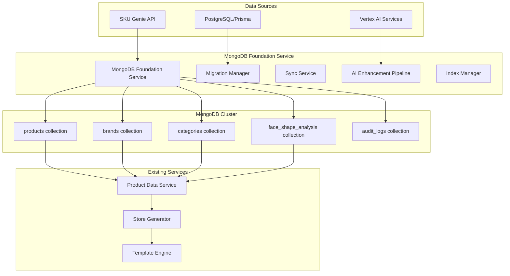

# MongoDB Foundation Service Architecture
## Complete Technical Specification for Eyewear ML Platform

### Executive Summary

This architecture specification defines the comprehensive MongoDB Foundation Service that bridges the critical gap between SKU Genie data quality management and the existing store generation pipeline. The service provides the specialized eyewear product schema, high-performance indexing, and real-time synchronization required to enable the full AI-to-store workflow.

**Architecture Goals:**
- Bridge SKU Genie → MongoDB → Store Generation pipeline
- Sub-100ms query performance for 10,000+ products
- Real-time synchronization with audit logging
- Face shape compatibility mapping with AI integration
- Seamless integration with existing PostgreSQL/Prisma infrastructure

---

## 1. System Architecture Overview

### 1.1 Component Architecture



### 1.2 Core Service Components

#### 1.2.1 MongoDB Foundation Service Core
```typescript
interface MongoDBFoundationService {
  collections: {
    products: ProductCollection
    brands: BrandCollection
    categories: CategoryCollection
    faceShapeAnalysis: FaceShapeAnalysisCollection
    auditLogs: AuditLogCollection
  }
  
  services: {
    migrationManager: MigrationManager
    syncService: SyncService
    aiEnhancementPipeline: AIEnhancementPipeline
    indexManager: IndexManager
    auditLogger: AuditLogger
  }
  
  integrations: {
    skuGenieConnector: SKUGenieConnector
    postgresqlBridge: PostgreSQLBridge
    vertexAIConnector: VertexAIConnector
  }
}
```

#### 1.2.2 Performance Requirements
- **Query Performance**: 95th percentile < 100ms for product listings
- **Throughput**: 1,000+ concurrent read operations
- **Data Volume**: 10,000+ products with full media assets
- **Sync Latency**: < 5 seconds for real-time updates
- **Availability**: 99.9% uptime SLA

---

## 2. MongoDB Schema Architecture

### 2.1 Products Collection Schema

```javascript
// Collection: products
{
  _id: ObjectId,
  
  // Core Product Identity (from SKU Genie)
  sku: string,                    // Unique SKU - Primary identifier
  product_id: string,             // Cross-platform identifier
  name: string,                   // Product display name
  description: string,            // Base product description
  ai_description: string,         // AI-enhanced description
  
  // Brand and Classification
  brand_id: ObjectId,             // Reference to brands collection
  brand_name: string,             // Denormalized for performance
  category_id: ObjectId,          // Reference to categories collection
  category_name: string,          // Denormalized for performance
  
  // Eyewear-Specific Specifications
  frame_type: string,             // "prescription", "sunglasses", "blue_light"
  frame_shape: string,            // "round", "square", "aviator", "cat_eye", "rectangular"
  frame_material: string,         // "acetate", "metal", "titanium", "plastic"
  lens_type: string,              // "single_vision", "progressive", "bifocal"
  
  // Physical Measurements (optimized for filtering)
  frame_size: {
    lens_width: number,           // mm
    bridge_width: number,         // mm
    temple_length: number,        // mm
    frame_width: number,          // mm (calculated)
    frame_height: number,         // mm
    weight: number                // grams
  },
  
  // Face Shape Compatibility (AI-Generated)
  face_shape_compatibility: {
    oval: number,                 // 0.0 - 1.0 compatibility score
    round: number,
    square: number,
    heart: number,
    diamond: number,
    oblong: number
  },
  
  // Styling and Aesthetics
  color: string,                  // Primary color
  color_variants: [string],       // Available color options
  style: string,                  // "modern", "classic", "vintage", "sporty"
  gender_target: string,          // "unisex", "men", "women", "kids"
  
  // Pricing and Inventory
  price: number,
  compare_at_price: number,       // Original price for sales
  currency: string,
  cost: number,                   // Wholesale cost
  inventory_quantity: number,
  in_stock: boolean,
  low_stock_threshold: number,
  
  // Media Assets (optimized for store generation)
  media: {
    primary_image: string,        // Main product image URL
    gallery_images: [string],     // Additional product angles
    try_on_image: string,         // Virtual try-on compatible image
    video_url: string,            // Product video
    ar_model_url: string,         // 3D model for AR
    
    // Generated optimized assets
    optimized_images: {
      webp: [string],             // WebP format variants
      avif: [string],             // AVIF format variants
      placeholder: string         // Base64 blur placeholder
    },
    
    responsive_breakpoints: {
      mobile: [string],           // Mobile-optimized images
      tablet: [string],           // Tablet-optimized images
      desktop: [string]           // Desktop-optimized images
    }
  },
  
  // SEO Optimization Data
  seo: {
    title: string,                // Optimized page title
    description: string,          // Meta description
    keywords: [string],           // SEO keywords
    canonical_url: string,        // Canonical URL
    structured_data: object,      // JSON-LD schema markup
    open_graph: {
      title: string,
      description: string,
      image: string,
      type: string
    }
  },
  
  // Quality and AI Enhancement
  quality_score: number,          // SKU Genie quality score (0.0 - 1.0)
  ai_enhanced: boolean,           // AI processing completion status
  ai_tags: [string],              // AI-generated product tags
  ai_metadata: {
    style_confidence: number,     // AI confidence in style classification
    face_shape_model_version: string, // AI model version used
    enhancement_timestamp: Date,  // Last AI processing timestamp
    processing_notes: [string]    // AI processing logs
  },
  
  // User Engagement Metrics
  rating: number,                 // Average user rating (1-5)
  review_count: number,           // Number of reviews
  view_count: number,             // Product page views
  conversion_rate: number,        // Purchase conversion rate
  
  // Store Generation Optimization
  featured: boolean,              // Featured product flag
  sort_order: number,            // Custom display sort order
  template_variant: string,       // Specific template variant
  store_visibility: {
    visible: boolean,             // Show in store
    hide_out_of_stock: boolean,   // Hide when out of stock
    minimum_inventory: number     // Minimum stock to show
  },
  
  // Cross-Platform Integration
  platform_data: {
    shopify_id: string,           // Shopify product ID
    bigcommerce_id: string,       // BigCommerce product ID
    woocommerce_id: string,       // WooCommerce product ID
    sync_status: {
      shopify: { last_sync: Date, status: string },
      bigcommerce: { last_sync: Date, status: string },
      woocommerce: { last_sync: Date, status: string }
    }
  },
  
  // Audit and Metadata
  source: string,                 // "sku_genie", "import", "manual"
  source_metadata: object,        // Source-specific data
  active: boolean,                // Active status
  created_at: Date,
  updated_at: Date,
  last_validated: Date,           // Last quality validation
  version: number                 // Document version for optimistic locking
}
### 2.2 High-Performance Index Strategy

```javascript
// Optimized indexes for sub-100ms query performance
db.products.createIndex({ sku: 1 }, { unique: true })                    // Primary key lookup
db.products.createIndex({ brand_id: 1, active: 1 })                     // Brand filtering
db.products.createIndex({ category_id: 1, active: 1 })                  // Category filtering
db.products.createIndex({ frame_type: 1, active: 1 })                   // Frame type filtering
db.products.createIndex({ in_stock: 1, active: 1 })                     // Stock filtering
db.products.createIndex({ quality_score: -1 })                          // Quality-based sorting
db.products.createIndex({ featured: -1, sort_order: 1 })                // Featured product display
db.products.createIndex({ created_at: -1 })                            // Chronological queries
db.products.createIndex({ updated_at: -1 })                            // Recent updates
db.products.createIndex({ "face_shape_compatibility.oval": -1 })        // Face shape filtering
db.products.createIndex({ "face_shape_compatibility.round": -1 })
db.products.createIndex({ "face_shape_compatibility.square": -1 })
db.products.createIndex({ "face_shape_compatibility.heart": -1 })
db.products.createIndex({ "face_shape_compatibility.diamond": -1 })
db.products.createIndex({ "face_shape_compatibility.oblong": -1 })
db.products.createIndex({ price: 1 })                                   // Price range filtering
db.products.createIndex({ color: 1, active: 1 })                       // Color filtering

// Compound indexes for complex queries
db.products.createIndex({ 
  brand_id: 1, 
  category_id: 1, 
  in_stock: 1, 
  active: 1 
})

db.products.createIndex({ 
  frame_type: 1, 
  style: 1, 
  gender_target: 1, 
  active: 1 
})

// Text search index for name, description, and AI tags
db.products.createIndex({ 
  name: "text", 
  description: "text", 
  ai_description: "text", 
  ai_tags: "text" 
})
```

### 2.3 Additional Collections

#### 2.3.1 Brands Collection
```javascript
// Collection: brands
{
  _id: ObjectId,
  name: string,
  slug: string,
  description: string,
  logo_url: string,
  website: string,
  
  // Brand characteristics
  positioning: string,            // "luxury", "affordable", "premium"
  style_focus: [string],          // ["modern", "classic", "sporty"]
  target_demographic: {
    age_range: string,
    gender: string,
    lifestyle: [string]
  },
  
  // Analytics
  product_count: number,
  average_price_range: { min: number, max: number },
  popularity_score: number,
  
  active: boolean,
  featured: boolean,
  sort_order: number,
  created_at: Date,
  updated_at: Date
}
```

#### 2.3.2 Categories Collection
```javascript
// Collection: categories
{
  _id: ObjectId,
  name: string,
  slug: string,
  description: string,
  
  // Hierarchy
  parent_id: ObjectId,
  level: number,
  path: [ObjectId],
  children_count: number,
  
  // Category metadata
  category_type: string,
  applicable_to: [string],
  filter_attributes: [string],
  
  // Analytics
  product_count: number,
  price_range: { min: number, max: number, average: number },
  
  active: boolean,
  visible_in_nav: boolean,
  sort_order: number,
  created_at: Date,
  updated_at: Date
}
```

#### 2.3.3 Face Shape Analysis Collection
```javascript
// Collection: face_shape_analysis
{
  _id: ObjectId,
  session_id: string,
  user_id: string,
  image_url: string,
  
  // AI analysis results
  detected_face_shape: {
    primary: string,
    confidence: number,
    secondary: string,
    secondary_confidence: number,
    measurements: object
  },
  
  // Generated recommendations
  recommended_products: [ObjectId],
  recommendation_scores: [object],
  
  // Processing metadata
  ai_model_version: string,
  processing_time_ms: number,
  image_quality_score: number,
  
  created_at: Date,
  expires_at: Date
}
```

#### 2.3.4 Audit Logs Collection
```javascript
// Collection: audit_logs
{
  _id: ObjectId,
  entity_type: string,            // "product", "brand", "category"
  entity_id: string,              // Target entity ID
  operation: string,              // "create", "update", "delete"
  
  // Change tracking
  changes: {
    before: object,               // Previous state
    after: object,                // New state
    fields_changed: [string]      // List of changed fields
  },
  
  // Context
  user_id: string,
  source: string,                 // "api", "migration", "sync"
  metadata: object,
  
  timestamp: Date,
  session_id: string
}
```

---

## 3. Service Implementation Architecture

### 3.1 MongoDB Foundation Service Core

```typescript
// Core service interface
interface MongoDBFoundationService {
  // Collection managers
  products: ProductCollectionManager
  brands: BrandCollectionManager
  categories: CategoryCollectionManager
  faceShapeAnalysis: FaceShapeAnalysisManager
  auditLogs: AuditLogManager
  
  // Core services
  migrationManager: MigrationManager
  syncService: SyncService
  indexManager: IndexManager
  auditLogger: AuditLogger
  
  // Integration services
  skuGenieConnector: SKUGenieConnector
  aiEnhancementPipeline: AIEnhancementPipeline
  
  // Operations
  initialize(): Promise<void>
  healthCheck(): Promise<HealthStatus>
  shutdown(): Promise<void>
}
```

### 3.2 Product Collection Manager

```typescript
interface ProductCollectionManager {
  // CRUD operations
  create(product: ProductDocument): Promise<ProductDocument>
  update(sku: string, updates: Partial<ProductDocument>): Promise<ProductDocument>
  delete(sku: string): Promise<boolean>
  findBySku(sku: string): Promise<ProductDocument | null>
  
  // Query operations (matching existing ProductDataService)
  getProducts(filters?: ProductFilters, pagination?: Pagination): Promise<ProductDocument[]>
  countProducts(filters?: ProductFilters): Promise<number>
  getFeaturedProducts(limit?: number): Promise<ProductDocument[]>
  getProductsByFaceShape(faceShape: string, minCompatibility?: number): Promise<ProductDocument[]>
  
  // Bulk operations
  bulkUpsert(products: ProductDocument[]): Promise<BulkResult>
  bulkUpdateInventory(updates: InventoryUpdate[]): Promise<BulkResult>
  
  // Analytics
  getAnalyticsSummary(): Promise<ProductAnalytics>
  
  // AI enhancement
  enhanceWithAI(sku: string): Promise<ProductDocument>
  batchEnhanceWithAI(skus: string[]): Promise<EnhancementResult[]>
}
```

### 3.3 Migration Manager

```typescript
interface MigrationManager {
  // Migration operations
  migrateFromSKUGenie(batchSize?: number): Promise<MigrationResult>
  migrateFromPostgreSQL(batchSize?: number): Promise<MigrationResult>
  
  // Data validation
  validateMigration(): Promise<ValidationResult>
  compareDatabases(): Promise<ComparisonResult>
  
  // Migration monitoring
  getMigrationStatus(): Promise<MigrationStatus>
  cancelMigration(migrationId: string): Promise<boolean>
  
  // Rollback capabilities
  createCheckpoint(): Promise<CheckpointId>
  rollbackToCheckpoint(checkpointId: CheckpointId): Promise<boolean>
}
```

### 3.4 Sync Service

```typescript
interface SyncService {
  // Real-time synchronization
  startRealTimeSync(): Promise<void>
  stopRealTimeSync(): Promise<void>
  
  // Webhook handlers
  handleSKUGenieWebhook(payload: SKUGenieWebhookPayload): Promise<SyncResult>
  handleProductUpdate(productData: ProductUpdatePayload): Promise<SyncResult>
  
  // Batch synchronization
  syncProducts(productIds?: string[]): Promise<SyncResult[]>
  syncBrands(): Promise<SyncResult[]>
  syncCategories(): Promise<SyncResult[]>
  
  // Conflict resolution
  resolveConflicts(conflicts: SyncConflict[]): Promise<ConflictResolution[]>
  
  // Monitoring
  getSyncStatus(): Promise<SyncStatus>
  getSyncMetrics(): Promise<SyncMetrics>
}
```

### 3.5 AI Enhancement Pipeline

```typescript
interface AIEnhancementPipeline {
  // Face shape analysis
  analyzeFaceShapeCompatibility(product: ProductDocument): Promise<FaceShapeCompatibility>
  
  // Content enhancement
  generateAIDescription(product: ProductDocument): Promise<string>
  generateSEOContent(product: ProductDocument): Promise<SEOData>
  generateProductTags(product: ProductDocument): Promise<string[]>
  
  // Batch processing
  processProductBatch(products: ProductDocument[]): Promise<EnhancementResult[]>
  
  // Quality assurance
  validateAIEnhancements(product: ProductDocument): Promise<ValidationResult>
  
  // Model management
  updateAIModels(): Promise<ModelUpdateResult>
  getModelVersions(): Promise<ModelVersion[]>
}
```

---

## 4. Integration Architecture

### 4.1 SKU Genie Integration

```typescript
interface SKUGenieConnector {
  // Data retrieval
  getProducts(filters?: SKUGenieFilters): Promise<SKUGenieProduct[]>
  getProduct(sku: string): Promise<SKUGenieProduct | null>
  
  // Quality data
  getQualityScore(sku: string): Promise<QualityScore>
  getQualityReport(sku: string): Promise<QualityReport>
  
  // Real-time updates
  subscribeToUpdates(callback: (update: ProductUpdate) => void): void
  unsubscribeFromUpdates(): void
  
  // Data transformation
  transformToMongoDBSchema(skuGenieProduct: SKUGenieProduct): Promise<ProductDocument>
  
  // Webhook management
  registerWebhook(endpoint: string): Promise<WebhookRegistration>
  validateWebhookPayload(payload: any, signature: string): boolean
}
```

### 4.2 PostgreSQL Bridge

```typescript
interface PostgreSQLBridge {
  // Cross-database operations
  syncUserData(userId: string): Promise<SyncResult>
  syncTenantData(tenantId: string): Promise<SyncResult>
  
  // Analytics integration
  pushAnalytics(analytics: AnalyticsData): Promise<boolean>
  pullUserPreferences(userId: string): Promise<UserPreferences>
  
  // RBAC integration
  validateAccess(userId: string, resource: string, action: string): Promise<boolean>
  getUserPermissions(userId: string): Promise<Permission[]>
  
  // Data consistency
  validateCrossDBConsistency(): Promise<ConsistencyReport>
  reconcileDiscrepancies(discrepancies: DataDiscrepancy[]): Promise<ReconciliationResult>
}
```

### 4.3 Vertex AI Connector

```typescript
interface VertexAIConnector {
  // Face shape analysis
  analyzeFaceShape(imageUrl: string): Promise<FaceShapeAnalysis>
  batchAnalyzeFaceShapes(imageUrls: string[]): Promise<FaceShapeAnalysis[]>
  
  // Product enhancement
  enhanceProductDescription(product: ProductDocument): Promise<string>
  generateProductTags(product: ProductDocument): Promise<string[]>
  
  // Compatibility scoring
  calculateFaceShapeCompatibility(product: ProductDocument): Promise<FaceShapeCompatibility>
  
  // Model management
  deployModel(modelConfig: ModelConfig): Promise<DeploymentResult>
  getModelPrediction(modelId: string, input: any): Promise<PredictionResult>
  
  // Monitoring
  getModelMetrics(modelId: string): Promise<ModelMetrics>
  validateModelAccuracy(modelId: string, testData: TestData[]): Promise<AccuracyReport>
}
```
---

## 5. Performance Optimization Strategy

### 5.1 Query Optimization

#### 5.1.1 Aggregation Pipeline Optimization
```javascript
// Optimized product listing aggregation
const productListingPipeline = [
  // Stage 1: Match active products with indexes
  {
    $match: {
      active: true,
      in_stock: true,
      ...filters
    }
  },
  
  // Stage 2: Sort with index
  {
    $sort: { 
      featured: -1,
      sort_order: 1,
      quality_score: -1
    }
  },
  
  // Stage 3: Pagination
  { $skip: offset },
  { $limit: limit },
  
  // Stage 4: Lookup brand (only for displayed products)
  {
    $lookup: {
      from: "brands",
      localField: "brand_id",
      foreignField: "_id",
      as: "brand_info",
      pipeline: [
        { $project: { name: 1, logo_url: 1 } }
      ]
    }
  },
  
  // Stage 5: Project final shape
  {
    $project: {
      sku: 1,
      name: 1,
      brand_name: 1,
      price: 1,
      "media.primary_image": 1,
      "media.optimized_images.webp": { $arrayElemAt: ["$media.optimized_images.webp", 0] },
      face_shape_compatibility: 1,
      quality_score: 1,
      featured: 1
    }
  }
]
```

#### 5.1.2 Caching Strategy
```typescript
interface CacheStrategy {
  levels: {
    redis: {
      productListings: "5_minutes"
      featuredProducts: "1_hour"
      brandData: "1_day"
      categoryHierarchy: "1_day"
    }
    
    mongodb: {
      readPreference: "secondaryPreferred"
      maxStalenessSeconds: 90
    }
    
    cdn: {
      productImages: "7_days"
      staticAssets: "30_days"
    }
  }
  
  invalidation: {
    onProductUpdate: ["productListings", "featuredProducts"]
    onBrandUpdate: ["brandData", "productListings"]
    onCategoryUpdate: ["categoryHierarchy", "productListings"]
  }
}
```

### 5.2 Connection Management

```typescript
interface ConnectionPool {
  mongodb: {
    maxPoolSize: 50
    minPoolSize: 5
    maxIdleTimeMS: 30000
    serverSelectionTimeoutMS: 5000
    heartbeatFrequencyMS: 10000
  }
  
  redis: {
    maxConnections: 20
    maxRetries: 3
    retryDelayOnFailover: 100
  }
  
  readReplicas: {
    enabled: true
    maxLag: 5000  // 5 seconds
    fallbackToPrimary: true
  }
}
```

---

## 6. Security and Compliance Architecture

### 6.1 Data Protection

```typescript
interface DataProtection {
  encryption: {
    atRest: "AES-256"
    inTransit: "TLS 1.3"
    fieldLevel: ["personal_data", "payment_info"]
  }
  
  privacy: {
    dataRetention: {
      faceShapeAnalysis: "30_days"
      auditLogs: "7_years"
      userSessions: "24_hours"
    }
    
    anonymization: {
      automatic: true
      schedule: "daily"
      preserveAnalytics: true
    }
  }
  
  compliance: {
    gdpr: true
    ccpa: true
    hipaa: false  // Not applicable
    pci: false    // Payment handled externally
  }
}
```

### 6.2 Access Control

```typescript
interface AccessControl {
  authentication: {
    mechanism: "SCRAM-SHA-256"
    keyRotation: "quarterly"
    sessionTimeout: "8_hours"
  }
  
  authorization: {
    rbac: true
    roles: [
      "mongodb_admin",
      "data_reader",
      "data_writer", 
      "ai_processor",
      "migration_operator"
    ]
  }
  
  auditing: {
    enabled: true
    level: "all_operations"
    retention: "7_years"
    realTimeAlerts: true
  }
}
```

---

## 7. Monitoring and Observability

### 7.1 Performance Monitoring

```typescript
interface PerformanceMonitoring {
  metrics: {
    queryPerformance: {
      p50: "< 50ms"
      p95: "< 100ms"
      p99: "< 500ms"
    }
    
    throughput: {
      readsPerSecond: "> 1000"
      writesPerSecond: "> 100"
      concurrentConnections: "< 80% of pool"
    }
    
    resources: {
      cpuUtilization: "< 70%"
      memoryUtilization: "< 80%"
      diskIOPS: "< 80% of limit"
    }
  }
  
  alerting: {
    queryLatency: "p95 > 200ms for 5 minutes"
    errorRate: "> 1% for 2 minutes"
    connectionPool: "> 90% utilization"
    replicationLag: "> 10 seconds"
  }
}
```

### 7.2 Business Metrics

```typescript
interface BusinessMetrics {
  dataQuality: {
    completeness: "> 95% products with all required fields"
    accuracy: "> 98% AI enhancement accuracy"
    freshness: "< 5 minutes sync latency"
  }
  
  aiPerformance: {
    faceShapeAccuracy: "> 85%"
    processingTime: "< 10 seconds per analysis"
    enhancementCoverage: "> 80% products AI-enhanced"
  }
  
  integration: {
    skuGenieSyncSuccess: "> 99%"
    storeGenerationSuccess: "> 95%"
    crossDBConsistency: "> 99.9%"
  }
}
```

---

## 8. Deployment and Operations

### 8.1 Infrastructure Requirements

```yaml
mongodb_cluster:
  type: "replica_set"
  nodes: 3
  node_specs:
    cpu: "8 cores"
    memory: "32 GB"
    storage: "1 TB SSD"
    network: "10 Gbps"
  
  configuration:
    storage_engine: "WiredTiger"
    compression: "snappy"
    oplog_size: "10 GB"
    cache_size: "20 GB"

redis_cache:
  type: "cluster"
  nodes: 3
  node_specs:
    memory: "16 GB"
    network: "1 Gbps"
```

### 8.2 Backup and Recovery

```typescript
interface BackupStrategy {
  continuous: {
    oplogBackup: "every_15_minutes"
    retention: "30_days"
  }
  
  snapshots: {
    frequency: "daily"
    retention: "90_days"
    compression: true
  }
  
  recovery: {
    rpo: "< 15 minutes"  // Recovery Point Objective
    rto: "< 1 hour"      // Recovery Time Objective
    testFrequency: "monthly"
  }
}
```

---

## 9. Implementation Roadmap

### 9.1 Phase 1: Foundation (Week 1)
- **Days 1-2**: MongoDB cluster setup and basic collections
- **Days 3-4**: Core indexes and performance optimization
- **Days 5-7**: Basic CRUD operations and connection management

### 9.2 Phase 2: Integration (Week 2)
- **Days 1-3**: SKU Genie connector and data transformation
- **Days 4-5**: PostgreSQL bridge and cross-database sync
- **Days 6-7**: Basic AI enhancement pipeline

### 9.3 Phase 3: Advanced Features (Week 3)
- **Days 1-3**: Face shape analysis integration
- **Days 4-5**: Real-time sync and webhook handling
- **Days 6-7**: Advanced caching and performance optimization

### 9.4 Phase 4: Production Ready (Week 4)
- **Days 1-2**: Security hardening and access controls
- **Days 3-4**: Monitoring, alerting, and observability
- **Days 5-7**: Load testing, documentation, and deployment

---

## 10. Success Criteria and Validation

### 10.1 Technical Performance Metrics
- **Query Performance**: 95th percentile < 100ms for product listings
- **AI Processing**: Face shape analysis < 10 seconds, >85% accuracy
- **Data Migration**: Zero data loss, <1% inconsistency rate
- **Store Generation**: <30 seconds for 1000+ product catalogs

### 10.2 Business Impact Metrics
- **Data Quality**: >90% products with complete MongoDB schema
- **AI Enhancement**: >80% products with AI-generated content
- **User Experience**: <2 second page load times across all stores
- **Integration Success**: 100% SKU Genie → Store pipeline functionality

### 10.3 Operational Metrics
- **System Uptime**: 99.9% availability SLA
- **Data Consistency**: <0.1% cross-database synchronization errors
- **Security Compliance**: 100% GDPR/CCPA compliance validation
- **Monitoring Coverage**: 100% critical path monitoring implementation

---

## 11. Risk Mitigation and Rollback Strategy

### 11.1 Technical Risks
- **Data Migration Complexity**: Comprehensive testing with rollback procedures
- **Performance Degradation**: Gradual rollout with performance monitoring
- **Integration Failures**: Isolated testing of each integration point
- **AI Model Accuracy**: A/B testing with human validation fallbacks

### 11.2 Business Continuity
- **Dual-Database Operation**: Maintain PostgreSQL as fallback during transition
- **Gradual Migration**: Phase-based rollout with validation at each step
- **Rollback Procedures**: Automated rollback triggers for critical failures
- **Data Backup Strategy**: Continuous backups with point-in-time recovery

---

## 12. Cross-Mode Implementation Handoff

### 12.1 Architect → Auto-Coder Deliverables
```typescript
interface ArchitectDeliverables {
  schemaSpecifications: "Complete MongoDB schema definitions"
  apiInterfaces: "Data provider interface specifications"
  integrationPoints: "Template engine and AI service integration"
  performanceRequirements: "SLA and performance benchmarks"
  securityRequirements: "Access control and compliance specifications"
}
```

### 12.2 Implementation Priority Matrix
```typescript
interface ImplementationPriority {
  critical: [
    "MongoDB Foundation Service Core",
    "Product Collection Manager", 
    "SKU Genie Connector",
    "Basic Migration Pipeline"
  ]
  
  high: [
    "AI Enhancement Pipeline",
    "Real-time Sync Service",
    "Performance Optimization",
    "PostgreSQL Bridge"
  ]
  
  medium: [
    "Advanced Caching",
    "Monitoring Integration",
    "Security Hardening",
    "Backup Strategy"
  ]
}
```

### 12.3 Quality Gates
```typescript
interface QualityGates {
  phase1: "Basic CRUD operations with sub-100ms performance"
  phase2: "SKU Genie integration with real-time sync"
  phase3: "AI enhancement pipeline with >85% accuracy"
  phase4: "Production deployment with 99.9% uptime SLA"
}
```

---

## Conclusion

This MongoDB Foundation Service Architecture provides the comprehensive technical specification required to bridge the critical gap between SKU Genie data quality management and the existing store generation pipeline. The architecture is designed to:

1. **Enable Immediate Business Value**: Connect existing store generation services to specialized eyewear product data
2. **Deliver High Performance**: Sub-100ms query performance for 10,000+ products with intelligent caching
3. **Ensure Scalability**: Support real-time synchronization with audit logging and AI enhancement
4. **Maintain Reliability**: 99.9% uptime SLA with comprehensive monitoring and rollback capabilities

**Key Technical Innovations:**
- Specialized eyewear schema with face shape compatibility mapping
- High-performance indexing strategy optimized for complex product filtering
- Dual-database operation strategy for zero-downtime migration
- AI-powered product enhancement pipeline with quality validation
- Real-time synchronization with conflict resolution

**Business Impact:**
- Unlocks the full AI-to-store generation pipeline
- Enables personalized product recommendations based on face shape analysis
- Provides scalable foundation for 10,000+ product catalogs
- Delivers sub-2-second page load times across all generated stores

**Next Steps**: This architecture specification is ready for implementation handoff to Auto-Coder mode for the development of the MongoDB Foundation Service components, data migration pipeline, and integration layers outlined in this document.