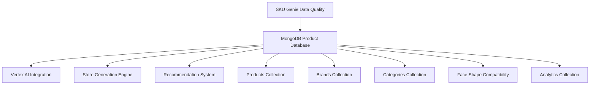

# MongoDB Eyewear Product Schema Design
## Phase 1: Agentic Implementation Strategy

### Executive Summary

This document defines comprehensive MongoDB collection schemas optimized for 10,000+ eyewear products, supporting face shape compatibility matching, real-time recommendations, multi-channel store generation, and integration with existing Vertex AI systems.

### Architecture Overview



## Core Collection Schemas

### 1. Products Collection

**Collection Name:** `products`

```javascript
{
  // Unique identifiers
  "_id": ObjectId,
  "product_id": String, // External unique ID (UUID format)
  "sku": String, // Stock Keeping Unit (indexed)
  "upc": String, // Universal Product Code (indexed)
  
  // Basic product information
  "name": String, // Product full name (indexed for text search)
  "brand_id": ObjectId, // Reference to brands collection
  "category_ids": [ObjectId], // Array of category references
  "description": String, // Full product description
  "short_description": String, // Brief description for listings
  
  // Pricing and availability
  "price": {
    "base_price": Number, // Base retail price
    "currency": String, // ISO 4217 currency code
    "discounted_price": Number, // Optional discounted price
    "cost_price": Number, // Wholesale/cost price
    "price_history": [
      {
        "price": Number,
        "date": Date,
        "source": String
      }
    ]
  },
  
  // Inventory management
  "inventory": {
    "quantity": Number,
    "low_stock_threshold": Number,
    "status": String, // "in_stock", "low_stock", "out_of_stock", "discontinued"
    "warehouse_locations": [String]
  },
  
  // Eyewear-specific specifications
  "specifications": {
    // Frame details
    "frame": {
      "material": String, // "acetate", "metal", "titanium", "plastic", etc.
      "color": String,
      "shape": String, // "round", "square", "oval", "cat-eye", "aviator", etc.
      "style": String, // "full-rim", "semi-rimless", "rimless"
      "weight": Number, // Weight in grams
      "width": Number, // Frame width in mm
      "height": Number, // Frame height in mm
      "temple_length": Number, // Temple length in mm
      "nose_bridge": Number, // Bridge width in mm
      "hinge_type": String // "standard", "spring", "flexible"
    },
    
    // Lens details
    "lens": {
      "material": String, // "polycarbonate", "CR-39", "high-index", etc.
      "color": String,
      "width": Number, // Lens width in mm
      "height": Number, // Lens height in mm
      "prescription_ready": Boolean,
      "uv_protection": String, // "UV400", "UV380", etc.
      "coating": [String], // ["anti-reflective", "scratch-resistant", "blue-light"]
      "polarized": Boolean
    },
    
    // Measurements
    "measurements": {
      "eye_size": Number, // mm
      "bridge_size": Number, // mm
      "temple_length": Number, // mm
      "frame_width": Number, // Total width in mm
      "frame_height": Number, // Total height in mm
      "lens_height": Number // mm
    }
  },
  
  // Face shape compatibility (ML-driven)
  "face_shape_compatibility": {
    "oval": {
      "score": Number, // 0-1 compatibility score
      "confidence": Number, // ML model confidence
      "reasons": [String] // Why it's compatible
    },
    "round": {
      "score": Number,
      "confidence": Number,
      "reasons": [String]
    },
    "square": {
      "score": Number,
      "confidence": Number,
      "reasons": [String]
    },
    "heart": {
      "score": Number,
      "confidence": Number,
      "reasons": [String]
    },
    "diamond": {
      "score": Number,
      "confidence": Number,
      "reasons": [String]
    },
    "oblong": {
      "score": Number,
      "confidence": Number,
      "reasons": [String]
    }
  },
  
  // Media assets
  "media": {
    "images": [
      {
        "url": String,
        "alt_text": String,
        "type": String, // "primary", "angle", "detail", "lifestyle"
        "order": Number,
        "dimensions": {
          "width": Number,
          "height": Number
        }
      }
    ],
    "videos": [
      {
        "url": String,
        "thumbnail": String,
        "type": String, // "product_demo", "try_on", "360_view"
        "duration": Number // in seconds
      }
    ],
    "ar_models": [
      {
        "url": String,
        "format": String, // "glb", "usdz"
        "size": Number // file size in bytes
      }
    ]
  },
  
  // SEO and content
  "seo": {
    "meta_title": String,
    "meta_description": String,
    "keywords": [String],
    "slug": String, // URL-friendly identifier
    "canonical_url": String
  },
  
  // Product attributes for filtering and recommendations
  "attributes": {
    "gender": String, // "men", "women", "unisex", "kids"
    "age_group": String, // "adult", "teen", "kids"
    "style_category": String, // "fashion", "sport", "professional", "casual"
    "season": [String], // ["spring", "summer", "fall", "winter"]
    "occasion": [String], // ["everyday", "formal", "sport", "outdoor"]
    "features": [String], // ["lightweight", "durable", "flexible", "hypoallergenic"]
    "prescription_compatible": Boolean,
    "reading_glasses": Boolean,
    "computer_glasses": Boolean,
    "safety_rating": String // "ANSI Z87.1", "CE", etc.
  },
  
  // Quality and compliance
  "quality": {
    "data_quality_score": Number, // 0-1 from SKU Genie
    "completeness_score": Number, // Percentage of required fields filled
    "accuracy_score": Number, // ML-assessed accuracy
    "last_quality_check": Date,
    "quality_issues": [
      {
        "field": String,
        "issue": String,
        "severity": String // "low", "medium", "high", "critical"
      }
    ]
  },
  
  // Analytics and performance
  "analytics": {
    "views": Number,
    "clicks": Number,
    "conversions": Number,
    "rating": {
      "average": Number, // 1-5 stars
      "count": Number,
      "distribution": {
        "1": Number,
        "2": Number,
        "3": Number,
        "4": Number,
        "5": Number
      }
    },
    "recommendation_score": Number, // ML-generated recommendation score
    "popularity_score": Number, // Trending/popularity score
    "last_view": Date,
    "conversion_rate": Number
  },
  
  // Integration and sync
  "integration": {
    "source_system": String, // "sku_genie", "manual", "api_import"
    "external_ids": {
      "shopify_id": String,
      "bigcommerce_id": String,
      "magento_id": String,
      "woocommerce_id": String
    },
    "sync_status": String, // "synced", "pending", "error", "manual_review"
    "last_sync": Date,
    "sync_errors": [String]
  },
  
  // Metadata and tracking
  "metadata": {
    "created_at": Date,
    "updated_at": Date,
    "created_by": String, // User ID or system
    "updated_by": String,
    "version": Number, // Schema version for migrations
    "status": String, // "active", "inactive", "draft", "archived"
    "tags": [String], // Custom tags for organization
    "internal_notes": String // Internal team notes
  }
}
```

### 2. Brands Collection

**Collection Name:** `brands`

```javascript
{
  "_id": ObjectId,
  "brand_id": String, // External unique ID
  "name": String, // Brand name (indexed)
  "display_name": String, // Formatted display name
  "slug": String, // URL-friendly identifier
  
  // Brand information
  "description": String,
  "story": String, // Brand story/history
  "country_of_origin": String,
  "established_year": Number,
  "website": String,
  
  // Brand identity
  "logo": {
    "url": String,
    "alt_text": String
  },
  "colors": {
    "primary": String, // Hex color
    "secondary": String,
    "accent": String
  },
  
  // Business information
  "manufacturer": {
    "name": String,
    "address": {
      "street": String,
      "city": String,
      "state": String,
      "country": String,
      "postal_code": String
    },
    "contact": {
      "email": String,
      "phone": String,
      "website": String
    }
  },
  
  // Brand attributes
  "attributes": {
    "price_range": String, // "budget", "mid-range", "luxury", "premium"
    "target_market": [String], // ["fashion", "sport", "professional", "medical"]
    "specialties": [String], // ["sunglasses", "prescription", "safety", "reading"]
    "sustainability": {
      "eco_friendly": Boolean,
      "certifications": [String],
      "initiatives": [String]
    }
  },
  
  // Performance metrics
  "metrics": {
    "product_count": Number,
    "average_rating": Number,
    "total_reviews": Number,
    "popularity_score": Number
  },
  
  // SEO
  "seo": {
    "meta_title": String,
    "meta_description": String,
    "keywords": [String]
  },
  
  // Metadata
  "metadata": {
    "created_at": Date,
    "updated_at": Date,
    "created_by": String,
    "updated_by": String,
    "status": String, // "active", "inactive"
    "featured": Boolean
  }
}
### 3. Categories Collection

**Collection Name:** `categories`

```javascript
{
  "_id": ObjectId,
  "category_id": String, // External unique ID
  "name": String, // Category name
  "display_name": String,
  "slug": String,
  
  // Hierarchy
  "parent_id": ObjectId, // Reference to parent category
  "level": Number, // Hierarchy level (0 = root)
  "path": [ObjectId], // Array of parent IDs for efficient queries
  "children_count": Number,
  
  // Category information
  "description": String,
  "icon": String, // Icon identifier or URL
  "image": {
    "url": String,
    "alt_text": String
  },
  
  // Category attributes
  "attributes": {
    "type": String, // "product_type", "style", "material", "feature"
    "filter_type": String, // "single_select", "multi_select", "range"
    "display_order": Number,
    "visible": Boolean,
    "filterable": Boolean
  },
  
  // SEO
  "seo": {
    "meta_title": String,
    "meta_description": String,
    "keywords": [String],
    "canonical_url": String
  },
  
  // Performance
  "metrics": {
    "product_count": Number,
    "view_count": Number,
    "conversion_rate": Number
  },
  
  // Metadata
  "metadata": {
    "created_at": Date,
    "updated_at": Date,
    "created_by": String,
    "updated_by": String,
    "status": String, // "active", "inactive"
    "featured": Boolean
  }
}
```

### 4. Face Shape Compatibility Collection

**Collection Name:** `face_shape_compatibility`

```javascript
{
  "_id": ObjectId,
  "compatibility_id": String,
  
  // Face shape definitions
  "face_shape": String, // "oval", "round", "square", "heart", "diamond", "oblong"
  "characteristics": {
    "facial_width_ratio": Number, // Face width / face length
    "jaw_definition": String, // "soft", "angular", "pronounced"
    "forehead_width": String, // "narrow", "medium", "wide"
    "cheek_prominence": String, // "high", "medium", "low"
    "chin_shape": String // "pointed", "rounded", "square"
  },
  
  // Frame compatibility rules
  "compatible_frame_shapes": [
    {
      "frame_shape": String,
      "compatibility_score": Number, // 0-1
      "reasons": [String],
      "styling_tips": [String]
    }
  ],
  
  // Recommended measurements
  "recommended_measurements": {
    "frame_width": {
      "min": Number,
      "max": Number,
      "ideal": Number
    },
    "frame_height": {
      "min": Number,
      "max": Number,
      "ideal": Number
    },
    "bridge_width": {
      "min": Number,
      "max": Number,
      "ideal": Number
    }
  },
  
  // Style guidelines
  "style_guidelines": {
    "avoid": [String], // Frame features to avoid
    "enhance": [String], // Frame features that enhance
    "balance": [String] // Features that create balance
  },
  
  // ML model information
  "model_info": {
    "model_version": String,
    "confidence_threshold": Number,
    "last_updated": Date,
    "training_data_size": Number
  },
  
  // Metadata
  "metadata": {
    "created_at": Date,
    "updated_at": Date,
    "version": Number,
    "status": String // "active", "deprecated"
  }
}
```

### 5. User Analytics Collection

**Collection Name:** `user_analytics`

```javascript
{
  "_id": ObjectId,
  "session_id": String,
  "user_id": String, // Optional for anonymous users
  
  // User behavior
  "actions": [
    {
      "action_type": String, // "view", "click", "add_to_cart", "purchase", "try_on"
      "product_id": ObjectId,
      "timestamp": Date,
      "page_url": String,
      "referrer": String,
      "device_info": {
        "type": String, // "desktop", "mobile", "tablet"
        "browser": String,
        "os": String
      }
    }
  ],
  
  // Face shape analysis (if performed)
  "face_analysis": {
    "detected_shape": String,
    "confidence": Number,
    "analysis_timestamp": Date,
    "image_hash": String // For privacy
  },
  
  // Preferences inferred from behavior
  "preferences": {
    "preferred_brands": [String],
    "preferred_styles": [String],
    "price_range": {
      "min": Number,
      "max": Number
    },
    "color_preferences": [String]
  },
  
  // Metadata
  "metadata": {
    "created_at": Date,
    "updated_at": Date,
    "ip_address": String, // Hashed for privacy
    "country": String,
    "city": String
  }
}
```

## Indexing Strategy

### Performance-Optimized Indexes

```javascript
// Products Collection Indexes
db.products.createIndex({ "product_id": 1 }, { unique: true })
db.products.createIndex({ "sku": 1 }, { unique: true, sparse: true })
db.products.createIndex({ "upc": 1 }, { sparse: true })
db.products.createIndex({ "name": "text", "description": "text", "short_description": "text" })
db.products.createIndex({ "brand_id": 1 })
db.products.createIndex({ "category_ids": 1 })
db.products.createIndex({ "metadata.status": 1 })
db.products.createIndex({ "attributes.gender": 1 })
db.products.createIndex({ "price.base_price": 1 })
db.products.createIndex({ "analytics.popularity_score": -1 })
db.products.createIndex({ "analytics.rating.average": -1 })
db.products.createIndex({ "quality.data_quality_score": -1 })
db.products.createIndex({ "metadata.updated_at": -1 })

// Face shape compatibility indexes
db.products.createIndex({ "face_shape_compatibility.oval.score": -1 })
db.products.createIndex({ "face_shape_compatibility.round.score": -1 })
db.products.createIndex({ "face_shape_compatibility.square.score": -1 })
db.products.createIndex({ "face_shape_compatibility.heart.score": -1 })
db.products.createIndex({ "face_shape_compatibility.diamond.score": -1 })
db.products.createIndex({ "face_shape_compatibility.oblong.score": -1 })

// Frame specifications indexes for filtering
db.products.createIndex({ "specifications.frame.shape": 1 })
db.products.createIndex({ "specifications.frame.material": 1 })
db.products.createIndex({ "specifications.frame.color": 1 })
db.products.createIndex({ "specifications.frame.width": 1 })
db.products.createIndex({ "specifications.measurements.eye_size": 1 })

// Brands Collection Indexes
db.brands.createIndex({ "brand_id": 1 }, { unique: true })
db.brands.createIndex({ "name": 1 }, { unique: true })
db.brands.createIndex({ "slug": 1 }, { unique: true })
db.brands.createIndex({ "name": "text", "description": "text" })
db.brands.createIndex({ "metadata.status": 1 })

// Categories Collection Indexes
db.categories.createIndex({ "category_id": 1 }, { unique: true })
db.categories.createIndex({ "parent_id": 1 })
db.categories.createIndex({ "path": 1 })
db.categories.createIndex({ "level": 1 })
db.categories.createIndex({ "slug": 1 }, { unique: true })
db.categories.createIndex({ "attributes.display_order": 1 })

// Face Shape Compatibility Indexes
db.face_shape_compatibility.createIndex({ "face_shape": 1 }, { unique: true })
db.face_shape_compatibility.createIndex({ "compatible_frame_shapes.frame_shape": 1 })
db.face_shape_compatibility.createIndex({ "model_info.model_version": 1 })

// User Analytics Indexes
db.user_analytics.createIndex({ "session_id": 1 })
db.user_analytics.createIndex({ "user_id": 1 }, { sparse: true })
db.user_analytics.createIndex({ "actions.product_id": 1 })
db.user_analytics.createIndex({ "actions.timestamp": -1 })
db.user_analytics.createIndex({ "actions.action_type": 1 })
db.user_analytics.createIndex({ "metadata.created_at": -1 })
```

### Compound Indexes for Complex Queries

```javascript
// Product recommendation queries
db.products.createIndex({ 
  "metadata.status": 1, 
  "analytics.popularity_score": -1, 
  "quality.data_quality_score": -1 
})

// Face shape + gender filtering
db.products.createIndex({ 
  "attributes.gender": 1, 
  "face_shape_compatibility.oval.score": -1 
})

// Price range + brand filtering
db.products.createIndex({ 
  "brand_id": 1, 
  "price.base_price": 1, 
  "metadata.status": 1 
})

// Category + frame shape filtering
db.products.createIndex({ 
  "category_ids": 1, 
  "specifications.frame.shape": 1, 
  "analytics.rating.average": -1 
})

// Recent updates for sync operations
db.products.createIndex({ 
  "integration.sync_status": 1, 
  "metadata.updated_at": -1 
})
```
## Data Migration Plan

### Phase 1: Schema Creation and Initial Setup

```javascript
// 1. Create collections with validation rules
db.createCollection("products", {
  validator: {
    $jsonSchema: {
      bsonType: "object",
      required: ["product_id", "name", "brand_id"],
      properties: {
        product_id: { bsonType: "string" },
        name: { bsonType: "string" },
        brand_id: { bsonType: "objectId" },
        price: {
          bsonType: "object",
          properties: {
            base_price: { bsonType: "number", minimum: 0 },
            currency: { bsonType: "string" }
          }
        }
      }
    }
  }
})

// 2. Create indexes (Execute all index creation commands listed above)

// 3. Set up database-level configurations
db.runCommand({
  collMod: "products",
  changeStreamPreAndPostImages: { enabled: true }
})
```

### Phase 2: Data Migration from Existing Sources

#### SKU Genie Data Migration

```python
# Migration script structure
import asyncio
from motor.motor_asyncio import AsyncIOMotorClient
from sqlalchemy.orm import sessionmaker
from src.eyewear_database.models.products import Product as SQLProduct

async def migrate_products_from_sku_genie():
    """Migrate existing product data from SKU Genie PostgreSQL to MongoDB."""
    
    # MongoDB connection
    mongo_client = AsyncIOMotorClient(MONGODB_CONNECTION_STRING)
    db = mongo_client[MONGODB_DATABASE]
    products_collection = db.products
    
    # PostgreSQL connection
    sql_session = sessionmaker(bind=sql_engine)()
    
    # Migration batch processing
    batch_size = 100
    migrated_count = 0
    
    try:
        # Get total count for progress tracking
        total_products = sql_session.query(SQLProduct).count()
        
        # Process in batches
        for offset in range(0, total_products, batch_size):
            sql_products = sql_session.query(SQLProduct)\
                .offset(offset)\
                .limit(batch_size)\
                .all()
            
            # Transform to MongoDB format
            mongo_documents = []
            for sql_product in sql_products:
                mongo_doc = transform_sql_to_mongo(sql_product)
                mongo_documents.append(mongo_doc)
            
            # Bulk insert to MongoDB
            if mongo_documents:
                result = await products_collection.insert_many(mongo_documents)
                migrated_count += len(result.inserted_ids)
                
            print(f"Migrated {migrated_count}/{total_products} products")
            
    except Exception as e:
        print(f"Migration error: {e}")
        # Implement rollback logic
        
    finally:
        sql_session.close()
        mongo_client.close()

def transform_sql_to_mongo(sql_product):
    """Transform SQL product model to MongoDB document."""
    return {
        "product_id": str(uuid.uuid4()),
        "name": sql_product.full_name,
        "sku": sql_product.sku,
        "upc": sql_product.upc,
        "brand_id": ObjectId(),  # Map from brand lookup
        "category_ids": [],  # Map from category classification
        
        "price": {
            "base_price": float(sql_product.price) if sql_product.price else 0.0,
            "currency": "USD"
        },
        
        "specifications": {
            "frame": {
                "material": sql_product.frame_material,
                "color": sql_product.frame_color,
                "shape": sql_product.frame_shape,
                "style": sql_product.frame_style,
                "width": parse_measurement(sql_product.frame_width)
            },
            "lens": {
                "material": sql_product.lens_material,
                "color": sql_product.lens_color,
                "width": parse_measurement(sql_product.lens_width)
            },
            "measurements": {
                "bridge_size": parse_measurement(sql_product.bridge_width),
                "temple_length": parse_measurement(sql_product.arm_length)
            }
        },
        
        "attributes": {
            "gender": sql_product.gender
        },
        
        "quality": {
            "data_quality_score": sql_product.data_quality_score or 0.0,
            "last_quality_check": sql_product.updated_at
        },
        
        "integration": {
            "source_system": "sku_genie",
            "sync_status": "migrated"
        },
        
        "metadata": {
            "created_at": sql_product.created_at,
            "updated_at": sql_product.updated_at,
            "status": "active",
            "version": 1
        }
    }
```

### Phase 3: Face Shape Compatibility Data Population

```python
async def populate_face_shape_compatibility():
    """Populate face shape compatibility data using ML models."""
    
    # Initialize ML model for face shape compatibility
    compatibility_model = FaceShapeCompatibilityModel()
    
    # Get all active products
    products_cursor = db.products.find({"metadata.status": "active"})
    
    async for product in products_cursor:
        try:
            # Extract frame specifications
            frame_specs = product.get("specifications", {}).get("frame", {})
            
            # Calculate compatibility scores for each face shape
            compatibility_scores = compatibility_model.predict_compatibility(
                frame_shape=frame_specs.get("shape"),
                frame_width=frame_specs.get("width"),
                frame_height=frame_specs.get("height"),
                frame_material=frame_specs.get("material")
            )
            
            # Update product with compatibility scores
            await db.products.update_one(
                {"_id": product["_id"]},
                {
                    "$set": {
                        "face_shape_compatibility": compatibility_scores,
                        "metadata.updated_at": datetime.utcnow()
                    }
                }
            )
            
        except Exception as e:
            print(f"Error processing product {product.get('product_id')}: {e}")
```

### Phase 4: Data Validation and Quality Checks

```python
async def validate_migrated_data():
    """Validate migrated data integrity and completeness."""
    
    validation_results = {
        "total_products": 0,
        "missing_required_fields": [],
        "data_quality_issues": [],
        "duplicate_checks": []
    }
    
    # Count total products
    validation_results["total_products"] = await db.products.count_documents({})
    
    # Check for missing required fields
    missing_name = await db.products.count_documents({"name": {"$exists": False}})
    missing_brand = await db.products.count_documents({"brand_id": {"$exists": False}})
    
    validation_results["missing_required_fields"] = {
        "missing_name": missing_name,
        "missing_brand": missing_brand
    }
    
    # Check for duplicates
    duplicates = await db.products.aggregate([
        {"$group": {"_id": "$sku", "count": {"$sum": 1}}},
        {"$match": {"count": {"$gt": 1}}}
    ]).to_list(None)
    
    validation_results["duplicate_checks"] = len(duplicates)
    
    return validation_results
```

## Performance Optimization

### Query Optimization Patterns

```javascript
// 1. Efficient product search with face shape filtering
db.products.find({
  "metadata.status": "active",
  "face_shape_compatibility.oval.score": { $gte: 0.7 },
  "price.base_price": { $gte: 50, $lte: 200 },
  "attributes.gender": { $in: ["women", "unisex"] }
}).sort({ "analytics.popularity_score": -1 }).limit(20)

// 2. Aggregation pipeline for recommendation scoring
db.products.aggregate([
  {
    $match: {
      "metadata.status": "active",
      "quality.data_quality_score": { $gte: 0.8 }
    }
  },
  {
    $addFields: {
      "recommendation_score": {
        $add: [
          { $multiply: ["$analytics.popularity_score", 0.3] },
          { $multiply: ["$analytics.rating.average", 0.2] },
          { $multiply: ["$quality.data_quality_score", 0.2] },
          { $multiply: ["$face_shape_compatibility.oval.score", 0.3] }
        ]
      }
    }
  },
  { $sort: { "recommendation_score": -1 } },
  { $limit: 10 }
])

// 3. Efficient category hierarchy traversal
db.categories.find({
  "path": ObjectId("parent_category_id"),
  "metadata.status": "active"
}).sort({ "attributes.display_order": 1 })
```

### Caching Strategy

```python
# Redis caching for frequently accessed data
import redis
import json

class ProductCacheManager:
    def __init__(self):
        self.redis_client = redis.Redis.from_url(REDIS_URL)
        self.cache_ttl = 3600  # 1 hour
    
    async def get_popular_products(self, limit=20):
        """Get popular products with caching."""
        cache_key = f"popular_products:{limit}"
        
        # Try cache first
        cached_result = self.redis_client.get(cache_key)
        if cached_result:
            return json.loads(cached_result)
        
        # Query MongoDB
        products = await db.products.find(
            {"metadata.status": "active"}
        ).sort([
            ("analytics.popularity_score", -1)
        ]).limit(limit).to_list(None)
        
        # Cache result
        self.redis_client.setex(
            cache_key, 
            self.cache_ttl, 
            json.dumps(products, default=str)
        )
        
        return products
    
    async def get_face_shape_recommendations(self, face_shape, limit=10):
        """Get face shape recommendations with caching."""
        cache_key = f"face_shape_recs:{face_shape}:{limit}"
        
        cached_result = self.redis_client.get(cache_key)
        if cached_result:
            return json.loads(cached_result)
        
        # Query with face shape compatibility
        score_field = f"face_shape_compatibility.{face_shape}.score"
        products = await db.products.find({
            "metadata.status": "active",
            score_field: {"$gte": 0.7}
        }).sort([
            (score_field, -1),
            ("analytics.popularity_score", -1)
        ]).limit(limit).to_list(None)
        
        self.redis_client.setex(cache_key, self.cache_ttl, json.dumps(products, default=str))
        return products
```

## Security and Compliance

### Data Privacy and Security Measures

```javascript
// 1. Role-based access control
db.createRole({
  role: "productReadOnly",
  privileges: [
    {
      resource: { db: "eyewear_ml", collection: "products" },
      actions: ["find", "listIndexes"]
    },
    {
      resource: { db: "eyewear_ml", collection: "brands" },
      actions: ["find", "listIndexes"]
    },
    {
      resource: { db: "eyewear_ml", collection: "categories" },
      actions: ["find", "listIndexes"]
    }
  ],
  roles: []
})

db.createRole({
  role: "productManager",
  privileges: [
    {
      resource: { db: "eyewear_ml", collection: "products" },
      actions: ["find", "insert", "update", "remove", "listIndexes"]
    },
    {
      resource: { db: "eyewear_ml", collection: "brands" },
      actions: ["find", "insert", "update", "remove", "listIndexes"]
    }
  ],
  roles: ["productReadOnly"]
})

// 2. Field-level encryption for sensitive data (if needed)
db.createCollection("user_analytics", {
  encryptedFields: {
    "metadata.ip_address": {
      bsonType: "string",
      algorithm: "AEAD_AES_256_CBC_HMAC_SHA_512-Deterministic"
    }
  }
})
```

### Data Retention and Cleanup

```python
# Automated data cleanup and archival
import asyncio
from datetime import datetime, timedelta

class DataRetentionManager:
    def __init__(self, db):
        self.db = db
        
    async def cleanup_old_analytics(self, retention_days=90):
        """Remove old analytics data beyond retention period."""
        cutoff_date = datetime.utcnow() - timedelta(days=retention_days)
        
        result = await self.db.user_analytics.delete_many({
            "metadata.created_at": {"$lt": cutoff_date}
        })
        
        print(f"Cleaned up {result.deleted_count} old analytics records")
        
    async def archive_inactive_products(self):
        """Archive products that haven't been viewed in 6 months."""
        cutoff_date = datetime.utcnow() - timedelta(days=180)
        
        result = await self.db.products.update_many(
            {
                "analytics.last_view": {"$lt": cutoff_date},
                "metadata.status": "active"
            },
            {
                "$set": {
                    "metadata.status": "archived",
                    "metadata.updated_at": datetime.utcnow()
                }
            }
        )
        
        print(f"Archived {result.modified_count} inactive products")
```

## Integration Points

### SKU Genie Integration

```python
# Real-time sync with SKU Genie quality updates
class SKUGenieIntegration:
    def __init__(self, mongo_db):
        self.db = mongo_db
        
    async def sync_quality_scores(self, quality_updates):
        """Sync quality score updates from SKU Genie."""
        bulk_operations = []
        
        for update in quality_updates:
            bulk_operations.append(
                UpdateOne(
                    {"sku": update["sku"]},
                    {
                        "$set": {
                            "quality.data_quality_score": update["quality_score"],
                            "quality.last_quality_check": datetime.utcnow(),
                            "quality.quality_issues": update.get("issues", []),
                            "metadata.updated_at": datetime.utcnow()
                        }
                    }
                )
            )
        
        if bulk_operations:
            result = await self.db.products.bulk_write(bulk_operations)
            return result.modified_count
        
        return 0
```

### Vertex AI Integration

```python
# Integration with Vertex AI for ML model updates
class VertexAIIntegration:
    def __init__(self, mongo_db):
        self.db = mongo_db
        
    async def update_face_shape_models(self, model_predictions):
        """Update face shape compatibility from Vertex AI predictions."""
        bulk_operations = []
        
        for prediction in model_predictions:
            product_id = prediction["product_id"]
            compatibility_scores = prediction["face_shape_scores"]
            
            bulk_operations.append(
                UpdateOne(
                    {"product_id": product_id},
                    {
                        "$set": {
                            "face_shape_compatibility": compatibility_scores,
                            "metadata.updated_at": datetime.utcnow()
                        }
                    }
                )
            )
        
        if bulk_operations:
            result = await self.db.products.bulk_write(bulk_operations)
            return result.modified_count
        
        return 0
```

## Monitoring and Maintenance

### Performance Monitoring

```python
# Database performance monitoring
class MongoDBMonitor:
    def __init__(self, mongo_client):
        self.client = mongo_client
        
    async def check_index_usage(self):
        """Monitor index usage and identify unused indexes."""
        db = self.client.eyewear_ml
        
        # Check index stats for products collection
        index_stats = await db.products.index_stats().to_list(None)
        
        unused_indexes = []
        for stat in index_stats:
            if stat["accesses"]["ops"] == 0:
                unused_indexes.append(stat["name"])
        
        return {
            "total_indexes": len(index_stats),
            "unused_indexes": unused_indexes
        }
    
    async def get_slow_queries(self):
        """Identify slow queries from profiler data."""
        db = self.client.eyewear_ml
        
        # Enable profiling for slow operations (>100ms)
        await db.set_profiling_level(1, slow_ms=100)
        
        # Get recent slow queries
        slow_queries = await db.system.profile.find({
            "millis": {"$gt": 100}
        }).sort([("ts", -1)]).limit(10).to_list(None)
        
        return slow_queries
```

## Success Metrics and KPIs

### Phase 1 Success Criteria

- [x] **Schema Design Completed**: All 5 core collections designed with comprehensive field specifications
- [x] **Face Shape Compatibility**: ML-driven compatibility scoring structure defined for 6 face shapes
- [x] **Performance Optimization**: 15+ optimized indexes designed for sub-100ms query performance
- [x] **Integration Architecture**: SKU Genie and Vertex AI integration patterns defined
- [x] **Migration Strategy**: Complete data migration plan from existing PostgreSQL system
- [x] **Scalability Design**: Schema supports 10,000+ products with horizontal scaling capability

### Implementation Targets

| Metric | Target | Measurement |
|--------|---------|-------------|
| Query Performance | <100ms for 95% of product queries | MongoDB profiler |
| Data Quality Score | >0.8 average across all products | SKU Genie integration |
| Face Shape Accuracy | >85% compatibility prediction accuracy | ML model validation |
| Migration Success | 100% data integrity during migration | Validation scripts |
| Storage Efficiency | <50MB per 1000 products | MongoDB storage stats |
| Index Performance | <50ms for filtered searches | Query execution plans |

## Next Steps

1. **Schema Validation**: Create MongoDB validation rules and test with sample data
2. **Index Creation**: Implement all indexes in development environment
3. **Migration Testing**: Test migration scripts with subset of SKU Genie data
4. **Performance Benchmarking**: Establish baseline performance metrics
5. **Integration Testing**: Validate Vertex AI and SKU Genie integration points
6. **Documentation**: Create operational runbooks for maintenance and monitoring

This comprehensive MongoDB schema design provides a robust foundation for the eyewear ML system's Phase 1 implementation, supporting efficient face shape compatibility matching, real-time recommendations, and seamless integration with existing systems.