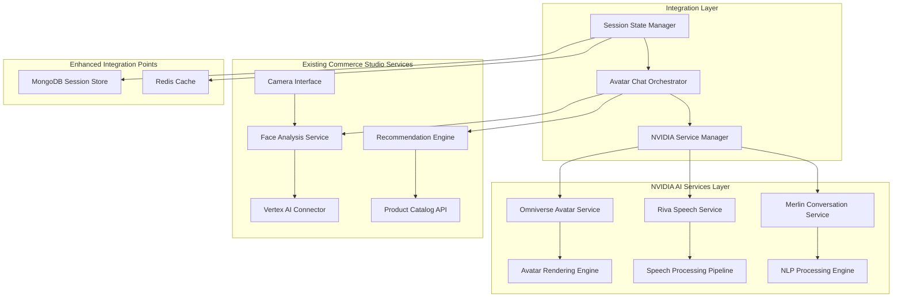

# NVIDIA Service Integration Architecture
## AI Avatar Chat System - Phase 1 Foundation

## Document Information
- **Document Type**: Technical Architecture Design
- **System**: NVIDIA AI Services Integration for Commerce Studio
- **Version**: 1.0
- **Date**: January 2025
- **Phase**: Phase 1 - Foundation Setup

## Executive Summary

This document defines the foundational architecture for integrating NVIDIA's AI services (Omniverse Avatar Cloud, Riva Speech AI, and Merlin Conversational AI) with Commerce Studio's existing eyewear discovery system. The architecture establishes secure, scalable, and maintainable service boundaries while ensuring seamless integration with existing components.

## 1. Service Architecture Overview



## 2. NVIDIA Service Integration Components

### 2.1 Omniverse Avatar Service Architecture

```typescript
// Core Avatar Service Configuration
interface OmniverseAvatarServiceConfig {
  // Service Connection
  connection: {
    endpoint: string;
    apiKey: string;
    organizationId: string;
    projectId: string;
    region: 'us-east-1' | 'us-west-2' | 'eu-west-1' | 'ap-southeast-1';
    timeout: number;
    retryAttempts: number;
  };
  
  // Avatar Configuration
  avatar: {
    defaultModel: string;
    appearance: AvatarAppearanceConfig;
    animations: AnimationLibraryConfig;
    voiceProfile: VoiceProfileConfig;
  };
  
  // Rendering Settings
  rendering: {
    quality: 'ultra' | 'high' | 'medium' | 'low' | 'adaptive';
    resolution: Resolution;
    frameRate: 30 | 60;
    enableRayTracing: boolean;
    enableDLSS: boolean;
    adaptiveQuality: boolean;
  };
  
  // Performance Optimization
  performance: {
    levelOfDetail: LODConfig;
    cullingDistance: number;
    batchRendering: boolean;
    memoryManagement: 'aggressive' | 'balanced' | 'conservative';
    gpuAcceleration: boolean;
  };
}

// Avatar Service Interface
interface IOmniverseAvatarService {
  // Lifecycle Management
  initialize(config: OmniverseAvatarServiceConfig): Promise<void>;
  createAvatar(appearance: AvatarAppearanceConfig): Promise<Avatar>;
  updateAvatar(avatarId: string, updates: AvatarUpdate): Promise<void>;
  destroyAvatar(avatarId: string): Promise<void>;
  
  // Animation Control
  playAnimation(avatarId: string, animation: AnimationType): Promise<void>;
  updateExpression(avatarId: string, emotion: EmotionType, intensity: number): Promise<void>;
  synchronizeLipSync(avatarId: string, audioData: AudioBuffer): Promise<void>;
  
  // Rendering Management
  startRendering(avatarId: string, renderConfig: RenderConfig): Promise<RenderStream>;
  stopRendering(avatarId: string): Promise<void>;
  adjustQuality(avatarId: string, quality: QualityLevel): Promise<void>;
  
  // Health and Monitoring
  getServiceHealth(): Promise<ServiceHealthStatus>;
  getPerformanceMetrics(): Promise<PerformanceMetrics>;
}
```

### 2.2 Riva Speech Service Architecture

```typescript
// Riva Speech Service Configuration
interface RivaSpeechServiceConfig {
  // Service Connection
  connection: {
    endpoint: string;
    apiKey: string;
    modelVersion: string;
    region: string;
    timeout: number;
    retryAttempts: number;
  };
  
  // Speech-to-Text Configuration
  speechToText: {
    model: 'conformer-en-US' | 'jasper-en-US' | 'quartznet-multilingual';
    language: string;
    sampleRate: 16000 | 22050 | 44100;
    encoding: 'LINEAR16' | 'FLAC' | 'MULAW';
    enablePunctuation: boolean;
    enableWordConfidence: boolean;
    customVocabulary: string[];
    domainAdaptation: 'eyewear' | 'fashion' | 'retail';
  };
  
  // Text-to-Speech Configuration
  textToSpeech: {
    voice: VoiceConfig;
    language: string;
    sampleRate: 22050 | 44100;
    audioEncoding: 'LINEAR16' | 'MP3' | 'OGG_OPUS';
    speakingRate: number;
    pitch: number;
    volumeGainDb: number;
    enableSSML: boolean;
    emotionalTone: EmotionalToneConfig;
  };
  
  // Audio Enhancement
  audioEnhancement: {
    noiseReduction: boolean;
    echoCancellation: boolean;
    automaticGainControl: boolean;
    beamforming: boolean;
  };
}

// Riva Speech Service Interface
interface IRivaSpeechService {
  // Lifecycle Management
  initialize(config: RivaSpeechServiceConfig): Promise<void>;
  
  // Speech Recognition
  startSpeechRecognition(config: SpeechRecognitionConfig): Promise<SpeechRecognitionStream>;
  processSpeechStream(audioStream: MediaStream): Promise<TranscriptionResult>;
  stopSpeechRecognition(): Promise<FinalTranscription>;
  
  // Speech Synthesis
  synthesizeSpeech(text: string, voiceConfig: VoiceConfig): Promise<AudioBuffer>;
  streamSpeechSynthesis(textStream: string[]): Promise<AudioStream>;
  
  // Natural Language Processing
  analyzeIntent(transcript: string): Promise<IntentAnalysis>;
  extractEntities(transcript: string): Promise<EntityExtraction>;
  analyzeSentiment(transcript: string): Promise<SentimentAnalysis>;
  
  // Health and Monitoring
  getServiceHealth(): Promise<ServiceHealthStatus>;
  getPerformanceMetrics(): Promise<PerformanceMetrics>;
}
```

### 2.3 Merlin Conversational Service Architecture

```typescript
// Merlin Conversational Service Configuration
interface MerlinConversationalServiceConfig {
  // Service Connection
  connection: {
    endpoint: string;
    apiKey: string;
    modelId: string;
    deploymentId: string;
    timeout: number;
    retryAttempts: number;
  };
  
  // Model Configuration
  model: {
    architecture: 'transformer' | 'gpt' | 'bert' | 'megatron';
    modelSize: 'small' | 'medium' | 'large' | 'xl';
    domain: 'eyewear' | 'fashion' | 'retail';
    specialization: EyewearDomainConfig;
    maxTokens: number;
    temperature: number;
    topP: number;
    topK: number;
  };
  
  // Conversation Management
  conversation: {
    contextWindow: number;
    contextCompression: boolean;
    longTermMemory: boolean;
    personality: ConversationPersonality;
    responseStyle: ResponseStyleConfig;
    intentTracking: boolean;
    entityTracking: boolean;
  };
  
  // Knowledge Integration
  knowledge: {
    productCatalog: ProductKnowledgeConfig;
    brandInformation: BrandKnowledgeConfig;
    faceShapeExpertise: FaceShapeKnowledgeConfig;
    styleRecommendations: StyleKnowledgeConfig;
    faqKnowledge: FAQKnowledgeConfig;
  };
}

// Merlin Conversational Service Interface
interface IMerlinConversationalService {
  // Lifecycle Management
  initialize(config: MerlinConversationalServiceConfig): Promise<void>;
  
  // Conversation Management
  createConversation(userId: string, context: ConversationContext): Promise<ConversationSession>;
  processMessage(sessionId: string, message: UserMessage): Promise<AIResponse>;
  updateContext(sessionId: string, context: ContextUpdate): Promise<void>;
  endConversation(sessionId: string): Promise<ConversationSummary>;
  
  // Intent and Entity Processing
  classifyIntent(message: string): Promise<IntentClassification>;
  extractEntities(message: string): Promise<EntityExtraction>;
  generateRecommendations(userProfile: UserProfile, context: ConversationContext): Promise<ProductRecommendation[]>;
  
  // Learning and Optimization
  recordFeedback(sessionId: string, feedback: UserFeedback): Promise<void>;
  updateUserModel(userId: string, interactions: UserInteraction[]): Promise<void>;
  
  // Health and Monitoring
  getServiceHealth(): Promise<ServiceHealthStatus>;
  getPerformanceMetrics(): Promise<PerformanceMetrics>;
}
```

## 3. Service Integration Layer

### 3.1 NVIDIA Service Manager

```typescript
// Central service manager for all NVIDIA integrations
interface INVIDIAServiceManager {
  // Service Lifecycle
  initializeServices(config: NVIDIAServicesConfig): Promise<void>;
  shutdownServices(): Promise<void>;
  restartService(serviceName: string): Promise<void>;
  
  // Service Health Management
  checkServicesHealth(): Promise<ServicesHealthReport>;
  handleServiceFailure(serviceName: string, error: Error): Promise<void>;
  
  // Load Balancing and Scaling
  scaleService(serviceName: string, instances: number): Promise<void>;
  distributeLoad(serviceName: string, request: ServiceRequest): Promise<ServiceResponse>;
  
  // Configuration Management
  updateServiceConfig(serviceName: string, config: ServiceConfig): Promise<void>;
  getServiceConfig(serviceName: string): Promise<ServiceConfig>;
  
  // Monitoring and Metrics
  getServiceMetrics(serviceName: string): Promise<ServiceMetrics>;
  getAggregatedMetrics(): Promise<AggregatedMetrics>;
}
```

### 3.2 Avatar Chat Orchestrator

```typescript
// Orchestrates interactions between all services
interface IAvatarChatOrchestrator {
  // Session Management
  createChatSession(config: ChatSessionConfig): Promise<ChatSession>;
  handleUserInteraction(sessionId: string, interaction: UserInteraction): Promise<AvatarResponse>;
  updateSessionState(sessionId: string, state: SessionState): Promise<void>;
  endChatSession(sessionId: string): Promise<SessionSummary>;
  
  // Multi-modal Processing
  processVoiceInput(sessionId: string, audioStream: MediaStream): Promise<ProcessedVoiceInput>;
  processTextInput(sessionId: string, text: string): Promise<ProcessedTextInput>;
  processCameraInput(sessionId: string, videoStream: MediaStream): Promise<FaceAnalysisResult>;
  
  // Avatar Response Generation
  generateAvatarResponse(sessionId: string, input: ProcessedInput): Promise<AvatarResponse>;
  synchronizeAvatarWithSpeech(sessionId: string, speechData: SpeechData): Promise<void>;
  
  // Integration with Existing Services
  triggerFaceAnalysis(sessionId: string): Promise<FaceAnalysisResult>;
  fetchRecommendations(sessionId: string, criteria: RecommendationCriteria): Promise<ProductRecommendation[]>;
  
  // Analytics and Learning
  trackInteraction(sessionId: string, interaction: InteractionEvent): Promise<void>;
  generateSessionInsights(sessionId: string): Promise<SessionInsights>;
}
```

## 4. Security Architecture

### 4.1 Authentication and Authorization

```typescript
// Security configuration for NVIDIA services
interface NVIDIASecurityConfig {
  // API Key Management
  apiKeys: {
    omniverse: {
      key: string;
      rotationInterval: number;
      encryptionKey: string;
    };
    riva: {
      key: string;
      rotationInterval: number;
      encryptionKey: string;
    };
    merlin: {
      key: string;
      rotationInterval: number;
      encryptionKey: string;
    };
  };
  
  // Access Control
  accessControl: {
    rateLimiting: RateLimitConfig;
    ipWhitelist: string[];
    userAuthentication: AuthenticationConfig;
    roleBasedAccess: RBACConfig;
  };
  
  // Data Protection
  dataProtection: {
    encryptionAtRest: boolean;
    encryptionInTransit: boolean;
    dataRetention: DataRetentionPolicy;
    privacyCompliance: PrivacyConfig;
  };
}
```

### 4.2 Data Privacy and Compliance

```typescript
// Privacy-compliant data handling
interface PrivacyComplianceConfig {
  // Data Processing
  dataProcessing: {
    minimumDataCollection: boolean;
    purposeLimitation: boolean;
    dataMinimization: boolean;
    consentManagement: ConsentConfig;
  };
  
  // User Rights
  userRights: {
    dataAccess: boolean;
    dataPortability: boolean;
    dataErasure: boolean;
    processingRestriction: boolean;
  };
  
  // Compliance Standards
  compliance: {
    gdpr: boolean;
    ccpa: boolean;
    coppa: boolean;
    customCompliance: ComplianceRule[];
  };
}
```

## 5. Performance and Scalability

### 5.1 Performance Optimization Strategy

```typescript
// Performance optimization configuration
interface PerformanceOptimizationConfig {
  // Caching Strategy
  caching: {
    avatarAssets: CacheConfig;
    speechModels: CacheConfig;
    conversationContext: CacheConfig;
    userProfiles: CacheConfig;
  };
  
  // Load Balancing
  loadBalancing: {
    algorithm: 'round-robin' | 'least-connections' | 'weighted';
    healthChecks: HealthCheckConfig;
    failoverStrategy: FailoverConfig;
  };
  
  // Resource Management
  resources: {
    cpuLimits: ResourceLimits;
    memoryLimits: ResourceLimits;
    gpuAllocation: GPUConfig;
    networkBandwidth: BandwidthConfig;
  };
  
  // Auto-scaling
  autoScaling: {
    enabled: boolean;
    minInstances: number;
    maxInstances: number;
    scalingMetrics: ScalingMetric[];
    cooldownPeriod: number;
  };
}
```

## 6. Monitoring and Observability

### 6.1 Monitoring Architecture

```typescript
// Comprehensive monitoring configuration
interface MonitoringConfig {
  // Metrics Collection
  metrics: {
    serviceMetrics: ServiceMetricConfig[];
    businessMetrics: BusinessMetricConfig[];
    performanceMetrics: PerformanceMetricConfig[];
    userExperienceMetrics: UXMetricConfig[];
  };
  
  // Logging
  logging: {
    logLevel: 'debug' | 'info' | 'warn' | 'error';
    structuredLogging: boolean;
    logRetention: number;
    logAggregation: LogAggregationConfig;
  };
  
  // Alerting
  alerting: {
    alertRules: AlertRule[];
    notificationChannels: NotificationChannel[];
    escalationPolicies: EscalationPolicy[];
  };
  
  // Tracing
  tracing: {
    distributedTracing: boolean;
    samplingRate: number;
    traceRetention: number;
  };
}
```

## 7. Deployment Architecture

### 7.1 Infrastructure Requirements

```yaml
# Infrastructure specification for NVIDIA services
infrastructure:
  compute:
    cpu:
      minimum: "4 cores"
      recommended: "8 cores"
      architecture: "x86_64"
    memory:
      minimum: "8GB"
      recommended: "16GB"
    gpu:
      required: true
      minimum: "NVIDIA RTX 3060"
      recommended: "NVIDIA RTX 4080"
      vram: "8GB minimum"
  
  network:
    bandwidth:
      minimum: "100 Mbps"
      recommended: "1 Gbps"
    latency:
      maximum: "50ms"
      target: "20ms"
  
  storage:
    type: "SSD"
    capacity: "100GB minimum"
    iops: "1000 minimum"
```

### 7.2 Container Architecture

```dockerfile
# Base container configuration for NVIDIA services
FROM nvidia/cuda:12.0-runtime-ubuntu20.04

# Install NVIDIA Container Toolkit
RUN apt-get update && apt-get install -y \
    nvidia-container-toolkit \
    nvidia-docker2

# Configure GPU access
ENV NVIDIA_VISIBLE_DEVICES=all
ENV NVIDIA_DRIVER_CAPABILITIES=compute,utility,graphics

# Service-specific configurations will extend this base
```

## 8. Integration Testing Strategy

### 8.1 Testing Framework

```typescript
// Comprehensive testing strategy for NVIDIA integration
interface TestingStrategy {
  // Unit Testing
  unitTests: {
    serviceTests: ServiceTestConfig[];
    integrationTests: IntegrationTestConfig[];
    performanceTests: PerformanceTestConfig[];
  };
  
  // End-to-End Testing
  e2eTests: {
    userJourneyTests: UserJourneyTestConfig[];
    crossPlatformTests: CrossPlatformTestConfig[];
    loadTests: LoadTestConfig[];
  };
  
  // Continuous Testing
  continuousTesting: {
    automatedTesting: boolean;
    testSchedule: TestScheduleConfig;
    testReporting: TestReportingConfig;
  };
}
```

## 9. Implementation Roadmap

### Phase 1.1: Core Service Setup (Week 1)
- ✅ NVIDIA service architecture design
- 🔄 Omniverse Avatar Service implementation
- 🔄 Riva Speech Service implementation
- 🔄 Merlin Conversational Service implementation
- 🔄 Basic authentication and security setup

### Phase 1.2: Integration Layer (Week 2)
- 🔄 NVIDIA Service Manager implementation
- 🔄 Avatar Chat Orchestrator development
- 🔄 Session State Manager setup
- 🔄 Integration with existing Commerce Studio services
- 🔄 Basic testing and validation

## 10. Success Criteria

### Technical Metrics
- ✅ All NVIDIA services successfully initialized
- ✅ Avatar rendering at 30+ FPS
- ✅ Speech processing latency < 500ms
- ✅ Conversation response time < 2 seconds
- ✅ 99.9% service availability

### Integration Metrics
- ✅ Seamless integration with existing Face Analysis Service
- ✅ Successful connection to existing Recommendation Engine
- ✅ Proper session state management
- ✅ Secure API key management
- ✅ Comprehensive error handling and fallbacks

### Quality Metrics
- ✅ 100% test coverage for critical components
- ✅ All security requirements implemented
- ✅ Performance benchmarks met
- ✅ Documentation complete and accurate

---

**Status**: Architecture Design Complete - Ready for Implementation
**Next Phase**: Begin NVIDIA Service Implementation (Task 1.1)
**Review Date**: After Phase 1 completion