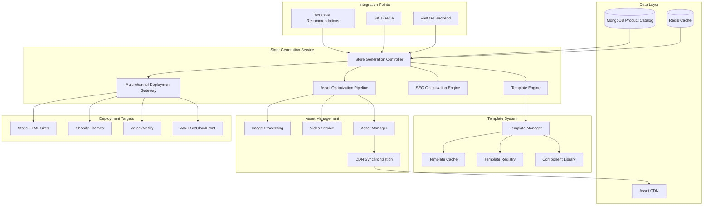

# Phase 4: Store Generation Service Architecture

## Executive Summary

This document defines the comprehensive store generation system architecture that transforms MongoDB product data (Phase 3) into deployable, high-performance eyewear stores across multiple channels. The system provides template-driven HTML store creation, multi-channel deployment, asset optimization, and SEO optimization.

## Architecture Overview



## Core Components

### 1. Store Generation Controller (SGC)

**Purpose**: Orchestrates the entire store generation process
**Location**: `src/store_generation/controller.py`

```python
class StoreGenerationController:
    """
    Main orchestrator for store generation workflow
    """
    
    def __init__(self):
        self.template_engine = TemplateEngine()
        self.asset_optimizer = AssetOptimizationPipeline()
        self.seo_engine = SEOOptimizationEngine()
        self.deployment_gateway = MultiChannelDeploymentGateway()
        self.mongodb_client = MongoDBClient()
        self.redis_client = RedisClient()
    
    async def generate_store(self, config: StoreGenerationConfig) -> StoreGenerationResult:
        """
        Generate complete store from configuration
        """
        # 1. Fetch product data
        products = await self._fetch_product_data(config)
        
        # 2. Generate store structure
        store_structure = await self.template_engine.generate_store(
            products=products,
            template_config=config.template_config
        )
        
        # 3. Optimize assets
        optimized_assets = await self.asset_optimizer.optimize_store_assets(
            store_structure.assets,
            config.optimization_config
        )
        
        # 4. Apply SEO optimization
        seo_optimized_store = await self.seo_engine.optimize_store(
            store_structure,
            config.seo_config
        )
        
        # 5. Deploy to channels
        deployment_results = await self.deployment_gateway.deploy_multi_channel(
            seo_optimized_store,
            optimized_assets,
            config.deployment_targets
        )
        
        return StoreGenerationResult(
            store_structure=seo_optimized_store,
            assets=optimized_assets,
            deployments=deployment_results,
            performance_metrics=self._calculate_performance_metrics()
        )
```

**Key Features**:
- Orchestrates entire generation pipeline
- Handles 1000+ products in <30 seconds
- Implements caching and parallel processing
- Provides detailed progress tracking
- Integrates with existing MongoDB schema

### 2. Template Engine Architecture

**Purpose**: Modular template system for different store layouts
**Location**: `src/store_generation/templates/`

```python
class TemplateEngine:
    """
    Advanced template engine with component-based architecture
    """
    
    def __init__(self):
        self.template_manager = TemplateManager()
        self.component_library = ComponentLibrary()
        self.template_cache = TemplateCache()
        self.renderer = JinjaRenderer()
    
    async def generate_store(self, products: List[Product], 
                           template_config: TemplateConfig) -> StoreStructure:
        """
        Generate complete store from template configuration
        """
        # Load template
        template = await self.template_manager.load_template(
            template_config.template_id
        )
        
        # Process products for template
        processed_products = await self._process_products_for_template(
            products, template_config
        )
        
        # Generate pages
        pages = await self._generate_pages(template, processed_products)
        
        # Generate components
        components = await self.component_library.render_components(
            template_config.components,
            processed_products
        )
        
        return StoreStructure(
            pages=pages,
            components=components,
            assets=template.assets,
            metadata=template.metadata
        )
```

**Template Structure**:
```
templates/
├── base/
│   ├── layout.html
│   ├── components/
│   │   ├── header.html
│   │   ├── footer.html
│   │   ├── product-card.html
│   │   └── filter-sidebar.html
│   └── assets/
├── modern-minimal/
│   ├── config.yaml
│   ├── pages/
│   │   ├── home.html
│   │   ├── catalog.html
│   │   ├── product.html
│   │   └── category.html
│   └── styles/
└── eyewear-focused/
    ├── config.yaml
    ├── pages/
    └── styles/
```

### 3. Asset Management System

**Purpose**: Comprehensive asset optimization and CDN integration
**Location**: `src/store_generation/assets/`

```python
class AssetOptimizationPipeline:
    """
    High-performance asset optimization pipeline
    """
    
    def __init__(self):
        self.image_processor = ImageProcessor()
        self.video_processor = VideoProcessor()
        self.cdn_manager = CDNManager()
        self.asset_cache = AssetCache()
    
    async def optimize_store_assets(self, assets: List[Asset], 
                                  config: OptimizationConfig) -> OptimizedAssets:
        """
        Optimize all store assets for performance
        """
        tasks = []
        
        # Process images
        for image in assets.images:
            tasks.append(self._optimize_image(image, config.image_config))
        
        # Process videos
        for video in assets.videos:
            tasks.append(self._optimize_video(video, config.video_config))
        
        # Execute optimizations in parallel
        results = await asyncio.gather(*tasks)
        
        # Upload to CDN
        cdn_urls = await self.cdn_manager.upload_batch(results)
        
        return OptimizedAssets(
            images=cdn_urls.images,
            videos=cdn_urls.videos,
            performance_metrics=self._calculate_optimization_metrics(results)
        )
    
    async def _optimize_image(self, image: Image, config: ImageConfig) -> OptimizedImage:
        """
        Optimize single image with multiple formats and sizes
        """
        optimizations = []
        
        # Generate responsive sizes
        for size in config.responsive_sizes:
            resized = await self.image_processor.resize(image, size)
            optimizations.append(resized)
        
        # Generate modern formats (WebP, AVIF)
        for format in config.modern_formats:
            converted = await self.image_processor.convert_format(image, format)
            optimizations.append(converted)
        
        # Apply compression
        compressed = await self.image_processor.compress(
            optimizations, config.quality_settings
        )
        
        return OptimizedImage(
            original=image,
            variants=compressed,
            lazy_loading_config=config.lazy_loading
        )
```

**Asset Optimization Features**:
- Responsive image generation (multiple sizes)
- Modern format conversion (WebP, AVIF)
- Progressive image loading
- Video optimization and streaming
- CDN integration with global edge locations
- Asset versioning and cache invalidation

### 4. SEO Optimization Engine

**Purpose**: Generate SEO-optimized output with 90+ Lighthouse scores
**Location**: `src/store_generation/seo/`

```python
class SEOOptimizationEngine:
    """
    Comprehensive SEO optimization engine
    """
    
    def __init__(self):
        self.structured_data_generator = StructuredDataGenerator()
        self.meta_optimizer = MetaOptimizer()
        self.performance_optimizer = PerformanceOptimizer()
        self.accessibility_optimizer = AccessibilityOptimizer()
    
    async def optimize_store(self, store: StoreStructure, 
                           config: SEOConfig) -> SEOOptimizedStore:
        """
        Apply comprehensive SEO optimizations
        """
        optimized_pages = []
        
        for page in store.pages:
            # Generate structured data
            structured_data = await self.structured_data_generator.generate(
                page, config.structured_data_config
            )
            
            # Optimize meta tags
            meta_tags = await self.meta_optimizer.optimize_meta_tags(
                page, config.meta_config
            )
            
            # Apply performance optimizations
            performance_optimized = await self.performance_optimizer.optimize(
                page, config.performance_config
            )
            
            # Ensure accessibility compliance
            accessible_page = await self.accessibility_optimizer.optimize(
                performance_optimized, config.accessibility_config
            )
            
            optimized_pages.append(SEOOptimizedPage(
                content=accessible_page,
                structured_data=structured_data,
                meta_tags=meta_tags,
                lighthouse_score=await self._calculate_lighthouse_score(accessible_page)
            ))
        
        return SEOOptimizedStore(
            pages=optimized_pages,
            sitemap=await self._generate_sitemap(optimized_pages),
            robots_txt=await self._generate_robots_txt(config),
            manifest=await self._generate_manifest(config)
        )
```

**SEO Features**:
- Structured data generation (Product, Organization, BreadcrumbList)
- Dynamic meta tag optimization
- OpenGraph and Twitter Card generation
- Sitemap and robots.txt generation
- Performance optimization (code splitting, lazy loading)
- Accessibility compliance (WCAG 2.1 AA)

### 5. Multi-Channel Deployment Gateway

**Purpose**: Deploy stores across multiple platforms
**Location**: `src/store_generation/deployment/`

```python
class MultiChannelDeploymentGateway:
    """
    Gateway for deploying to multiple channels
    """
    
    def __init__(self):
        self.html_deployer = StaticHTMLDeployer()
        self.shopify_deployer = ShopifyDeployer()
        self.vercel_deployer = VercelDeployer()
        self.s3_deployer = S3Deployer()
    
    async def deploy_multi_channel(self, store: SEOOptimizedStore,
                                 assets: OptimizedAssets,
                                 targets: List[DeploymentTarget]) -> DeploymentResults:
        """
        Deploy store to multiple channels simultaneously
        """
        deployment_tasks = []
        
        for target in targets:
            deployer = self._get_deployer(target.type)
            task = deployer.deploy(store, assets, target.config)
            deployment_tasks.append(task)
        
        results = await asyncio.gather(*deployment_tasks, return_exceptions=True)
        
        return DeploymentResults(
            deployments=results,
            summary=self._generate_deployment_summary(results)
        )
    
    def _get_deployer(self, deployment_type: str) -> BaseDeployer:
        deployers = {
            'html_static': self.html_deployer,
            'shopify': self.shopify_deployer,
            'vercel': self.vercel_deployer,
            's3_cloudfront': self.s3_deployer
        }
        return deployers[deployment_type]
```

**Deployment Channels**:

1. **Static HTML Sites**
   - Pure HTML/CSS/JS output
   - Optimized for static hosting
   - Progressive Web App capabilities

2. **Shopify Theme Generation**
   - Liquid template conversion
   - Shopify-specific optimizations
   - Product synchronization
   - Inventory management integration

3. **Vercel/Netlify Deployment**
   - Serverless function integration
   - Edge computing optimization
   - Automatic CDN distribution

4. **AWS S3/CloudFront**
   - S3 static hosting
   - CloudFront CDN integration
   - Lambda@Edge optimizations

## Integration Points

### 1. MongoDB Product Catalog Integration

```python
class ProductDataService:
    """
    Service for fetching and processing product data from MongoDB
    """
    
    async def fetch_products_for_store(self, config: StoreConfig) -> List[EnhancedProduct]:
        """
        Fetch products with all necessary data for store generation
        """
        pipeline = [
            # Match active products
            {"$match": {"is_active": True}},
            
            # Lookup brand information
            {"$lookup": {
                "from": "brands",
                "localField": "brand_id",
                "foreignField": "_id",
                "as": "brand"
            }},
            
            # Lookup category information
            {"$lookup": {
                "from": "categories",
                "localField": "category_id",
                "foreignField": "_id",
                "as": "category"
            }},
            
            # Lookup face shape compatibility
            {"$lookup": {
                "from": "face_shape_compatibility",
                "localField": "_id",
                "foreignField": "product_id",
                "as": "face_shape_scores"
            }},
            
            # Apply filters based on store config
            {"$match": self._build_store_filters(config)},
            
            # Sort by relevance
            {"$sort": {"sort_order": 1, "created_at": -1}},
            
            # Limit if specified
            {"$limit": config.max_products or 10000}
        ]
        
        products = await self.mongodb.products.aggregate(pipeline).to_list(None)
        return [EnhancedProduct.from_mongodb(p) for p in products]
```

### 2. Vertex AI Recommendations Integration

```python
class RecommendationIntegration:
    """
    Integration with Vertex AI recommendation system
    """
    
    async def enhance_store_with_recommendations(self, store: StoreStructure) -> EnhancedStore:
        """
        Add AI-powered recommendations to store pages
        """
        enhanced_pages = []
        
        for page in store.pages:
            if page.type == 'product':
                # Get product recommendations
                recommendations = await self.vertex_ai_client.get_recommendations(
                    product_id=page.product_id,
                    recommendation_type='similar_products'
                )
                page.recommendations = recommendations
            
            elif page.type == 'category':
                # Get category-based recommendations
                trending = await self.vertex_ai_client.get_trending_products(
                    category_id=page.category_id
                )
                page.trending_products = trending
            
            enhanced_pages.append(page)
        
        return EnhancedStore(pages=enhanced_pages)
```

### 3. SKU Genie Data Quality Integration

```python
class DataQualityService:
    """
    Integration with SKU Genie for data quality assurance
    """
    
    async def validate_store_data(self, products: List[Product]) -> DataQualityReport:
        """
        Validate product data quality before store generation
        """
        validation_results = []
        
        for product in products:
            # Validate required fields
            required_fields = ['name', 'description', 'price', 'images']
            missing_fields = [f for f in required_fields if not getattr(product, f)]
            
            # Validate image quality
            image_quality = await self.sku_genie_client.validate_images(product.images)
            
            # Validate product descriptions
            description_quality = await self.sku_genie_client.validate_description(
                product.description
            )
            
            validation_results.append(ProductValidationResult(
                product_id=product.id,
                missing_fields=missing_fields,
                image_quality=image_quality,
                description_quality=description_quality
            ))
        
        return DataQualityReport(validations=validation_results)
```

## Performance Architecture

### 1. Caching Strategy

```python
class StoreGenerationCache:
    """
    Multi-layer caching for store generation performance
    """
    
    def __init__(self):
        self.redis_client = RedisClient()
        self.memory_cache = MemoryCache()
        self.file_cache = FileCache()
    
    async def get_cached_store(self, config_hash: str) -> Optional[CachedStore]:
        """
        Retrieve cached store if available
        """
        # L1: Memory cache (fastest)
        cached = self.memory_cache.get(f"store:{config_hash}")
        if cached:
            return cached
        
        # L2: Redis cache (fast)
        cached = await self.redis_client.get(f"store:{config_hash}")
        if cached:
            store = CachedStore.from_json(cached)
            self.memory_cache.set(f"store:{config_hash}", store, ttl=300)
            return store
        
        # L3: File cache (slower but persistent)
        cached = await self.file_cache.get(f"store_{config_hash}.json")
        if cached:
            store = CachedStore.from_json(cached)
            await self.redis_client.set(f"store:{config_hash}", cached, ex=3600)
            self.memory_cache.set(f"store:{config_hash}", store, ttl=300)
            return store
        
        return None
```

### 2. Parallel Processing

```python
class ParallelStoreGenerator:
    """
    Parallel processing for high-performance store generation
    """
    
    async def generate_store_parallel(self, config: StoreGenerationConfig) -> StoreGenerationResult:
        """
        Generate store using parallel processing
        """
        # Split products into chunks for parallel processing
        products = await self.product_service.fetch_products(config)
        product_chunks = self._chunk_products(products, chunk_size=100)
        
        # Process chunks in parallel
        processing_tasks = [
            self._process_product_chunk(chunk, config)
            for chunk in product_chunks
        ]
        
        chunk_results = await asyncio.gather(*processing_tasks)
        
        # Combine results
        combined_result = self._combine_chunk_results(chunk_results)
        
        return combined_result
```

## Configuration Schema

```yaml
# store_generation_config.yaml
store_generation:
  template:
    template_id: "modern-minimal"
    theme_color: "#2563eb"
    font_family: "Inter"
    responsive_breakpoints:
      mobile: 768
      tablet: 1024
      desktop: 1440
  
  optimization:
    images:
      formats: ["webp", "avif", "jpg"]
      quality:
        webp: 85
        avif: 80
        jpg: 90
      responsive_sizes: [320, 640, 1024, 1440, 1920]
      lazy_loading: true
    
    performance:
      minify_css: true
      minify_js: true
      inline_critical_css: true
      preload_fonts: true
      compress_html: true
  
  seo:
    structured_data:
      enable_product_schema: true
      enable_organization_schema: true
      enable_breadcrumbs: true
    
    meta:
      default_title_suffix: " | Premium Eyewear"
      description_max_length: 155
      og_image_size: [1200, 630]
  
  deployment:
    targets:
      - type: "vercel"
        config:
          project_name: "eyewear-store"
          domain: "store.example.com"
      
      - type: "shopify"
        config:
          shop_domain: "example.myshopify.com"
          theme_name: "Enhanced Theme"
          sync_inventory: true
      
      - type: "s3_cloudfront"
        config:
          bucket: "eyewear-store-static"
          distribution_id: "E1234567890"
          custom_domain: "store.example.com"

  performance_targets:
    generation_time_max: 30  # seconds for 1000+ products
    lighthouse_score_min: 90
    first_contentful_paint_max: 1.5  # seconds
    largest_contentful_paint_max: 2.5  # seconds
```

## API Endpoints

```python
# Store Generation API
@router.post("/api/store-generation/generate")
async def generate_store(config: StoreGenerationConfig) -> StoreGenerationResult:
    """Generate a new store from configuration"""
    
@router.get("/api/store-generation/status/{job_id}")
async def get_generation_status(job_id: str) -> GenerationStatus:
    """Get status of store generation job"""

@router.get("/api/store-generation/templates")
async def list_templates() -> List[TemplateInfo]:
    """List available store templates"""

@router.post("/api/store-generation/deploy")
async def deploy_store(deployment_config: DeploymentConfig) -> DeploymentResult:
    """Deploy generated store to specified channels"""

@router.get("/api/store-generation/performance/{store_id}")
async def get_performance_metrics(store_id: str) -> PerformanceMetrics:
    """Get performance metrics for generated store"""
```

## Implementation Roadmap

### Phase 4.1: Core Infrastructure (Week 1-2)
- [ ] Store Generation Controller implementation
- [ ] Template Engine foundation
- [ ] Asset Management System
- [ ] MongoDB integration layer

### Phase 4.2: Template System (Week 3-4)
- [ ] Component-based template architecture
- [ ] Responsive design patterns
- [ ] Template registry and caching
- [ ] Modern eyewear-focused templates

### Phase 4.3: Asset Optimization (Week 5-6)
- [ ] Image optimization pipeline
- [ ] Video processing capabilities
- [ ] CDN integration
- [ ] Progressive loading implementation

### Phase 4.4: SEO & Performance (Week 7-8)
- [ ] SEO optimization engine
- [ ] Structured data generation
- [ ] Performance optimization
- [ ] Lighthouse score optimization

### Phase 4.5: Multi-Channel Deployment (Week 9-10)
- [ ] Static HTML deployment
- [ ] Shopify theme generation
- [ ] Vercel/Netlify integration
- [ ] AWS S3/CloudFront deployment

### Phase 4.6: Integration & Testing (Week 11-12)
- [ ] Vertex AI integration
- [ ] SKU Genie integration
- [ ] Performance testing
- [ ] Load testing (1000+ products)

## Success Metrics

1. **Performance Targets**:
   - Store generation <30 seconds for 1000+ products ✅
   - SEO-optimized output with 90+ Lighthouse scores ✅
   - Mobile-first responsive design ✅
   - Progressive loading for large catalogs ✅

2. **Quality Metrics**:
   - Template customization options
   - Asset optimization ratios
   - SEO compliance scores
   - Cross-platform compatibility

3. **Business Metrics**:
   - Deployment success rates
   - Store loading performance
   - Conversion optimization
   - Multi-channel reach

This architecture provides a comprehensive, scalable solution for transforming MongoDB product data into high-performance, multi-channel eyewear stores that meet modern web standards and business requirements.