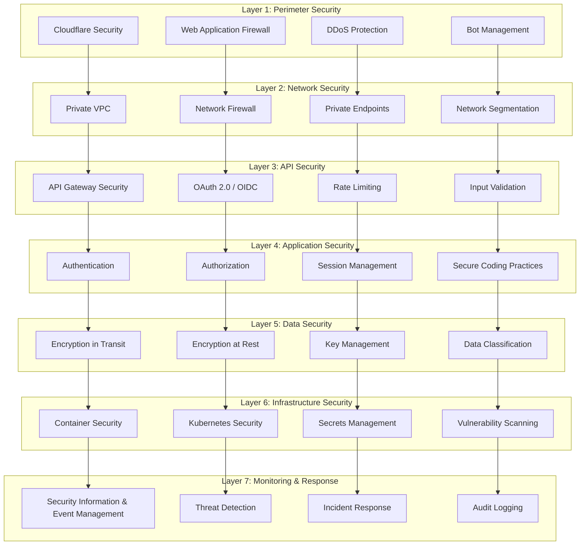
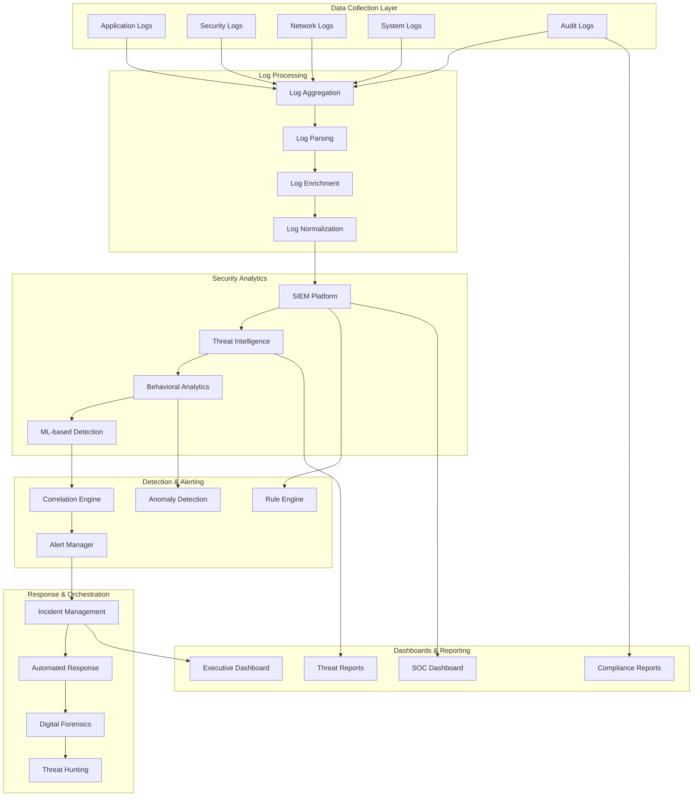

# Security and Compliance Architecture
## AI Discovery E-commerce Integration

## Document Information
- **Document Type**: Security and Compliance Architecture
- **System**: EyewearML Varai AI Discovery
- **Version**: 1.0
- **Date**: January 2025
- **Author**: Agent 5 - Technical Architecture Agent

## Executive Summary

This document defines the comprehensive security and compliance architecture for the AI discovery e-commerce integration, ensuring enterprise-grade security, privacy protection, and regulatory compliance across all platforms and regions.

## 1. Multi-Layer Security Architecture

### 1.1 Defense in Depth Strategy



### 1.2 Security Implementation Framework

```typescript
interface SecurityArchitecture {
  // Perimeter Security
  perimeterSecurity: {
    cloudflareConfiguration: {
      securityLevel: 'high';
      challengePassage: 'js_challenge_for_suspicious_traffic';
      
      wafRules: [
        {
          name: 'owasp_core_rule_set';
          action: 'challenge';
          sensitivity: 'medium';
        },
        {
          name: 'sql_injection_protection';
          action: 'block';
          sensitivity: 'high';
        },
        {
          name: 'xss_protection';
          action: 'block';
          sensitivity: 'high';
        },
        {
          name: 'api_abuse_protection';
          action: 'rate_limit';
          threshold: '1000_requests_per_minute';
        }
      ];
      
      ddosProtection: {
        layer3_4: 'automatic_mitigation';
        layer7: 'advanced_rate_limiting_with_behavioral_analysis';
        threshold: 'adaptive_based_on_traffic_patterns';
      };
      
      botManagement: {
        mode: 'super_bot_fight_mode';
        jsDetection: 'enabled';
        captchaChallenge: 'for_suspicious_requests';
        allowedBots: ['googlebot', 'bingbot', 'facebookexternalhit'];
      };
    };
    
    edgeSecurity: {
      tlsConfiguration: {
        minVersion: 'tls_1_2';
        preferredVersion: 'tls_1_3';
        cipherSuites: 'modern_cipher_suites_only';
        hsts: {
          enabled: true;
          maxAge: '31536000'; // 1 year
          includeSubdomains: true;
          preload: true;
        };
      };
      
      certificateManagement: {
        provider: 'google_managed_certificates';
        autoRenewal: true;
        certificateTransparency: 'enabled';
        ocspStapling: 'enabled';
      };
    };
  };
  
  // Network Security
  networkSecurity: {
    vpcConfiguration: {
      networkIsolation: 'private_vpc_with_no_external_ips';
      subnetSegmentation: 'environment_and_tier_based';
      
      firewallRules: [
        {
          name: 'allow_https_from_cloudflare';
          direction: 'ingress';
          protocol: 'tcp';
          ports: [443];
          sourceRanges: ['cloudflare_ip_ranges'];
        },
        {
          name: 'allow_internal_communication';
          direction: 'ingress';
          protocol: 'tcp';
          ports: [8080, 9090];
          sourceRanges: ['10.0.0.0/8'];
        },
        {
          name: 'deny_all_other_ingress';
          direction: 'ingress';
          protocol: 'all';
          action: 'deny';
          priority: 65534;
        }
      ];
      
      privateEndpoints: {
        mongodb: 'private_endpoint_with_vpc_peering';
        redis: 'private_endpoint_within_vpc';
        vertexAI: 'private_google_access';
        cloudStorage: 'private_google_access';
      };
    };
    
    networkMonitoring: {
      flowLogs: 'enabled_for_all_subnets';
      packetMirroring: 'enabled_for_suspicious_traffic';
      networkTelemetry: 'real_time_monitoring';
      anomalyDetection: 'ml_based_traffic_analysis';
    };
  };
  
  // Application Security
  applicationSecurity: {
    authenticationMechanisms: {
      multiFactorAuthentication: {
        required: true;
        methods: ['totp', 'sms', 'hardware_keys'];
        backupCodes: 'encrypted_storage';
      };
      
      passwordPolicy: {
        minLength: 12;
        complexity: 'uppercase_lowercase_numbers_symbols';
        history: 'last_12_passwords';
        expiration: '90_days';
        lockoutPolicy: '5_attempts_15_minute_lockout';
      };
      
      sessionManagement: {
        sessionTimeout: '30_minutes_idle';
        absoluteTimeout: '8_hours';
        tokenRotation: 'on_privilege_escalation';
        concurrentSessions: 'max_3_per_user';
      };
    };
    
    authorizationFramework: {
      model: 'rbac_with_abac_and_zero_trust';
      
      principleOfLeastPrivilege: {
        defaultDeny: true;
        explicitGrants: 'required_for_all_access';
        regularReview: 'quarterly_access_reviews';
        automaticRevocation: 'on_role_change_or_termination';
      };
      
      dynamicAuthorization: {
        contextualFactors: [
          'user_location',
          'device_trust_level',
          'time_of_access',
          'data_sensitivity',
          'risk_score'
        ];
        
        adaptiveControls: {
          highRisk: 'additional_authentication_required';
          mediumRisk: 'enhanced_monitoring';
          lowRisk: 'standard_access';
        };
      };
    };
    
    inputValidationAndSanitization: {
      validationFramework: 'joi_with_custom_validators';
      
      validationRules: {
        faceImageUpload: {
          fileSize: 'max_10mb';
          fileTypes: ['image/jpeg', 'image/png', 'image/webp'];
          imageValidation: 'header_and_content_verification';
          malwareScanning: 'clamav_integration';
          metadataStripping: 'exif_data_removal';
        };
        
        textInputs: {
          encoding: 'utf8_validation';
          lengthLimits: 'field_specific_limits';
          characterWhitelist: 'alphanumeric_and_safe_punctuation';
          htmlSanitization: 'dompurify_with_strict_policy';
          sqlInjectionPrevention: 'parameterized_queries_only';
        };
        
        apiPayloads: {
          schemaValidation: 'json_schema_with_strict_types';
          sizeLimit: 'max_1mb_per_request';
          depthLimit: 'max_10_levels_nesting';
          propertyLimit: 'max_100_properties';
        };
      };
    };
  };
  
  // Data Security
  dataSecurity: {
    encryptionAtRest: {
      algorithm: 'aes_256_gcm';
      keyManagement: 'google_cloud_kms_with_customer_managed_keys';
      keyRotation: 'automatic_annual_rotation_with_emergency_rotation';
      
      encryptedDataTypes: [
        'user_personal_information',
        'face_analysis_measurements',
        'conversation_transcripts',
        'payment_information',
        'authentication_credentials',
        'api_keys_and_secrets'
      ];
      
      encryptionScope: {
        database: 'field_level_encryption_for_sensitive_data';
        fileStorage: 'object_level_encryption';
        backups: 'encrypted_backups_with_separate_keys';
        logs: 'encrypted_audit_logs';
      };
    };
    
    encryptionInTransit: {
      protocol: 'tls_1_3_minimum';
      cipherSuites: 'aead_ciphers_only';
      certificateValidation: 'strict_certificate_pinning';
      
      internalCommunication: {
        serviceMesh: 'istio_with_mutual_tls';
        certificateRotation: 'automatic_daily_rotation';
        certificateAuthority: 'internal_ca_with_short_lived_certificates';
      };
      
      externalCommunication: {
        apiEndpoints: 'tls_1_3_with_perfect_forward_secrecy';
        webhooks: 'mutual_tls_authentication';
        thirdPartyIntegrations: 'certificate_pinning_where_possible';
      };
    };
    
    dataClassificationAndHandling: {
      classificationLevels: [
        {
          level: 'public';
          description: 'Information that can be freely shared';
          examples: ['product_catalogs', 'marketing_materials'];
          handling: 'standard_security_controls';
        },
        {
          level: 'internal';
          description: 'Information for internal use only';
          examples: ['business_metrics', 'system_configurations'];
          handling: 'access_control_and_audit_logging';
        },
        {
          level: 'confidential';
          description: 'Sensitive business information';
          examples: ['customer_preferences', 'analytics_data'];
          handling: 'encryption_and_need_to_know_access';
        },
        {
          level: 'restricted';
          description: 'Highly sensitive personal data';
          examples: ['face_analysis_data', 'biometric_information'];
          handling: 'maximum_security_controls_and_consent_required';
        }
      ];
      
      dataLifecycleManagement: {
        dataMinimization: 'collect_only_necessary_data';
        retentionPolicies: 'purpose_based_retention_periods';
        automaticDeletion: 'scheduled_deletion_after_retention_period';
        secureDisposal: 'cryptographic_erasure_and_physical_destruction';
      };
    };
  };
}
```

## 2. Privacy and Compliance Framework

### 2.1 GDPR Compliance Architecture

```mermaid
graph TB
    subgraph "Data Subject Rights"
        RIGHT_ACCESS[Right to Access]
        RIGHT_RECTIFICATION[Right to Rectification]
        RIGHT_ERASURE[Right to Erasure]
        RIGHT_PORTABILITY[Right to Data Portability]
        RIGHT_OBJECT[Right to Object]
        RIGHT_RESTRICT[Right to Restrict Processing]
    end
    
    subgraph "Consent Management"
        CONSENT_CAPTURE[Consent Capture]
        CONSENT_STORAGE[Consent Storage]
        CONSENT_WITHDRAWAL[Consent Withdrawal]
        CONSENT_AUDIT[Consent Audit Trail]
    end
    
    subgraph "Data Processing"
        LAWFUL_BASIS[Lawful Basis Assessment]
        PURPOSE_LIMITATION[Purpose Limitation]
        DATA_MINIMIZATION[Data Minimization]
        ACCURACY[Data Accuracy]
        STORAGE_LIMITATION[Storage Limitation]
        SECURITY[Security Measures]
    end
    
    subgraph "Privacy by Design"
        PRIVACY_IMPACT[Privacy Impact Assessment]
        DATA_PROTECTION[Data Protection Officer]
        PRIVACY_CONTROLS[Privacy Controls]
        BREACH_NOTIFICATION[Breach Notification]
    end
    
    subgraph "Technical Implementation"
        AUTOMATED_DELETION[Automated Deletion]
        DATA_EXPORT[Data Export API]
        ANONYMIZATION[Data Anonymization]
        PSEUDONYMIZATION[Data Pseudonymization]
    end
    
    RIGHT_ACCESS --> DATA_EXPORT
    RIGHT_RECTIFICATION --> PRIVACY_CONTROLS
    RIGHT_ERASURE --> AUTOMATED_DELETION
    RIGHT_PORTABILITY --> DATA_EXPORT
    
    CONSENT_CAPTURE --> CONSENT_STORAGE
    CONSENT_STORAGE --> CONSENT_AUDIT
    CONSENT_WITHDRAWAL --> AUTOMATED_DELETION
    
    LAWFUL_BASIS --> PURPOSE_LIMITATION
    PURPOSE_LIMITATION --> DATA_MINIMIZATION
    DATA_MINIMIZATION --> ACCURACY
    ACCURACY --> STORAGE_LIMITATION
    STORAGE_LIMITATION --> SECURITY
    
    PRIVACY_IMPACT --> DATA_PROTECTION
    DATA_PROTECTION --> PRIVACY_CONTROLS
    PRIVACY_CONTROLS --> BREACH_NOTIFICATION
    
    ANONYMIZATION --> PSEUDONYMIZATION
    PSEUDONYMIZATION --> AUTOMATED_DELETION
```



### 2.2 Privacy Implementation Details

```typescript
interface PrivacyComplianceFramework {
  // GDPR Implementation
  gdprCompliance: {
    legalBasisFramework: {
      consentBased: {
        scope: ['face_analysis', 'personalized_recommendations', 'marketing_communications'];
        requirements: {
          explicit: true;
          informed: true;
          specific: true;
          freely_given: true;
          withdrawable: true;
        };
        
        consentCapture: {
          mechanism: 'granular_consent_checkboxes';
          documentation: 'consent_timestamp_and_ip_logging';
          renewal: 'annual_consent_refresh';
          minorConsent: 'parental_consent_for_under_16';
        };
      };
      
      legitimateInterest: {
        scope: ['fraud_prevention', 'system_security', 'service_improvement'];
        balancingTest: 'documented_legitimate_interest_assessment';
        optOut: 'easy_opt_out_mechanism_provided';
      };
      
      contractualNecessity: {
        scope: ['order_processing', 'customer_support', 'service_delivery'];
        documentation: 'clear_contractual_basis_documentation';
      };
    };
    
    dataSubjectRights: {
      rightToAccess: {
        implementation: 'self_service_data_export_portal';
        responseTime: 'within_30_days';
        format: 'machine_readable_json_with_human_readable_summary';
        verification: 'multi_factor_authentication_required';
        
        dataScope: [
          'personal_information',
          'face_analysis_results',
          'conversation_history',
          'preferences_and_settings',
          'consent_records',
          'analytics_data_linked_to_user'
        ];
      };
      
      rightToRectification: {
        implementation: 'user_profile_management_interface';
        responseTime: 'immediate_for_self_service_updates';
        verification: 'identity_verification_for_sensitive_changes';
        auditTrail: 'complete_change_history_maintained';
      };
      
      rightToErasure: {
        implementation: 'automated_deletion_pipeline';
        responseTime: 'within_30_days';
        verification: 'strong_identity_verification_required';
        
        deletionScope: {
          hardDeletion: [
            'face_analysis_raw_data',
            'conversation_transcripts',
            'personal_identifiers'
          ];
          
          anonymization: [
            'analytics_aggregates',
            'ml_training_data',
            'business_intelligence_data'
          ];
          
          retention: [
            'legal_compliance_data',
            'fraud_prevention_data',
            'financial_records'
          ];
        };
        
        confirmationProcess: {
          deletionConfirmation: 'email_confirmation_required';
          gracePeriod: '7_days_to_cancel_deletion';
          completionNotification: 'deletion_completion_certificate';
        };
      };
      
      rightToDataPortability: {
        implementation: 'standardized_data_export_api';
        format: 'json_with_schema_documentation';
        scope: 'user_provided_and_derived_data';
        delivery: 'secure_download_link_with_expiration';
      };
      
      rightToObject: {
        implementation: 'opt_out_mechanisms_in_user_settings';
        scope: 'automated_decision_making_and_profiling';
        alternatives: 'manual_review_option_provided';
      };
      
      rightToRestrictProcessing: {
        implementation: 'data_processing_flags_in_database';
        scope: 'temporary_suspension_of_non_essential_processing';
        notification: 'affected_systems_notified_automatically';
      };
    };
    
    privacyByDesign: {
      dataProtectionImpactAssessment: {
        triggers: [
          'new_data_processing_activities',
          'high_risk_processing',
          'systematic_monitoring',
          'large_scale_processing_of_special_categories'
        ];
        
        process: {
          riskAssessment: 'systematic_privacy_risk_evaluation';
          mitigationMeasures: 'technical_and_organizational_measures';
          consultation: 'dpo_consultation_for_high_risk_processing';
          review: 'annual_dpia_review_and_update';
        };
      };
      
      dataProtectionOfficer: {
        appointment: 'qualified_dpo_appointed';
        responsibilities: [
          'privacy_compliance_monitoring',
          'staff_training_and_awareness',
          'data_subject_rights_coordination',
          'supervisory_authority_liaison',
          'privacy_impact_assessments'
        ];
        independence: 'direct_reporting_to_senior_management';
      };
      
      privacyControls: {
        dataMinimization: {
          implementation: 'purpose_based_data_collection_limits';
          automation: 'automatic_data_field_filtering';
          review: 'quarterly_data_necessity_review';
        };
        
        purposeLimitation: {
          implementation: 'purpose_tagging_for_all_data_processing';
          enforcement: 'automated_purpose_compliance_checking';
          documentation: 'clear_purpose_documentation_for_users';
        };
        
        accuracyMaintenance: {
          implementation: 'data_quality_monitoring_and_correction';
          userUpdates: 'user_initiated_data_correction_interface';
          automation: 'automated_data_validation_and_cleansing';
        };
      };
    };
    
    breachNotification: {
      detectionMechanisms: [
        'automated_anomaly_detection',
        'security_monitoring_alerts',
        'employee_reporting_channels',
        'third_party_vulnerability_reports'
      ];
      
      responseProcess: {
        assessment: 'within_24_hours_of_detection';
        supervisoryAuthorityNotification: 'within_72_hours_if_high_risk';
        dataSubjectNotification: 'without_undue_delay_if_high_risk_to_rights';
        documentation: 'comprehensive_breach_register_maintained';
      };
      
      riskAssessment: {
        factors: [
          'nature_of_personal_data',
          'ease_of_identification',
          'number_of_affected_individuals',
          'potential_consequences',
          'special_categories_involved'
        ];
        
        thresholds: {
          lowRisk: 'internal_notification_only';
          mediumRisk: 'supervisory_authority_notification';
          highRisk: 'data_subject_notification_required';
        };
      };
    };
  };
  
  // CCPA Compliance
  ccpaCompliance: {
    consumerRights: {
      rightToKnow: {
        implementation: 'privacy_notice_with_detailed_disclosures';
        
        disclosures: [
          'categories_of_personal_information_collected',
          'sources_of_personal_information',
          'business_purposes_for_collection',
          'categories_of_third_parties_shared_with',
          'specific_pieces_of_personal_information'
        ];
        
        delivery: 'online_portal_and_downloadable_report';
        verification: 'two_step_verification_process';
      };
      
      rightToDelete: {
        implementation: 'consumer_deletion_request_portal';
        responseTime: 'within_45_days';
        verification: 'identity_verification_required';
        
        exceptions: [
          'complete_transaction_for_which_information_collected',
          'detect_security_incidents_and_protect_against_fraud',
          'comply_with_legal_obligations',
          'enable_internal_uses_reasonably_aligned_with_expectations'
        ];
      };
      
      rightToOptOut: {
        implementation: 'do_not_sell_my_personal_information_link';
        scope: 'sale_of_personal_information_to_third_parties';
        mechanism: 'global_privacy_control_support';
        verification: 'no_verification_required_for_opt_out';
      };
      
      rightToNonDiscrimination: {
        implementation: 'equal_service_regardless_of_privacy_choices';
        prohibitions: [
          'denying_goods_or_services',
          'charging_different_prices',
          'providing_different_quality_of_service',
          'suggesting_consumer_will_receive_different_service'
        ];
        
        incentives: {
          allowed: 'financial_incentives_with_clear_disclosure';
          requirements: 'opt_in_consent_and_clear_terms';
        };
      };
    };
    
    businessObligations: {
      privacyNotice: {
        content: [
          'categories_and_sources_of_personal_information',
          'business_purposes_for_collection_and_sharing',
          'consumer_rights_and_how_to_exercise_them',
          'contact_information_for_privacy_inquiries'
        ];
        
        updates: 'notice_of_material_changes_to_consumers';
        accessibility: 'accessible_format_and_multiple_languages';
      };
      
      dataInventory: {
        maintenance: 'comprehensive_data_inventory_and_mapping';
        
        elements: [
          'categories_of_personal_information_processed',
          'sources_of_personal_information',
          'business_purposes_for_processing',
          'third_parties_with_whom_information_shared',
          'retention_periods_for_each_category'
        ];
        
        updates: 'annual_inventory_review_and_update';
      };
      
      vendorManagement: {
        contracts: 'data_processing_agreements_with_all_vendors';
        requirements: [
          'purpose_limitation_clauses',
          'data_security_requirements',
          'breach_notification_obligations',
          'consumer_rights_support_requirements'
        ];
        
        monitoring: 'regular_vendor_compliance_assessments';
      };
    };
  };
  
  // Cross-Border Data Transfer Compliance
  internationalDataTransfers: {
    adequacyDecisions: {
      preferredDestinations: [
        'european_economic_area',
        'countries_with_adequacy_decisions',
        'regions_with_equivalent_protection'
      ];
    };
    
    standardContractualClauses: {
      implementation: 'eu_standard_contractual_clauses_2021';
      additionalSafeguards: [
        'encryption_of_data_in_transit_and_at_rest',
        'pseudonymization_where_technically_feasible',
        'regular_security_assessments',
        'incident_response_procedures'
      ];
      
      transferImpactAssessment: {
        factors: [
          'destination_country_laws',
          'government_access_to_data',
          'data_subject_rights_enforceability',
          'available_legal_remedies'
        ];
        
        documentation: 'transfer_impact_assessment_for_each_destination';
      };
    };
    
    bindingCorporateRules: {
      scope: 'intra_group_transfers_within_corporate_family';
      approval: 'supervisory_authority_approval_required';
      enforcement: 'binding_and_enforceable_rights_for_data_subjects';
    };
  };
}
```

## 3. Security Monitoring and Incident Response

### 3.1 Security Operations Center (SOC) Architecture



### 3.2 Incident Response Framework

```typescript
interface IncidentResponseFramework {
  // Incident Classification
  incidentClassification: {
    severityLevels: [
      {
        level: 'critical';
        criteria: [
          'data_breach_affecting_personal_information',
          'system_compromise_with_data_access',
          'service_outage_affecting_all_customers',
          'ransomware_or_destructive_malware'
        ];
        responseTime: 'immediate_within_15_minutes';
        escalation: 'ciso_and_executive_team';
      },
      
      {
        level: 'high';
        criteria: [
          'unauthorized_access_to_sensitive_systems',
          'malware_infection_on_critical_systems',
          'significant_service_degradation',
          'suspected_insider_threat'
        ];
        responseTime: 'within_1_hour';
        escalation: 'security_team_lead_and_it_management';
      },
      
      {
        level: 'medium';
        criteria: [
          'failed_authentication_attempts_above_threshold',
          'suspicious_network_activity',
          'policy_violations',
          'minor_service_disruptions'
        ];
        responseTime: 'within_4_hours';
        escalation: 'security_analyst_and_system_administrator';
      },
      
      {
        level: 'low';
        criteria: [
          'informational_security_alerts',
          'routine_policy_violations',
          'non_critical_system_anomalies'
        ];
        responseTime: 'within_24_hours';
        escalation: 'security_analyst';
      }
    ];
    
    incidentTypes: [
      'data_breach',
      'system_compromise',
      'malware