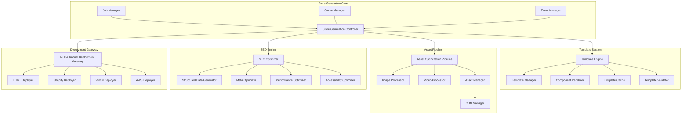

# Store Generation Service - Component Specifications

## Overview

This document provides detailed technical specifications for each component of the Store Generation Service, building upon the architecture defined in Phase 4. Each component is designed to work together to transform MongoDB product data into high-performance, multi-channel eyewear stores.

## Component Architecture



## 1. Store Generation Controller

### Purpose
Central orchestrator that manages the entire store generation workflow, coordinates all components, and ensures performance targets are met.

### Key Features
- Generate stores with 1000+ products in <30 seconds
- Support concurrent generation jobs
- Implement circuit breaker patterns
- Provide real-time progress tracking
- Handle failures gracefully with rollback capabilities

### Configuration Schema
```yaml
store_generation_controller:
  performance:
    max_concurrent_jobs: 5
    job_timeout_seconds: 300
    circuit_breaker:
      mongodb:
        failure_threshold: 5
        timeout_seconds: 30
      asset_processing:
        failure_threshold: 3
        timeout_seconds: 60
  
  caching:
    product_data_ttl: 3600  # 1 hour
    template_cache_ttl: 7200  # 2 hours
    asset_cache_ttl: 86400  # 24 hours
  
  monitoring:
    metrics_collection: true
    performance_tracking: true
    error_reporting: true
```

### Core Methods
1. **generate_store(request)** - Initiate store generation process
2. **get_job_status(job_id)** - Get current status of generation job
3. **cancel_job(job_id)** - Cancel running generation job
4. **list_active_jobs()** - List all active generation jobs

## 2. Template Engine

### Purpose
Advanced template system that generates responsive, component-based store layouts with dynamic content integration.

### Key Features
- Jinja2-based templating with custom extensions
- Component composition system
- Responsive design patterns
- Template inheritance and includes
- Custom template functions and filters

### Template Structure
```
templates/
├── layouts/
│   ├── base.html              # Base layout with header/footer
│   ├── store.html             # Store-specific layout
│   └── checkout.html          # Checkout flow layout
├── pages/
│   ├── home.html              # Homepage template
│   ├── catalog.html           # Product catalog
│   ├── product.html           # Product detail page
│   ├── category.html          # Category listing
│   ├── search.html            # Search results
│   └── about.html             # About page
├── components/
│   ├── header.html            # Site header
│   ├── footer.html            # Site footer
│   ├── navigation.html        # Main navigation
│   ├── product-card.html      # Product card component
│   ├── product-grid.html      # Product grid layout
│   ├── filter-sidebar.html    # Product filters
│   ├── breadcrumbs.html       # Breadcrumb navigation
│   ├── face-shape-guide.html  # Face shape compatibility
│   ├── size-guide.html        # Size guide modal
│   ├── reviews.html           # Product reviews
│   └── recommendations.html   # Product recommendations
├── partials/
│   ├── meta-tags.html         # SEO meta tags
│   ├── structured-data.html   # JSON-LD structured data
│   ├── analytics.html         # Analytics tracking
│   └── scripts.html           # JavaScript includes
└── macros/
    ├── forms.html             # Form helpers
    ├── images.html            # Image helpers
    └── utilities.html         # Utility functions
```

### Custom Template Functions
- **format_price(amount, currency)** - Format price with currency
- **generate_seo_title(product, config)** - Generate SEO-optimized titles
- **get_image_srcset(image, sizes)** - Generate responsive image srcset
- **format_face_shape_score(score)** - Format face shape compatibility scores
- **get_color_variants(product)** - Get available color options

### Core Methods
1. **generate_store(products, config)** - Generate complete store structure
2. **render_page(template, context)** - Render individual page
3. **validate_template(template_id)** - Validate template configuration
4. **list_available_templates()** - List all available templates

## 3. Asset Optimization Pipeline

### Purpose
High-performance asset processing system that optimizes images, videos, and other media for web delivery with CDN integration.

### Key Features
- Multi-format image optimization (WebP, AVIF, JPEG)
- Responsive image generation
- Video transcoding and streaming optimization
- Progressive loading support
- CDN upload and distribution
- Parallel processing with worker pools

### Image Processing Capabilities
- **Resize**: Maintain aspect ratio while resizing
- **Format Conversion**: Convert to modern formats (WebP, AVIF)
- **Compression**: Optimize file sizes without quality loss
- **Blur Placeholders**: Generate base64 blur placeholders
- **Dominant Colors**: Extract colors for theming
- **Responsive Variants**: Generate multiple sizes for different devices

### Optimization Targets
- 80% reduction in image file sizes
- Support for modern image formats
- Progressive loading for faster perceived performance
- Automatic CDN distribution

### Core Methods
1. **optimize_store_assets(assets, config)** - Optimize all store assets
2. **process_image(image, config)** - Process individual image
3. **process_video(video, config)** - Process individual video
4. **upload_to_cdn(assets)** - Upload optimized assets to CDN

## 4. SEO Optimization Engine

### Purpose
Comprehensive SEO optimization system that ensures 90+ Lighthouse scores and search engine compliance.

### Key Features
- Structured data generation (JSON-LD)
- Meta tag optimization
- Performance optimization
- Accessibility compliance (WCAG 2.1 AA)
- Core Web Vitals optimization
- Lighthouse testing integration

### Structured Data Types
- **Product Schema**: Enhanced product information
- **Organization Schema**: Business information
- **BreadcrumbList Schema**: Navigation hierarchy
- **Review Schema**: Customer reviews
- **FAQ Schema**: Frequently asked questions

### Performance Optimizations
- Critical CSS inlining
- JavaScript code splitting
- Image lazy loading
- Resource preloading
- Minification and compression
- Service worker implementation

### Accessibility Features
- WCAG 2.1 AA compliance
- Keyboard navigation support
- Screen reader optimization
- Color contrast validation
- Alt text generation
- Focus management

### Core Methods
1. **optimize_store(store, assets, config)** - Apply comprehensive SEO optimizations
2. **generate_structured_data(page)** - Generate JSON-LD structured data
3. **optimize_meta_tags(page)** - Optimize meta tags for search engines
4. **test_lighthouse_score(page)** - Test page with Lighthouse

## 5. Multi-Channel Deployment Gateway

### Purpose
Unified deployment system that handles multiple target platforms with platform-specific optimizations.

### Supported Platforms
- **Static HTML Sites**: Vercel, Netlify, AWS S3
- **Shopify**: Theme generation and deployment
- **Progressive Web Apps**: PWA capabilities
- **AMP Pages**: Accelerated Mobile Pages

### Platform Optimizations
- **Shopify**: Liquid template conversion, product sync
- **Jamstack**: Static site generation, serverless functions
- **AWS S3**: CloudFront CDN integration, Lambda@Edge
- **PWA**: Service worker, app manifest, offline support

### Deployment Features
- Simultaneous multi-platform deployment
- Platform-specific optimizations
- Rollback capabilities
- Health checks and monitoring
- Custom domain configuration

### Core Methods
1. **deploy_multi_channel(store, assets, targets)** - Deploy to multiple channels
2. **optimize_for_platform(store, target)** - Platform-specific optimizations
3. **monitor_deployments(deployment_ids)** - Monitor deployment status
4. **rollback_deployment(deployment_id)** - Rollback failed deployment

## Integration Points

### MongoDB Integration
- Product data fetching with aggregation pipelines
- Real-time data updates
- Performance optimization with indexes
- Circuit breaker protection

### Vertex AI Integration
- Product recommendations
- Face shape compatibility scoring
- Content enhancement
- Personalization features

### SKU Genie Integration
- Data quality validation
- Product information enhancement
- Inventory synchronization
- Brand consistency checks

### FastAPI Integration
- RESTful API endpoints
- Authentication and authorization
- Rate limiting
- Request/response validation

## Performance Metrics

### Generation Performance
- Store generation time: <30 seconds for 1000+ products
- Concurrent job capacity: 5 simultaneous generations
- Memory usage: <2GB per generation job
- CPU utilization: Optimized for multi-core processing

### Quality Metrics
- Lighthouse score: 90+ for all generated pages
- Image optimization: 80% size reduction
- SEO compliance: 100% structured data coverage
- Accessibility: WCAG 2.1 AA compliance

### Reliability Metrics
- Uptime: 99.9% availability
- Error rate: <1% failed generations
- Recovery time: <5 minutes for system issues
- Data integrity: 100% consistency across platforms

This specification serves as the foundation for implementing the Store Generation Service components. Each component should be developed with these specifications in mind to ensure seamless integration and optimal performance.