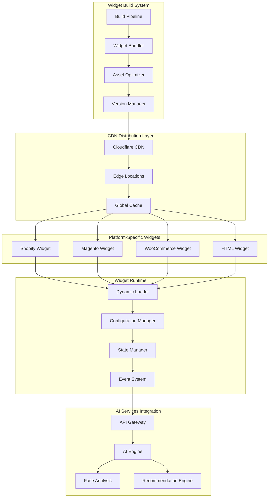
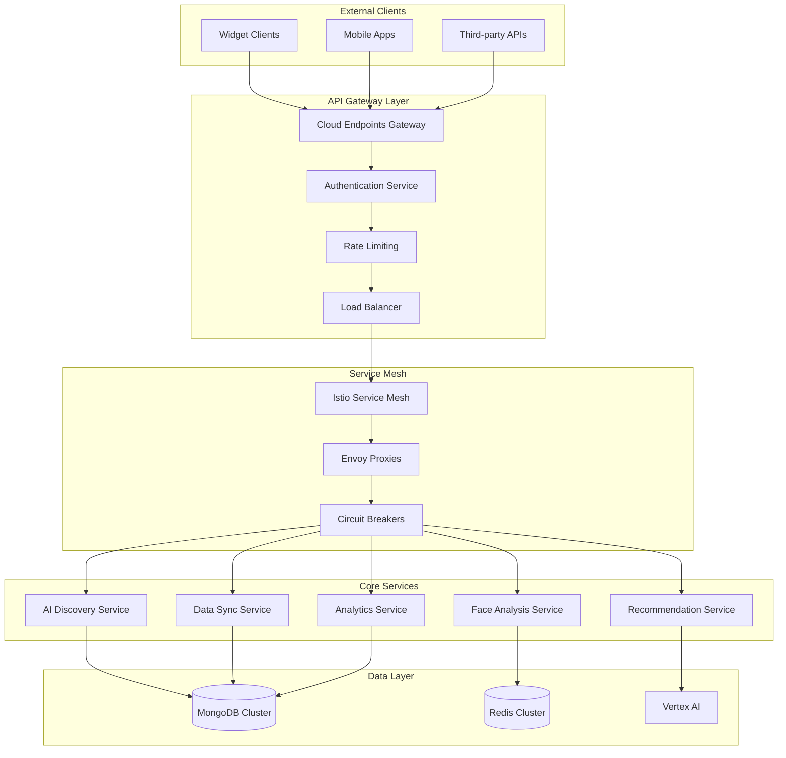
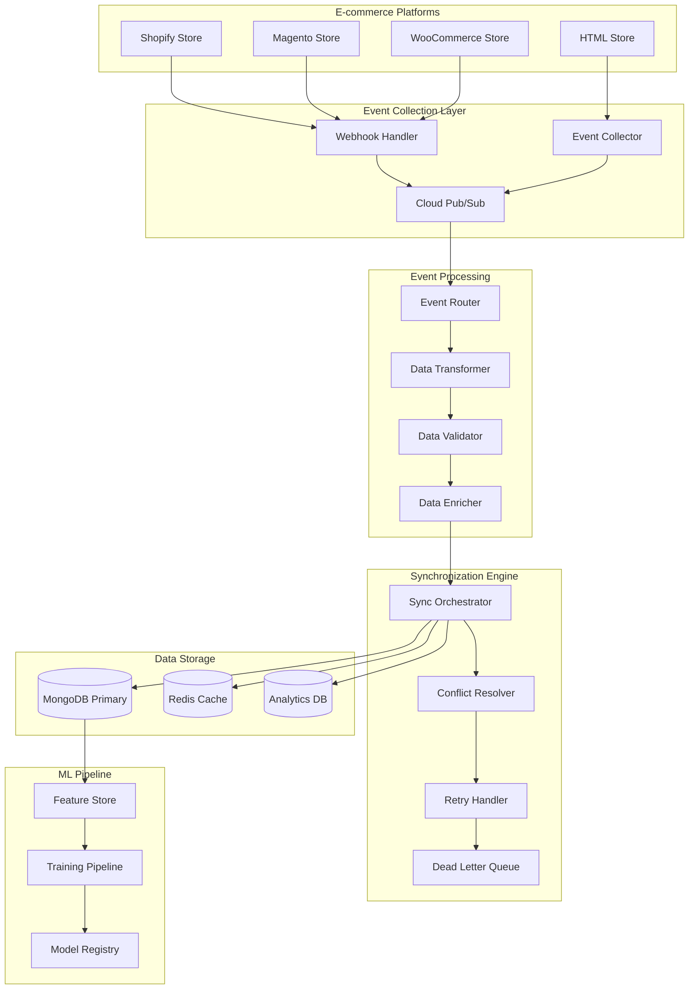
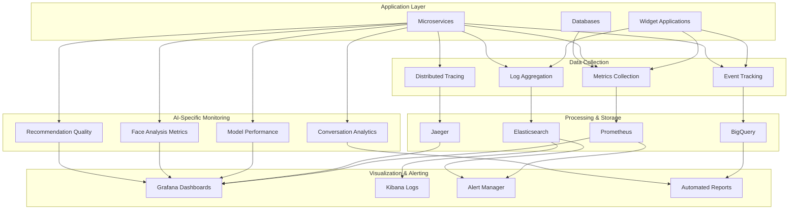
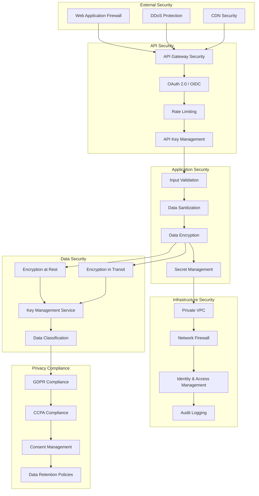
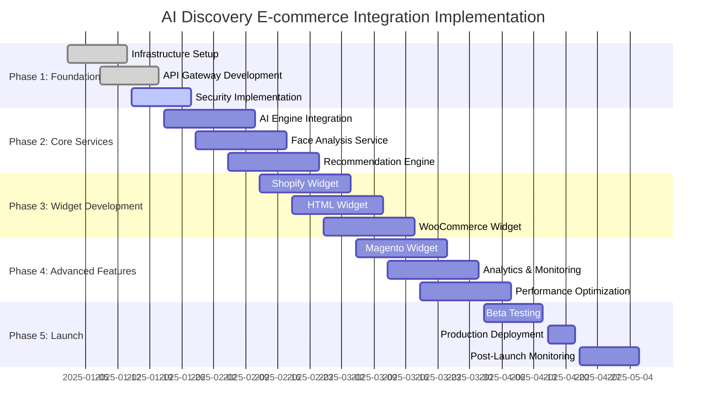

# Technical Architecture: AI Discovery E-commerce Integration
## Agent 5: Technical Architecture Agent

## Document Information
- **Document Type**: Technical Architecture Specification
- **System**: EyewearML Varai AI Discovery E-commerce Integration
- **Version**: 1.0
- **Date**: January 2025
- **Author**: Agent 5 - Technical Architecture Agent

## Executive Summary

This document defines the comprehensive technical architecture for deploying EyewearML's Varai AI-powered eyewear discovery system across multiple e-commerce platforms. The architecture builds upon the existing GCP infrastructure, MongoDB database, and Vertex AI integration while introducing scalable widget deployment, API gateway services, data synchronization, monitoring, and security layers.

The system is designed to support multi-tenant deployment across Shopify, Magento, WooCommerce, and HTML stores with real-time AI processing, privacy-compliant data handling, and enterprise-grade performance and security.

## 1. Widget Deployment Architecture

### 1.1 Multi-Platform Widget Distribution System



### 1.2 Widget Deployment Infrastructure

```typescript
interface WidgetDeploymentArchitecture {
  // CDN Configuration
  cdnConfiguration: {
    provider: 'cloudflare';
    globalDistribution: {
      regions: ['NA', 'EU', 'APAC'];
      edgeLocations: 200+;
      cacheStrategy: 'aggressive_with_smart_invalidation';
    };
    
    assetOptimization: {
      compression: 'brotli';
      minification: true;
      bundleSplitting: 'platform_specific';
      lazyLoading: 'component_based';
    };
    
    performanceTargets: {
      firstByteTime: '<100ms';
      assetLoadTime: '<500ms';
      totalWidgetLoad: '<2s';
    };
  };
  
  // Build and Deployment Pipeline
  buildPipeline: {
    cicdPlatform: 'google_cloud_build';
    buildTriggers: ['git_push', 'scheduled_builds', 'manual_trigger'];
    
    buildStages: [
      {
        name: 'source_preparation';
        actions: ['code_checkout', 'dependency_installation', 'environment_setup'];
      },
      {
        name: 'platform_builds';
        actions: ['shopify_build', 'magento_build', 'woocommerce_build', 'html_build'];
        parallel: true;
      },
      {
        name: 'optimization';
        actions: ['asset_optimization', 'bundle_analysis', 'performance_testing'];
      },
      {
        name: 'deployment';
        actions: ['cdn_upload', 'cache_invalidation', 'health_checks'];
      }
    ];
    
    rollbackStrategy: {
      automaticRollback: true;
      healthCheckFailureThreshold: 3;
      rollbackTimeWindow: '5_minutes';
    };
  };
  
  // Version Management
  versionManagement: {
    strategy: 'semantic_versioning';
    releaseChannels: ['stable', 'beta', 'alpha'];
    
    deploymentStrategy: {
      stable: 'blue_green_deployment';
      beta: 'canary_deployment';
      alpha: 'feature_flag_deployment';
    };
    
    backwardCompatibility: {
      supportedVersions: 3; // Support last 3 major versions
      deprecationNotice: '90_days';
      migrationTools: 'automated_migration_scripts';
    };
  };
}
```

### 1.3 Platform-Specific Widget Architecture

```typescript
interface PlatformWidgetArchitecture {
  // Shopify Widget Architecture
  shopifyWidget: {
    integrationMethod: 'shopify_app_with_theme_integration';
    
    components: {
      appInterface: {
        framework: 'react_with_polaris';
        authentication: 'oauth_2_0';
        permissions: ['read_products', 'read_customers', 'read_orders', 'write_script_tags'];
      };
      
      themeIntegration: {
        liquidTemplates: ['product_page', 'collection_page', 'cart_page'];
        scriptInjection: 'dynamic_script_tags';
        styleInjection: 'css_variables_with_theme_inheritance';
      };
      
      dataSync: {
        webhooks: ['orders/create', 'customers/create', 'products/update'];
        apiIntegration: 'shopify_admin_api';
        realTimeUpdates: 'websocket_connection';
      };
    };
    
    deployment: {
      appStore: 'shopify_app_store';
      installationFlow: 'one_click_install_with_guided_setup';
      configurationUI: 'embedded_app_interface';
    };
  };
  
  // WooCommerce Widget Architecture
  wooCommerceWidget: {
    integrationMethod: 'wordpress_plugin';
    
    components: {
      pluginCore: {
        framework: 'wordpress_plugin_api';
        hooks: ['woocommerce_single_product_summary', 'woocommerce_after_single_product'];
        shortcodes: ['varai_ai_discovery', 'varai_face_analysis', 'varai_recommendations'];
      };
      
      adminInterface: {
        framework: 'wordpress_admin_ui';
        configurationPages: ['general_settings', 'ai_features', 'appearance', 'analytics'];
        capabilities: 'manage_woocommerce';
      };
      
      frontendIntegration: {
        scriptEnqueuing: 'wp_enqueue_script_with_dependencies';
        styleEnqueuing: 'wp_enqueue_style_with_theme_compatibility';
        ajaxHandlers: 'wp_ajax_actions';
      };
    };
    
    deployment: {
      repository: 'wordpress_plugin_directory';
      installationFlow: 'wordpress_admin_plugin_install';
      updateMechanism: 'wordpress_auto_updates';
    };
  };
  
  // Magento Widget Architecture
  magentoWidget: {
    integrationMethod: 'magento_extension';
    
    components: {
      moduleStructure: {
        framework: 'magento_2_module_system';
        components: ['blocks', 'controllers', 'models', 'observers'];
        layoutXml: 'catalog_product_view_with_custom_blocks';
      };
      
      adminConfiguration: {
        framework: 'magento_admin_system_config';
        sections: ['general', 'ai_features', 'appearance', 'advanced'];
        acl: 'custom_admin_permissions';
      };
      
      frontendIntegration: {
        requireJs: 'magento_requirejs_with_dependencies';
        knockout: 'magento_knockout_components';
        uiComponents: 'magento_ui_component_system';
      };
    };
    
    deployment: {
      marketplace: 'magento_marketplace';
      installationMethod: 'composer_installation';
      upgradeProcess: 'magento_upgrade_scripts';
    };
  };
  
  // HTML Widget Architecture
  htmlWidget: {
    integrationMethod: 'javascript_embed';
    
    components: {
      coreWidget: {
        framework: 'vanilla_javascript_with_optional_react';
        bundling: 'webpack_with_code_splitting';
        polyfills: 'automatic_polyfill_injection';
      };
      
      configurationSystem: {
        initialization: 'declarative_configuration';
        runtime: 'api_based_configuration_updates';
        validation: 'schema_based_validation';
      };
      
      integration: {
        domIntegration: 'shadow_dom_for_isolation';
        eventSystem: 'custom_event_dispatching';
        styling: 'css_custom_properties_with_fallbacks';
      };
    };
    
    deployment: {
      distribution: 'cdn_hosted_with_npm_package';
      installation: 'script_tag_inclusion';
      configuration: 'inline_or_external_configuration';
    };
  };
}
```

## 2. API Gateway and Service Mesh Architecture

### 2.1 API Gateway Infrastructure



### 2.2 API Gateway Configuration

```yaml
# Cloud Endpoints Configuration
apiVersion: v1
kind: ConfigMap
metadata:
  name: api-gateway-config
data:
  endpoints.yaml: |
    swagger: "2.0"
    info:
      title: "EyewearML AI Discovery API"
      version: "1.0.0"
      description: "API for AI-powered eyewear discovery and recommendations"
    
    host: "api.varai.ai"
    schemes:
      - "https"
    
    securityDefinitions:
      api_key:
        type: "apiKey"
        name: "X-API-Key"
        in: "header"
      oauth2:
        type: "oauth2"
        flow: "application"
        tokenUrl: "https://auth.varai.ai/oauth/token"
    
    paths:
      /v1/ai/chat:
        post:
          summary: "Process conversational AI request"
          security:
            - api_key: []
          parameters:
            - name: "message"
              in: "body"
              required: true
              schema:
                $ref: "#/definitions/ChatMessage"
          responses:
            200:
              description: "AI response"
              schema:
                $ref: "#/definitions/AIResponse"
          x-google-backend:
            address: "https://ai-service-dot-eyewearml-ai.uc.r.appspot.com"
            path_translation: "APPEND_PATH_TO_ADDRESS"
    
      /v1/face/analyze:
        post:
          summary: "Analyze face image for measurements"
          security:
            - api_key: []
          parameters:
            - name: "image"
              in: "body"
              required: true
              schema:
                $ref: "#/definitions/FaceImage"
          responses:
            200:
              description: "Face analysis results"
              schema:
                $ref: "#/definitions/FaceAnalysisResult"
          x-google-backend:
            address: "https://face-service-dot-eyewearml-ai.uc.r.appspot.com"
    
      /v1/recommendations:
        get:
          summary: "Get personalized recommendations"
          security:
            - api_key: []
          parameters:
            - name: "session_id"
              in: "query"
              type: "string"
              required: true
            - name: "face_shape"
              in: "query"
              type: "string"
            - name: "preferences"
              in: "query"
              type: "string"
          responses:
            200:
              description: "Product recommendations"
              schema:
                $ref: "#/definitions/RecommendationList"
          x-google-backend:
            address: "https://recommendation-service-dot-eyewearml-ai.uc.r.appspot.com"
    
    definitions:
      ChatMessage:
        type: "object"
        properties:
          text:
            type: "string"
          session_id:
            type: "string"
          user_id:
            type: "string"
          context:
            type: "object"
      
      AIResponse:
        type: "object"
        properties:
          response:
            type: "string"
          intent:
            type: "string"
          actions:
            type: "array"
            items:
              type: "object"
          session_state:
            type: "object"
```

### 2.3 Service Mesh Configuration

```yaml
# Istio Service Mesh Configuration
apiVersion: networking.istio.io/v1beta1
kind: VirtualService
metadata:
  name: ai-discovery-routing
spec:
  hosts:
  - api.varai.ai
  gateways:
  - ai-discovery-gateway
  http:
  - match:
    - uri:
        prefix: /v1/ai/
    route:
    - destination:
        host: ai-service
        port:
          number: 8080
    fault:
      delay:
        percentage:
          value: 0.1
        fixedDelay: 5s
    retries:
      attempts: 3
      perTryTimeout: 2s
  
  - match:
    - uri:
        prefix: /v1/face/
    route:
    - destination:
        host: face-analysis-service
        port:
          number: 8080
    timeout: 10s
    retries:
      attempts: 2
      perTryTimeout: 5s
  
  - match:
    - uri:
        prefix: /v1/recommendations/
    route:
    - destination:
        host: recommendation-service
        port:
          number: 8080
    retries:
      attempts: 3
      perTryTimeout: 3s

---
apiVersion: networking.istio.io/v1beta1
kind: DestinationRule
metadata:
  name: ai-services-circuit-breaker
spec:
  host: "*.varai.ai"
  trafficPolicy:
    circuitBreaker:
      consecutiveErrors: 5
      interval: 30s
      baseEjectionTime: 30s
      maxEjectionPercent: 50
    loadBalancer:
      simple: LEAST_CONN
    connectionPool:
      tcp:
        maxConnections: 100
      http:
        http1MaxPendingRequests: 50
        maxRequestsPerConnection: 10
```

## 3. Data Synchronization Infrastructure

### 3.1 Event-Driven Synchronization Architecture



### 3.2 Data Synchronization Service Implementation

```typescript
interface DataSynchronizationArchitecture {
  // Event Collection System
  eventCollection: {
    webhookHandler: {
      framework: 'cloud_functions_with_express';
      authentication: 'hmac_signature_verification';
      rateLimiting: 'per_source_rate_limits';
      
      endpoints: {
        shopify: '/webhooks/shopify/{event_type}';
        magento: '/webhooks/magento/{event_type}';
        woocommerce: '/webhooks/woocommerce/{event_type}';
        html: '/events/html/{event_type}';
      };
      
      eventTypes: [
        'product_created', 'product_updated', 'product_deleted',
        'order_created', 'order_updated', 'order_completed',
        'customer_created', 'customer_updated',
        'ai_interaction', 'face_analysis_completed', 'recommendation_generated'
      ];
    };
    
    messageQueue: {
      service: 'google_cloud_pub_sub';
      topics: {
        productEvents: 'product-sync-events';
        orderEvents: 'order-sync-events';
        customerEvents: 'customer-sync-events';
        aiEvents: 'ai-interaction-events';
      };
      
      subscriptions: {
        syncProcessor: 'sync-processor-subscription';
        analyticsProcessor: 'analytics-processor-subscription';
        mlProcessor: 'ml-training-processor-subscription';
      };
      
      configuration: {
        messageRetention: '7_days';
        ackDeadline: '60_seconds';
        maxDeliveryAttempts: 5;
        deadLetterTopic: 'failed-sync-events';
      };
    };
  };
  
  // Data Processing Pipeline
  processingPipeline: {
    eventRouter: {
      implementation: 'cloud_functions_with_routing_logic';
      routingRules: [
        {
          condition: 'event.type === "product_updated"';
          destination: 'product-sync-processor';
          priority: 'high';
        },
        {
          condition: 'event.type === "order_completed"';
          destination: 'order-sync-processor';
          priority: 'medium';
        },
        {
          condition: 'event.type === "ai_interaction"';
          destination: 'ai-analytics-processor';
          priority: 'low';
        }
      ];
    };
    
    dataTransformer: {
      implementation: 'cloud_dataflow_with_apache_beam';
      transformations: [
        'platform_specific_to_canonical_format',
        'data_validation_and_cleaning',
        'privacy_compliance_filtering',
        'data_enrichment_with_ai_metadata'
      ];
      
      schemas: {
        canonicalProduct: 'product_schema_v1';
        canonicalOrder: 'order_schema_v1';
        canonicalCustomer: 'customer_schema_v1';
        aiInteraction: 'ai_interaction_schema_v1';
      };
    };
    
    conflictResolution: {
      strategy: 'timestamp_based_with_business_rules';
      rules: [
        {
          field: 'product.inventory';
          resolution: 'platform_wins'; // Platform is source of truth for inventory
        },
        {
          field: 'product.ai_metadata';
          resolution: 'varai_wins'; // Varai is source of truth for AI data
        },
        {
          field: 'customer.preferences';
          resolution: 'merge_with_timestamp'; // Merge preferences with latest timestamp
        }
      ];
    };
  };
  
  // Storage and Persistence
  storageArchitecture: {
    primaryStorage: {
      database: 'mongodb_atlas_cluster';
      configuration: {
        replicaSet: 'rs0';
        readPreference: 'secondaryPreferred';
        writeConcern: { w: 'majority', j: true };
      };
      
      collections: {
        products: {
          sharding: { key: { store_id: 1, _id: 1 } };
          indexes: [
            { store_id: 1, updated_at: -1 },
            { 'ai_metadata.face_shape_compatibility': 1 },
            { brand: 1, category: 1, in_stock: 1 }
          ];
        };
        
        orders: {
          sharding: { key: { store_id: 1, created_at: 1 } };
          indexes: [
            { store_id: 1, customer_id: 1, created_at: -1 },
            { status: 1, created_at: -1 }
          ];
        };
        
        ai_sessions: {
          sharding: { key: { session_id: 1 } };
          ttl: { created_at: 1, expireAfterSeconds: 86400 }; // 24 hours
        };
      };
    };
    
    cacheLayer: {
      service: 'redis_cluster';
      configuration: {
        nodes: 3;
        replication: true;
        persistence: 'aof_enabled';
        maxMemory: '2gb_per_node';
        evictionPolicy: 'allkeys-lru';
      };
      
      cachePatterns: {
        productCache: {
          keyPattern: 'product:{store_id}:{product_id}';
          ttl: '1_hour';
          invalidationTriggers: ['product_updated'];
        };
        
        recommendationCache: {
          keyPattern: 'recommendations:{user_id}:{face_shape}:{preferences_hash}';
          ttl: '15_minutes';
          invalidationTriggers: ['product_updated', 'inventory_changed'];
        };
        
        sessionCache: {
          keyPattern: 'session:{session_id}';
          ttl: '30_minutes';
          slidingExpiration: true;
        };
      };
    };
  };
}
```

## 4. Monitoring and Observability Architecture

### 4.1 Comprehensive Monitoring Stack



### 4.2 Monitoring Configuration

```yaml
# Prometheus Configuration for AI Discovery
apiVersion: v1
kind: ConfigMap
metadata:
  name: prometheus-config
data:
  prometheus.yml: |
    global:
      scrape_interval: 15s
      evaluation_interval: 15s
      external_labels:
        cluster: 'ai-discovery-production'
        region: 'us-central1'
    
    rule_files:
      - "/etc/prometheus/rules/*.yml"
    
    alerting:
      alertmanagers:
        - static_configs:
            - targets:
              - alertmanager:9093
    
    scrape_configs:
      # AI Discovery Services
      - job_name: 'ai-discovery-api'
        kubernetes_sd_configs:
          - role: endpoints
        relabel_configs:
          - source_labels: [__meta_kubernetes_service_name]
            action: keep
            regex: ai-discovery-api
        metrics_path: /metrics
        scrape_interval: 10s
      
      - job_name: 'face-analysis-service'
        kubernetes_sd_configs:
          - role: endpoints
        relabel_configs:
          - source_labels: [__meta_kubernetes_service_name]
            action: keep
            regex: face-analysis-service
        metrics_path: /metrics
        scrape_interval: 15s
      
      - job_name: 'recommendation-service'
        kubernetes_sd_configs:
          - role: endpoints
        relabel_configs:
          - source_labels: [__meta_kubernetes_service_name]
            action: keep
            regex: recommendation-service
        metrics_path: /metrics
        scrape_interval: 30s
      
      # Infrastructure Monitoring
      - job_name: 'mongodb-exporter'
        static_configs:
          - targets: ['mongodb-exporter:9216']
        scrape_interval: 30s
      
      - job_name: 'redis-exporter'
        static_configs:
          - targets: ['redis-exporter:9121']
        scrape_interval: 30s
      
      # Widget Performance Monitoring
      - job_name: 'widget-performance'
        static_configs:
          - targets: ['widget-metrics-collector:8080']
        scrape_interval: 60s
        metrics_path: /widget-metrics

---
# Alert Rules for AI Discovery
apiVersion: v1
kind: ConfigMap
metadata:
  name: prometheus-rules
data:
  ai-discovery-alerts.yml: |
    groups:
      - name: ai-discovery-alerts
        rules:
          # API Performance Alerts
          - alert: HighAPILatency
            expr: histogram_quantile(0.95, rate(http_request_duration_seconds_bucket[5m])) > 2
            for: 2m
            labels:
              severity: warning
            annotations:
              summary: "High API latency detected"
              description: "95th percentile latency is {{ $value }}s"
          
          - alert: HighErrorRate
            expr: rate(http_requests_total{status=~"5.."}[5m]) / rate(http_requests_total[5m]) > 0.05
            for: 1m
            labels:
              severity: critical
            annotations:
              summary: "High error rate detected"
              description: "Error rate is {{ $value | humanizePercentage }}"
          
          # AI-Specific Alerts
          - alert: FaceAnalysisFailureRate
            expr: rate(face_analysis_failures_total[5m]) / rate(face_analysis_requests_total[5m]) > 0.1
            for: 2m
            labels:
              severity: warning
            annotations:
              summary: "High face analysis failure rate"
              description: "Face analysis failure rate is {{ $value | humanizePercentage }}"
          
          - alert: RecommendationLatency
            expr: histogram_quantile(0.95, rate(recommendation_generation_duration_seconds_bucket[5m])) > 5
            for: 3m
            labels:
              severity: warning
            annotations:
              summary: "Slow recommendation generation"
              description: "95th percentile recommendation latency is {{ $value }}s"
          
          # Infrastructure Alerts
          - alert: MongoDBConnectionFailure
            expr: mongodb_up == 0
            for: 1m
            labels:
              severity: critical
            annotations:
              summary: "MongoDB connection failure"
              description: "MongoDB instance is down"
          
          - alert: RedisConnectionFailure
            expr: redis_up == 0
            for: 1m
            labels:
              severity: critical
            annotations:
              summary: "Redis connection failure"
              description: "Redis instance is down"
          
          # Widget Performance Alerts
          - alert: WidgetLoadTimeHigh
            expr: histogram_quantile(0.95, rate(widget_load_time_seconds_bucket[5m])) > 3
            for: 2m
            labels:
              severity: warning
            annotations:
              summary: "Widget load time is high"
              description: "95th percentile widget load time is {{ $value }}s"
```

### 4.3 AI-Specific Monitoring Metrics

```typescript
interface AIMonitoringMetrics {
  // Face Analysis Metrics
  faceAnalysisMetrics: {
    performanceMetrics: [
      'face_analysis_requests_total',
      'face_analysis_duration_seconds',
      'face_analysis_failures_total',
      'face_detection_confidence_score',
      'measurement_accuracy_score'
    ];
    
    qualityMetrics: [
      'image_quality_score',
      'face_detection_success_rate',
      'measurement_confidence_distribution',
      'processing_retry_count'
    ];
    
    businessMetrics: [
      'face_analysis_to_recommendation_conversion',
      'face_analysis_completion_rate',
      'user_satisfaction_with_analysis'
    ];
  };
  
  // Recommendation Engine Metrics
  recommendationMetrics: {
    performanceMetrics: [
      'recommendation_generation_duration_seconds',
      'recommendation_requests_total',
      'recommendation_cache_hit_rate',
      'recommendation_model_inference_time'
    ];
    
    qualityMetrics: [
      'recommendation_relevance_score',
      'recommendation_diversity_score',
      'recommendation_click_through_rate',
      'recommendation_conversion_rate'
    ];
    
    businessMetrics: [
      'recommendations_leading_to_purchase',
      'average_order_value_with_recommendations',
      'user_engagement_with_recommendations'
    ];
  };
  
  // Conversation AI Metrics
  conversationMetrics: {
    performanceMetrics: [
      'conversation_response_time_seconds',
      'intent_recognition_accuracy',
      'context_maintenance_score',
      'conversation_completion_rate'
    ];
    
    qualityMetrics: [
      'user_satisfaction_score',
      'conversation_coherence_score',
      'goal_achievement_rate',
      'fallback_trigger_rate'
    ];
    
    businessMetrics: [
      'conversations_leading_to_conversion',
      'average_conversation_duration',
      'repeat_conversation_rate'
    ];
  };
}
```

## 5. Security and Compliance Architecture

### 5.1 Multi-Layer Security Architecture



### 5.2 Security Implementation Details

```typescript
interface SecurityArchitecture {
  // API Security Configuration
  apiSecurity: {
    authentication: {
      methods: ['oauth2_client_credentials', 'api_key', 'jwt_bearer'];
      
      oauth2Configuration: {
        authorizationServer: 'https://auth.varai.ai';
        tokenEndpoint: '/oauth/token';
        scopes: ['read:products', 'write:analytics', 'access:ai_services'];
        tokenExpiry: '1_hour';
        refreshTokenExpiry: '30_days';
      };
      
      apiKeyConfiguration: {
        keyRotation: 'every_90_days';
        keyScoping: 'service_specific';
        rateLimiting: 'per_key_limits';
        monitoring: 'usage_analytics';
      };
    };
    
    authorization: {
      model: 'rbac_with_abac';
      
      roles: [
        {
          name: 'widget_client';
          permissions: ['read:recommendations', 'write:analytics', 'access:face_analysis'];
        },
        {
          name: 'admin_user';
          permissions: ['read:all', 'write:configuration', 'manage:users'];
        },
        {
          name: 'analytics_service';
          permissions: ['read:analytics', 'write:metrics'];
        }
      ];
      
      policies: [
        {
          name: 'data_residency_policy';
          rule: 'eu_users_data_stays_in_eu';
          enforcement: 'api_gateway_level';
        },
        {
          name: 'rate_limiting_policy';
          rule: 'max_1000_requests_per_minute_per_client';
          enforcement: 'api_gateway_level';
        }
      ];
    };
    
    inputValidation: {
      framework: 'joi_with_custom_validators';
      
      validationRules: {
        faceImageUpload: {
          maxSize: '10MB';
          allowedFormats: ['jpeg', 'png', 'webp'];
          dimensionLimits: { minWidth: 200, minHeight: 200, maxWidth: 4096, maxHeight: 4096 };
          contentValidation: 'image_content_verification';
        };
        
        chatMessage: {
          maxLength: 1000;
          allowedCharacters: 'unicode_text_with_basic_punctuation';
          profanityFilter: 'enabled';
          injectionPrevention: 'sql_and_script_injection_detection';
        };
        
        userPreferences: {
          schema: 'predefined_preference_schema';
          sanitization: 'html_entity_encoding';
          validation: 'business_rule_validation';
        };
      };
    };
  };
  
  // Data Protection
  dataProtection: {
    encryptionAtRest: {
      service: 'google_cloud_kms';
      algorithm: 'aes_256_gcm';
      keyRotation: 'automatic_annual_rotation';
      
      encryptedFields: [
        'user.personal_information',
        'face_analysis.raw_measurements',
        'conversation.message_content',
        'order.payment_information'
      ];
    };
    
    encryptionInTransit: {
      protocol: 'tls_1_3';
      certificateManagement: 'google_managed_certificates';
      hsts: 'enabled_with_preload';
      
      internalCommunication: {
        serviceMesh: 'istio_with_mutual_tls';
        certificateRotation: 'automatic_daily_rotation';
      };
    };
    
    dataClassification: {
      levels: ['public', 'internal', 'confidential', 'restricted'];
      
      classificationRules: {
        faceAnalysisData: 'restricted';
        userPreferences: 'confidential';
        productCatalog: 'internal';
        analyticsAggregates: 'internal';
        publicContent: 'public';
      };
      
      handlingPolicies: {
        restricted: {
          encryption: 'required';
          access: 'need_to_know_basis';
          retention: 'explicit_consent_based';
          sharing: 'prohibited';
        };
        confidential: {
          encryption: 'required';
          access: 'role_based';
          retention: 'business_need_based';
          sharing: 'internal_only';
        };
      };
    };
  };
  
  // Privacy Compliance
  privacyCompliance: {
    gdprCompliance: {
      legalBasis: 'consent_and_legitimate_interest';
      
      dataSubjectRights: {
        rightToAccess: {
          implementation: 'self_service_data_export';
          responseTime: '30_days';
          format: 'machine_readable_json';
        };
        
        rightToRectification: {
          implementation: 'user_profile_management_ui';
          responseTime: 'immediate';
        };
        
        rightToErasure: {
          implementation: 'automated_data_deletion_pipeline';
          responseTime: '30_days';
          verification: 'deletion_confirmation_audit_trail';
        };
        
        rightToPortability: {
          implementation: 'standardized_data_export_api';
          format: 'json_with_schema_documentation';
        };
      };
      
      consentManagement: {
        granularity: 'purpose_specific_consent';
        
        consentTypes: [
          'face_analysis_processing',
          'personalized_recommendations',
          'analytics_and_improvement',
          'marketing_communications'
        ];
        
        consentStorage: {
          location: 'encrypted_consent_database';
          retention: 'indefinite_until_withdrawal';
          auditTrail: 'complete_consent_history';
        };
      };
    };
    
    ccpaCompliance: {
      consumerRights: {
        rightToKnow: 'data_collection_transparency_notice';
        rightToDelete: 'automated_deletion_upon_request';
        rightToOptOut: 'do_not_sell_mechanism';
        rightToNonDiscrimination: 'equal_service_regardless_of_privacy_choices';
      };
      
      dataCategories: [
        'identifiers',
        'commercial_information',
        'biometric_information',
        'internet_activity',
        'inferences_from_personal_information'
      ];
    };
  };
}
```

## 6. Implementation Timeline and Success Metrics

### 6.1 Implementation Roadmap



### 6.2 Success Metrics and KPIs

```typescript
interface SuccessMetrics {
  // Technical Performance Metrics
  technicalMetrics: {
    availability: {
      target: '99.9%';
      measurement: 'uptime_monitoring';
      alertThreshold: '99.5%';
    };
    
    latency: {
      apiResponseTime: {
        target: '<500ms_p95';
        measurement: 'prometheus_metrics';
        alertThreshold: '>1000ms_p95';
      };
      
      widgetLoadTime: {
        target: '<2s_p95';
        measurement: 'real_user_monitoring';
        alertThreshold: '>3s_p95';
      };
      
      faceAnalysisTime: {
        target: '<5s_p95';
        measurement: 'service_metrics';
        alertThreshold: '>8s_p95';
      };
    };
    
    scalability: {
      concurrentUsers: {
        target: '10000+';
        measurement: 'load_testing';
        alertThreshold: 'performance_degradation_at_8000';
      };
      
      requestsPerSecond: {
        target: '1000+';
        measurement: 'api_gateway_metrics';
        alertThreshold: 'errors_above_800_rps';
      };
    };
  };
  
  // Business Metrics
  businessMetrics: {
    adoption: {
      widgetInstallations: {
        target: '1000_stores_in_6_months';
        measurement: 'installation_tracking';
      };
      
      activeUsers: {
        target: '50000_monthly_active_users';
        measurement: 'user_analytics';
      };
      
      sessionEngagement: {
        target: '5_minutes_average_session_duration';
        measurement: 'session_analytics';
      };
    };
    
    conversion: {
      faceAnalysisToRecommendation: {
        target: '80%_completion_rate';
        measurement: 'funnel_analytics';
      };
      
      recommendationToCart: {
        target: '25%_click_to_cart_rate';
        measurement: 'conversion_tracking';
      };
      
      overallConversionLift: {
        target: '40%_improvement_over_baseline';
        measurement: 'ab_testing';
      };
    };
    
    revenue: {
      revenueAttribution: {
        target: '$1M_attributed_revenue_in_first_year';
        measurement: 'revenue_tracking';
      };
      
      averageOrderValue: {
        target: '20%_increase_with_ai_recommendations';
        measurement: 'order_value_analysis';
      };
    };
  };
  
  // AI Quality Metrics
  aiQualityMetrics: {
    faceAnalysisAccuracy: {
      target: '95%_measurement_accuracy';
      measurement: 'ground_truth_validation';
    };
    
    recommendationRelevance: {
      target: '4.0_average_relevance_score';
      measurement: 'user_feedback_ratings';
    };
    
    conversationSatisfaction: {
      target: '4.2_average_satisfaction_score';
      measurement: 'post_conversation_surveys';
    };
  };
}
```

## 7. Risk Assessment and Mitigation

### 7.1 Technical Risks

| Risk | Probability | Impact | Mitigation Strategy |
|------|-------------|--------|-------------------|
| **Vertex AI Service Limits** | Medium | High | Implement request queuing, multiple model endpoints, graceful degradation |
| **MongoDB Performance Issues** | Low | High | Read replicas, connection pooling, query optimization, caching layer |
| **Widget Compatibility Issues** | High | Medium | Extensive cross-platform testing, progressive enhancement, fallback mechanisms |
| **Face Analysis Privacy Concerns** | Medium | High | Client-side processing, data minimization, explicit consent, audit trails |
| **API Rate Limiting** | Medium | Medium | Intelligent rate limiting, request prioritization, caching strategies |

### 7.2 Business Risks

| Risk | Probability | Impact | Mitigation Strategy |
|------|-------------|--------|-------------------|
| **Low Merchant Adoption** | Medium | High | Comprehensive onboarding, clear value proposition, success metrics demonstration |
| **Competitive Response** | High | Medium | Continuous innovation, patent protection, exclusive partnerships |
| **Regulatory Changes** | Low | High | Legal compliance monitoring, adaptable privacy framework, regulatory expertise |
| **Platform Policy Changes** | Medium | Medium | Multi-platform strategy, direct integration options, policy monitoring |

## 8. Conclusion

This technical architecture provides a comprehensive foundation for deploying EyewearML's AI discovery system across multiple e-commerce platforms. The architecture emphasizes:

1. **Scalability**: Designed to handle millions of users across multiple platforms
2. **Security**: Multi-layer security with privacy-first design principles
3. **Performance**: Optimized for real-time AI processing and recommendations
4. **Compliance**: Built-in GDPR and CCPA compliance mechanisms
5. **Monitoring**: Comprehensive observability for both technical and business metrics
6. **Flexibility**: Platform-agnostic design with platform-specific optimizations

The phased implementation approach ensures manageable deployment while building upon existing GCP infrastructure and MongoDB foundations. Success will be measured through technical performance metrics, business KPIs, and AI quality indicators, with continuous monitoring and optimization throughout the deployment lifecycle.