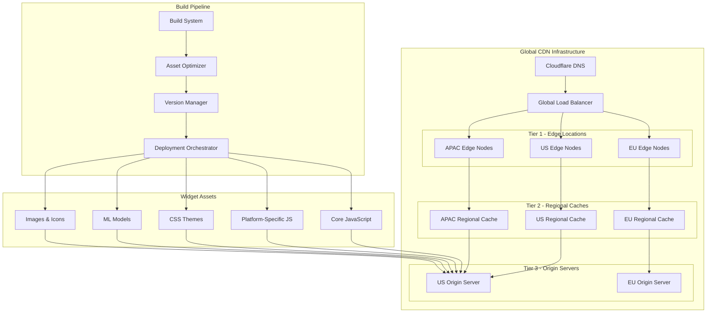
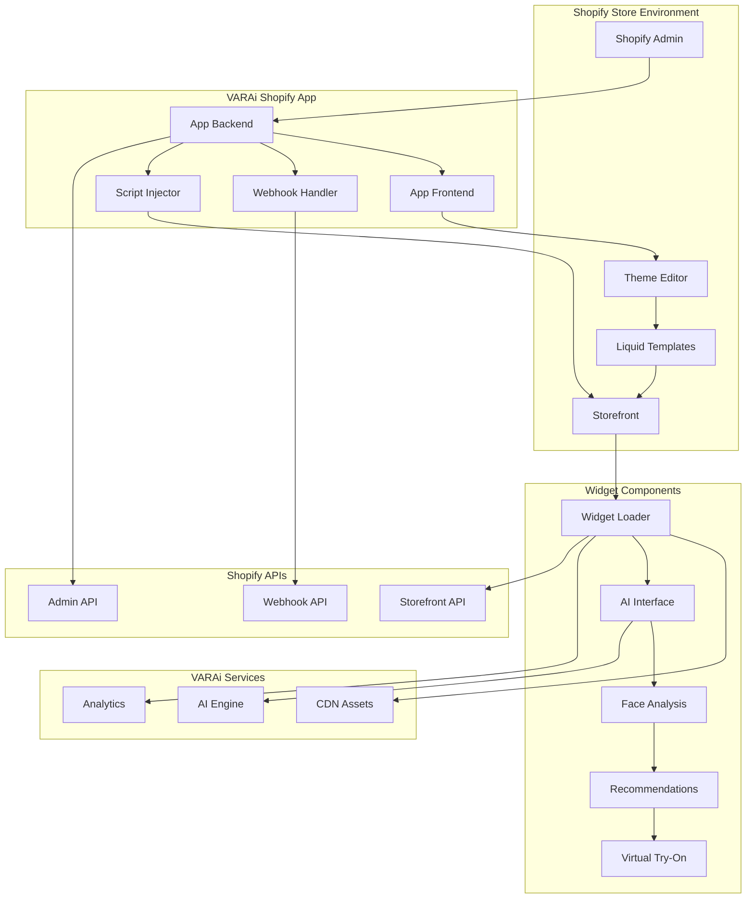
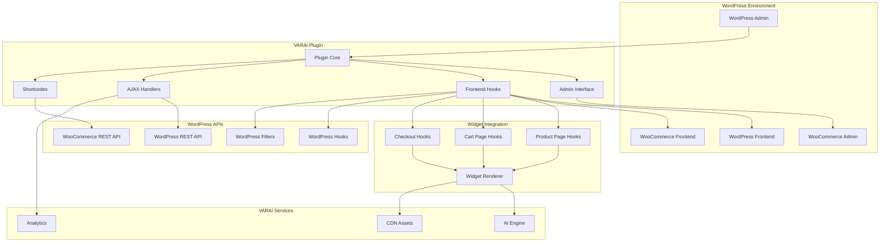

# Widget Deployment Architecture
## AI Discovery E-commerce Integration

## Document Information
- **Document Type**: Widget Deployment Architecture
- **System**: EyewearML Varai AI Discovery
- **Version**: 1.0
- **Date**: January 2025
- **Author**: Agent 5 - Technical Architecture Agent

## Executive Summary

This document details the comprehensive widget deployment architecture for the AI discovery e-commerce integration, covering CDN distribution, platform-specific implementations, and deployment strategies across Shopify, Magento, WooCommerce, and HTML stores.

## 1. Global CDN Distribution Architecture

### 1.1 Multi-Tier CDN Strategy



### 1.2 CDN Configuration and Optimization

```typescript
interface CDNConfiguration {
  // Cloudflare CDN Settings
  cloudflareConfig: {
    zones: [
      {
        domain: 'cdn.varai.ai';
        plan: 'enterprise';
        features: ['argo_smart_routing', 'polish', 'mirage', 'rocket_loader'];
      }
    ];
    
    cacheRules: [
      {
        pattern: '*.js';
        cacheTtl: '30_days';
        browserTtl: '7_days';
        compression: 'brotli';
        minification: true;
      },
      {
        pattern: '*.css';
        cacheTtl: '30_days';
        browserTtl: '7_days';
        compression: 'brotli';
        minification: true;
      },
      {
        pattern: '*.wasm';
        cacheTtl: '90_days';
        browserTtl: '30_days';
        compression: 'gzip';
      },
      {
        pattern: '/api/*';
        cacheTtl: '0';
        browserTtl: '0';
        bypassCache: true;
      }
    ];
    
    performanceOptimizations: {
      http3: true;
      earlyHints: true;
      brotliCompression: true;
      imageOptimization: 'polish_with_webp_conversion';
      mobileSdkOptimization: true;
    };
    
    securityFeatures: {
      waf: 'managed_rules_with_custom_rules';
      ddosProtection: 'advanced_ddos_protection';
      botManagement: 'super_bot_fight_mode';
      rateLimiting: 'per_ip_and_per_api_key';
    };
  };
  
  // Asset Optimization Strategy
  assetOptimization: {
    bundleStrategy: {
      core: {
        files: ['widget-core.js', 'ai-engine-client.js', 'face-analysis.js'];
        optimization: 'tree_shaking_and_dead_code_elimination';
        compression: 'brotli_level_11';
        cacheStrategy: 'long_term_caching_with_content_hash';
      };
      
      platformSpecific: {
        shopify: {
          files: ['shopify-adapter.js', 'liquid-integration.js'];
          optimization: 'platform_specific_tree_shaking';
          lazyLoading: 'dynamic_imports';
        };
        
        woocommerce: {
          files: ['woocommerce-adapter.js', 'wordpress-integration.js'];
          optimization: 'wordpress_compatibility_layer';
          lazyLoading: 'conditional_loading';
        };
        
        magento: {
          files: ['magento-adapter.js', 'requirejs-integration.js'];
          optimization: 'amd_module_optimization';
          lazyLoading: 'requirejs_async_loading';
        };
        
        html: {
          files: ['html-adapter.js', 'vanilla-integration.js'];
          optimization: 'minimal_dependencies';
          lazyLoading: 'intersection_observer_based';
        };
      };
      
      themes: {
        files: ['theme-light.css', 'theme-dark.css', 'theme-custom.css'];
        optimization: 'css_purging_and_critical_css_extraction';
        delivery: 'critical_css_inline_with_async_loading';
      };
    };
    
    imageOptimization: {
      formats: ['webp', 'avif', 'jpeg', 'png'];
      responsiveImages: 'srcset_with_sizes_attribute';
      lazyLoading: 'intersection_observer_with_fallback';
      placeholders: 'low_quality_image_placeholders';
    };
    
    fontOptimization: {
      strategy: 'font_display_swap_with_preload';
      subsetting: 'unicode_range_subsetting';
      formats: ['woff2', 'woff', 'ttf'];
      fallbacks: 'system_font_stack';
    };
  };
  
  // Performance Monitoring
  performanceMonitoring: {
    realUserMonitoring: {
      provider: 'cloudflare_analytics_with_custom_metrics';
      metrics: [
        'first_contentful_paint',
        'largest_contentful_paint',
        'cumulative_layout_shift',
        'first_input_delay',
        'time_to_interactive'
      ];
    };
    
    syntheticMonitoring: {
      provider: 'pingdom_with_custom_scripts';
      locations: ['us_east', 'us_west', 'eu_west', 'asia_pacific'];
      frequency: 'every_5_minutes';
      alertThresholds: {
        loadTime: '3_seconds';
        availability: '99.9_percent';
      };
    };
  };
}
```

## 2. Platform-Specific Widget Implementations

### 2.1 Shopify Widget Architecture



### 2.2 Shopify Implementation Details

```typescript
interface ShopifyWidgetImplementation {
  // App Structure
  appStructure: {
    backend: {
      framework: 'node_js_with_express';
      authentication: 'shopify_oauth_2_0';
      database: 'mongodb_with_shopify_session_storage';
      
      routes: [
        '/auth/shopify',
        '/auth/shopify/callback',
        '/api/widget/config',
        '/api/analytics/track',
        '/webhooks/orders/create',
        '/webhooks/products/update'
      ];
      
      middleware: [
        'shopify_auth_middleware',
        'csrf_protection',
        'rate_limiting',
        'request_validation'
      ];
    };
    
    frontend: {
      framework: 'react_with_shopify_polaris';
      buildTool: 'vite_with_shopify_cli';
      
      pages: [
        'dashboard',
        'configuration',
        'analytics',
        'help'
      ];
      
      components: [
        'widget_preview',
        'configuration_form',
        'analytics_charts',
        'installation_guide'
      ];
    };
  };
  
  // Theme Integration
  themeIntegration: {
    liquidTemplates: {
      productPage: {
        file: 'sections/varai-ai-discovery.liquid';
        placement: 'after_product_form';
        conditional: 'if product.type contains "eyewear"';
      };
      
      collectionPage: {
        file: 'sections/varai-collection-filter.liquid';
        placement: 'before_collection_products';
        conditional: 'if collection.handle contains "eyewear"';
      };
      
      cartPage: {
        file: 'snippets/varai-cart-recommendations.liquid';
        placement: 'after_cart_items';
        conditional: 'if cart contains eyewear products';
      };
    };
    
    scriptInjection: {
      method: 'script_tag_api';
      timing: 'after_page_load';
      
      scripts: [
        {
          src: 'https://cdn.varai.ai/shopify/widget-loader.js';
          async: true;
          defer: true;
        },
        {
          src: 'https://cdn.varai.ai/shopify/analytics-tracker.js';
          async: true;
        }
      ];
    };
    
    styleInjection: {
      method: 'asset_api_with_theme_inheritance';
      
      stylesheets: [
        {
          src: 'https://cdn.varai.ai/shopify/widget-styles.css';
          media: 'all';
          priority: 'high';
        }
      ];
      
      customProperties: {
        '--varai-primary-color': '{{ settings.accent_color }}';
        '--varai-font-family': '{{ settings.type_header_font.family }}';
        '--varai-border-radius': '{{ settings.button_border_radius }}px';
      };
    };
  };
  
  // Data Synchronization
  dataSynchronization: {
    webhooks: [
      {
        topic: 'orders/create';
        endpoint: '/webhooks/orders/create';
        fields: ['id', 'line_items', 'customer', 'total_price'];
      },
      {
        topic: 'orders/updated';
        endpoint: '/webhooks/orders/updated';
        fields: ['id', 'financial_status', 'fulfillment_status'];
      },
      {
        topic: 'products/create';
        endpoint: '/webhooks/products/create';
        fields: ['id', 'title', 'vendor', 'product_type', 'variants'];
      },
      {
        topic: 'products/update';
        endpoint: '/webhooks/products/update';
        fields: ['id', 'title', 'vendor', 'variants', 'updated_at'];
      },
      {
        topic: 'customers/create';
        endpoint: '/webhooks/customers/create';
        fields: ['id', 'email', 'first_name', 'last_name'];
      }
    ];
    
    apiIntegration: {
      adminApi: {
        version: '2023-10';
        rateLimits: 'bucket_based_with_retry';
        
        endpoints: [
          'GET /admin/api/2023-10/products.json',
          'GET /admin/api/2023-10/customers.json',
          'GET /admin/api/2023-10/orders.json',
          'PUT /admin/api/2023-10/products/{id}/metafields.json'
        ];
      };
      
      storefrontApi: {
        version: '2023-10';
        authentication: 'storefront_access_token';
        
        queries: [
          'product_recommendations',
          'collection_products',
          'customer_orders'
        ];
      };
    };
  };
  
  // Widget Configuration
  widgetConfiguration: {
    settings: {
      placement: {
        type: 'select';
        options: ['product_page', 'collection_page', 'cart_page', 'all_pages'];
        default: 'product_page';
      };
      
      features: {
        faceAnalysis: {
          type: 'boolean';
          default: true;
          description: 'Enable AI-powered face analysis';
        };
        
        virtualTryOn: {
          type: 'boolean';
          default: true;
          description: 'Enable virtual try-on feature';
        };
        
        recommendations: {
          type: 'boolean';
          default: true;
          description: 'Enable personalized recommendations';
        };
        
        conversationalAI: {
          type: 'boolean';
          default: true;
          description: 'Enable AI chatbot';
        };
      };
      
      appearance: {
        primaryColor: {
          type: 'color';
          default: '#007bff';
          description: 'Primary widget color';
        };
        
        position: {
          type: 'select';
          options: ['left', 'right', 'center', 'floating'];
          default: 'right';
        };
        
        theme: {
          type: 'select';
          options: ['light', 'dark', 'auto'];
          default: 'auto';
        };
      };
      
      privacy: {
        gdprCompliant: {
          type: 'boolean';
          default: true;
          description: 'Enable GDPR compliance features';
        };
        
        consentRequired: {
          type: 'boolean';
          default: true;
          description: 'Require explicit consent for face analysis';
        };
        
        dataRetentionDays: {
          type: 'number';
          default: 30;
          min: 1;
          max: 365;
          description: 'Data retention period in days';
        };
      };
    };
  };
}
```

### 2.3 WooCommerce Widget Architecture



### 2.4 WooCommerce Implementation Details

```php
<?php
/**
 * VARAi AI Discovery WooCommerce Plugin Implementation
 */

class VARAi_AI_Discovery_Plugin {
    
    private $version = '1.0.0';
    private $plugin_name = 'varai-ai-discovery';
    private $api_client;
    private $analytics;
    
    public function __construct() {
        $this->load_dependencies();
        $this->set_locale();
        $this->define_admin_hooks();
        $this->define_public_hooks();
        $this->init_api_client();
    }
    
    /**
     * Load plugin dependencies
     */
    private function load_dependencies() {
        require_once plugin_dir_path(dirname(__FILE__)) . 'includes/class-varai-api-client.php';
        require_once plugin_dir_path(dirname(__FILE__)) . 'includes/class-varai-analytics.php';
        require_once plugin_dir_path(dirname(__FILE__)) . 'includes/class-varai-widget-renderer.php';
        require_once plugin_dir_path(dirname(__FILE__)) . 'admin/class-varai-admin.php';
        require_once plugin_dir_path(dirname(__FILE__)) . 'public/class-varai-public.php';
    }
    
    /**
     * Define admin hooks
     */
    private function define_admin_hooks() {
        $plugin_admin = new VARAi_Admin($this->get_plugin_name(), $this->get_version());
        
        add_action('admin_enqueue_scripts', array($plugin_admin, 'enqueue_styles'));
        add_action('admin_enqueue_scripts', array($plugin_admin, 'enqueue_scripts'));
        add_action('admin_menu', array($plugin_admin, 'add_admin_menu'));
        add_action('admin_init', array($plugin_admin, 'register_settings'));
        
        // WooCommerce specific admin hooks
        add_filter('woocommerce_get_settings_pages', array($plugin_admin, 'add_settings_page'));
        add_action('woocommerce_admin_field_varai_widget_preview', array($plugin_admin, 'widget_preview_field'));
    }
    
    /**
     * Define public hooks
     */
    private function define_public_hooks() {
        $plugin_public = new VARAi_Public($this->get_plugin_name(), $this->get_version());
        
        add_action('wp_enqueue_scripts', array($plugin_public, 'enqueue_styles'));
        add_action('wp_enqueue_scripts', array($plugin_public, 'enqueue_scripts'));
        
        // WooCommerce product page integration
        add_action('woocommerce_single_product_summary', array($plugin_public, 'add_ai_discovery_widget'), 25);
        add_action('woocommerce_after_single_product_summary', array($plugin_public, 'add_face_analysis_widget'), 15);
        
        // Cart and checkout integration
        add_action('woocommerce_cart_collaterals', array($plugin_public, 'add_cart_recommendations'));
        add_action('woocommerce_checkout_after_order_review', array($plugin_public, 'add_checkout_recommendations'));
        
        // AJAX handlers
        add_action('wp_ajax_varai_ai_chat', array($plugin_public, 'handle_ai_chat'));
        add_action('wp_ajax_nopriv_varai_ai_chat', array($plugin_public, 'handle_ai_chat'));
        add_action('wp_ajax_varai_face_analysis', array($plugin_public, 'handle_face_analysis'));
        add_action('wp_ajax_nopriv_varai_face_analysis', array($plugin_public, 'handle_face_analysis'));
        add_action('wp_ajax_varai_get_recommendations', array($plugin_public, 'handle_get_recommendations'));
        add_action('wp_ajax_nopriv_varai_get_recommendations', array($plugin_public, 'handle_get_recommendations'));
        
        // Shortcodes
        add_shortcode('varai_ai_discovery', array($plugin_public, 'ai_discovery_shortcode'));
        add_shortcode('varai_face_analysis', array($plugin_public, 'face_analysis_shortcode'));
        add_shortcode('varai_recommendations', array($plugin_public, 'recommendations_shortcode'));
        
        // WooCommerce hooks for data synchronization
        add_action('woocommerce_order_status_completed', array($this, 'sync_completed_order'));
        add_action('woocommerce_add_to_cart', array($this, 'track_add_to_cart'));
        add_action('woocommerce_product_viewed', array($this, 'track_product_view'));
    }
    
    /**
     * Initialize API client
     */
    private function init_api_client() {
        $api_key = get_option('varai_api_key');
        $api_endpoint = get_option('varai_api_endpoint', 'https://api.varai.ai/v1');
        
        $this->api_client = new VARAi_API_Client($api_key, $api_endpoint);
        $this->analytics = new VARAi_Analytics($this->api_client);
    }
    
    /**
     * Sync completed order to VARAi platform
     */
    public function sync_completed_order($order_id) {
        $order = wc_get_order($order_id);
        
        if (!$order) {
            return;
        }
        
        $order_data = array(
            'order_id' => $order_id,
            'customer_id' => $order->get_customer_id(),
            'total' => $order->get_total(),
            'currency' => $order->get_currency(),
            'items' => array(),
            'timestamp' => current_time('timestamp'),
            'platform' => 'woocommerce'
        );
        
        foreach ($order->get_items() as $item) {
            $product = $item->get_product();
            $order_data['items'][] = array(
                'product_id' => $product->get_id(),
                'name' => $product->get_name(),
                'quantity' => $item->get_quantity(),
                'price' => $item->get_total(),
                'sku' => $product->get_sku()
            );
        }
        
        $this->api_client->sync_order($order_data);
    }
    
    /**
     * Track add to cart events
     */
    public function track_add_to_cart($cart_item_key) {
        $cart = WC()->cart;
        $cart_item = $cart->get_cart_item($cart_item_key);
        
        if (!$cart_item) {
            return;
        }
        
        $product = $cart_item['data'];
        
        $event_data = array(
            'event_type' => 'add_to_cart',
            'product_id' => $product->get_id(),
            'product_name' => $product->get_name(),
            'quantity' => $cart_item['quantity'],
            'price' => $product->get_price(),
            'timestamp' => current_time('timestamp'),
            'session_id' => $this->get_session_id(),
            'platform' => 'woocommerce'
        );
        
        $this->analytics->track_event($event_data);
    }
    
    /**
     * Get or create session ID
     */
    private function get_session_id() {
        if (!session_id()) {
            session_start();
        }
        
        if (!isset($_SESSION['varai_session_id'])) {
            $_SESSION['varai_session_id'] = wp_generate_uuid4();
        }
        
        return $_SESSION['varai_session_id'];
    }
}

/**
 * Widget Renderer Class
 */
class VARAi_Widget_Renderer {
    
    private $api_client;
    private $settings;
    
    public function __construct($api_client) {
        $this->api_client = $api_client;
        $this->settings = get_option('varai_settings', array());
    }
    
    /**
     * Render AI Discovery Widget
     */
    public function render_ai_discovery_widget($product_id = null) {
        if (!$this->is_widget_enabled('ai_discovery')) {
            return;
        }
        
        $product = $product_id ? wc_get_product($product_id) : wc_get_product();
        
        if (!$product || !$this->is_eyewear_product($product)) {
            return;
        }
        
        $widget_config = array(
            'product_id' => $product->get_id(),
            'product_name' => $product->get_name(),
            'product_price' => $product->get_price(),
            'product_currency' => get_woocommerce_currency(),
            'session_id' => $this->get_session_id(),
            'api_endpoint' => $this->settings['api_endpoint'] ?? 'https://api.varai.ai/v1',
            'features' => array(
                'face_analysis' => $this->settings['enable_face_analysis'] ?? true,
                'virtual_try_on' => $this->settings['enable_virtual_try_on'] ?? true,
                'recommendations' => $this->settings['enable_recommendations'] ?? true,
                'conversational_ai' => $this->settings['enable_conversational_ai'] ?? true
            ),
            'appearance' => array(
                'primary_color' => $this->settings['primary_color'] ?? '#007bff',
                'position' => $this->settings['widget_position'] ?? 'right',
                'theme' => $this->settings['widget_theme'] ?? 'auto'
            ),
            'privacy' => array(
                'gdpr_compliant' => $this->settings['gdpr_compliant'] ?? true,
                'consent_required' => $this->settings['consent_required'] ?? true,
                'data_retention_days' => $this->settings['data_retention_days'] ?? 30
            )
        );
        
        ?>
        <div id="varai-ai-discovery-widget" 
             class="varai-widget-container"
             data-config='<?php echo esc_attr(json_encode($widget_config)); ?>'>
            
            <div class="varai-loading">
                <div class="varai-spinner"></div>
                <p><?php _e('Loading AI-powered frame finder...', 'varai-ai-discovery'); ?></p>
            </div>
            
            <noscript>
                <div class="varai-fallback">
                    <h3><?php _e('AI-Powered Frame Finder', 'varai-ai-discovery'); ?></h3>
                    <p><?php _e('Enable JavaScript to use our AI-powered frame finder.', 'varai-ai-discovery'); ?></p>
                </div>
            </noscript>
        </div>
        <?php
    }
    
    /**
     * Check if product is eyewear
     */
    private function is_eyewear_product($product) {
        $eyewear_categories = array('eyewear', 'glasses', 'sunglasses', 'frames');
        $product_categories = wp_get_post_terms($product->get_id(), 'product_cat', array('fields' => 'slugs'));
        
        return !empty(array_intersect($eyewear_categories, $product_categories));
    }
    
    /**
     * Check if widget feature is enabled
     */
    private function is_widget_enabled($feature) {
        return $this->settings["enable_{$feature}"] ?? true;
    }
    
    /**
     * Get session ID
     */
    private function get_session_id() {
        if (!session_id()) {
            session_start();
        }
        
        if (!isset($_SESSION['varai_session_id'])) {
            $_SESSION['varai_session_id'] = wp_generate_uuid4();
        }