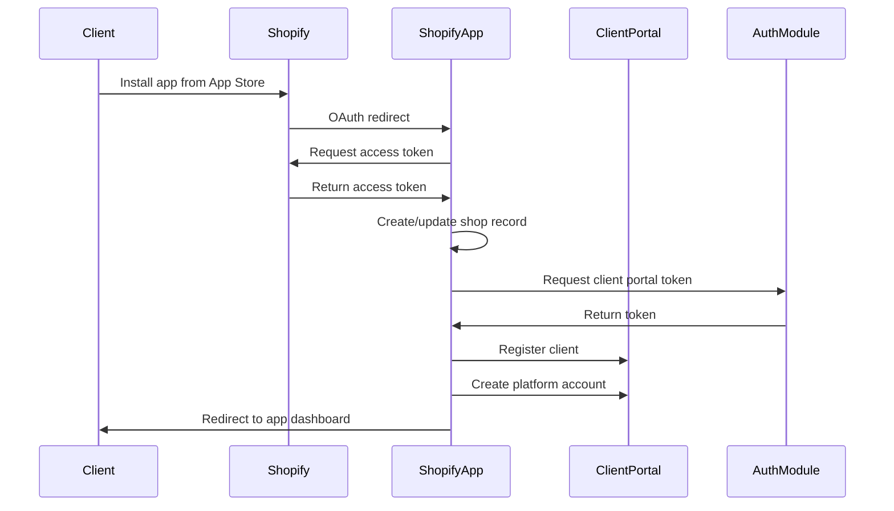
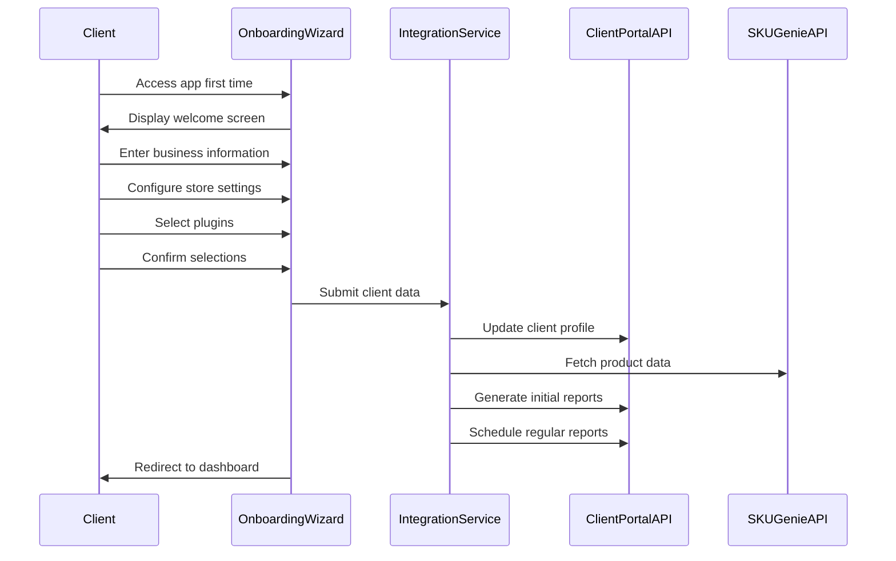
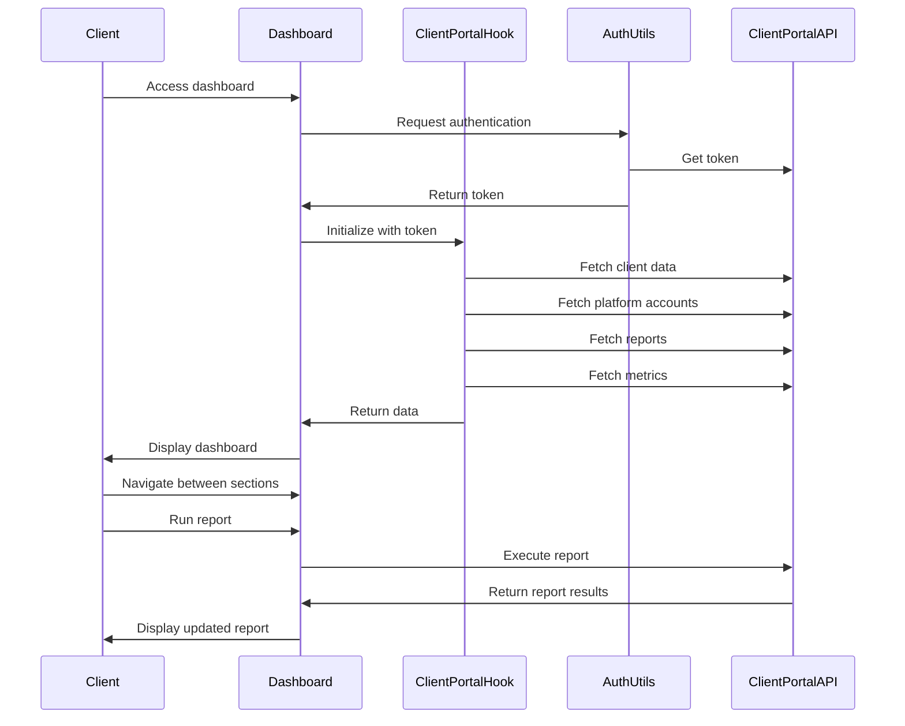
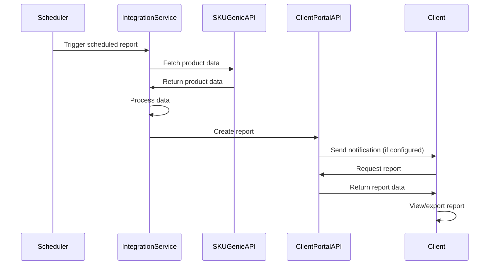
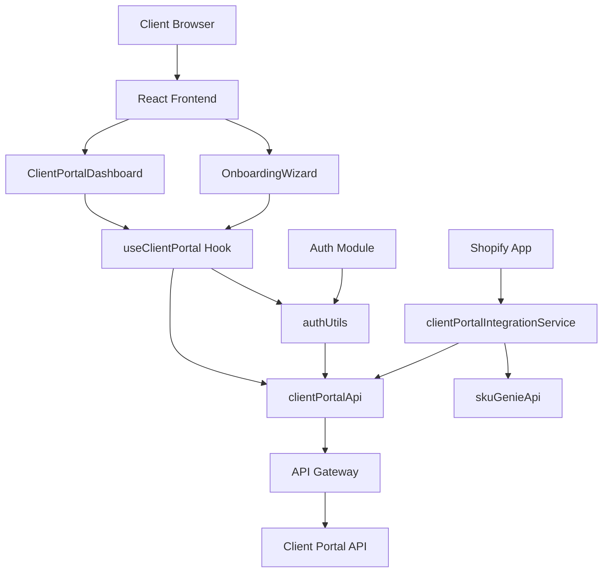

# Client Portal Integration: User Journey Diagrams

## 1. Client Registration Journey

## 2. Onboarding Journey

## 3. Dashboard Access Journey

## 4. Report Generation Journey

## Component Interaction Diagram

These diagrams illustrate the flow of data and interactions between different components in the client portal integration, providing a visual representation of the user journeys described in the previous document.