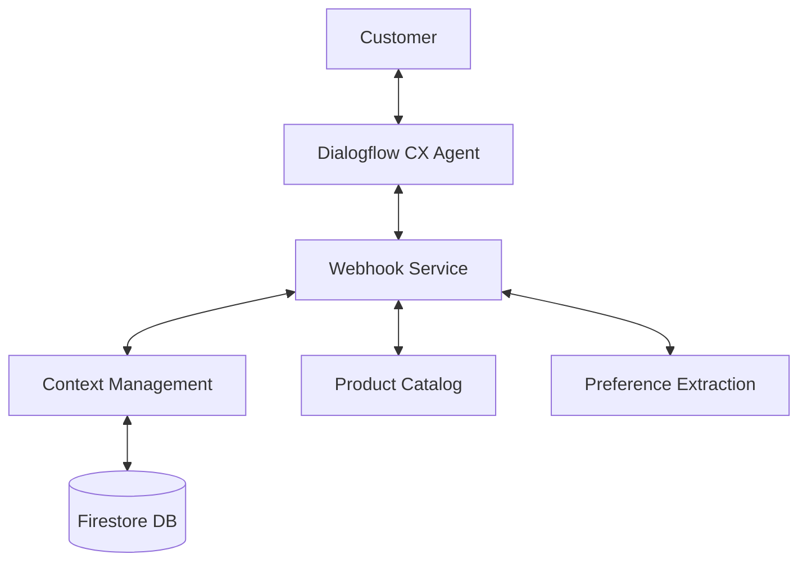

# EyewearML Conversational AI

The EyewearML Conversational AI engine powers natural language interactions throughout the platform, enabling customers to find the perfect eyewear through intuitive conversation. This component uses Google's Dialogflow CX for natural language understanding and a custom webhook service for business logic and personalization.

## Key Capabilities

- **Intent Recognition**: Accurately identifies when customers are describing style preferences, fit requirements, budget concerns, or other intents
- **Contextual Memory**: Maintains conversation history across turns to build a comprehensive understanding of customer needs
- **Natural Language Generation**: Communicates in a friendly, helpful manner that mimics the best in-person sales experiences
- **Preference Extraction**: Identifies both explicit and implicit preferences from conversational cues

## Architecture

The conversational AI system is built on several key components:

1. **Dialogflow CX Agent**: Handles natural language understanding, intent classification, and conversation flow management
2. **Webhook Service**: Provides business logic integration, product recommendations, and personalization
3. **Context Management**: Maintains user preferences and conversation state across session turns
4. **Product Catalog Integration**: Connects conversation to the product inventory for accurate recommendations



## Implementation

### Dialogflow CX Configuration

- **Agent Configuration**: Located in `config/dialogflow/agent_config.yaml`
- **Environment Settings**: Production, staging, development environments in `.env.docker`, `.env.staging`, and `.env.development`
- **Conversation Flows**: JSON definitions in `docs/conversational_ai/poc/`
  - Style recommendation flow provides personalized style advice
  - Frame finder flow helps users locate specific frames
  - Fit consultation flow guides users through finding the best fit
  - Deploy flows using `src/conversational_ai/deploy_flows.py`

### Webhook Service

- **Express.js Server**: Main service in `src/conversational_ai/webhook/index.js`
- **Intent Handlers**:
  - Product handlers (`src/conversational_ai/webhook/handlers/product_handlers.js`) manage product search and filtering
  - Recommendation handlers (`src/conversational_ai/webhook/handlers/recommendation_handlers.js`) generate personalized product suggestions
- **Context Management**:
  - Firebase integration (`src/conversational_ai/context/firebase_config.js`) connects to Firestore
  - Context manager (`src/conversational_ai/context/context_manager.js`) stores user preferences and conversation history
  - Automatic fallback to in-memory storage if Firebase isn't configured

### Interactive Demo Application

- **Demo Server**: Located in `src/conversational_ai/demo.js`
- **Features**:
  - Web-based chat interface for testing the conversational AI
  - Automatic webhook server management
  - Status monitoring for Dialogflow and webhook connectivity
  - Support for conversation session persistence

## User Experience Features

The conversational AI delivers a premium user experience through several key features:

1. **Multi-turn Conversations**: Maintains context across multiple conversation turns to avoid repetition
2. **Implicit Preference Detection**: Identifies preferences even when not explicitly stated by the user
3. **Natural Responses**: Generates conversational, human-like responses that feel like talking to a real stylist
4. **Visual Product Recommendations**: Presents eyewear options with rich visual cards and relevant product details
5. **Intent Recognition**: Accurately distinguishes between queries about style, fit, price, and functionality
6. **Graceful Error Handling**: Provides helpful recovery options when unable to understand the user

## Deployment

The system is deployed on Google Cloud Platform using:

- **Dialogflow CX**: Managed by Google Cloud Console
- **Express Server**: Webhook service deployed as standalone Node.js application
- **Firestore**: Context storage for conversation persistence
- **Secret Manager**: Securely manages API keys and credentials

## Setup and Installation

### Quick Start (In-Memory Storage)

For quick testing, you can run the demo with in-memory storage using our security-hardened dependencies:

```bash
# Install securely pinned dependencies
cd src/conversational_ai/package
npm install
cd ../../..

# Start the demo application
node src/conversational_ai/demo.js
```

Then open your browser to http://localhost:3050

> ⚠️ **Security Note**: Always use the provided package.json with pinned dependencies. 
> Installing packages without version pinning (e.g., `npm install express firebase-admin...`) 
> can introduce numerous vulnerabilities through transitive dependencies.

### Full Setup with Google Cloud and Firebase

For a complete setup with Google Cloud and Firebase:

1. For Windows users:
   ```
   .\setup-conversational-ai.ps1
   ```

2. For macOS/Linux users:
   ```
   chmod +x setup-conversational-ai.sh
   ./setup-conversational-ai.sh
   ```

3. Follow the final steps displayed by the script:
   - Create the Dialogflow CX agent through the web console
   - Deploy the conversation flows 
   - Start the demo application

For detailed manual setup instructions, see [Google Cloud Setup Guide](../setup-google-cloud.md).

## Development Tools

- **Setup Scripts**: `setup-conversational-ai.ps1` (Windows) and `setup-conversational-ai.sh` (macOS/Linux) for automated setup
- **Testing Framework**: 
  - Use `tests/conversational_ai/test_deploy_flows.py` to validate deployment
  - Interactive testing with `src/conversational_ai/test_agent_responses.py`
- **Package Management**: Dependencies listed in project `package.json`
- **Environment Variables**: `.env` files configure service for different deployment environments

## Next Steps

1. **Face Shape Analysis**: Advanced image processing to recommend frames based on face shape
2. **Advanced Voice Integration**: Connect to voice interfaces for hands-free shopping experiences
3. **Multi-language Support**: Expansion to additional languages beyond the current supported set
4. **Sentiment Analysis**: Monitoring customer sentiment to adjust tone and recommendations
5. **A/B Testing Framework**: Testing different conversation flows to optimize conversion rates

## Related Documentation

- [Google Cloud Setup Guide](../setup-google-cloud.md)
- [Windows Setup Script](../setup-conversational-ai.ps1)
- [Unix/Linux Setup Script](../setup-conversational-ai.sh)
- [Testing Framework Guide](./testing/README.md)
- [Conversation Flow Definitions](./poc/)
