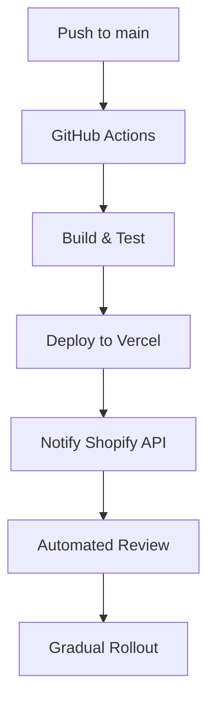
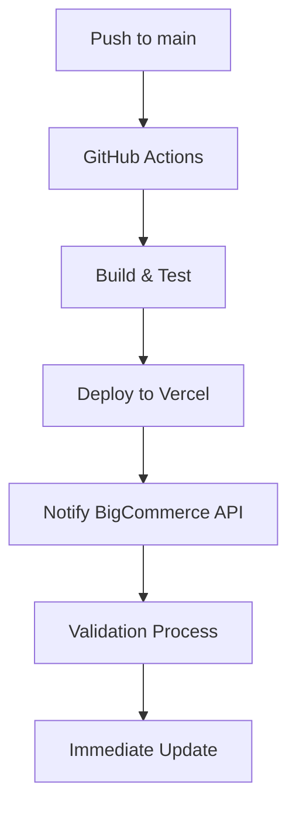
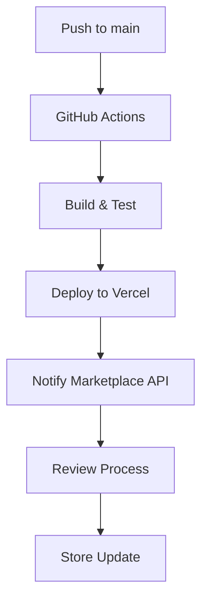
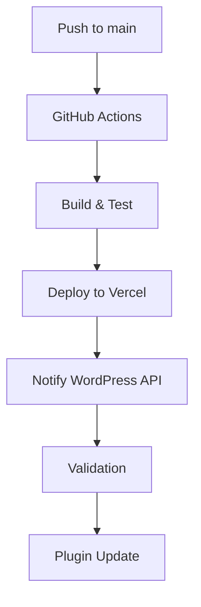

# EyewearML Apps Deployment Guide

This guide explains how to deploy and manage OTA (Over-The-Air) updates for the EyewearML apps across different e-commerce platforms.

## Deployment Architecture

All apps are hosted on Vercel with the following setup:
- Production deployments triggered by pushes to `main` branch
- Preview deployments for pull requests
- Automatic OTA updates through app store APIs
- Database and Redis instances on Digital Ocean

### Environment Setup

1. Vercel Projects:
   - eyewearml-shopify
   - eyewearml-bigcommerce
   - eyewearml-magento
   - eyewearml-woocommerce

2. Digital Ocean Resources:
   - Managed PostgreSQL database
   - Managed Redis cluster
   - Object storage for assets

## Initial Setup

1. Create Vercel projects:
```bash
# Install Vercel CLI
npm i -g vercel

# Link projects
cd apps/shopify && vercel link
cd ../bigcommerce && vercel link
cd ../magento && vercel link
cd ../woocommerce && vercel link
```

2. Set up environment variables:
```bash
# Copy example env files
cp .env.example .env

# Set up environment variables in Vercel
vercel env pull
```

3. Configure GitHub Actions:
   - Add required secrets in GitHub repository settings
   - Enable GitHub Actions workflow

## OTA Update Process

### Shopify App

1. App Store Version Management:
   - Version number tracked in `apps/shopify/package.json`
   - GitHub Actions workflow notifies Shopify API on successful deployment
   - Shopify performs automated review of changes
   - Updates rolled out to stores gradually

2. Update Flow:


### BigCommerce App

1. App Store Version Management:
   - Version tracked in `apps/bigcommerce/package.json`
   - Updates submitted through BigCommerce API
   - Automated validation process

2. Update Flow:


### Magento Extension

1. Marketplace Version Management:
   - Version tracked in `apps/magento/composer.json`
   - Updates submitted through Marketplace API
   - Manual review required for major changes

2. Update Flow:


### WooCommerce Plugin

1. WordPress Plugin Directory Management:
   - Version tracked in `apps/woocommerce/eyewearml.php`
   - Updates submitted through WordPress API
   - Automated validation for minor updates

2. Update Flow:


## Monitoring & Rollbacks

### Health Checks

1. Automated monitoring:
```bash
# Check app health
curl https://api.eyewearml.com/health

# Check deployment status
vercel list deployments
```

2. Metrics tracked:
   - API response times
   - Error rates
   - User engagement
   - Update success rates

### Rollback Process

1. Immediate rollback:
```bash
# Revert to previous version
vercel rollback

# Notify app stores
npm run notify-rollback
```

2. Gradual rollback:
   - Identify issues through monitoring
   - Roll back affected stores first
   - Communicate with app stores

## Deployment Commands

### Production Deployment

```bash
# Deploy all apps
npm run deploy:all

# Deploy specific app
npm run deploy:shopify
npm run deploy:bigcommerce
npm run deploy:magento
npm run deploy:woocommerce
```

### Preview Deployment

```bash
# Create preview deployment
vercel

# Deploy specific app for preview
cd apps/[platform] && vercel
```

### Environment Management

```bash
# Pull environment variables
vercel env pull

# Add new secret
vercel secrets add my-secret-name my-secret-value
```

## Troubleshooting

### Common Issues

1. Failed Deployments:
   - Check build logs: `vercel logs`
   - Verify environment variables
   - Check dependencies

2. Update Failures:
   - Review app store validation errors
   - Check API responses
   - Verify version numbers

### Support Contacts

- Deployment Issues: devops@eyewearml.com
- App Store Issues: 
  - Shopify: shopify-support@eyewearml.com
  - BigCommerce: bigcommerce-support@eyewearml.com
  - Magento: magento-support@eyewearml.com
  - WooCommerce: woo-support@eyewearml.com

## Security

1. Environment Protection:
   - All secrets stored in Vercel
   - No sensitive data in repositories
   - Regular security audits

2. Access Control:
   - Limited production access
   - 2FA required for deployments
   - Audit logging enabled

## Backup & Recovery

1. Database Backups:
   - Automated daily backups
   - Point-in-time recovery
   - Geo-replicated storage

2. Deployment Recovery:
   - Multiple deployment regions
   - Automated failover
   - Regular disaster recovery tests
