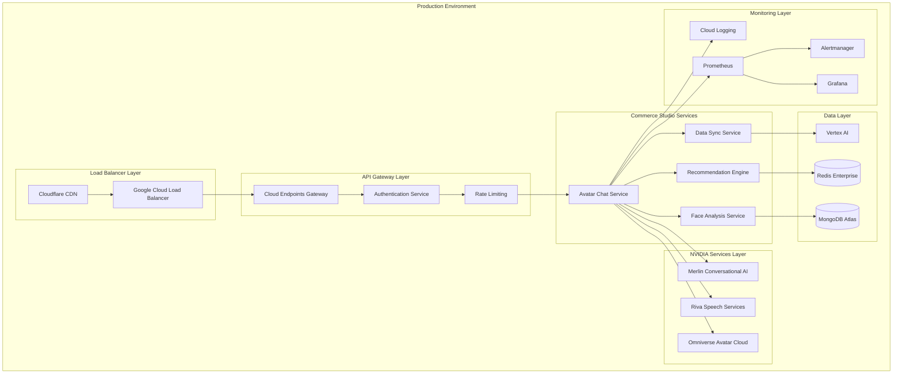

# AI Avatar Chat System Deployment Strategy
## Production Deployment and Monitoring Guide

## Document Information
- **Document Type**: Deployment Strategy and Operations Guide
- **System**: AI Avatar Chat System with NVIDIA Integration
- **Version**: 1.0
- **Date**: January 2025
- **Dependencies**: Commerce Studio Infrastructure, NVIDIA Cloud Services, Google Cloud Platform

## Executive Summary

This document outlines the comprehensive deployment strategy for the AI Avatar Chat System, including infrastructure provisioning, service deployment, monitoring setup, and operational procedures for maintaining a production-ready NVIDIA-powered conversational shopping assistant.

## Deployment Architecture Overview



## Infrastructure Provisioning

### 1. Google Cloud Platform Setup

```terraform
# main.tf - GCP Infrastructure for AI Avatar Chat System
terraform {
  required_version = ">= 1.0"
  required_providers {
    google = {
      source  = "hashicorp/google"
      version = "~> 4.0"
    }
    kubernetes = {
      source  = "hashicorp/kubernetes"
      version = "~> 2.0"
    }
  }
}

provider "google" {
  project = var.project_id
  region  = var.region
  zone    = var.zone
}

# GKE Cluster for Avatar Chat Services
resource "google_container_cluster" "avatar_chat_cluster" {
  name     = "avatar-chat-cluster"
  location = var.region

  # Node configuration optimized for AI workloads
  node_config {
    machine_type = "n1-standard-8"
    disk_size_gb = 100
    disk_type    = "pd-ssd"
    
    # GPU nodes for avatar rendering
    guest_accelerator {
      type  = "nvidia-tesla-t4"
      count = 1
    }
    
    oauth_scopes = [
      "https://www.googleapis.com/auth/cloud-platform"
    ]
    
    labels = {
      environment = "production"
      service     = "avatar-chat"
    }
  }

  # Cluster configuration
  initial_node_count = 3
  
  # Network configuration
  network    = google_compute_network.avatar_chat_network.name
  subnetwork = google_compute_subnetwork.avatar_chat_subnet.name
  
  # Security configuration
  master_auth {
    client_certificate_config {
      issue_client_certificate = false
    }
  }
  
  # Workload Identity for secure service communication
  workload_identity_config {
    workload_pool = "${var.project_id}.svc.id.goog"
  }
  
  # Network policy for security
  network_policy {
    enabled = true
  }
  
  # Monitoring and logging
  monitoring_config {
    enable_components = ["SYSTEM_COMPONENTS", "WORKLOADS"]
  }
  
  logging_config {
    enable_components = ["SYSTEM_COMPONENTS", "WORKLOADS"]
  }
}

# Dedicated node pool for NVIDIA GPU workloads
resource "google_container_node_pool" "gpu_nodes" {
  name       = "gpu-node-pool"
  location   = var.region
  cluster    = google_container_cluster.avatar_chat_cluster.name
  node_count = 2

  node_config {
    machine_type = "n1-standard-4"
    
    guest_accelerator {
      type  = "nvidia-tesla-t4"
      count = 1
    }
    
    oauth_scopes = [
      "https://www.googleapis.com/auth/cloud-platform"
    ]
    
    labels = {
      workload-type = "gpu-intensive"
      service       = "avatar-rendering"
    }
    
    taint {
      key    = "nvidia.com/gpu"
      value  = "true"
      effect = "NO_SCHEDULE"
    }
  }
  
  autoscaling {
    min_node_count = 1
    max_node_count = 5
  }
}

# Cloud SQL for session data
resource "google_sql_database_instance" "avatar_chat_db" {
  name             = "avatar-chat-db"
  database_version = "POSTGRES_13"
  region           = var.region

  settings {
    tier = "db-custom-4-16384"
    
    backup_configuration {
      enabled                        = true
      start_time                     = "03:00"
      point_in_time_recovery_enabled = true
      backup_retention_settings {
        retained_backups = 7
      }
    }
    
    ip_configuration {
      ipv4_enabled    = false
      private_network = google_compute_network.avatar_chat_network.id
    }
    
    database_flags {
      name  = "max_connections"
      value = "200"
    }
  }
  
  deletion_protection = true
}

# Redis instance for real-time data
resource "google_redis_instance" "avatar_chat_redis" {
  name           = "avatar-chat-redis"
  tier           = "STANDARD_HA"
  memory_size_gb = 4
  region         = var.region
  
  authorized_network = google_compute_network.avatar_chat_network.id
  
  redis_configs = {
    maxmemory-policy = "allkeys-lru"
  }
}

# Cloud Storage for avatar assets
resource "google_storage_bucket" "avatar_assets" {
  name     = "${var.project_id}-avatar-assets"
  location = var.region
  
  uniform_bucket_level_access = true
  
  versioning {
    enabled = true
  }
  
  lifecycle_rule {
    condition {
      age = 30
    }
    action {
      type = "Delete"
    }
  }
}

# Variables
variable "project_id" {
  description = "GCP Project ID"
  type        = string
}

variable "region" {
  description = "GCP Region"
  type        = string
  default     = "us-central1"
}

variable "zone" {
  description = "GCP Zone"
  type        = string
  default     = "us-central1-a"
}
```

### 2. NVIDIA Services Configuration

```yaml
# nvidia-services-config.yaml
apiVersion: v1
kind: ConfigMap
metadata:
  name: nvidia-services-config
  namespace: avatar-chat
data:
  omniverse-config.yaml: |
    omniverse:
      endpoint: "https://api.omniverse.nvidia.com"
      organization_id: "${NVIDIA_ORG_ID}"
      project_id: "${NVIDIA_PROJECT_ID}"
      api_version: "v1"
      
      avatar_models:
        - id: "female-professional-consultant"
          name: "Professional Female Consultant"
          appearance:
            gender: "female"
            ethnicity: "diverse"
            age: "middle-aged"
            style: "professional"
          voice_profile: "en-US-female-warm"
          
        - id: "male-friendly-assistant"
          name: "Friendly Male Assistant"
          appearance:
            gender: "male"
            ethnicity: "diverse"
            age: "young"
            style: "casual-professional"
          voice_profile: "en-US-male-friendly"
      
      rendering:
        quality: "adaptive"
        resolution: "1280x720"
        frame_rate: 30
        enable_ray_tracing: true
        enable_dlss: true
        
      streaming:
        protocol: "webrtc"
        bitrate: 2000000
        adaptive_bitrate: true
        low_latency: true

  riva-config.yaml: |
    riva:
      endpoint: "https://api.riva.nvidia.com"
      api_version: "v1"
      
      speech_recognition:
        model: "conformer-en-US"
        language: "en-US"
        enable_punctuation: true
        enable_word_confidence: true
        enable_speaker_diarization: false
        max_alternatives: 3
        
      speech_synthesis:
        voice_models:
          - id: "en-US-female-warm"
            name: "Warm Female Voice"
            language: "en-US"
            gender: "female"
            style: "professional-warm"
            
          - id: "en-US-male-friendly"
            name: "Friendly Male Voice"
            language: "en-US"
            gender: "male"
            style: "casual-friendly"
        
        audio_config:
          sample_rate: 22050
          encoding: "LINEAR16"
          speaking_rate: 1.0
          pitch: 0.0

  merlin-config.yaml: |
    merlin:
      endpoint: "https://api.merlin.nvidia.com"
      api_version: "v1"
      
      model:
        id: "megatron-gpt-eyewear-specialist"
        size: "large"
        domain: "eyewear_retail"
        
      generation:
        max_tokens: 2048
        temperature: 0.7
        top_p: 0.9
        top_k: 50
        repetition_penalty: 1.1
        
      conversation:
        context_window: 10
        personality: "helpful_consultant"
        response_style: "conversational"
        enable_memory: true
        
      knowledge_base:
        eyewear_expertise: true
        face_shape_analysis: true
        style_recommendations: true
        brand_knowledge: true
        trend_awareness: true

---
apiVersion: v1
kind: Secret
metadata:
  name: nvidia-api-keys
  namespace: avatar-chat
type: Opaque
data:
  nvidia-api-key: ${NVIDIA_API_KEY_BASE64}
  nvidia-org-id: ${NVIDIA_ORG_ID_BASE64}
  nvidia-project-id: ${NVIDIA_PROJECT_ID_BASE64}
```

### 3. Avatar Chat Service Deployment

```yaml
# avatar-chat-deployment.yaml
apiVersion: apps/v1
kind: Deployment
metadata:
  name: avatar-chat-service
  namespace: avatar-chat
  labels:
    app: avatar-chat-service
    version: v1.0.0
spec:
  replicas: 3
  selector:
    matchLabels:
      app: avatar-chat-service
  template:
    metadata:
      labels:
        app: avatar-chat-service
        version: v1.0.0
    spec:
      serviceAccountName: avatar-chat-service-account
      
      containers:
      - name: avatar-chat-service
        image: gcr.io/commerce-studio/avatar-chat-service:v1.0.0
        ports:
        - containerPort: 8080
          name: http
        - containerPort: 8443
          name: https
        - containerPort: 9090
          name: metrics
        
        env:
        - name: NVIDIA_API_KEY
          valueFrom:
            secretKeyRef:
              name: nvidia-api-keys
              key: nvidia-api-key
        - name: NVIDIA_ORG_ID
          valueFrom:
            secretKeyRef:
              name: nvidia-api-keys
              key: nvidia-org-id
        - name: MONGODB_URI
          valueFrom:
            secretKeyRef:
              name: database-credentials
              key: mongodb-uri
        - name: REDIS_URI
          valueFrom:
            secretKeyRef:
              name: database-credentials
              key: redis-uri
        
        resources:
          requests:
            memory: "2Gi"
            cpu: "1000m"
            nvidia.com/gpu: 1
          limits:
            memory: "4Gi"
            cpu: "2000m"
            nvidia.com/gpu: 1
        
        livenessProbe:
          httpGet:
            path: /health
            port: 8080
          initialDelaySeconds: 30
          periodSeconds: 10
          timeoutSeconds: 5
          failureThreshold: 3
        
        readinessProbe:
          httpGet:
            path: /ready
            port: 8080
          initialDelaySeconds: 10
          periodSeconds: 5
          timeoutSeconds: 3
          failureThreshold: 3
        
        volumeMounts:
        - name: nvidia-config
          mountPath: /etc/nvidia-config
          readOnly: true
        - name: avatar-assets
          mountPath: /var/avatar-assets
        
      volumes:
      - name: nvidia-config
        configMap:
          name: nvidia-services-config
      - name: avatar-assets
        persistentVolumeClaim:
          claimName: avatar-assets-pvc
      
      nodeSelector:
        workload-type: gpu-intensive
      
      tolerations:
      - key: nvidia.com/gpu
        operator: Equal
        value: "true"
        effect: NoSchedule

---
apiVersion: v1
kind: Service
metadata:
  name: avatar-chat-service
  namespace: avatar-chat
  labels:
    app: avatar-chat-service
spec:
  selector:
    app: avatar-chat-service
  ports:
  - name: http
    port: 80
    targetPort: 8080
    protocol: TCP
  - name: https
    port: 443
    targetPort: 8443
    protocol: TCP
  - name: metrics
    port: 9090
    targetPort: 9090
    protocol: TCP
  type: ClusterIP

---
apiVersion: autoscaling/v2
kind: HorizontalPodAutoscaler
metadata:
  name: avatar-chat-service-hpa
  namespace: avatar-chat
spec:
  scaleTargetRef:
    apiVersion: apps/v1
    kind: Deployment
    name: avatar-chat-service
  minReplicas: 3
  maxReplicas: 10
  metrics:
  - type: Resource
    resource:
      name: cpu
      target:
        type: Utilization
        averageUtilization: 70
  - type: Resource
    resource:
      name: memory
      target:
        type: Utilization
        averageUtilization: 80
  - type: Pods
    pods:
      metric:
        name: avatar_sessions_per_pod
      target:
        type: AverageValue
        averageValue: "50"
```

## Monitoring and Observability

### 1. Prometheus Monitoring Configuration

```yaml
# prometheus-config.yaml
apiVersion: v1
kind: ConfigMap
metadata:
  name: prometheus-config
  namespace: monitoring
data:
  prometheus.yml: |
    global:
      scrape_interval: 15s
      evaluation_interval: 15s
    
    rule_files:
      - "/etc/prometheus/rules/*.yml"
    
    alerting:
      alertmanagers:
        - static_configs:
            - targets:
              - alertmanager:9093
    
    scrape_configs:
    # Avatar Chat Service Metrics
    - job_name: 'avatar-chat-service'
      static_configs:
        - targets: ['avatar-chat-service:9090']
      metrics_path: /metrics
      scrape_interval: 10s
      scrape_timeout: 5s
      
    # NVIDIA Services Metrics (via proxy)
    - job_name: 'nvidia-omniverse-metrics'
      static_configs:
        - targets: ['nvidia-metrics-proxy:9091']
      metrics_path: /omniverse/metrics
      scrape_interval: 30s
      
    - job_name: 'nvidia-riva-metrics'
      static_configs:
        - targets: ['nvidia-metrics-proxy:9092']
      metrics_path: /riva/metrics
      scrape_interval: 30s
      
    - job_name: 'nvidia-merlin-metrics'
      static_configs:
        - targets: ['nvidia-metrics-proxy:9093']
      metrics_path: /merlin/metrics
      scrape_interval: 30s
    
    # Infrastructure Metrics
    - job_name: 'kubernetes-nodes'
      kubernetes_sd_configs:
        - role: node
      relabel_configs:
        - source_labels: [__address__]
          regex: '(.*):10250'
          target_label: __address__
          replacement: '${1}:9100'
    
    # GPU Metrics
    - job_name: 'gpu-metrics'
      static_configs:
        - targets: ['dcgm-exporter:9400']
      scrape_interval: 10s

  avatar-chat-rules.yml: |
    groups:
    - name: avatar-chat-alerts
      rules:
      # Avatar Session Metrics
      - alert: HighAvatarSessionLatency
        expr: histogram_quantile(0.95, avatar_session_duration_seconds_bucket) > 5
        for: 2m
        labels:
          severity: warning
        annotations:
          summary: "High avatar session latency detected"
          description: "95th percentile session latency is {{ $value }}s"
      
      - alert: AvatarRenderingErrors
        expr: rate(avatar_rendering_errors_total[5m]) > 0.1
        for: 1m
        labels:
          severity: critical
        annotations:
          summary: "Avatar rendering errors detected"
          description: "Avatar rendering error rate is {{ $value }} errors/sec"
      
      # Speech Processing Metrics
      - alert: SpeechRecognitionLatency
        expr: histogram_quantile(0.95, speech_recognition_duration_seconds_bucket) > 2
        for: 2m
        labels:
          severity: warning
        annotations:
          summary: "High speech recognition latency"
          description: "Speech recognition latency is {{ $value }}s"
      
      - alert: SpeechSynthesisErrors
        expr: rate(speech_synthesis_errors_total[5m]) > 0.05
        for: 1m
        labels:
          severity: warning
        annotations:
          summary: "Speech synthesis errors detected"
          description: "Speech synthesis error rate is {{ $value }} errors/sec"
      
      # Conversation AI Metrics
      - alert: ConversationResponseLatency
        expr: histogram_quantile(0.95, conversation_response_duration_seconds_bucket) > 3
        for: 2m
        labels:
          severity: warning
        annotations:
          summary: "High conversation response latency"
          description: "Conversation response latency is {{ $value }}s"
      
      # Resource Utilization
      - alert: HighGPUUtilization
        expr: nvidia_gpu_utilization_gpu > 90
        for: 5m
        labels:
          severity: warning
        annotations:
          summary: "High GPU utilization detected"
          description: "GPU utilization is {{ $value }}%"
      
      - alert: HighMemoryUsage
        expr: (container_memory_usage_bytes / container_spec_memory_limit_bytes) * 100 > 85
        for: 5m
        labels:
          severity: warning
        annotations:
          summary: "High memory usage detected"
          description: "Memory usage is {{ $value }}%"
```

### 2. Grafana Dashboard Configuration

```json
{
  "dashboard": {
    "id": null,
    "title": "AI Avatar Chat System Dashboard",
    "tags": ["avatar-chat", "nvidia", "ai"],
    "timezone": "browser",
    "panels": [
      {
        "id": 1,
        "title": "Avatar Session Metrics",
        "type": "stat",
        "targets": [
          {
            "expr": "sum(rate(avatar_sessions_total[5m]))",
            "legendFormat": "Sessions/sec"
          },
          {
            "expr": "sum(avatar_active_sessions)",
            "legendFormat": "Active Sessions"
          },
          {
            "expr": "histogram_quantile(0.95, avatar_session_duration_seconds_bucket)",
            "legendFormat": "95th Percentile Duration"
          }
        ],
        "fieldConfig": {
          "defaults": {
            "unit": "short",
            "min": 0
          }
        },
        "gridPos": {
          "h": 8,
          "w": 12,
          "x": 0,
          "y": 0
        }
      },
      {
        "id": 2,
        "title": "Avatar Rendering Performance",
        "type": "timeseries",
        "targets": [
          {
            "expr": "rate(avatar_frames_rendered_total[5m])",
            "legendFormat": "Frames/sec - {{instance}}"
          },
          {
            "expr": "avatar_rendering_latency_seconds",
            "legendFormat": "Rendering Latency - {{instance}}"
          }
        ],
        "fieldConfig": {
          "defaults": {
            "unit": "short",
            "min": 0
          }
        },
        "gridPos": {
          "h": 8,
          "w": 12,
          "x": 12,
          "y": 0
        }
      },
      {
        "id": 3,
        "title": "Speech Processing Metrics",
        "type": "timeseries",
        "targets": [
          {
            "expr": "rate(speech_recognition_requests_total[5m])",
            "legendFormat": "Recognition Requests/sec"
          },
          {
            "expr": "rate(speech_synthesis_requests_total[5m])",
            "legendFormat": "Synthesis Requests/sec"
          },
          {
            "expr": "histogram_quantile(0.95, speech_processing_duration_seconds_bucket)",
            "legendFormat": "95th Percentile Processing Time"
          }
        ],
        "fieldConfig": {
          "defaults": {
            "unit": "short",
            "min": 0
          }
        },
        "gridPos": {
          "h": 8,
          "w": 12,
          "x": 0,
          "y": 8
        }
      },
      {
        "id": 4,
        "title": "Conversation AI Performance",
        "type": "timeseries",
        "targets": [
          {
            "expr": "rate(conversation_requests_total[5m])",
            "legendFormat": "Conversation Requests/sec"
          },
          {
            "expr": "histogram_quantile(0.95, conversation_response_duration_seconds_bucket)",
            "legendFormat": "95th Percentile Response Time"
          },
          {
            "expr": "conversation_context_size_bytes",
            "legendFormat": "Context Size - {{session_id}}"
          }
        ],
        "fieldConfig": {
          "defaults": {
            "unit": "short",
            "min": 0
          }
        },
        "gridPos": {
          "h": 8,
          "w": 12,
          "x": 12,
          "y": 8
        }
      },
      {
        "id": 5,
        "title": "GPU Utilization",
        "type": "timeseries",
        "targets": [
          {
            "expr": "nvidia_gpu_utilization_gpu",
            "legendFormat": "GPU Utilization - {{gpu}}"
          },
          {
            "expr": "nvidia_gpu_memory_utilization_gpu",
            "legendFormat": "GPU Memory Utilization - {{gpu}}"
          },
          {
            "expr": "nvidia_gpu_temperature_gpu",
            "legendFormat": "GPU Temperature - {{gpu}}"
          }
        ],
        "fieldConfig": {
          "defaults": {
            "unit": "percent",
            "min": 0,
            "max": 100
          }
        },
        "gridPos": {
          "h": 8,
          "w": 12,
          "x": 0,
          "y": 16
        }
      },
      {
        "id": 6,
        "title": "Error Rates",
        "type": "timeseries",
        "targets": [
          {
            "expr": "rate(avatar_rendering_errors_total[5m])",
            "legendFormat": "Avatar Rendering Errors/sec"
          },
          {
            "expr": "rate(speech_processing_errors_total[5m])",
            "legendFormat": "Speech Processing Errors/sec"
          },
          {
            "expr": "rate(conversation_errors_total[5m])",
            "legendFormat": "Conversation Errors/sec"
          },
          {
            "expr": "rate(http_requests_total{status=~\"5..\"}[5m])",
            "legendFormat": "HTTP 5xx Errors/sec"
          }
        ],
        "fieldConfig": {
          "defaults": {
            "unit": "short",
            "min": 0
          }
        },
        "gridPos": {
          "h": 8,
          "w": 12,
          "x": 12,
          "y": 16
        }
      }
    ],
    "time": {
      "from": "now-1h",
      "to": "now"
    },
    "refresh": "10s"
  }
}
```

### 3. Alerting Configuration

```yaml
# alertmanager-config.yaml
apiVersion: v1
kind: ConfigMap
metadata:
  name: alertmanager-config
  namespace: monitoring
data:
  alertmanager.yml: |
    global:
      smtp_smarthost: 'smtp.gmail.com:587'
      smtp_from: 'alerts@commerce-studio.com'
      smtp_auth_username: 'alerts@commerce-studio.com'
      smtp_auth_password: '${SMTP_PASSWORD}'
    
    route:
      group_by: ['alertname', 'cluster', 'service']
      group_wait: 10s
      group_interval: 10s
      repeat_interval: 1h
      receiver: 'web.hook'
      routes:
      - match:
          severity: critical
        receiver: 'critical-alerts'
        group_wait: 5s
        repeat_interval: 30m
      - match:
          severity: warning
        receiver: 'warning-alerts'
        repeat_interval: 2h
    
    receivers:
    - name: 'web.hook'
      webhook_configs:
      - url: 'http://webhook-service:8080/alerts'
        send_resolved: true
    
    - name: 'critical-alerts'
      email_configs:
      - to: 'oncall@commerce-studio.com'
        subject: 'CRITICAL: Avatar Chat System Alert'
        body: |
          Alert: {{ .GroupLabels.alertname }}
          Severity: {{ .CommonLabels.severity }}
          Instance: {{ .CommonLabels.instance }}
          Description: {{ .CommonAnnotations.description }}
          
          Dashboard: https://grafana.commerce-studio.com/d/avatar-chat
      
      slack_configs:
      - api_url: '${SLACK_WEBHOOK_URL}'
        channel: '#alerts-critical'
        title: 'CRITICAL: Avatar Chat System Alert'
        text: |
          Alert: {{ .GroupLabels.alertname }}
          Severity: {{ .CommonLabels.severity }}
          Description: {{ .CommonAnnotations.description }}
    
    - name: 'warning-alerts'
      email_configs:
      - to: 'team@commerce-studio.com'
        subject: 'WARNING: Avatar Chat System Alert'
        body: |
          Alert: {{ .GroupLabels.alertname }}
          Severity: {{ .CommonLabels.severity }}
          Description: {{ .CommonAnnotations.description }}
      
      slack_configs:
      - api_url: '${SLACK_WEBHOOK_URL}'
        channel: '#alerts-warning'
        title: 'WARNING: Avatar Chat System Alert'
        text: |
          Alert: {{ .GroupLabels.alertname }}
          Description: {{ .CommonAnnotations.description }}
```

## Security and Compliance

### 1. Security Policies

```yaml
# security-policies.yaml
apiVersion: networking.k8s.io/v1
kind: NetworkPolicy
metadata:
  name: avatar-chat-network-policy
  namespace: avatar-chat
spec:
  podSelector:
    matchLabels:
      app: avatar-chat-service
  policyTypes:
  - Ingress
  - Egress
  ingress:
  - from:
    - namespaceSelector:
        matchLabels:
          name: api-gateway
    ports:
    - protocol: TCP
      port: 8080
  - from:
    - namespaceSelector:
        matchLabels:
          name: monitoring
    ports:
    - protocol: TCP
      port: 9090
  egress:
  - to: []
    ports:
    - protocol: TCP
      port: 443  # HTTPS to NVIDIA services
    - protocol: TCP
      port: 27017  # MongoDB
    - protocol: TCP
      port: 6379   # Redis

---
apiVersion: security.istio.io/v1beta1
kind: PeerAuthentication
metadata:
  name: avatar-chat-mtls
  namespace: avatar-chat
spec:
  selector:
    matchLabels:
      app: avatar-chat-service
  mtls:
    mode: STRICT

---
apiVersion: security.istio.io/v1beta1
kind: AuthorizationPolicy
metadata:
  name: avatar-chat-authz
  namespace: avatar-chat
spec:
  selector:
    matchLabels:
      app: avatar-chat-service
  rules:
  - from:
    - source:
        principals: ["cluster.local/ns/api-gateway/sa/api-gateway-service-account"]
  - to:
    - operation:
        methods: ["GET", "POST"]
        paths: ["/v1/avatar-chat/*"]
```

### 2. Data Protection

```yaml
# data-protection-config.yaml
apiVersion: v1
kind: ConfigMap
metadata:
  name: data-protection-config
  namespace: avatar-chat
data:
  encryption-config.yaml: |
    encryption:
      # Conversation data encryption
      conversation_data:
        algorithm: "AES-256-GCM"
        key_rotation_interval: "24h"
        backup_encryption: true
        
      # Voice data encryption
      voice_data:
        algorithm: "AES-256-GC