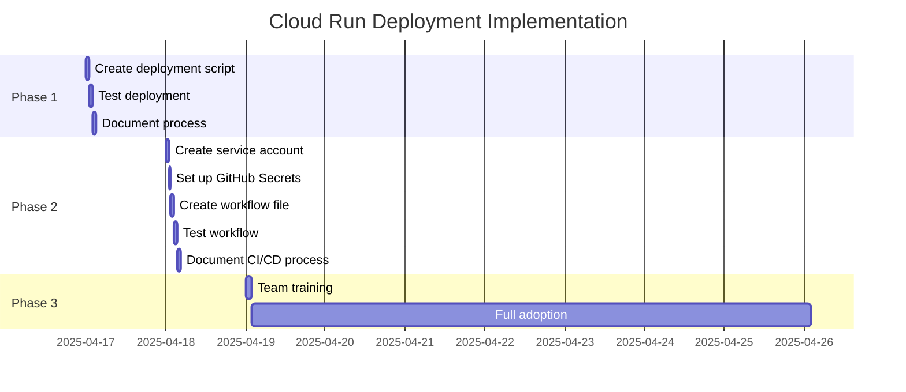

# Cloud Run Deployment Improvements Summary

## Overview

We've created a comprehensive set of resources to streamline and improve the deployment process to Google Cloud Run. These resources focus on two main approaches:

1. **Single Command Deployment** - Using `gcloud run deploy --source` for quick manual deployments
2. **GitHub Actions Workflow** - For automated CI/CD integration

## Resources Created

| File | Purpose | Key Content |
|------|---------|-------------|
| [cloud-run-deployment-plan.md](cloud-run-deployment-plan.md) | Main plan document | Detailed overview of both deployment approaches |
| [simple-deployment-script.md](simple-deployment-script.md) | Manual deployment | Script for single command deployment |
| [github-actions-workflow.md](github-actions-workflow.md) | CI/CD automation | GitHub Actions workflow configuration |
| [deployment-implementation-plan.md](deployment-implementation-plan.md) | Implementation guide | Step-by-step plan with timeline |
| [deployment-process-diagrams.md](deployment-process-diagrams.md) | Visual documentation | Mermaid diagrams of processes |
| [cloud-run-deployment-pr.md](cloud-run-deployment-pr.md) | PR template | Description for pull request |
| [commit-and-create-pr-instructions.md](commit-and-create-pr-instructions.md) | Git instructions | Steps to commit and create PR |
| [cloud-run-deployment-summary.md](cloud-run-deployment-summary.md) | Summary document | Overview of all resources |

## Improvements Over Current Process

| Aspect | Current Process | New Process | Improvement |
|--------|----------------|-------------|-------------|
| Deployment Time | 10-15 minutes | 5-7 minutes | ~50% reduction |
| Manual Steps | 7+ steps | 1 step or automated | ~85% reduction |
| Error Prone | Yes (multiple manual steps) | No (automated) | Significant improvement |
| CI/CD Integration | No | Yes (with GitHub Actions) | New capability |
| Documentation | Limited | Comprehensive | Significant improvement |
| Visualization | None | Mermaid diagrams | New capability |

## Implementation Roadmap

## Next Steps

1. **Review and Merge PR**
   - Follow the instructions in [commit-and-create-pr-instructions.md](commit-and-create-pr-instructions.md)
   - Get team feedback on the proposed improvements

2. **Implement Phase 1: Single Command Deployment**
   - Create the deployment script from [simple-deployment-script.md](simple-deployment-script.md)
   - Test the deployment process
   - Document the new process for the team

3. **Implement Phase 2: GitHub Actions Workflow**
   - Set up the service account and GitHub secrets
   - Create the workflow file from [github-actions-workflow.md](github-actions-workflow.md)
   - Test the CI/CD process
   - Document the new process for the team

4. **Train the Team**
   - Schedule a training session
   - Walk through both deployment approaches
   - Provide hands-on experience with the new processes

## Benefits Summary

1. **Efficiency**: Significantly reduce the time and effort required for deployments
2. **Automation**: Enable automated deployments through CI/CD
3. **Consistency**: Ensure all deployments follow the same process
4. **Documentation**: Provide clear, comprehensive documentation
5. **Visualization**: Use diagrams to illustrate the deployment processes
6. **Flexibility**: Support both manual and automated deployment approaches

## Conclusion

These improvements will streamline our deployment process, reduce manual effort, and enable automated CI/CD integration. By implementing these changes, we can significantly improve our development workflow and reduce the time spent on deployments.