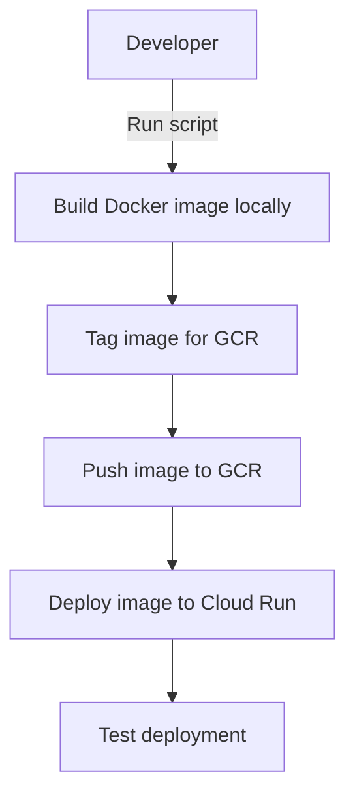
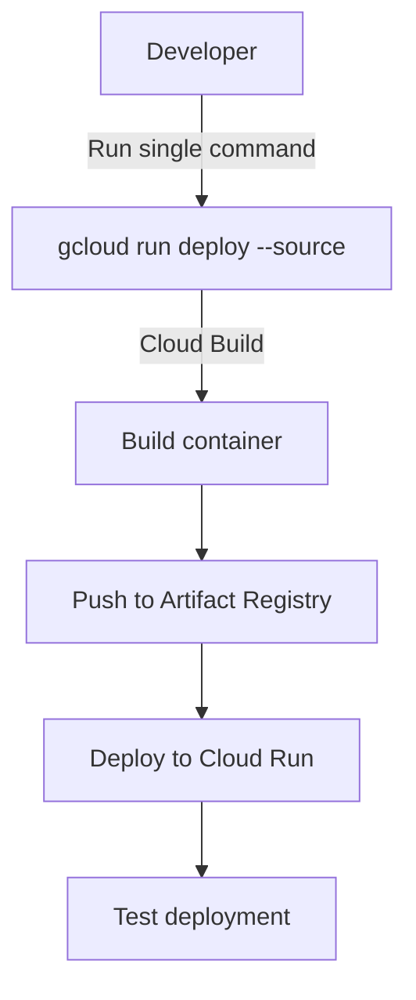
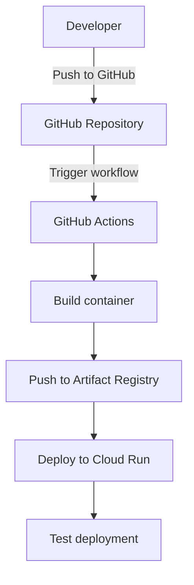

# Cloud Run Deployment Approaches Comparison

This document compares the different approaches for deploying to Cloud Run, with a focus on the Docker deploy approach.

## Deployment Approaches Overview

| Approach | Description | Best For |
|----------|-------------|----------|
| **Docker Deploy** | Build Docker image locally, push to GCR, deploy to Cloud Run | Immediate deployment needs, custom build processes |
| **Single Command** | Use `gcloud run deploy --source` to build and deploy in one step | Simplified workflow, quick deployments |
| **GitHub Actions** | Automate deployment via GitHub CI/CD | Production deployments, automated workflows |

## 1. Docker Deploy Approach

### Process Flow



### Advantages

- **Full Control**: Complete control over the Docker build process
- **Local Testing**: Ability to test the Docker image locally before deploying
- **Custom Builds**: Support for custom build steps and configurations
- **Familiar Workflow**: Uses standard Docker commands and processes
- **Immediate Deployment**: Direct deployment without additional services

### Disadvantages

- **Local Resources**: Requires Docker to be installed and running locally
- **Build Time**: Building large images locally can be time-consuming
- **Manual Process**: More manual steps compared to other approaches
- **Consistency**: Potential for inconsistency between environments

### When to Use

- When you need immediate deployment without setting up CI/CD
- When you have custom build requirements not supported by Cloud Build
- When you want to test the Docker image locally before deploying
- When you're familiar with Docker and prefer direct control

## 2. Single Command Approach

### Process Flow



### Advantages

- **Simplicity**: One command handles build and deploy
- **No Local Docker**: No need for Docker installed locally
- **Cloud Build**: Uses Google Cloud Build for consistent builds
- **Artifact Registry**: Automatically pushes to Artifact Registry

### Disadvantages

- **Less Control**: Less control over the build process
- **Build Limitations**: Limited customization of the build process
- **Dependency on Cloud Build**: Requires Cloud Build API enabled
- **No Local Testing**: Cannot test the image locally before deploying

### When to Use

- When you want a simplified deployment process
- When you don't need to test the Docker image locally
- When you don't have Docker installed locally
- When you want to leverage Cloud Build for consistent builds

## 3. GitHub Actions Approach

### Process Flow



### Advantages

- **Automation**: Fully automated CI/CD pipeline
- **Consistency**: Consistent build and deployment process
- **Versioning**: Deployment tied to source control
- **Collaboration**: Team visibility into deployments
- **Triggers**: Various triggers for deployment (push, PR, manual)

### Disadvantages

- **Setup Complexity**: More complex initial setup
- **GitHub Dependency**: Requires GitHub repository
- **Secrets Management**: Requires managing secrets in GitHub
- **Learning Curve**: Requires understanding of GitHub Actions

### When to Use

- When you want automated deployments
- When you have a team working on the project
- When you want deployments tied to source control
- When you want a consistent deployment process

## Comparison Table

| Feature | Docker Deploy | Single Command | GitHub Actions |
|---------|---------------|----------------|----------------|
| **Deployment Time** | 5-10 minutes | 3-5 minutes | 5-8 minutes |
| **Setup Complexity** | Low | Very Low | Medium |
| **Automation** | Manual | Manual | Automated |
| **Local Dependencies** | Docker, gcloud | gcloud only | None |
| **Build Location** | Local machine | Cloud Build | GitHub Actions |
| **Image Storage** | Google Container Registry | Artifact Registry | Artifact Registry |
| **Control Over Build** | High | Medium | High |
| **Local Testing** | Yes | No | No |
| **CI/CD Integration** | No | No | Yes |
| **Team Collaboration** | Limited | Limited | High |
| **Deployment History** | Limited | Limited | Comprehensive |
| **Rollback Capability** | Manual | Manual | Automated |

## Recommended Approach for Different Scenarios

### For Immediate Deployment Needs

**Recommended: Docker Deploy**

The Docker deploy approach is ideal for immediate deployment needs, especially when you want full control over the build process and the ability to test locally before deploying.

```bash
# Quick reference for Docker deploy
./docker-deploy-to-cloud-run.sh  # Linux/macOS
# or
.\docker-deploy-to-cloud-run.ps1  # Windows
```

### For Regular Development Deployments

**Recommended: Single Command**

The single command approach is ideal for regular development deployments, offering a simplified workflow without the need for local Docker.

```bash
# Quick reference for single command deploy
gcloud run deploy eyewear-ml-api \
  --source . \
  --region us-central1 \
  --platform managed \
  --allow-unauthenticated
```

### For Production Deployments

**Recommended: GitHub Actions**

The GitHub Actions approach is ideal for production deployments, offering automation, consistency, and team visibility.

```yaml
# Quick reference for GitHub Actions
name: Deploy to Cloud Run
on:
  push:
    branches: [main]
jobs:
  deploy:
    runs-on: ubuntu-latest
    steps:
      - uses: actions/checkout@v3
      - uses: google-github-actions/setup-gcloud@v1
      - run: gcloud run deploy SERVICE_NAME --source .
```

## Migration Path

For a smooth transition between approaches, consider this migration path:

1. **Start with Docker Deploy**: For immediate deployment needs
2. **Move to Single Command**: As you become comfortable with Cloud Run
3. **Implement GitHub Actions**: For production-ready CI/CD

This progression allows you to start with a familiar approach and gradually adopt more automated and sophisticated deployment methods as your needs evolve.

## Conclusion

The Docker deploy approach provides a good balance of control and simplicity for immediate deployment needs. It's a great starting point for deploying to Cloud Run, especially if you're already familiar with Docker.

As your deployment needs evolve, consider moving to the single command approach for simplified workflows, and eventually to GitHub Actions for fully automated CI/CD.