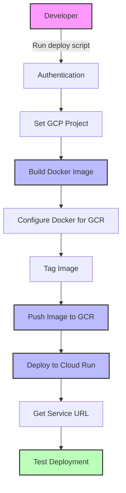
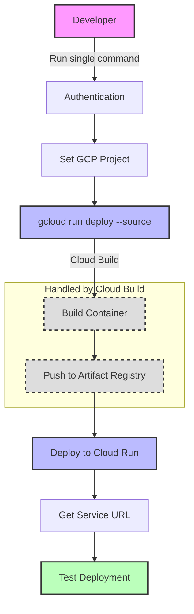
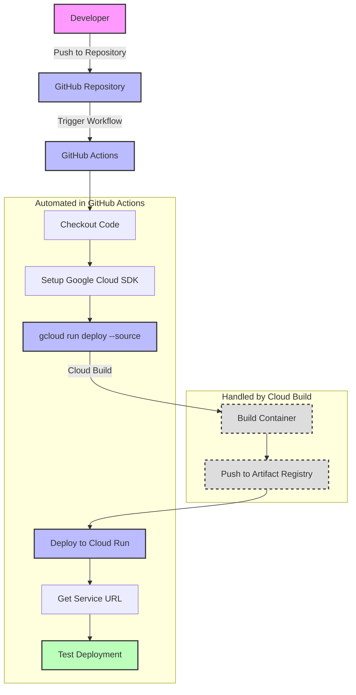
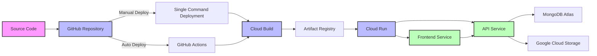
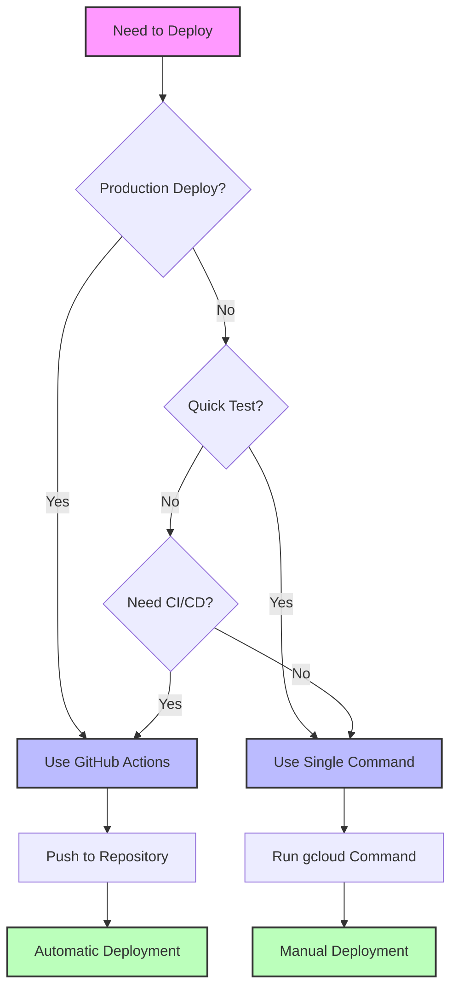
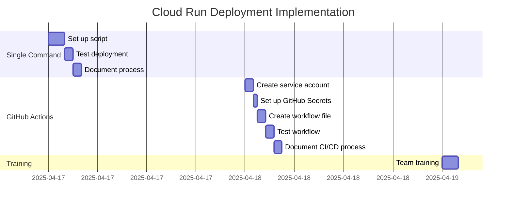

# Cloud Run Deployment Process Diagrams

This document provides visual representations of the deployment processes using Mermaid diagrams.

## Current Deployment Process

## Single Command Deployment Process

## GitHub Actions CI/CD Process

## Deployment Architecture

## Deployment Decision Tree

## Implementation Timeline

These diagrams provide a visual representation of:
1. The current deployment process
2. The new single command deployment process
3. The GitHub Actions CI/CD process
4. The overall deployment architecture
5. A decision tree for choosing the right deployment method
6. An implementation timeline

Use these diagrams to help communicate the new deployment processes to your team.