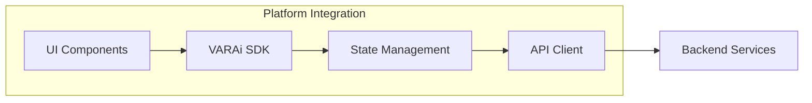
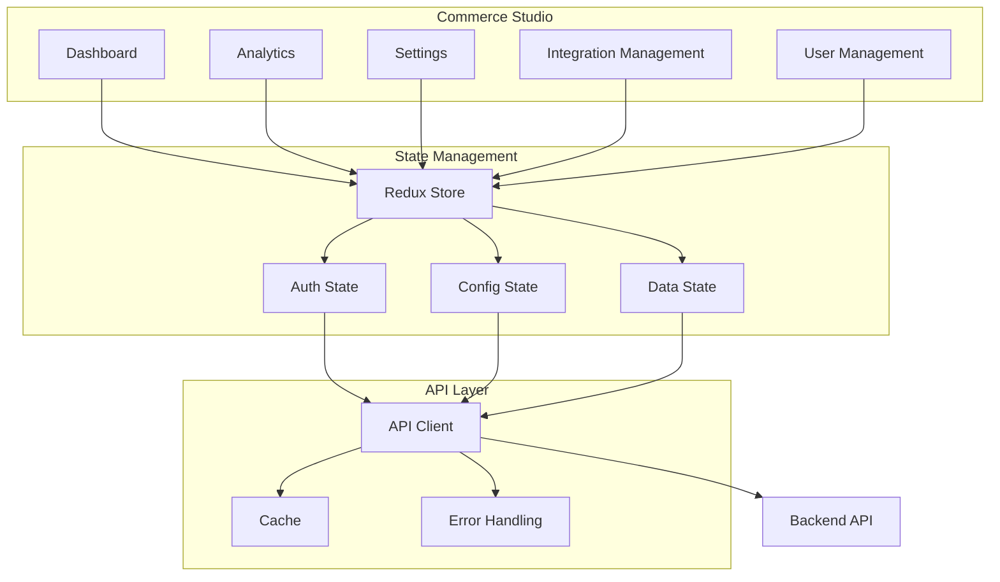
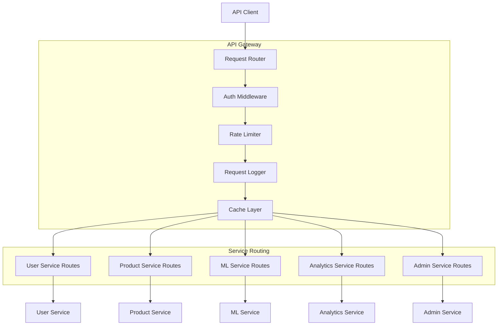
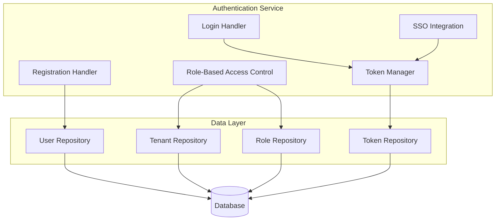
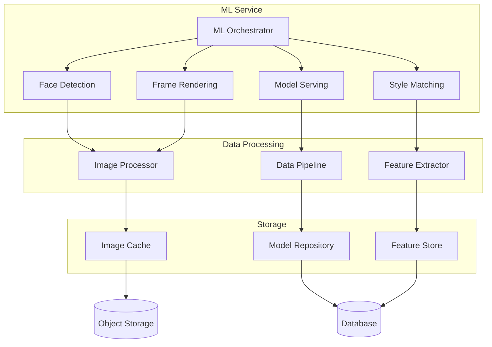
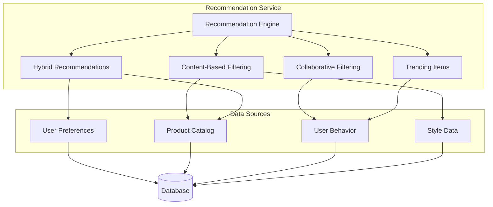
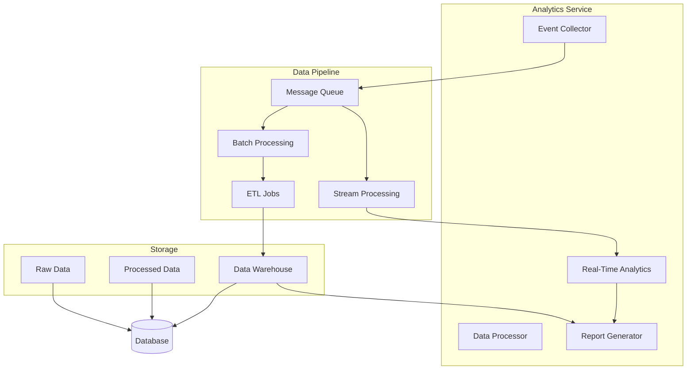
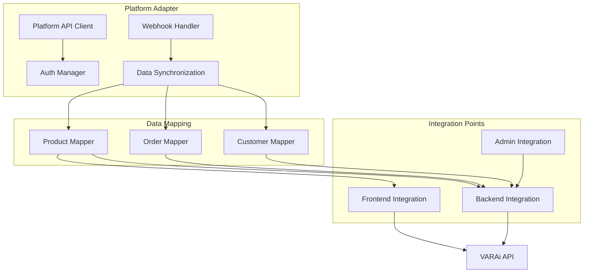
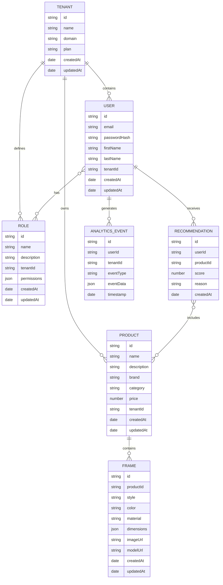

# VARAi Component Diagrams

This document provides detailed component diagrams for the VARAi platform, illustrating the internal structure of each major system component and how they interact.

## Frontend Applications

Each platform integration follows a similar pattern:

### Commerce Studio Architecture

## Backend Services

### API Gateway

### Authentication Service

### ML Service

### Recommendation Service

### Analytics Service

## Integration Services

### E-commerce Platform Adapters

## Data Storage

### Database Schema

## Next Steps

For more detailed information on data flows between components, please refer to the [Data Flow Documentation](./data-flow.md).