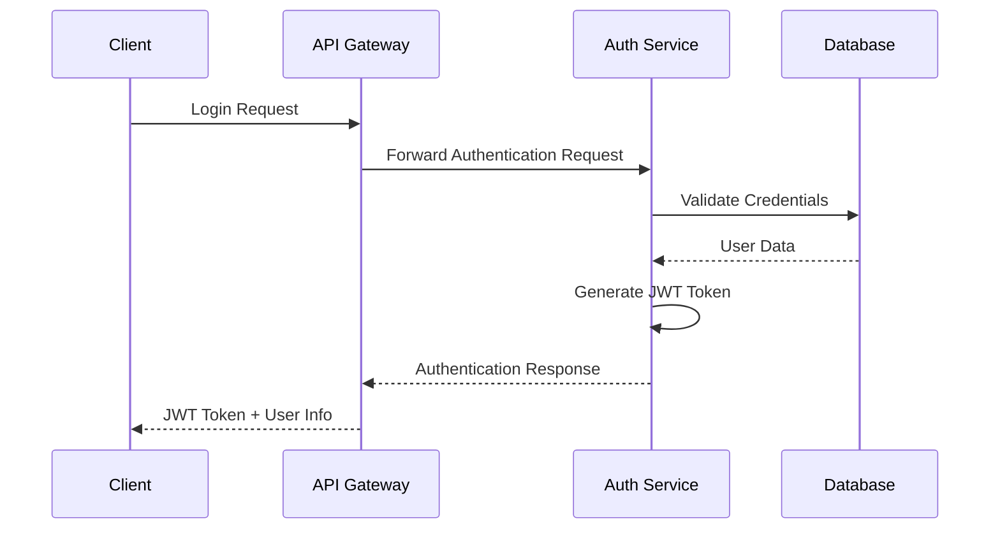
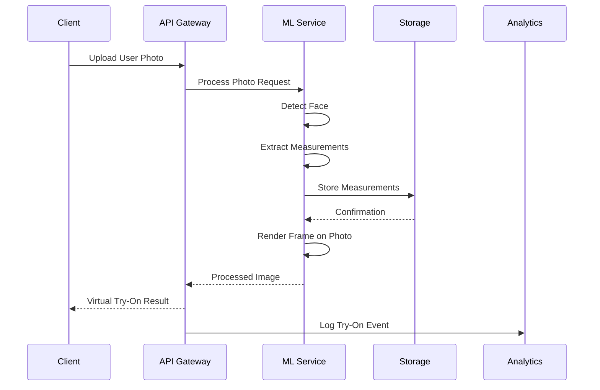
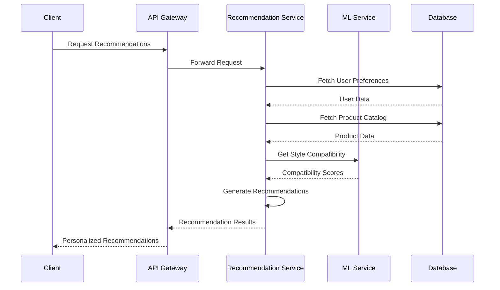
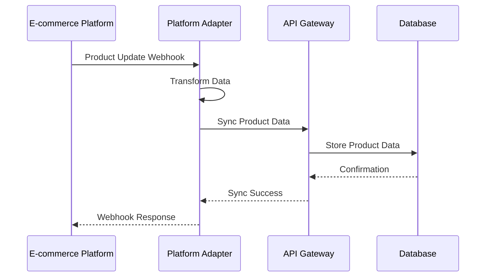
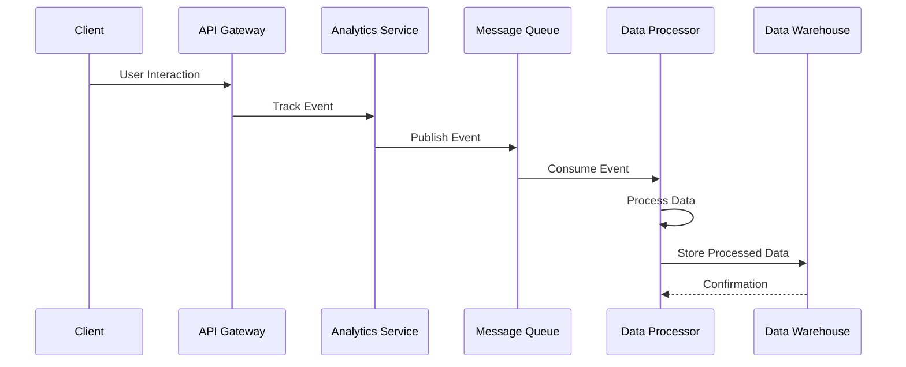

# VARAi Data Flow Documentation

This document describes the data flows between different components of the VARAi platform, helping developers understand how data moves through the system.

## Overview

The VARAi platform processes several types of data:

1. **User Data**: Information about users, their preferences, and authentication
2. **Product Data**: Information about eyewear products, including images and metadata
3. **Analytics Data**: Usage data and metrics for reporting and optimization
4. **ML Data**: Data used for machine learning models, including face measurements and style preferences

## Key Data Flows

### User Authentication Flow



### Virtual Try-On Flow



### Product Recommendation Flow



### E-commerce Integration Flow



### Analytics Data Flow



## Data Storage

### Database Collections

The VARAi platform uses MongoDB Atlas as its primary database, with the following main collections:

1. **tenants**: Information about organizations using the platform
2. **users**: User account information
3. **roles**: Role definitions for RBAC
4. **products**: Eyewear product information
5. **frames**: Detailed frame information
6. **recommendations**: Generated product recommendations
7. **analytics_events**: User interaction events
8. **ml_models**: Machine learning model metadata
9. **face_measurements**: User face measurement data

### Object Storage

The platform uses cloud object storage for:

1. **Product Images**: High-quality images of eyewear products
2. **User Photos**: User-uploaded photos for virtual try-on
3. **Rendered Images**: Virtual try-on results
4. **ML Model Files**: Serialized machine learning models

## Data Transformation

### Product Data Transformation

When integrating with e-commerce platforms, product data undergoes the following transformation:

```
E-commerce Platform Product
↓
Platform Adapter Transformation
↓
VARAi Product Schema
↓
Database Storage
```

### Analytics Data Transformation

User interaction events go through the following transformation pipeline:

```
Raw Event
↓
Event Validation
↓
Event Enrichment (user, tenant, timestamp)
↓
Event Storage (raw)
↓
Batch Processing
↓
Aggregation
↓
Data Warehouse Storage
```

## Data Security

All data flows in the VARAi platform adhere to the following security principles:

1. **Authentication**: All API requests require proper authentication
2. **Authorization**: Access to data is controlled by role-based permissions
3. **Encryption**: Sensitive data is encrypted in transit and at rest
4. **Data Isolation**: Multi-tenant data is strictly isolated
5. **Audit Logging**: All data access and modifications are logged

## Next Steps

For more detailed information on the technology stack used for data processing, please refer to the [Technology Stack Documentation](./technology-stack.md).