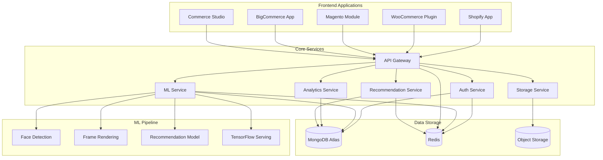

# VARAi System Architecture Overview

## Introduction

The VARAi platform is a comprehensive eyewear virtual try-on and recommendation system built on a modern, scalable microservices architecture. This document provides a high-level overview of the system architecture, its components, and how they interact.

## Architecture Diagram

## Core Components

### Frontend Applications

The VARAi platform provides multiple frontend applications to serve different user needs:

1. **Commerce Studio**: Admin dashboard for merchants and platform administrators
2. **E-commerce Platform Integrations**: Native integrations for major e-commerce platforms
   - Shopify App
   - WooCommerce Plugin
   - Magento Module
   - BigCommerce App
3. **Customer-Facing Components**: Embeddable widgets for merchant websites
   - Virtual Try-On Widget
   - Frame Finder Component
   - Style Recommendations Interface

### Core Services

The backend of the VARAi platform consists of several microservices:

1. **API Gateway**: Central entry point for all API requests, handling routing, authentication, and rate limiting
2. **Authentication Service**: Manages user authentication, authorization, and multi-tenant access control
3. **ML Service**: Orchestrates machine learning models for face detection, frame rendering, and recommendations
4. **Analytics Service**: Collects and processes usage data for insights and reporting
5. **Storage Service**: Manages file storage and retrieval for product images, user photos, and other assets
6. **Recommendation Service**: Generates personalized product recommendations based on user preferences and behavior

### ML Pipeline

The ML pipeline consists of several specialized components:

1. **Face Detection**: Detects and analyzes facial features in user photos
2. **Frame Rendering**: Renders eyewear frames on user photos for virtual try-on
3. **Recommendation Model**: Generates personalized product recommendations
4. **TensorFlow Serving**: Serves machine learning models with high performance

### Data Storage

The VARAi platform uses several data storage solutions:

1. **MongoDB Atlas**: Primary database for storing user data, product information, and analytics
2. **Redis**: In-memory cache for high-performance data access
3. **Object Storage**: Cloud storage for files such as images and documents

## Communication Patterns

The VARAi platform uses several communication patterns:

1. **RESTful APIs**: For synchronous request-response communication between services
2. **Message Queues**: For asynchronous communication and event-driven architecture
3. **WebSockets**: For real-time communication with frontend applications

## Deployment Architecture

The VARAi platform primarily uses Kubernetes for deployment, with Cloud Run for specific services. The platform supports the following environments:

1. **Development**: For active development and testing
2. **Staging**: For pre-production testing and validation
3. **Production**: For live customer usage

Each environment is isolated and has its own set of resources, ensuring that development and testing activities do not impact production systems.

### Kubernetes Deployment

Most services in the VARAi platform are deployed on Kubernetes, which provides:

- Container orchestration
- Horizontal scaling
- Self-healing capabilities
- Service discovery and load balancing
- Rolling updates and rollbacks

### Cloud Run Deployment

Specific services, such as the `ml-datadriven-recos` service, are deployed on Google Cloud Run for:

- Serverless operation
- Automatic scaling to zero
- Pay-per-use billing
- Regional deployment for data residency compliance

The `ml-datadriven-recos` service is deployed in both `us-central1` and `europe-west1` regions to serve users in North America and Europe respectively, ensuring low latency and compliance with data residency requirements.

## Scalability and Reliability

The VARAi platform is designed for high scalability and reliability:

1. **Horizontal Scaling**: Services can be scaled independently based on demand
2. **Load Balancing**: Distributes traffic across multiple instances of each service
3. **Fault Tolerance**: Services are designed to handle failures gracefully
4. **Monitoring and Alerting**: Comprehensive monitoring and alerting for early detection of issues

## Security Architecture

The VARAi platform implements a comprehensive security architecture:

1. **Authentication and Authorization**: Role-based access control for all users
2. **API Security**: HTTPS, API keys, and OAuth for secure API access
3. **Data Protection**: Encryption for sensitive data at rest and in transit
4. **Security Monitoring**: Continuous monitoring for security threats

## Next Steps

For more detailed information on specific components, please refer to the following documents:

- [Component Diagrams](./component-diagrams.md)
- [Data Flow Documentation](./data-flow.md)
- [Technology Stack Documentation](./technology-stack.md)
- [Design Patterns Documentation](./design-patterns.md)
- [Architecture Decision Records](./adr/index.md)