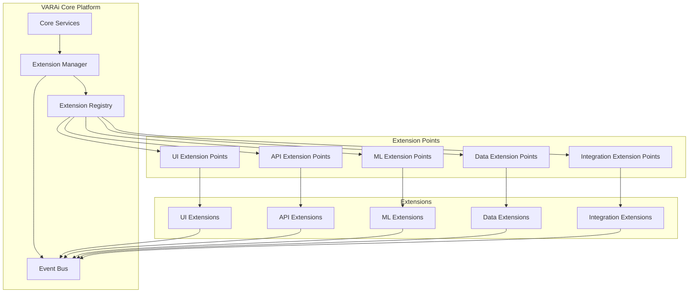

# Extension Architecture Documentation

This document provides a comprehensive overview of the VARAi platform's extension architecture, helping developers understand how extensions are structured, loaded, and integrated with the core platform.

## Overview

The VARAi platform uses a modular extension architecture that allows developers to extend and customize the platform's functionality without modifying the core codebase. This architecture is designed to be:

- **Flexible**: Support various types of extensions
- **Secure**: Isolate extensions from the core platform
- **Performant**: Minimize performance impact
- **Maintainable**: Enable independent development and deployment
- **Discoverable**: Make extensions easy to find and use

## Architecture Diagram



## Core Components

### Extension Manager

The Extension Manager is responsible for:

- Loading and unloading extensions
- Managing extension lifecycle
- Enforcing security policies
- Handling extension dependencies
- Monitoring extension health

### Extension Registry

The Extension Registry maintains a catalog of:

- Available extensions
- Extension metadata
- Extension configurations
- Extension dependencies
- Extension versions

### Event Bus

The Event Bus facilitates communication between:

- Core platform and extensions
- Different extensions
- Different components within an extension

## Extension Structure

### Extension Package

An extension package consists of:

```
my-extension/
├── manifest.json           # Extension metadata and configuration
├── icon.png                # Extension icon
├── README.md               # Extension documentation
├── CHANGELOG.md            # Version history
├── LICENSE                 # License information
├── src/                    # Source code
│   ├── index.ts            # Entry point
│   ├── components/         # UI components
│   ├── services/           # Business logic
│   └── models/             # Data models
├── dist/                   # Compiled code
├── tests/                  # Tests
└── package.json            # Dependencies and scripts
```

### Manifest File

The `manifest.json` file defines the extension's metadata and configuration:

```json
{
  "name": "shopify-integration",
  "displayName": "Shopify Integration",
  "version": "1.0.0",
  "description": "Integrates VARAi with Shopify stores",
  "author": "VARAi, Inc.",
  "license": "MIT",
  "icon": "icon.png",
  "main": "dist/index.js",
  "extensionPoints": [
    "integration.ecommerce.platform",
    "ui.settings.integration"
  ],
  "permissions": [
    "api.products.read",
    "api.products.write",
    "api.customers.read"
  ],
  "dependencies": {
    "core": "^1.0.0",
    "analytics-extension": "^1.0.0"
  },
  "configuration": {
    "properties": {
      "apiKey": {
        "type": "string",
        "description": "Shopify API Key"
      },
      "apiSecret": {
        "type": "string",
        "description": "Shopify API Secret",
        "format": "password"
      },
      "shopDomain": {
        "type": "string",
        "description": "Shopify Shop Domain"
      }
    },
    "required": ["apiKey", "apiSecret", "shopDomain"]
  }
}
```

## Extension Points

Extension points are well-defined interfaces where extensions can integrate with the core platform. The VARAi platform provides several categories of extension points:

### UI Extension Points

UI extension points allow extensions to add or modify UI components:

- **ui.dashboard.widget**: Add widgets to the dashboard
- **ui.settings.section**: Add sections to the settings page
- **ui.product.detail**: Enhance product detail views
- **ui.customer.profile**: Enhance customer profile views
- **ui.navigation.item**: Add items to the navigation menu

### API Extension Points

API extension points allow extensions to add or modify API endpoints:

- **api.routes**: Add custom API routes
- **api.middleware**: Add custom middleware
- **api.models**: Add custom data models
- **api.validators**: Add custom validators
- **api.transformers**: Add custom data transformers

### ML Extension Points

ML extension points allow extensions to add or modify ML capabilities:

- **ml.model**: Add custom ML models
- **ml.pipeline**: Add custom ML pipelines
- **ml.feature**: Add custom feature extractors
- **ml.training**: Add custom training procedures
- **ml.evaluation**: Add custom evaluation metrics

### Data Extension Points

Data extension points allow extensions to add or modify data processing:

- **data.source**: Add custom data sources
- **data.sink**: Add custom data sinks
- **data.processor**: Add custom data processors
- **data.validator**: Add custom data validators
- **data.transformer**: Add custom data transformers

### Integration Extension Points

Integration extension points allow extensions to add integrations with external systems:

- **integration.ecommerce.platform**: Add e-commerce platform integrations
- **integration.analytics**: Add analytics integrations
- **integration.crm**: Add CRM integrations
- **integration.marketing**: Add marketing integrations
- **integration.payment**: Add payment integrations

## Extension Lifecycle

Extensions go through the following lifecycle:

1. **Installation**: The extension is installed on the VARAi platform
2. **Registration**: The extension registers with the Extension Registry
3. **Initialization**: The extension is initialized with its configuration
4. **Activation**: The extension is activated and begins operation
5. **Deactivation**: The extension is deactivated (e.g., when disabled)
6. **Uninstallation**: The extension is removed from the VARAi platform

## Extension Communication

Extensions can communicate with the core platform and other extensions through several mechanisms:

### Event-Based Communication

Extensions can publish and subscribe to events on the Event Bus:

```typescript
// Publishing an event
eventBus.publish('product.updated', { productId: '123', changes: { ... } });

// Subscribing to an event
eventBus.subscribe('product.updated', (data) => {
  // Handle the event
});
```

### API-Based Communication

Extensions can call APIs provided by the core platform or other extensions:

```typescript
// Calling a core API
const product = await core.api.products.getProduct('123');

// Calling another extension's API
const analytics = await extensions.get('analytics-extension');
await analytics.api.trackEvent('product.viewed', { productId: '123' });
```

### Direct Method Calls

Extensions can expose methods that can be called by the core platform or other extensions:

```typescript
// Exposing a method
export function processImage(imageData) {
  // Process the image
  return processedData;
}

// Calling the method from another extension
const imageProcessor = await extensions.get('image-processor-extension');
const processedData = await imageProcessor.processImage(imageData);
```

## Security Model

The VARAi platform implements a comprehensive security model for extensions:

### Permission System

Extensions must declare the permissions they require in their manifest file. Users must approve these permissions during installation.

### Isolation

Extensions run in isolated contexts to prevent them from interfering with each other or the core platform.

### Resource Limits

Extensions are subject to resource limits to prevent them from consuming excessive resources.

### Code Signing

Extensions can be signed to verify their authenticity and integrity.

### Vulnerability Scanning

Extensions are scanned for vulnerabilities before being published to the Extension Marketplace.

## Extension Development Workflow

The typical workflow for developing an extension is:

1. **Create**: Create a new extension project using the Extension SDK
2. **Develop**: Implement the extension's functionality
3. **Test**: Test the extension in a development environment
4. **Package**: Package the extension for distribution
5. **Publish**: Publish the extension to the Extension Marketplace
6. **Maintain**: Update and maintain the extension

## Extension SDK

The VARAi platform provides an Extension SDK that includes:

- **CLI Tools**: For creating, testing, and packaging extensions
- **API Clients**: For interacting with the core platform
- **UI Components**: For building consistent UI extensions
- **Testing Utilities**: For testing extensions
- **Documentation**: For understanding the extension architecture

## Best Practices

When developing extensions, follow these best practices:

1. **Minimal Core Dependencies**: Minimize dependencies on core platform internals
2. **Graceful Degradation**: Handle errors and edge cases gracefully
3. **Performance Optimization**: Optimize for performance and resource usage
4. **Security First**: Follow security best practices
5. **User Experience**: Maintain a consistent user experience
6. **Documentation**: Document your extension thoroughly
7. **Testing**: Test your extension thoroughly
8. **Versioning**: Use semantic versioning for your extension

## Next Steps

To start developing extensions for the VARAi platform, see the [Plugin Development Guide](./plugin-development-guide.md) for step-by-step instructions.