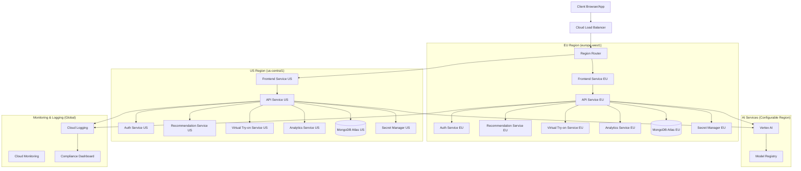

# Google Cloud Run Deployment with Regulatory Compliance

This document outlines the implementation plan for deploying the EyewearML platform to Google Cloud Run while ensuring compliance with regulatory requirements such as GDPR and healthcare data regulations.

## Table of Contents

1. [Introduction](#introduction)
2. [Regulatory Requirements](#regulatory-requirements)
3. [Implementation Plan](#implementation-plan)
   - [Phase 1: Code Review and Analysis](#phase-1-code-review-and-analysis)
   - [Phase 2: Implementation Changes](#phase-2-implementation-changes)
   - [Phase 3: Testing Plan](#phase-3-testing-plan)
   - [Phase 4: Documentation Updates](#phase-4-documentation-updates)
4. [Architecture](#architecture)
   - [Regional Deployment Strategy](#regional-deployment-strategy)
   - [Data Isolation](#data-isolation)
   - [Security Controls](#security-controls)
5. [Implementation Details](#implementation-details)
   - [Terraform Modules](#terraform-modules)
   - [Dockerfile Updates](#dockerfile-updates)
   - [CI/CD Pipeline](#cicd-pipeline)
6. [Testing and Validation](#testing-and-validation)
7. [References](#references)

## Introduction

The EyewearML platform currently uses Kubernetes for orchestration but needs to migrate to Google Cloud Run for improved scalability, cost efficiency, and simplified operations. This migration must maintain compliance with regulatory requirements, particularly GDPR for EU users and healthcare data regulations for prescription and biometric information.

## Regulatory Requirements

### GDPR Compliance

The General Data Protection Regulation (GDPR) imposes strict requirements on handling personal data of EU citizens:

1. **Data Residency**: Personal data of EU citizens must be stored within EU borders
2. **Data Subject Rights**: Users must be able to access, export, and delete their data
3. **Data Protection**: Appropriate security measures must be implemented
4. **Data Processing Records**: Documentation of data processing activities

### Healthcare Data Regulations

Healthcare-related data, including prescription information and biometric data (face measurements), requires additional protections:

1. **Enhanced Security**: Stricter access controls and encryption
2. **Data Isolation**: Separation of healthcare data from other data
3. **Audit Logging**: Comprehensive logging of all data access
4. **Consent Management**: Clear user consent for processing biometric data

## Implementation Plan

### Phase 1: Code Review and Analysis

#### 1.1 Current Infrastructure Assessment

The current infrastructure uses:
- Docker containers for services (Node.js-based)
- Terraform for infrastructure management
- Kubernetes for orchestration
- MongoDB Atlas for database
- Multi-environment support (dev, staging, prod)

#### 1.2 Regulatory Requirements Analysis

The project has existing region-specific data storage implementation (`docs/architecture/region_specific_data_storage.md`) that addresses:
- GDPR compliance for EU user data
- Region-specific database configurations
- Data residency requirements

#### 1.3 Deployment Code Review

Current deployment approach:
- Uses Kubernetes deployments defined in Terraform
- Services are containerized with Docker
- Terraform modules for networking, database, and Kubernetes
- Environment-specific configurations

#### 1.4 Gaps for Cloud Run Deployment

1. **Missing Cloud Run-specific configurations**:
   - No Cloud Run service definitions
   - No regional service deployment for regulatory compliance

2. **Authentication and authorization for Cloud Run**:
   - Current setup uses Kubernetes secrets
   - Need Cloud Run-compatible secret management

3. **Networking and routing**:
   - Current setup uses Kubernetes Ingress
   - Need Cloud Run-compatible routing with regional awareness

4. **Database connectivity**:
   - Current MongoDB Atlas setup needs region-specific configuration

### Phase 2: Implementation Changes

#### 2.1 Terraform Module Updates

1. **Create Cloud Run Module**:
   - Create `terraform/modules/cloud_run/main.tf`
   - Define Cloud Run service resources with regional deployment
   - Configure service accounts and IAM permissions
   - Set up Cloud Run revision management

2. **Update Database Module**:
   - Enhance `terraform/modules/database/main.tf` to support region-specific MongoDB Atlas clusters
   - Configure network peering for each region
   - Implement data isolation between regions

3. **Update Networking Module**:
   - Modify `terraform/modules/networking/main.tf` to support Cloud Run
   - Configure global load balancer with regional routing
   - Set up Cloud CDN for static content

4. **Create Secrets Module**:
   - Create `terraform/modules/secrets/main.tf`
   - Implement Secret Manager for sensitive data
   - Configure regional secret access

#### 2.2 Dockerfile Updates

1. **Update Service Dockerfiles**:
   - Optimize for Cloud Run requirements
   - Add health check endpoints
   - Configure proper signal handling
   - Add region-specific configuration support

2. **Create Multi-stage Builds**:
   - Implement production-optimized builds
   - Reduce image size for faster startup
   - Include region-specific artifacts as needed

#### 2.3 Environment Configuration

1. **Create Region-specific Environment Files**:
   - Update `.env.example` for each region
   - Document required environment variables
   - Implement region detection logic

2. **Update Terraform Variables**:
   - Add region-specific variables
   - Configure data residency options
   - Set up regulatory compliance flags

#### 2.4 CI/CD Pipeline Updates

1. **Create Cloud Build Configuration**:
   - Define `cloudbuild.yaml` for automated builds
   - Configure regional deployments
   - Implement compliance validation steps

2. **Deployment Scripts**:
   - Create region-aware deployment scripts
   - Implement rollback mechanisms
   - Add validation steps for regulatory compliance

### Phase 3: Testing Plan

#### 3.1 Local Testing

1. **Local Cloud Run Emulation**:
   - Test services with Cloud Run local emulator
   - Verify environment configuration
   - Validate region-specific behavior

2. **Integration Testing**:
   - Test service communication
   - Verify database connections
   - Validate authentication flows

#### 3.2 Staging Environment Testing

1. **Regional Deployment Testing**:
   - Deploy to multiple regions (US, EU)
   - Verify region-specific data storage
   - Test cross-region communication

2. **Load Testing**:
   - Verify autoscaling behavior
   - Test cold start performance
   - Validate resource utilization

#### 3.3 Compliance Testing

1. **Data Residency Validation**:
   - Verify EU data stays in EU regions
   - Test region detection logic
   - Validate cross-region access controls

2. **Security Testing**:
   - Verify encryption at rest and in transit
   - Test IAM permissions
   - Validate secret management

3. **Audit Logging Verification**:
   - Test comprehensive audit logging
   - Verify regulatory compliance logs
   - Validate data access tracking

### Phase 4: Documentation Updates

#### 4.1 Architecture Documentation

1. **Update Architecture Diagrams**:
   - Create Cloud Run architecture diagrams
   - Document regional deployment architecture
   - Illustrate data flow and isolation

2. **Update Technical Documentation**:
   - Document Cloud Run configuration
   - Describe regional deployment strategy
   - Explain regulatory compliance measures

#### 4.2 Deployment Documentation

1. **Create Cloud Run Deployment Guide**:
   - Document deployment process
   - Explain regional configuration
   - Provide troubleshooting steps

2. **Update Operations Documentation**:
   - Document monitoring and alerting
   - Explain logging and auditing
   - Describe disaster recovery procedures

#### 4.3 Compliance Documentation

1. **Create Regulatory Compliance Guide**:
   - Document GDPR compliance measures
   - Explain healthcare data handling
   - Describe data isolation architecture

2. **Create Data Processing Documentation**:
   - Document data flow and processing
   - Explain data retention policies
   - Describe data subject rights implementation

## Architecture

### Regional Deployment Strategy

The architecture implements a multi-region deployment to address data residency requirements:



1. **EU Region (europe-west1)**
   - Stores all EU user data within EU borders (GDPR compliance)
   - Hosts complete service stack for EU users
   - Uses EU-based MongoDB Atlas instance

2. **US Region (us-central1)**
   - Stores North American and other non-EU user data
   - Hosts complete service stack for non-EU users
   - Uses US-based MongoDB Atlas instance

3. **Region Router**
   - Determines appropriate region based on:
     - Explicit region header (`X-Data-Region`)
     - User preferences stored in profile
     - IP-based geolocation
     - Default region fallback

### Data Isolation

#### Healthcare Data Considerations

The system handles potentially sensitive healthcare-related data (prescriptions, face measurements):

1. **Data Classification**
   - Personal Identifiable Information (PII)
   - Healthcare-related data (prescriptions)
   - Biometric data (face measurements)
   - Non-sensitive data (product catalog)

2. **Isolation Strategy**
   - Healthcare data stored only in region-specific databases
   - Strict access controls based on data classification
   - Encryption at rest and in transit for all sensitive data
   - Data minimization principles applied to AI model inputs

#### AI Model and User Data Separation

To address the concern about AI models and user information:

1. **Model Deployment**
   - AI models deployed in configurable regions based on compliance requirements
   - Model training data anonymized and separated from production user data
   - Model Registry maintains versioning and regional deployment information

2. **Data Flow Controls**
   - Clear boundaries between user data and AI processing
   - Anonymization of data before AI processing where appropriate
   - Audit logging of all data access by AI services

### Security Controls

1. **Authentication and Authorization**
   - IAM-based access control for all services
   - Service accounts with least privilege
   - Identity-aware proxy for admin interfaces

2. **Encryption**
   - Encryption at rest for all data stores
   - TLS for all service communication
   - Customer-managed encryption keys for sensitive data

3. **Audit Logging**
   - Comprehensive logging of all data access
   - Immutable audit trails
   - Regular compliance reporting

## Implementation Details

### Terraform Modules

#### Cloud Run Module

```hcl
# terraform/modules/cloud_run/main.tf

# Regional service deployment
resource "google_cloud_run_service" "service" {
  for_each = var.regions

  name     = "${var.service_name}-${each.key}"
  location = each.value.region
  
  template {
    spec {
      containers {
        image = "${var.container_registry}/${var.image_prefix}/${var.service_name}:${var.image_tag}"
        
        resources {
          limits = {
            cpu    = var.resources.cpu_limit
            memory = var.resources.memory_limit
          }
        }
        
        env {
          name  = "REGION"
          value = each.key
        }
        
        # Region-specific environment variables
        dynamic "env" {
          for_each = each.value.environment_variables
          content {
            name  = env.key
            value = env.value
          }
        }
        
        # Secret environment variables
        dynamic "env" {
          for_each = var.secrets
          content {
            name = env.key
            value_from {
              secret_key_ref {
                name = "${var.service_name}-${each.key}-${env.key}"
                key  = "latest"
              }
            }
          }
        }
      }
      
      service_account_name = google_service_account.service_account.email
    }
  }
  
  traffic {
    percent         = 100
    latest_revision = true
  }
  
  autogenerate_revision_name = true
}

# IAM permissions
resource "google_service_account" "service_account" {
  account_id   = "${var.service_name}-sa"
  display_name = "Service Account for ${var.service_name}"
}

# Regional domain mapping
resource "google_cloud_run_domain_mapping" "domain_mapping" {
  for_each = var.regions
  
  name     = "${each.key}.${var.domain_name}"
  location = each.value.region
  
  metadata {
    namespace = var.project_id
  }
  
  spec {
    route_name = google_cloud_run_service.service[each.key].name
  }
}
```

#### Global Load Balancer with Regional Routing

```hcl
# terraform/modules/networking/main.tf

# Global load balancer with regional routing
resource "google_compute_url_map" "url_map" {
  name        = "varai-url-map"
  description = "URL map for VARAi services with regional routing"
  
  default_service = google_compute_backend_service.default_backend.id
  
  host_rule {
    hosts        = [var.domain_name]
    path_matcher = "main"
  }
  
  path_matcher {
    name            = "main"
    default_service = google_compute_backend_service.default_backend.id
    
    route_rules {
      priority = 1
      header_action {
        request_headers_to_remove = ["X-Region-Processed"]
      }
      match_rules {
        header_matches {
          header_name = "X-Data-Region"
          exact_match = "eu"
        }
      }
      service = google_compute_backend_service.eu_backend.id
    }
    
    route_rules {
      priority = 2
      header_action {
        request_headers_to_remove = ["X-Region-Processed"]
      }
      match_rules {
        header_matches {
          header_name = "X-User-Region"
          exact_match = "eu"
        }
      }
      service = google_compute_backend_service.eu_backend.id
    }
    
    route_rules {
      priority = 3
      header_action {
        request_headers_to_add {
          header_name  = "X-Region-Processed"
          header_value = "true"
        }
      }
      match_rules {
        header_matches {
          header_name   = "X-Region-Processed"
          present_match = false
        }
      }
      service = google_compute_backend_service.us_backend.id
    }
  }
}
```

#### Region-Specific Database Configuration

```hcl
# terraform/modules/database/main.tf

# Create MongoDB Atlas clusters in different regions
resource "mongodbatlas_cluster" "cluster" {
  for_each = var.regions
  
  project_id              = var.atlas_project_id
  name                    = "varai-${each.key}"
  mongo_db_major_version  = var.mongodb_version
  provider_name           = "GCP"
  provider_region_name    = each.value.atlas_region
  provider_instance_size_name = var.atlas_instance_size
  
  # Region-specific backup policy
  backup_enabled = var.enable_backups
  
  # Region-specific encryption
  encryption_at_rest_provider = var.enable_encryption_at_rest ? "GCP" : null
}

# Network peering for each region
resource "mongodbatlas_network_peering" "peering" {
  for_each = var.regions
  
  project_id     = var.atlas_project_id
  container_id   = mongodbatlas_cluster.cluster[each.key].container_id
  provider_name  = "GCP"
  gcp_project_id = var.gcp_project_id
  network_name   = var.vpc_network_name
}
```

### Dockerfile Updates

#### Multi-stage Build Example

```dockerfile
# Build stage
FROM node:18-slim AS build

WORKDIR /app

COPY package*.json ./
RUN npm ci

COPY . .
RUN npm run build

# Production stage
FROM node:18-slim

WORKDIR /app

# Copy only production dependencies
COPY package*.json ./
RUN npm ci --only=production

# Copy built application
COPY --from=build /app/dist ./dist
COPY --from=build /app/public ./public

# Add health check endpoint
COPY health-check.js ./

# Set environment variables
ENV NODE_ENV=production
ENV PORT=8080

# Expose the port
EXPOSE 8080

# Start the application
CMD ["node", "dist/index.js"]
```

### CI/CD Pipeline

#### Cloud Build Configuration

```yaml
# cloudbuild.yaml
steps:
  # Build the container image
  - name: 'gcr.io/cloud-builders/docker'
    args: ['build', '-t', 'gcr.io/$PROJECT_ID/${_SERVICE_NAME}:$COMMIT_SHA', '.']
  
  # Push the container image to Container Registry
  - name: 'gcr.io/cloud-builders/docker'
    args: ['push', 'gcr.io/$PROJECT_ID/${_SERVICE_NAME}:$COMMIT_SHA']
  
  # Deploy to US region
  - name: 'gcr.io/google.com/cloudsdktool/cloud-sdk'
    entrypoint: gcloud
    args:
    - 'run'
    - 'deploy'
    - '${_SERVICE_NAME}-us'
    - '--image'
    - 'gcr.io/$PROJECT_ID/${_SERVICE_NAME}:$COMMIT_SHA'
    - '--region'
    - 'us-central1'
    - '--platform'
    - 'managed'
    - '--set-env-vars'
    - 'REGION=us'
  
  # Deploy to EU region
  - name: 'gcr.io/google.com/cloudsdktool/cloud-sdk'
    entrypoint: gcloud
    args:
    - 'run'
    - 'deploy'
    - '${_SERVICE_NAME}-eu'
    - '--image'
    - 'gcr.io/$PROJECT_ID/${_SERVICE_NAME}:$COMMIT_SHA'
    - '--region'
    - 'europe-west1'
    - '--platform'
    - 'managed'
    - '--set-env-vars'
    - 'REGION=eu'
  
  # Run compliance validation tests
  - name: 'gcr.io/google.com/cloudsdktool/cloud-sdk'
    entrypoint: /bin/bash
    args:
    - '-c'
    - |
      gcloud builds submit --config=compliance-tests.yaml \
        --substitutions=_SERVICE_NAME=${_SERVICE_NAME},_COMMIT_SHA=$COMMIT_SHA

substitutions:
  _SERVICE_NAME: 'default'  # Default value, can be overridden

images:
  - 'gcr.io/$PROJECT_ID/${_SERVICE_NAME}:$COMMIT_SHA'
```

## Testing and Validation

### Compliance Test Suite

Create a comprehensive test suite to validate regulatory compliance:

1. **Data Residency Tests**:
   - Verify EU user data is stored in EU region
   - Verify US user data is stored in US region
   - Test region detection logic

2. **Data Protection Tests**:
   - Verify encryption at rest and in transit
   - Test access controls and permissions
   - Validate secret management

3. **Audit Logging Tests**:
   - Verify comprehensive logging of all data access
   - Test audit trail immutability
   - Validate compliance reporting

### Automated Validation

Implement automated validation in the CI/CD pipeline:

1. **Pre-deployment Validation**:
   - Static code analysis for security issues
   - Container vulnerability scanning
   - Configuration validation

2. **Post-deployment Validation**:
   - Automated compliance tests
   - Security scanning
   - Performance testing

### Manual Verification

Perform manual verification for critical compliance aspects:

1. **Data Subject Rights**:
   - Test data access requests
   - Verify data export functionality
   - Test data deletion process

2. **Consent Management**:
   - Verify consent collection
   - Test consent withdrawal
   - Validate consent records

## References

- [Google Cloud Run Documentation](https://cloud.google.com/run/docs)
- [GDPR Compliance on GCP](https://cloud.google.com/security/compliance/gdpr)
- [Healthcare Compliance on GCP](https://cloud.google.com/security/compliance/hipaa)
- [Multi-regional Architectures](https://cloud.google.com/architecture/framework/regions)
- [Terraform Google Provider Documentation](https://registry.terraform.io/providers/hashicorp/google/latest/docs)