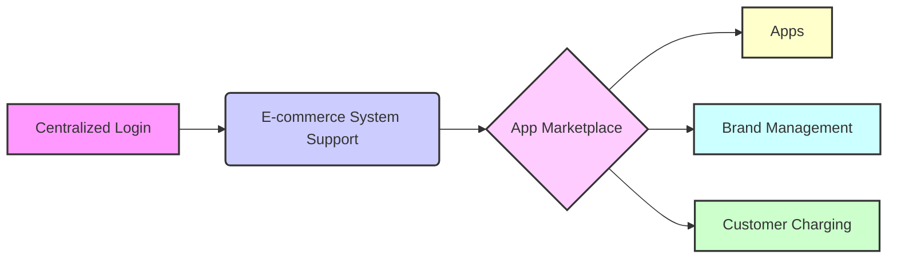

# Executive Overview README Plan

**I. Executive Summary**

*   Briefly introduce the eyewear recommendation platform and its value proposition for potential investors.
*   Highlight the key features and benefits of the platform.

**II. Platform Overview**

*   **Centralized Login:** Describe the centralized login system and its benefits for security and user management.
*   **E-commerce System Support:** Explain how the platform supports different e-commerce systems (e.g., Shopify, WooCommerce) and the integration process.
*   **App Marketplace:** Describe the app marketplace and its role in extending the platform's functionality.
*   **Apps:** Explain the types of apps available in the marketplace (e.g., recommendation algorithms, analytics tools, marketing integrations).
*   **Brand Management:** Describe how brands are managed within the platform, including brand creation, modification, and customization options.
*   **Customer Charging:** Explain the platform's customer charging model (e.g., subscription-based, usage-based, tiered pricing).

**III. Installation and Setup**

*   Describe the installation process through the web interface.
*   Explain any required dependencies or configuration options.

**IV. Technical Architecture**

*   Provide a high-level overview of the platform's technical architecture.
*   Describe the key components and their interactions.

**V. Business Model**

*   Explain the platform's business model and revenue streams.
*   Highlight the potential for growth and scalability.

**VI. Team and Expertise**

*   Introduce the team behind the platform and their relevant expertise.

**VII. Call to Action**

*   Encourage potential investors to learn more about the platform and explore investment opportunities.

## Platform Overview Diagrams

### Component Diagram



### Technical Architecture Diagram

```mermaid
graph LR
    A[Frontend (React)] --> B(API Gateway (FastAPI))
    B --> C{Recommendation Service}
    B --> D{Database (PostgreSQL)}
    B --> E{Storage (Cloud Storage)}
    C --> D
    C --> E
    style A fill:#f9f,stroke:#333,stroke-width:2px
    style B fill:#ccf,stroke:#333,stroke-width:2px
    style C fill:#fcf,stroke:#333,stroke-width:2px
    style D fill:#ffc,stroke:#333,stroke-width:2px
    style E fill:#cff,stroke:#333,stroke-width:2px