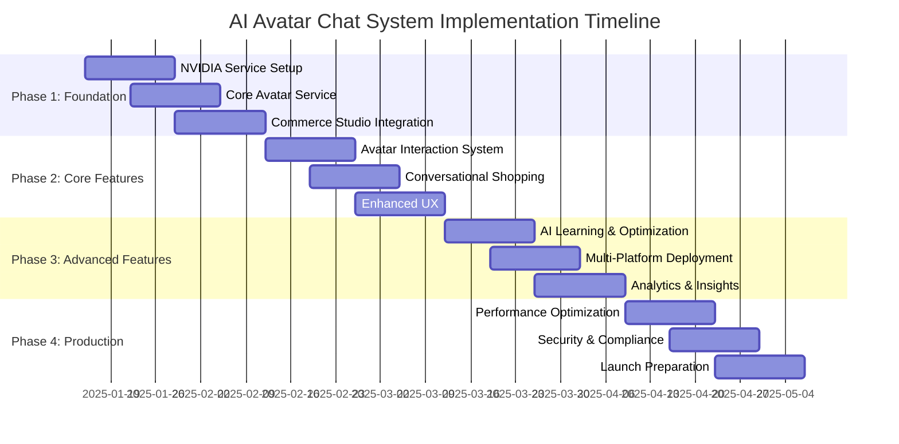

# AI Avatar Chat System Implementation Roadmap
## NVIDIA-Powered Virtual Shopping Assistant Deployment Strategy

## Document Information
- **Document Type**: Implementation Roadmap and Deployment Strategy
- **System**: AI Avatar Chat System with NVIDIA Integration
- **Version**: 1.0
- **Date**: January 2025
- **Dependencies**: Commerce Studio, NVIDIA Omniverse/Riva/Merlin, Google Cloud Platform

## Executive Summary

This roadmap outlines the comprehensive implementation strategy for deploying the AI Avatar Chat System across Commerce Studio's multi-platform ecosystem. The implementation follows a phased approach that ensures minimal disruption to existing services while progressively introducing advanced NVIDIA AI capabilities.

## Implementation Overview

### Phase-Based Deployment Strategy



## Phase 1: Foundation Setup (Weeks 1-3)

### Week 1: NVIDIA Services Integration

#### Day 1-2: NVIDIA Account Setup and API Access
```bash
# NVIDIA Service Configuration Script
#!/bin/bash

# Set up NVIDIA Omniverse Avatar Cloud
echo "Setting up NVIDIA Omniverse Avatar Cloud..."
curl -X POST "https://api.omniverse.nvidia.com/v1/organizations" \
  -H "Authorization: Bearer $NVIDIA_API_KEY" \
  -H "Content-Type: application/json" \
  -d '{
    "name": "Commerce Studio",
    "type": "enterprise",
    "industry": "retail_ecommerce"
  }'

# Configure Riva Speech AI
echo "Configuring NVIDIA Riva Speech AI..."
curl -X POST "https://api.riva.nvidia.com/v1/models/deploy" \
  -H "Authorization: Bearer $NVIDIA_API_KEY" \
  -H "Content-Type: application/json" \
  -d '{
    "model_name": "conformer-en-US",
    "model_type": "speech_recognition",
    "deployment_config": {
      "max_batch_size": 16,
      "max_sequence_length": 512,
      "instance_group": [{"count": 2, "kind": "KIND_GPU"}]
    }
  }'

# Initialize Merlin Conversational AI
echo "Initializing NVIDIA Merlin Conversational AI..."
curl -X POST "https://api.merlin.nvidia.com/v1/deployments" \
  -H "Authorization: Bearer $NVIDIA_API_KEY" \
  -H "Content-Type: application/json" \
  -d '{
    "model_id": "megatron-gpt-eyewear-specialist",
    "deployment_name": "commerce-studio-avatar-chat",
    "config": {
      "max_tokens": 2048,
      "temperature": 0.7,
      "domain_specialization": "eyewear_retail"
    }
  }'
```

#### Day 3-5: Avatar Model Configuration
```typescript
// Avatar Configuration Service
interface AvatarConfigurationService {
  async setupAvatarModels(): Promise<AvatarModelConfig[]> {
    const avatarConfigs = [
      {
        id: 'female-professional-consultant',
        appearance: {
          gender: 'female',
          ethnicity: 'diverse',
          age: 'middle-aged',
          style: 'professional',
          clothing: 'business-casual',
          personality: 'warm-professional'
        },
        voiceProfile: {
          voiceId: 'en-US-female-warm-professional',
          speakingRate: 1.0,
          pitch: 0.0,
          emotionalRange: 'moderate'
        }
      },
      {
        id: 'male-friendly-assistant',
        appearance: {
          gender: 'male',
          ethnicity: 'diverse',
          age: 'young',
          style: 'casual-professional',
          clothing: 'smart-casual',
          personality: 'friendly-enthusiastic'
        },
        voiceProfile: {
          voiceId: 'en-US-male-friendly',
          speakingRate: 1.1,
          pitch: 2.0,
          emotionalRange: 'high'
        }
      }
    ];

    // Deploy avatar models to NVIDIA Omniverse
    const deployedModels = await Promise.all(
      avatarConfigs.map(config => this.deployAvatarModel(config))
    );

    return deployedModels;
  }

  private async deployAvatarModel(config: AvatarConfig): Promise<AvatarModelConfig> {
    const response = await fetch('https://api.omniverse.nvidia.com/v1/avatars', {
      method: 'POST',
      headers: {
        'Authorization': `Bearer ${process.env.NVIDIA_API_KEY}`,
        'Content-Type': 'application/json'
      },
      body: JSON.stringify({
        name: config.id,
        appearance: config.appearance,
        animations: await this.loadAnimationLibrary(),
        expressions: await this.loadExpressionLibrary(),
        voice_profile: config.voiceProfile
      })
    });

    return response.json();
  }
}
```

#### Day 6-7: Basic Avatar Rendering Pipeline
```typescript
// Avatar Rendering Service
class AvatarRenderingService {
  private omniverseClient: OmniverseClient;
  private renderingEngine: RenderingEngine;

  async initializeRenderingPipeline(): Promise<void> {
    // Initialize Omniverse connection
    this.omniverseClient = new OmniverseClient({
      endpoint: process.env.NVIDIA_OMNIVERSE_ENDPOINT,
      apiKey: process.env.NVIDIA_API_KEY,
      organizationId: process.env.NVIDIA_ORG_ID
    });

    // Set up rendering engine
    this.renderingEngine = new RenderingEngine({
      quality: 'adaptive',
      enableRayTracing: true,
      enableDLSS: true,
      targetFrameRate: 30
    });

    // Configure streaming
    await this.setupAvatarStreaming();
  }

  async renderAvatar(avatarId: string, sessionId: string): Promise<AvatarStream> {
    const avatarInstance = await this.omniverseClient.createAvatarInstance({
      avatarId,
      sessionId,
      renderingConfig: {
        resolution: '1280x720',
        quality: 'high',
        enableLipSync: true,
        enableFacialExpressions: true
      }
    });

    return this.renderingEngine.startStreaming(avatarInstance);
  }

  private async setupAvatarStreaming(): Promise<void> {
    // Configure WebRTC streaming for real-time avatar delivery
    const streamingConfig = {
      protocol: 'webrtc',
      codec: 'h264',
      bitrate: 2000000, // 2 Mbps
      adaptiveBitrate: true,
      lowLatencyMode: true
    };

    await this.renderingEngine.configureStreaming(streamingConfig);
  }
}
```

### Week 2: Core Avatar Chat Service Development

#### Day 8-10: Avatar Chat Session Management
```typescript
// Avatar Chat Session Manager
class AvatarChatSessionManager {
  private sessionStore: SessionStore;
  private avatarController: AvatarController;
  private speechService: RivaSpeechService;
  private conversationService: MerlinConversationalService;

  async createChatSession(config: ChatSessionConfig): Promise<ChatSession> {
    const sessionId = this.generateSessionId();
    
    // Initialize avatar for session
    const avatar = await this.avatarController.initializeAvatar({
      modelId: config.avatarModelId,
      sessionId,
      personalityConfig: config.personalityConfig
    });

    // Set up speech processing
    const speechProcessor = await this.speechService.createProcessor({
      sessionId,
      language: config.language || 'en-US',
      voiceProfile: avatar.voiceProfile
    });

    // Initialize conversation context
    const conversationContext = await this.conversationService.initializeContext({
      sessionId,
      userId: config.userId,
      domain: 'eyewear_retail',
      personalityType: config.personalityConfig.type
    });

    const session: ChatSession = {
      sessionId,
      userId: config.userId,
      avatar,
      speechProcessor,
      conversationContext,
      state: 'initialized',
      startTime: new Date(),
      lastActivity: new Date()
    };

    await this.sessionStore.saveSession(session);
    return session;
  }

  async handleUserInteraction(
    sessionId: string, 
    interaction: UserInteraction
  ): Promise<AvatarResponse> {
    const session = await this.sessionStore.getSession(sessionId);
    
    // Process user input based on type
    let processedInput: ProcessedInput;
    
    switch (interaction.type) {
      case 'voice':
        processedInput = await this.processVoiceInput(
          interaction.data as AudioBuffer,
          session
        );
        break;
      case 'text':
        processedInput = await this.processTextInput(
          interaction.data as string,
          session
        );
        break;
      case 'camera':
        processedInput = await this.processCameraInput(
          interaction.data as ImageData,
          session
        );
        break;
    }

    // Generate avatar response
    const response = await this.generateAvatarResponse(processedInput, session);
    
    // Update session state
    await this.updateSessionState(session, processedInput, response);
    
    return response;
  }

  private async processVoiceInput(
    audioData: AudioBuffer,
    session: ChatSession
  ): Promise<ProcessedInput> {
    // Speech-to-text conversion
    const transcript = await session.speechProcessor.transcribe(audioData);
    
    // Intent classification
    const intent = await session.conversationContext.classifyIntent(transcript.text);
    
    // Entity extraction
    const entities = await session.conversationContext.extractEntities(transcript.text);
    
    return {
      type: 'voice',
      originalData: audioData,
      transcript: transcript.text,
      confidence: transcript.confidence,
      intent,
      entities,
      timestamp: new Date()
    };
  }

  private async generateAvatarResponse(
    input: ProcessedInput,
    session: ChatSession
  ): Promise<AvatarResponse> {
    // Generate conversational response
    const conversationResponse = await session.conversationContext.generateResponse({
      input: input.transcript || input.text,
      intent: input.intent,
      entities: input.entities,
      sessionHistory: session.conversationHistory
    });

    // Generate avatar animation sequence
    const animationSequence = await this.generateAnimationSequence(
      conversationResponse,
      session.avatar
    );

    // Generate speech audio
    const speechAudio = await session.speechProcessor.synthesize({
      text: conversationResponse.text,
      emotion: conversationResponse.emotion,
      emphasis: conversationResponse.emphasis
    });

    return {
      conversationResponse,
      animationSequence,
      speechAudio,
      uiElements: conversationResponse.uiElements,
      systemActions: conversationResponse.systemActions,
      timestamp: new Date()
    };
  }
}
```

#### Day 11-14: Speech Processing Integration
```typescript
// Riva Speech Integration Service
class RivaSpeechIntegrationService {
  private rivaClient: RivaClient;
  private audioProcessor: AudioProcessor;

  async initializeSpeechServices(): Promise<void> {
    this.rivaClient = new RivaClient({
      endpoint: process.env.NVIDIA_RIVA_ENDPOINT,
      apiKey: process.env.NVIDIA_API_KEY,
      ssl: true
    });

    this.audioProcessor = new AudioProcessor({
      sampleRate: 16000,
      channels: 1,
      enableNoiseReduction: true,
      enableEchoCancellation: true
    });

    await this.setupSpeechModels();
  }

  async createSpeechProcessor(config: SpeechProcessorConfig): Promise<SpeechProcessor> {
    // Set up speech recognition
    const recognitionConfig = {
      language_code: config.language,
      model: 'conformer-en-US',
      enable_automatic_punctuation: true,
      enable_word_time_offsets: true,
      enable_word_confidence: true,
      max_alternatives: 3
    };

    const recognizer = await this.rivaClient.createStreamingRecognizer(recognitionConfig);

    // Set up speech synthesis
    const synthesisConfig = {
      language_code: config.language,
      voice: config.voiceProfile,
      audio_encoding: 'LINEAR16',
      sample_rate_hertz: 22050,
      speaking_rate: 1.0,
      pitch: 0.0,
      volume_gain_db: 0.0
    };

    const synthesizer = await this.rivaClient.createSynthesizer(synthesisConfig);

    return new SpeechProcessor({
      recognizer,
      synthesizer,
      audioProcessor: this.audioProcessor,
      sessionId: config.sessionId
    });
  }

  private async setupSpeechModels(): Promise<void> {
    // Deploy speech recognition models
    await this.rivaClient.deployModel({
      model_name: 'conformer-en-US',
      model_type: 'speech_recognition',
      config: {
        max_batch_size: 8,
        max_sequence_length: 512,
        instance_group: [{ count: 1, kind: 'KIND_GPU' }]
      }
    });

    // Deploy speech synthesis models
    await this.rivaClient.deployModel({
      model_name: 'fastpitch-hifigan-en-US',
      model_type: 'speech_synthesis',
      config: {
        max_batch_size: 4,
        instance_group: [{ count: 1, kind: 'KIND_GPU' }]
      }
    });
  }
}

// Speech Processor Implementation
class SpeechProcessor {
  private recognizer: StreamingRecognizer;
  private synthesizer: SpeechSynthesizer;
  private audioProcessor: AudioProcessor;
  private sessionId: string;

  async transcribe(audioData: AudioBuffer): Promise<TranscriptionResult> {
    // Process audio for optimal recognition
    const processedAudio = await this.audioProcessor.process(audioData);
    
    // Perform speech recognition
    const recognitionResult = await this.recognizer.recognize(processedAudio);
    
    return {
      text: recognitionResult.alternatives[0].transcript,
      confidence: recognitionResult.alternatives[0].confidence,
      words: recognitionResult.alternatives[0].words,
      alternatives: recognitionResult.alternatives.slice(1),
      timestamp: new Date()
    };
  }

  async synthesize(config: SynthesisConfig): Promise<AudioBuffer> {
    // Prepare SSML if emotional speech is required
    let textInput = config.text;
    if (config.emotion || config.emphasis) {
      textInput = this.generateSSML(config);
    }

    // Generate speech audio
    const synthesisResult = await this.synthesizer.synthesize({
      text: textInput,
      voice: config.voice || this.defaultVoice,
      audio_config: {
        audio_encoding: 'LINEAR16',
        sample_rate_hertz: 22050,
        speaking_rate: config.speakingRate || 1.0,
        pitch: config.pitch || 0.0
      }
    });

    return synthesisResult.audio_content;
  }

  private generateSSML(config: SynthesisConfig): string {
    let ssml = `<speak>`;
    
    if (config.emotion) {
      ssml += `<prosody rate="${config.speakingRate || 1.0}" pitch="${config.pitch || 0}">`;
    }
    
    if (config.emphasis) {
      ssml += `<emphasis level="${config.emphasis}">`;
    }
    
    ssml += config.text;
    
    if (config.emphasis) {
      ssml += `</emphasis>`;
    }
    
    if (config.emotion) {
      ssml += `</prosody>`;
    }
    
    ssml += `</speak>`;
    
    return ssml;
  }
}
```

### Week 3: Commerce Studio Integration

#### Day 15-17: Enhanced Face Analysis Integration
```typescript
// Enhanced Face Analysis with Avatar Integration
class AvatarGuidedFaceAnalysis extends FaceAnalysisService {
  private avatarController: AvatarController;
  private conversationService: MerlinConversationalService;

  async performAvatarGuidedAnalysis(
    sessionId: string,
    cameraStream: MediaStream
  ): Promise<EnhancedFaceAnalysisResult> {
    const session = await this.getSession(sessionId);
    
    // Avatar provides guidance
    await this.avatarController.playAnimation(session.avatar, 'guidance_start');
    await this.avatarController.speak(session.avatar, {
      text: "Let me help you position your face for the best analysis. Please look directly at the camera.",
      emotion: 'encouraging'
    });

    // Monitor face positioning with real-time feedback
    const positioningGuidance = await this.provideRealTimeGuidance(
      cameraStream,
      session.avatar
    );

    // Capture optimal frame when positioning is good
    const capturedFrame = await this.captureOptimalFrame(
      cameraStream,
      positioningGuidance
    );

    // Perform enhanced analysis
    const analysisResult = await this.analyzeWithEnhancedContext(
      capturedFrame,
      session.conversationContext
    );

    // Avatar explains results
    await this.explainAnalysisResults(analysisResult, session.avatar);

    return analysisResult;
  }

  private async provideRealTimeGuidance(
    cameraStream: MediaStream,
    avatar: Avatar
  ): Promise<PositioningGuidance> {
    const guidanceTracker = new PositioningGuidanceTracker();
    
    return new Promise((resolve) => {
      const videoTrack = cameraStream.getVideoTracks()[0];
      const imageCapture = new ImageCapture(videoTrack);
      
      const checkPositioning = async () => {
        try {
          const frame = await imageCapture.grabFrame();
          const positioning = await this.analyzeFacePositioning(frame);
          
          if (positioning.quality < 0.7) {
            await this.provideFeedback(positioning, avatar);
          } else if (positioning.quality > 0.9) {
            await this.avatarController.speak(avatar, {
              text: "Perfect! Hold that position.",
              emotion: 'excited'
            });
            resolve(guidanceTracker.getGuidanceData());
            return;
          }
          
          setTimeout(checkPositioning, 500);
        } catch (error) {
          console.error('Error in positioning guidance:', error);
        }
      };
      
      checkPositioning();
    });
  }

  private async explainAnalysisResults(
    results: EnhancedFaceAnalysisResult,
    avatar: Avatar
  ): Promise<void> {
    // Generate personalized explanation
    const explanation = await this.conversationService.generateExplanation({
      faceShape: results.faceShape,
      confidence: results.confidence,
      measurements: results.measurements,
      personalityType: 'encouraging_consultant'
    });

    // Avatar presents results with animations
    await this.avatarController.playAnimation(avatar, 'results_presentation');
    await this.avatarController.speak(avatar, {
      text: explanation.introText,
      emotion: 'professional'
    });

    // Show visual demonstration of face shape
    await this.avatarController.playAnimation(avatar, `demonstrate_${results.faceShape}`);
    await this.avatarController.speak(avatar, {
      text: explanation.faceShapeExplanation,
      emotion: 'informative'
    });

    // Transition to recommendations
    await this.avatarController.speak(avatar, {
      text: "Now let me show you some frames that will look amazing on you!",
      emotion: 'excited'
    });
  }
}
```

#### Day 18-21: API Gateway Enhancement
```yaml
# Enhanced API Gateway Configuration for Avatar Chat
apiVersion: networking.istio.io/v1beta1
kind: VirtualService
metadata:
  name: avatar-chat-routing
spec:
  hosts:
  - api.commerce-studio.com
  gateways:
  - avatar-chat-gateway
  http:
  # NVIDIA Omniverse Avatar Routes
  - match:
    - uri:
        prefix: /v1/avatar/
    route:
    - destination:
        host: nvidia-omniverse-proxy
        port:
          number: 443
    headers:
      request:
        add:
          x-nvidia-org-id: "commerce-studio-org"
    timeout: 30s
    retries:
      attempts: 3
      perTryTimeout: 10s

  # NVIDIA Riva Speech Routes
  - match:
    - uri:
        prefix: /v1/speech/
    route:
    - destination:
        host: nvidia-riva-proxy
        port:
          number: 443
    headers:
      request:
        add:
          x-nvidia-api-version: "v1"
    timeout: 15s

  # NVIDIA Merlin Conversation Routes
  - match:
    - uri:
        prefix: /v1/conversation/
    route:
    - destination:
        host: nvidia-merlin-proxy
        port:
          number: 443
    timeout: 20s

  # Avatar Chat Session Routes
  - match:
    - uri:
        prefix: /v1/avatar-chat/
    route:
    - destination:
        host: avatar-chat-service
        port:
          number: 8080
    headers:
      request:
        add:
          x-session-tracking: "enabled"

---
# Rate Limiting for NVIDIA Services
apiVersion: networking.istio.io/v1beta1
kind: EnvoyFilter
metadata:
  name: nvidia-rate-limiting
spec:
  configPatches:
  - applyTo: HTTP_FILTER
    match:
      context: SIDECAR_INBOUND
      listener:
        filterChain:
          filter:
            name: "envoy.filters.network.http_connection_manager"
    patch:
      operation: INSERT_BEFORE
      value:
        name: envoy.filters.http.local_ratelimit
        typed_config:
          "@type": type.googleapis.com/udpa.type.v1.TypedStruct
          type_url: type.googleapis.com/envoy.extensions.filters.http.local_ratelimit.v3.LocalRateLimit
          value:
            stat_prefix: nvidia_rate_limiter
            token_bucket:
              max_tokens: 100
              tokens_per_fill: 10
              fill_interval: 1s
            filter_enabled:
              runtime_key: nvidia_rate_limit_enabled
              default_value:
                numerator: 100
                denominator: HUNDRED
```

## Phase 2: Core Features Development (Weeks 4-6)

### Week 4: Avatar Interaction System

#### Day 22-25: Multi-modal Input Processing
```typescript
// Multi-modal Input Processing System
class MultiModalInputProcessor {
  private voiceProcessor: VoiceInputProcessor;
  private textProcessor: TextInputProcessor;
  private cameraProcessor: CameraInputProcessor;
  private gestureProcessor: GestureInputProcessor;

  async processInput(
    input: MultiModalInput,
    sessionContext: SessionContext
  ): Promise<ProcessedInput> {
    const results: ProcessedInputResult[] = [];

    // Process each input modality
    if (input.voice) {
      const voiceResult = await this.voiceProcessor.process(
        input.voice,
        sessionContext
      );
      results.push(voiceResult);
    }

    if (input.text) {
      const textResult = await this.textProcessor.process(
        input.text,
        sessionContext
      );
      results.push(textResult);
    }

    if (input.camera) {
      const cameraResult = await this.cameraProcessor.process(
        input.camera,
        sessionContext
      );
      results.push(cameraResult);
    }

    if (input.gestures) {
      const gestureResult = await this.gestureProcessor.process(
        input.gestures,
        sessionContext
      );
      results.push(gestureResult);
    }

    // Fuse multi-modal inputs
    return this.fuseInputs(results, sessionContext);
  }

  private async fuseInputs(
    results: ProcessedInputResult[],
    sessionContext: SessionContext
  ): Promise<ProcessedInput> {
    // Implement multi-modal fusion algorithm
    const fusionWeights = this.calculateFusionWeights(results, sessionContext);
    
    const fusedIntent = this.fuseIntents(results, fusionWeights);
    const fusedEntities = this.fuseEntities(results, fusionWeights);
    const fusedConfidence = this.calculateFusedConfidence(results, fusionWeights);

    return {
      intent: fusedIntent,
      entities: fusedEntities,
      confidence: fusedConfidence,
      modalities: results.map(r => r.modality),
      timestamp: new Date(),
      sessionContext
    };
  }
}

// Voice Input Processor
class VoiceInputProcessor {
  private speechRecognizer: SpeechRecognizer;
  private intentClassifier: IntentClassifier;
  private emotionAnalyzer: EmotionAnalyzer;

  async process(
    audioData: AudioBuffer,
    sessionContext: SessionContext
  ): Promise<ProcessedInputResult> {
    // Speech recognition
    const transcript = await this.speechRecognizer.transcribe(audioData);
    
    // Intent classification
    const intent = await this.intentClassifier.classify(
      transcript.text,
      sessionContext
    );
    
    // Emotion analysis from voice
    const emotion = await this.emotionAnalyzer.analyzeVoice(audioData);
    
    // Entity extraction
    const entities = await this.extractEntities(transcript.text, sessionContext);

    return {
      modality: 'voice',
      transcript: transcript.text,
      confidence: transcript.confidence,
      intent,
      entities,
      emotion,
      timestamp: new Date()
    };
  }
}
```

#### Day 26-28: Avatar Response Generation System
```typescript
// Avatar Response Generation System
class AvatarResponseGenerator {
  private conversationEngine: ConversationEngine;
  private animationController: AnimationController;
  private speechSynthesizer: SpeechSynthesizer;
  private uiElementGenerator: UIElementGenerator;

  async generateResponse(
    processedInput: ProcessedInput,
    sessionContext: SessionContext
  ): Promise<AvatarResponse> {
    // Generate conversational response
    const conversationResponse = await this.conversationEngine.generateResponse({
      input: processedInput,
      context: sessionContext,
      personalityConfig: sessionContext.avatar.personalityConfig
    });

    // Generate avatar animations
    const animationSequence = await this.generateAnimationSequence(
      conversationResponse,
      processedInput,
      sessionContext
    );

    // Generate speech audio
    const speechAudio = await this.generateSpeechAudio(
      conversationResponse,
      sessionContext.avatar.voiceProfile
    );

    // Generate UI elements
    const uiElements = await this.generateUIElements(
      conversationResponse,
      sessionContext
    );

    // Generate system actions
    const systemActions = this.generateSystemActions(
      conversationResponse,
      processedInput
    );

    return {
      conversationResponse,
      animationSequence,
      speechAudio,
      uiElements,
      systemActions,
      responseTime: Date.now() - processedInput.timestamp.getTime(),
      sessionId: sessionContext.sessionId
    };
  }

  private async generateAnimationSequence(
    conversationResponse: ConversationResponse,
    processedInput: ProcessedInput,
    sessionContext: SessionContext
  ): Promise<AnimationSequence> {
    const animations: Animation[] = [];

    // Base animation based on conversation intent
    const baseAnimation = this.selectBaseAnimation(
      conversationResponse.intent,
      conversationResponse.emotion
    );
    animations.push(baseAnimation);

    // Gesture animations for emphasis
    if (conversationResponse.emphasisPoints) {
      const gestureAnimations = await this.generateGestureAnimations(
        conversationResponse.emphasisPoints
      );
      animations.push(...gestureAnimations);
    }

    // Facial expressions
    const facialExpressions = await this.generateFacialExpressions(
      conversationResponse.emotion,
      conversationResponse.intensity
    );
    animations.push(...facialExpressions);

    // Product demonstration animations
    if (conversationResponse.productReferences) {
      const productAnimations = await this.generateProductAnimations(
        conversationResponse.productReferences
      );
      animations.push(...productAnimations);
    }

    return {
      animations,
      duration: this.calculateTotalDuration(animations),
      synchronizationPoints: this.calculateSyncPoints(animations, conversationResponse.text)
    };
  }

  private async generateSpeechAudio(
    conversationResponse: ConversationResponse,
    voiceProfile: VoiceProfile
  ): Promise<AudioBuffer> {
    // Prepare SSML with emotional markup
    const ssmlText = this.generateSSMLWithEmotions(
      conversationResponse.text,
      conversationResponse.emotion,
      conversationResponse.emphasisPoints
    );

    // Synthesize speech with voice profile
    const speechConfig = {
      text: ssmlText,
      voice: voiceProfile.voiceId,
      speakingRate: this.calculateSpeakingRate(conversationResponse.urgency),
      pitch: this.calculatePitch(conversationResponse.emotion),
      volume: voiceProfile.volume,
      enableSSML: true
    };

    return await this.speechSynthesizer.synthesize(speechConfig);
  }
}
```

### Week 5: Conversational Shopping Flow

#### Day 29-32: Guided Face Analysis Conversation
```typescript
// Guided Face Analysis Conversation Flow
class GuidedFaceAnalysisFlow {
  private conversationManager: ConversationManager;
  private faceAnalysisService: FaceAnalysisService;
  private avatarController: A