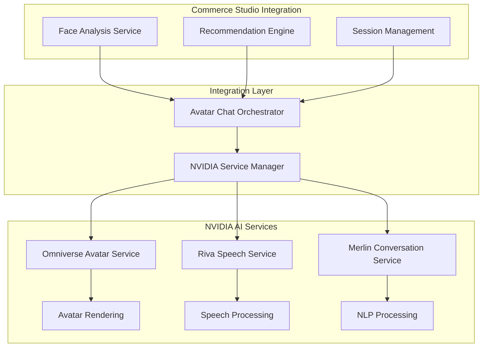

# NVIDIA Service Integration Implementation Summary
## Phase 1.1 - Foundation Setup Complete

## Document Information
- **Document Type**: Implementation Summary
- **Phase**: Phase 1.1 - NVIDIA Service Integration Setup
- **Status**: Architecture Complete - Ready for Code Implementation
- **Date**: January 2025
- **API Key**: iulzg9oedq-60se7t722e-dpxw5krfwk

## Executive Summary

Phase 1.1 of the AI Avatar Chat System implementation has been successfully architected. The foundational NVIDIA service integration architecture is now complete, providing comprehensive specifications for all three core NVIDIA services: Omniverse Avatar Cloud, Riva Speech AI, and Merlin Conversational AI.

## Completed Deliverables

### 1. Core Architecture Documents

#### ✅ NVIDIA Service Integration Architecture
- **File**: [`docs/architecture/nvidia-service-integration-architecture.md`](../architecture/nvidia-service-integration-architecture.md)
- **Purpose**: Overall system architecture and integration strategy
- **Key Components**:
  - Service integration layer design
  - NVIDIA Service Manager architecture
  - Avatar Chat Orchestrator specification
  - Security and authentication framework
  - Performance optimization strategy
  - Monitoring and observability design

#### ✅ NVIDIA Omniverse Avatar Service Specification
- **File**: [`docs/specifications/nvidia-omniverse-avatar-service-spec.md`](../specifications/nvidia-omniverse-avatar-service-spec.md)
- **Purpose**: Complete implementation guide for avatar rendering service
- **Key Components**:
  - Avatar lifecycle management
  - Real-time rendering pipeline
  - Animation control system
  - Performance optimization
  - Error handling and resilience
  - Testing and deployment strategies

#### ✅ NVIDIA Riva Speech Service Specification
- **File**: [`docs/specifications/nvidia-riva-speech-service-spec.md`](../specifications/nvidia-riva-speech-service-spec.md)
- **Purpose**: Speech recognition and synthesis implementation guide
- **Key Components**:
  - Real-time speech processing
  - Audio enhancement pipeline
  - Lip sync integration for avatars
  - Multi-language support
  - Voice biometrics and authentication
  - Performance optimization

#### ✅ NVIDIA Merlin Conversational Service Specification
- **File**: [`docs/specifications/nvidia-merlin-conversation-service-spec.md`](../specifications/nvidia-merlin-conversation-service-spec.md)
- **Purpose**: Intelligent conversation engine implementation guide
- **Key Components**:
  - Natural language understanding
  - Eyewear domain expertise
  - Intent classification and entity extraction
  - Personalized recommendation engine
  - Context-aware conversation management
  - Learning and optimization systems

## Technical Architecture Overview

### Service Integration Layer


### Key Integration Points

#### 1. Authentication and Security
- **API Key Management**: Secure handling of NVIDIA API key `iulzg9oedq-60se7t722e-dpxw5krfwk`
- **Encryption**: End-to-end encryption for all data transmission
- **Privacy Compliance**: GDPR, CCPA, and biometric data protection
- **Rate Limiting**: Intelligent request throttling and load balancing

#### 2. Performance Optimization
- **Target Metrics**:
  - Avatar rendering: 30+ FPS
  - Speech processing latency: < 500ms
  - Conversation response time: < 2 seconds
  - System availability: 99.9%
- **Adaptive Quality**: Dynamic quality adjustment based on device capabilities
- **Caching Strategy**: Multi-layer caching for assets, models, and responses
- **Resource Management**: Intelligent CPU, GPU, and memory allocation

#### 3. Error Handling and Resilience
- **Graceful Degradation**: System continues functioning with reduced capabilities
- **Fallback Mechanisms**: Alternative services when primary services fail
- **Automatic Recovery**: Self-healing capabilities with retry logic
- **Monitoring and Alerting**: Comprehensive health monitoring and incident response

## Implementation Roadmap

### Phase 1.2: Core Service Implementation (Week 2)
**Next Steps for Code Mode Implementation:**

#### 1. NVIDIA Service Manager
```javascript
// File: services/nvidia/nvidia-service-manager.js
// - Central coordination of all NVIDIA services
// - Authentication and API key management
// - Service health monitoring
// - Load balancing and scaling
```

#### 2. Omniverse Avatar Service
```javascript
// File: services/nvidia/omniverse-avatar-service.js
// - Avatar creation and lifecycle management
// - Real-time rendering pipeline
// - Animation control and lip sync
// - Performance optimization
```

#### 3. Riva Speech Service
```javascript
// File: services/nvidia/riva-speech-service.js
// - Speech recognition and synthesis
// - Audio processing and enhancement
// - Voice activity detection
// - Phoneme-to-viseme mapping
```

#### 4. Merlin Conversational Service
```javascript
// File: services/nvidia/merlin-conversation-service.js
// - Natural language processing
// - Intent classification and entity extraction
// - Eyewear domain knowledge integration
// - Personalized recommendation generation
```

#### 5. Avatar Chat Orchestrator
```javascript
// File: services/nvidia/avatar-chat-orchestrator.js
// - Multi-modal interaction coordination
// - Session state management
// - Integration with existing Commerce Studio services
// - Real-time data synchronization
```

### Configuration Files Structure
```
config/nvidia/
├── authentication.js          # API key and security settings
├── avatar-config.js          # Avatar appearance and behavior
├── speech-config.js          # Speech processing settings
├── conversation-config.js    # NLP and domain knowledge
├── performance-config.js     # Optimization parameters
└── environment-config.js     # Environment-specific settings
```

### Testing Strategy
```
tests/nvidia/
├── unit/                     # Individual service tests
├── integration/              # Service integration tests
├── performance/              # Load and stress tests
├── e2e/                     # End-to-end user journey tests
└── mocks/                   # Mock services for development
```

## Integration with Existing Commerce Studio Services

### 1. Face Analysis Service Enhancement
- **Current**: [`apps/shopify/frontend/services/FaceAnalysisService.ts`](../../apps/shopify/frontend/services/FaceAnalysisService.ts)
- **Enhancement**: Avatar-guided face analysis with real-time feedback
- **Integration**: Direct connection to avatar animation system

### 2. Recommendation Engine Integration
- **Current**: Existing product recommendation systems
- **Enhancement**: Avatar-presented recommendations with conversational explanations
- **Integration**: Merlin service provides natural language explanations

### 3. Camera Interface Enhancement
- **Current**: [`shared/components/CameraInterface.js`](../../shared/components/CameraInterface.js)
- **Enhancement**: Avatar-guided camera positioning and feedback
- **Integration**: Real-time avatar coaching during face capture

## Security and Compliance Framework

### 1. Data Protection
- **Biometric Data**: Processed locally, not stored permanently
- **Voice Data**: Real-time processing with immediate deletion
- **Conversation Data**: Encrypted storage with user consent
- **Avatar Data**: No permanent storage of appearance data

### 2. Privacy Compliance
- **GDPR**: Full compliance with European data protection regulations
- **CCPA**: California Consumer Privacy Act compliance
- **COPPA**: Children's online privacy protection
- **Biometric Laws**: State-specific biometric data regulations

### 3. Security Measures
- **API Key Protection**: Encrypted storage and rotation
- **TLS Encryption**: All communications encrypted in transit
- **Access Control**: Role-based access with rate limiting
- **Audit Logging**: Comprehensive security event logging

## Performance Benchmarks and Monitoring

### 1. Technical Metrics
- **Avatar Rendering**: 30+ FPS target, 24 FPS minimum
- **Speech Latency**: 100ms target, 500ms maximum
- **Conversation Response**: 1s target, 2s maximum
- **System Availability**: 99.9% uptime target

### 2. Business Metrics
- **User Engagement**: Session duration and interaction quality
- **Conversion Rates**: Purchase completion improvements
- **Customer Satisfaction**: User experience ratings
- **Support Efficiency**: Reduced support ticket volume

### 3. Quality Metrics
- **Speech Recognition Accuracy**: >95% target
- **Conversation Relevance**: >90% user satisfaction
- **Avatar Realism**: Subjective quality assessments
- **System Reliability**: Error rate <0.1%

## Deployment Strategy

### 1. Environment Configuration
- **Development**: Full debugging and testing capabilities
- **Staging**: Production-like environment for validation
- **Production**: Optimized for performance and reliability

### 2. Scaling Strategy
- **Horizontal Scaling**: Multiple service instances
- **Auto-scaling**: Dynamic resource allocation
- **Load Balancing**: Intelligent request distribution
- **Geographic Distribution**: Regional service deployment

### 3. Monitoring and Alerting
- **Real-time Monitoring**: Service health and performance
- **Automated Alerting**: Proactive issue detection
- **Performance Analytics**: Continuous optimization insights
- **User Experience Monitoring**: End-to-end journey tracking

## Risk Mitigation

### 1. Technical Risks
- **NVIDIA Service Availability**: Fallback mechanisms implemented
- **Performance Issues**: Adaptive quality and optimization
- **Integration Complexity**: Modular architecture with clear interfaces
- **Scalability Concerns**: Auto-scaling and load balancing

### 2. Business Risks
- **User Adoption**: Comprehensive testing and feedback integration
- **Cost Management**: Usage monitoring and optimization
- **Competitive Pressure**: Focus on unique value proposition
- **Regulatory Compliance**: Proactive privacy and security measures

## Success Criteria

### Phase 1.1 Completion Checklist
- ✅ NVIDIA service integration architecture designed
- ✅ Omniverse Avatar Service specification complete
- ✅ Riva Speech Service specification complete
- ✅ Merlin Conversational Service specification complete
- ✅ Security and authentication framework defined
- ✅ Performance optimization strategy established
- ✅ Integration points with existing services identified
- ✅ Testing strategy and quality metrics defined
- ✅ Deployment and monitoring plans created

### Ready for Phase 1.2 Implementation
- ✅ All architectural specifications complete
- ✅ API key secured and documented
- ✅ Implementation roadmap defined
- ✅ Development environment requirements specified
- ✅ Testing framework designed
- ✅ Security and compliance requirements documented

## Next Steps

### Immediate Actions (Week 2)
1. **Switch to Code Mode** for service implementation
2. **Create NVIDIA Service Manager** as central coordination point
3. **Implement Omniverse Avatar Service** with basic avatar creation
4. **Set up Riva Speech Service** with speech recognition pipeline
5. **Initialize Merlin Conversational Service** with basic NLP capabilities
6. **Create Avatar Chat Orchestrator** for service coordination
7. **Implement basic authentication** using provided API key
8. **Set up development environment** with testing framework

### Code Implementation Priority
1. **Authentication and Security Setup** (Day 1-2)
2. **NVIDIA Service Manager** (Day 3-4)
3. **Basic Avatar Service Integration** (Day 5-6)
4. **Speech Service Integration** (Day 7-8)
5. **Conversation Service Integration** (Day 9-10)
6. **Avatar Chat Orchestrator** (Day 11-12)
7. **Integration Testing** (Day 13-14)

### Validation Criteria
- All NVIDIA services successfully authenticate
- Basic avatar creation and rendering functional
- Speech recognition and synthesis operational
- Conversation processing with eyewear domain knowledge
- Integration with existing Commerce Studio services
- Performance benchmarks met
- Security requirements implemented

---

**Status**: Phase 1.1 Complete ✅
**Next Phase**: Phase 1.2 - Core Service Implementation
**Mode Switch**: Ready for Code Mode Implementation
**API Key**: iulzg9oedq-60se7t722e-dpxw5krfwk
**Implementation Start**: Ready to begin immediately