# VARAi Commerce Studio - Infrastructure Overview

## Complete Infrastructure Architecture

This document contains both a detailed internal infrastructure diagram and a simplified public overview.

## Public Infrastructure Overview

This simplified diagram shows the high-level architecture suitable for external stakeholders and documentation.

```mermaid
graph TB
    subgraph "User Layer"
        Users[End Users]
        Merchants[Merchants & Retailers]
        Partners[Integration Partners]
    end

    subgraph "Global Load Balancing"
        CDN[Content Delivery Network]
        LoadBalancer[Global Load Balancer]
    end

    subgraph "US Region (us-central1)"
        subgraph "Frontend - US"
            WebAppUS[Web Application US]
            MobileAppUS[Mobile Apps US]
            CustomerPortalUS[Customer Portal US]
        end
        
        subgraph "Services - US"
            APIGatewayUS[API Gateway US]
            AuthServiceUS[Authentication US]
            CoreServicesUS[Core Business Services US]
            AIServicesUS[AI/ML Services US]
        end
        
        subgraph "Data - US"
            DatabaseUS[Primary Database US]
            CacheUS[Caching Layer US]
            FileStorageUS[File Storage US]
        end
    end

    subgraph "EU Region (europe-west1)"
        subgraph "Frontend - EU"
            WebAppEU[Web Application EU]
            MobileAppEU[Mobile Apps EU]
            CustomerPortalEU[Customer Portal EU]
        end
        
        subgraph "Services - EU"
            APIGatewayEU[API Gateway EU]
            AuthServiceEU[Authentication EU]
            CoreServicesEU[Core Business Services EU]
            AIServicesEU[AI/ML Services EU]
        end
        
        subgraph "Data - EU"
            DatabaseEU[Primary Database EU]
            CacheEU[Caching Layer EU]
            FileStorageEU[File Storage EU]
        end
    end

    subgraph "Third-Party Integrations"
        subgraph "E-commerce Platforms"
            Shopify[Shopify]
            Magento[Magento]
            WooCommerce[WooCommerce]
            BigCommerce[BigCommerce]
        end
        
        subgraph "Healthcare Systems"
            Epic[Epic EMR]
            Cerner[Cerner]
            Allscripts[Allscripts]
            NextGen[NextGen]
        end
        
        subgraph "External Services"
            PaymentGateways[Payment Processors]
            ShippingAPIs[Shipping Services]
            EmailServices[Email Services]
            SMSServices[SMS Services]
        end
    end

    subgraph "Shared AI Platform"
        SharedAI[AI/ML Platform]
        ModelRegistry[Model Registry]
    end

    subgraph "Global Infrastructure"
        Monitoring[Monitoring & Logging]
        Security[Security & Compliance]
        BackupRecovery[Backup & Recovery]
    end

    %% User Connections
    Users --> CDN
    Merchants --> CDN
    Partners --> CDN
    
    %% Load Balancing
    CDN --> LoadBalancer
    LoadBalancer --> WebAppUS
    LoadBalancer --> WebAppEU

    %% US Region Connections
    WebAppUS --> APIGatewayUS
    MobileAppUS --> APIGatewayUS
    CustomerPortalUS --> APIGatewayUS
    APIGatewayUS --> AuthServiceUS
    APIGatewayUS --> CoreServicesUS
    APIGatewayUS --> AIServicesUS
    CoreServicesUS --> DatabaseUS
    CoreServicesUS --> CacheUS
    AIServicesUS --> SharedAI

    %% EU Region Connections
    WebAppEU --> APIGatewayEU
    MobileAppEU --> APIGatewayEU
    CustomerPortalEU --> APIGatewayEU
    APIGatewayEU --> AuthServiceEU
    APIGatewayEU --> CoreServicesEU
    APIGatewayEU --> AIServicesEU
    CoreServicesEU --> DatabaseEU
    CoreServicesEU --> CacheEU
    AIServicesEU --> SharedAI

    %% Third-Party Integration Connections
    CoreServicesUS --> Shopify
    CoreServicesUS --> Magento
    CoreServicesUS --> Epic
    CoreServicesUS --> PaymentGateways
    CoreServicesEU --> Shopify
    CoreServicesEU --> Magento
    CoreServicesEU --> Epic
    CoreServicesEU --> PaymentGateways

    %% Infrastructure Connections
    APIGatewayUS --> Monitoring
    APIGatewayEU --> Monitoring
    DatabaseUS --> BackupRecovery
    DatabaseEU --> BackupRecovery
    AuthServiceUS --> Security
    AuthServiceEU --> Security

    %% Styling
    classDef user fill:#e3f2fd,stroke:#1976d2,stroke-width:2px
    classDef frontend fill:#f3e5f5,stroke:#7b1fa2,stroke-width:2px
    classDef api fill:#e8f5e8,stroke:#388e3c,stroke-width:2px
    classDef ai fill:#fff3e0,stroke:#f57c00,stroke-width:2px
    classDef integration fill:#fce4ec,stroke:#c2185b,stroke-width:2px
    classDef data fill:#f1f8e9,stroke:#689f38,stroke-width:2px
    classDef infra fill:#ffebee,stroke:#d32f2f,stroke-width:2px

    class Users,Merchants,Partners user
    class WebAppUS,WebAppEU,MobileAppUS,MobileAppEU,CustomerPortalUS,CustomerPortalEU frontend
    class APIGatewayUS,APIGatewayEU,AuthServiceUS,AuthServiceEU,CoreServicesUS,CoreServicesEU api
    class AIServicesUS,AIServicesEU,SharedAI,ModelRegistry ai
    class Shopify,Magento,WooCommerce,BigCommerce,Epic,Cerner,PaymentGateways,ShippingAPIs integration
    class DatabaseUS,DatabaseEU,CacheUS,CacheEU,FileStorageUS,FileStorageEU data
    class CDN,LoadBalancer,Monitoring,Security,BackupRecovery infra
```

## Detailed Internal Infrastructure Architecture

This comprehensive diagram shows the complete system architecture with all components and is intended for internal technical teams.

```mermaid
graph TB
    subgraph "External Users & Integrations"
        Users[End Users]
        Merchants[Merchants/Retailers]
        ShopifyStores[Shopify Stores]
        MagentoStores[Magento Stores]
        WooStores[WooCommerce Stores]
        PMSystems[PMS Systems]
    end

    subgraph "CDN & Load Balancing"
        CDN[Google Cloud CDN]
        GLB[Global Load Balancer]
        RegionRouter[Region-based Router]
    end

    subgraph "Multi-Region Deployment"
        subgraph "US Region (us-central1)"
            subgraph "Frontend Layer - US"
                ReactAppUS[React Frontend US]
                StaticSiteUS[Static Website US]
                CustomerPortalUS[Customer Portal US]
            end
            
            subgraph "API Gateway - US"
                APIGatewayUS[API Gateway US]
                AuthServiceUS[Auth Service US]
            end
            
            subgraph "Core Services - US"
                UserMgmtUS[User Management US]
                TenantMgmtUS[Tenant Management US]
                NotificationUS[Notification Service US]
                AnalyticsUS[Analytics Engine US]
                ReportingUS[Reporting Service US]
            end
            
            subgraph "Business Services - US"
                SKUGenieUS[SKU-Genie US]
                DataAdaptersUS[Data Source Adapters US]
                QualityEngineUS[Quality Engine US]
                SyncEngineUS[Sync Engine US]
            end
            
            subgraph "AI/ML Services - US"
                RecommendationUS[Recommendation Engine US]
                FaceAnalysisUS[Face Shape Analysis US]
                VirtualTryOnUS[Virtual Try-On US]
                ProductEnhancementUS[Product Enhancement US]
                TrendPredictionUS[Trend Prediction US]
            end
        end

        subgraph "EU Region (europe-west1)"
            subgraph "Frontend Layer - EU"
                ReactAppEU[React Frontend EU]
                StaticSiteEU[Static Website EU]
                CustomerPortalEU[Customer Portal EU]
            end
            
            subgraph "API Gateway - EU"
                APIGatewayEU[API Gateway EU]
                AuthServiceEU[Auth Service EU]
            end
            
            subgraph "Core Services - EU"
                UserMgmtEU[User Management EU]
                TenantMgmtEU[Tenant Management EU]
                NotificationEU[Notification Service EU]
                AnalyticsEU[Analytics Engine EU]
                ReportingEU[Reporting Service EU]
            end
            
            subgraph "Business Services - EU"
                SKUGenieEU[SKU-Genie EU]
                DataAdaptersEU[Data Source Adapters EU]
                QualityEngineEU[Quality Engine EU]
                SyncEngineEU[Sync Engine EU]
            end
            
            subgraph "AI/ML Services - EU"
                RecommendationEU[Recommendation Engine EU]
                FaceAnalysisEU[Face Shape Analysis EU]
                VirtualTryOnEU[Virtual Try-On EU]
                ProductEnhancementEU[Product Enhancement EU]
                TrendPredictionEU[Trend Prediction EU]
            end
        end
    end

    subgraph "Shared AI Services (Multi-Region)"
        VertexAI[Google Vertex AI]
        ModelRegistry[ML Model Registry]
        AITraining[Model Training Pipeline]
    end

    subgraph "Data Storage Layer"
        subgraph "Primary Databases"
            MongoDBUS[(MongoDB Atlas US)]
            MongoDBEU[(MongoDB Atlas EU)]
            RedisUS[(Redis Cache US)]
            RedisEU[(Redis Cache EU)]
        end
        
        subgraph "Object Storage"
            CloudStorageUS[Cloud Storage US]
            CloudStorageEU[Cloud Storage EU]
            ImageCDN[Image CDN]
        end
        
        subgraph "Data Pipeline"
            DataValidation[Data Validation Service]
            ETLPipeline[ETL Pipeline]
            DataSync[Cross-Region Sync]
        end
    end

    subgraph "Integration Layer"
        subgraph "E-commerce Connectors"
            ShopifyConnector[Shopify Connector]
            MagentoConnector[Magento Connector]
            WooConnector[WooCommerce Connector]
            BigCommerceConnector[BigCommerce Connector]
        end
        
        subgraph "PMS Integrations"
            EpicConnector[Epic Integration]
            CernerConnector[Cerner Integration]
            AllscriptsConnector[Allscripts Integration]
            NextGenConnector[NextGen Integration]
        end
        
        subgraph "External APIs"
            PaymentGateways[Payment Gateways]
            ShippingAPIs[Shipping APIs]
            EmailServices[Email Services]
            SMSServices[SMS Services]
        end
    end

    subgraph "Infrastructure & DevOps"
        subgraph "Container Orchestration"
            GKEClusterUS[GKE Cluster US]
            GKEClusterEU[GKE Cluster EU]
            ArgoCD[ArgoCD GitOps]
        end
        
        subgraph "CI/CD Pipeline"
            GitHubActions[GitHub Actions]
            CloudBuild[Google Cloud Build]
            ContainerRegistry[Container Registry]
            HelmCharts[Helm Charts]
        end
        
        subgraph "Monitoring & Observability"
            CloudMonitoring[Cloud Monitoring]
            CloudLogging[Cloud Logging]
            Prometheus[Prometheus]
            Grafana[Grafana Dashboards]
            AlertManager[Alert Manager]
            UptimeChecks[Uptime Monitoring]
        end
        
        subgraph "Security & Compliance"
            SecretManagerUS[Secret Manager US]
            SecretManagerEU[Secret Manager EU]
            IAM[Identity & Access Management]
            VPC[Virtual Private Cloud]
            Firewall[Cloud Firewall]
            ComplianceDashboard[Compliance Dashboard]
        end
        
        subgraph "Backup & Recovery"
            BackupService[Automated Backups]
            DisasterRecovery[Disaster Recovery]
            CrossRegionReplication[Cross-Region Replication]
        end
    end

    %% User Connections
    Users --> CDN
    Merchants --> CDN
    ShopifyStores --> ShopifyConnector
    MagentoStores --> MagentoConnector
    WooStores --> WooConnector
    PMSystems --> EpicConnector
    PMSystems --> CernerConnector

    %% CDN & Load Balancing
    CDN --> GLB
    GLB --> RegionRouter
    RegionRouter --> ReactAppUS
    RegionRouter --> ReactAppEU

    %% US Region Connections
    ReactAppUS --> APIGatewayUS
    StaticSiteUS --> APIGatewayUS
    CustomerPortalUS --> APIGatewayUS
    APIGatewayUS --> AuthServiceUS
    APIGatewayUS --> UserMgmtUS
    APIGatewayUS --> SKUGenieUS
    APIGatewayUS --> RecommendationUS
    
    SKUGenieUS --> DataAdaptersUS
    SKUGenieUS --> QualityEngineUS
    SKUGenieUS --> MongoDBUS
    SKUGenieUS --> RedisUS
    
    RecommendationUS --> VertexAI
    FaceAnalysisUS --> VertexAI
    VirtualTryOnUS --> VertexAI

    %% EU Region Connections
    ReactAppEU --> APIGatewayEU
    StaticSiteEU --> APIGatewayEU
    CustomerPortalEU --> APIGatewayEU
    APIGatewayEU --> AuthServiceEU
    APIGatewayEU --> UserMgmtEU
    APIGatewayEU --> SKUGenieEU
    APIGatewayEU --> RecommendationEU
    
    SKUGenieEU --> DataAdaptersEU
    SKUGenieEU --> QualityEngineEU
    SKUGenieEU --> MongoDBEU
    SKUGenieEU --> RedisEU
    
    RecommendationEU --> VertexAI
    FaceAnalysisEU --> VertexAI
    VirtualTryOnEU --> VertexAI

    %% Data Layer Connections
    MongoDBUS -.-> DataSync
    MongoDBEU -.-> DataSync
    DataSync --> CrossRegionReplication
    
    %% Integration Connections
    DataAdaptersUS --> ShopifyConnector
    DataAdaptersUS --> MagentoConnector
    DataAdaptersEU --> ShopifyConnector
    DataAdaptersEU --> MagentoConnector

    %% Infrastructure Connections
    GKEClusterUS --> CloudMonitoring
    GKEClusterEU --> CloudMonitoring
    CloudMonitoring --> Grafana
    CloudLogging --> Prometheus
    
    GitHubActions --> CloudBuild
    CloudBuild --> ContainerRegistry
    ArgoCD --> GKEClusterUS
    ArgoCD --> GKEClusterEU

    %% Security Connections
    AuthServiceUS --> SecretManagerUS
    AuthServiceEU --> SecretManagerEU
    IAM --> VPC
    VPC --> Firewall

    %% Styling
    classDef frontend fill:#e1f5fe,stroke:#01579b,stroke-width:2px
    classDef api fill:#f3e5f5,stroke:#4a148c,stroke-width:2px
    classDef service fill:#e8f5e8,stroke:#1b5e20,stroke-width:2px
    classDef data fill:#fff3e0,stroke:#e65100,stroke-width:2px
    classDef ai fill:#fce4ec,stroke:#880e4f,stroke-width:2px
    classDef infra fill:#f1f8e9,stroke:#33691e,stroke-width:2px
    classDef security fill:#ffebee,stroke:#b71c1c,stroke-width:2px

    class ReactAppUS,ReactAppEU,StaticSiteUS,StaticSiteEU,CustomerPortalUS,CustomerPortalEU frontend
    class APIGatewayUS,APIGatewayEU,AuthServiceUS,AuthServiceEU api
    class UserMgmtUS,UserMgmtEU,TenantMgmtUS,TenantMgmtEU,SKUGenieUS,SKUGenieEU service
    class MongoDBUS,MongoDBEU,RedisUS,RedisEU,CloudStorageUS,CloudStorageEU data
    class VertexAI,RecommendationUS,RecommendationEU,FaceAnalysisUS,FaceAnalysisEU ai
    class GKEClusterUS,GKEClusterEU,CloudMonitoring,CloudLogging infra
    class SecretManagerUS,SecretManagerEU,IAM,VPC,Firewall security
```

## Diagram Usage Guidelines

### Public Infrastructure Overview
- **Intended Audience**: External stakeholders, partners, investors, public documentation
- **Content**: High-level architecture without sensitive implementation details
- **Use Cases**:
  - Marketing materials and presentations
  - Partner integration discussions
  - Public documentation and blog posts
  - Investor presentations
  - General system overview for non-technical stakeholders

### Detailed Internal Infrastructure Architecture
- **Intended Audience**: Internal development teams, DevOps engineers, system architects
- **Content**: Complete technical implementation with all components and connections
- **Use Cases**:
  - Technical planning and architecture decisions
  - DevOps and deployment planning
  - Security reviews and compliance audits
  - Troubleshooting and system maintenance
  - Onboarding new technical team members

### Key Differences
| Aspect | Public Diagram | Internal Diagram |
|--------|----------------|------------------|
| **Detail Level** | High-level components | Specific services and technologies |
| **Regional Info** | Generic "Cloud Infrastructure" | Specific US/EU regions with compliance details |
| **Security Details** | Generic "Security & Compliance" | Specific secret management, IAM, VPC details |
| **Technology Stack** | Generic service categories | Specific technologies (MongoDB, Redis, GKE, etc.) |
| **Integration Details** | General "E-commerce Integrations" | Specific connectors (Shopify, Magento, etc.) |
| **Deployment Info** | Abstract infrastructure layer | Detailed CI/CD, monitoring, and deployment specifics |

## Infrastructure Components Overview

### Frontend Layer
- **React Applications**: Modern SPA built with React and TypeScript
- **Static Websites**: Marketing and customer-facing pages
- **Customer Portals**: Self-service interfaces for merchants

### API Gateway & Authentication
- **Multi-region API Gateways**: Handle routing, rate limiting, and request validation
- **Authentication Services**: JWT-based auth with multi-tenant support
- **Load Balancing**: Global and regional load distribution

### Core Business Services
- **SKU-Genie**: Product data management and quality assurance
- **User & Tenant Management**: Multi-tenant user administration
- **Analytics & Reporting**: Business intelligence and insights

### AI/ML Services
- **Recommendation Engine**: Personalized product recommendations
- **Face Shape Analysis**: Computer vision for facial feature detection
- **Virtual Try-On**: AR/VR integration for product visualization
- **Vertex AI Integration**: Google Cloud AI/ML platform

### Data Storage
- **MongoDB Atlas**: Primary database with multi-region deployment
- **Redis Cache**: High-performance caching layer
- **Cloud Storage**: Object storage for images and assets
- **Cross-region Replication**: Data consistency and disaster recovery

### Integration Layer
- **E-commerce Connectors**: Shopify, Magento, WooCommerce, BigCommerce
- **PMS Integrations**: Healthcare practice management systems
- **External APIs**: Payment, shipping, communication services

### Infrastructure & DevOps
- **Google Kubernetes Engine**: Container orchestration
- **GitOps with ArgoCD**: Automated deployment and configuration management
- **CI/CD Pipeline**: GitHub Actions and Cloud Build
- **Monitoring**: Comprehensive observability with Prometheus, Grafana, and Cloud Monitoring

### Security & Compliance
- **Multi-region Secret Management**: Secure credential storage
- **Identity & Access Management**: Fine-grained permissions
- **Network Security**: VPC, firewalls, and network policies
- **Compliance Dashboard**: Regulatory compliance monitoring

## Deployment Patterns

### Development Environment
- Local development with Docker Compose
- Feature branch deployments to staging
- Automated testing and quality gates

### Staging Environment
- Production-like environment for integration testing
- Performance testing and load validation
- Security scanning and compliance checks

### Production Environment
- Multi-region active-active deployment
- Auto-scaling based on demand
- Zero-downtime deployments with blue-green strategy

## Key Features

1. **Multi-Region Architecture**: US and EU regions for data residency compliance
2. **Microservices Design**: Loosely coupled, independently deployable services
3. **Cloud-Native**: Built for Google Cloud Platform with managed services
4. **AI-First**: Integrated machine learning and AI capabilities
5. **Scalable**: Auto-scaling infrastructure to handle varying loads
6. **Secure**: Enterprise-grade security with compliance monitoring
7. **Observable**: Comprehensive monitoring, logging, and alerting
8. **Resilient**: Disaster recovery and cross-region replication

## Technology Stack

- **Frontend**: React, TypeScript, Material-UI
- **Backend**: Node.js, Python, FastAPI
- **Database**: MongoDB Atlas, Redis
- **AI/ML**: Google Vertex AI, TensorFlow
- **Infrastructure**: Google Cloud Platform, Kubernetes
- **CI/CD**: GitHub Actions, ArgoCD, Helm
- **Monitoring**: Prometheus, Grafana, Cloud Monitoring