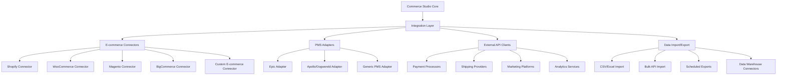

# VARAi Commerce Studio Integration Capabilities

## Overview

VARAi Commerce Studio provides comprehensive integration capabilities that allow it to connect seamlessly with various e-commerce platforms, practice management systems, and other third-party services. This document details the integration architecture, supported platforms, and implementation guidelines.

## Integration Architecture

## E-commerce Platform Integrations

### 1. Shopify Integration

The Shopify integration is one of the most comprehensive connectors in the Commerce Studio platform, providing deep integration with the Shopify e-commerce ecosystem.

#### Features

- **Product Synchronization**: Bidirectional sync of products, variants, collections, and metadata
- **Inventory Management**: Real-time inventory updates across channels
- **Order Processing**: Synchronization of orders, fulfillments, and refunds
- **Customer Data**: Customer profiles and purchase history synchronization
- **AI Enhancement**: Push AI-enhanced product data to Shopify
- **Analytics Integration**: Incorporate Shopify sales data into Commerce Studio analytics

#### Technical Implementation

- **Authentication**: OAuth 2.0 flow for secure authentication
- **API Usage**: Shopify Admin API for data operations
- **Webhooks**: Real-time event notifications for changes in either system
- **Rate Limiting**: Intelligent throttling to respect Shopify's API limits
- **Conflict Resolution**: Smart handling of concurrent changes
- **Error Handling**: Robust error recovery and retry mechanisms

#### Installation Process

1. Install the Commerce Studio app from the Shopify App Store
2. Authorize the app with appropriate permissions
3. Configure synchronization settings in Commerce Studio
4. Perform initial data import
5. Set up ongoing synchronization schedule

#### Data Mapping

| Shopify Entity | Commerce Studio Entity | Sync Direction | Notes |
|----------------|------------------------|----------------|-------|
| Product        | Product                | Bidirectional  | Includes metadata, images, and variants |
| Collection     | Category               | Bidirectional  | Includes rules and manual collections |
| Customer       | Customer               | Bidirectional  | Includes contact info and preferences |
| Order          | Order                  | Shopify → CS   | Includes line items and fulfillment status |
| Inventory      | Inventory              | Bidirectional  | Real-time updates |
| Price          | Price                  | Bidirectional  | Includes special pricing and sales |

### 2. WooCommerce Integration

The WooCommerce integration connects Commerce Studio with WordPress-based WooCommerce stores.

#### Features

- **WordPress Plugin**: Dedicated plugin for easy installation
- **Product Synchronization**: Sync products, variations, and categories
- **WooCommerce Attributes**: Map to Commerce Studio attributes
- **Media Synchronization**: Product images and galleries
- **Order Management**: Order status updates and history

#### Technical Implementation

- **Authentication**: REST API keys with secure storage
- **WordPress Hooks**: Integration with WordPress action/filter system
- **Background Processing**: Asynchronous processing for large datasets
- **Conflict Detection**: Timestamp-based change detection

### 3. Magento Integration

The Magento integration connects Commerce Studio with Magento 2.x e-commerce platforms.

#### Features

- **Magento Extension**: Marketplace extension for easy installation
- **Catalog Synchronization**: Products, categories, and attributes
- **Multi-store Support**: Handle multiple store views
- **EAV Compatibility**: Map Magento's EAV model to Commerce Studio
- **Scheduled Synchronization**: Configurable sync schedules

#### Technical Implementation

- **Authentication**: API integration tokens
- **Magento API**: REST and GraphQL API usage
- **Queue System**: Integration with Magento's queue system
- **Indexer Awareness**: Coordination with Magento indexers

### 4. BigCommerce Integration

The BigCommerce integration connects Commerce Studio with BigCommerce stores.

#### Features

- **BigCommerce App**: Listed in the BigCommerce App Marketplace
- **Catalog Management**: Products, categories, and brands
- **Channel Integration**: Support for BigCommerce multi-channel
- **Headless Support**: Compatible with headless BigCommerce implementations

#### Technical Implementation

- **Authentication**: OAuth and API tokens
- **Webhooks**: Event-driven updates
- **V3 API**: Latest BigCommerce API support
- **GraphQL**: Support for BigCommerce GraphQL API

### 5. Custom E-commerce Integration

For custom e-commerce platforms, Commerce Studio provides a flexible integration framework.

#### Features

- **REST API**: Comprehensive API for custom integration
- **Webhook System**: Event notifications for real-time updates
- **Bulk Operations**: Efficient handling of large datasets
- **SDK Libraries**: Client libraries for common languages

#### Technical Implementation

- **Authentication**: OAuth 2.0 or API key options
- **Documentation**: Swagger/OpenAPI documentation
- **Sandbox Environment**: Testing environment for integration development

## Practice Management System (PMS) Integrations

### 1. Epic Integration

The Epic integration connects Commerce Studio with healthcare systems using Epic.

#### Features

- **Patient Data Integration**: Secure access to patient records
- **Prescription Data**: Optical prescription synchronization
- **Appointment Scheduling**: Coordinate with appointment systems
- **Billing Integration**: Connect with Epic billing modules

#### Technical Implementation

- **FHIR Compatibility**: Support for healthcare data standards
- **HIPAA Compliance**: Secure handling of protected health information
- **Epic App Orchard**: Listed in Epic's app marketplace
- **Secure Authentication**: OAuth and SMART on FHIR

### 2. Apollo/Oogwereld Integration

The Apollo/Oogwereld integration connects Commerce Studio with European optical retail systems.

#### Features

- **Multi-language Support**: Support for Dutch and other European languages
- **European Regulations**: Compliance with EU regulations
- **Prescription Format**: European notation support
- **Inventory Synchronization**: Real-time stock updates

#### Technical Implementation

- **GDPR Compliance**: European data protection measures
- **API Integration**: REST API connectivity
- **Data Transformation**: Convert between US and European formats

### 3. Generic PMS Adapter

The Generic PMS Adapter provides a flexible framework for integrating with various practice management systems.

#### Features

- **Configurable Mapping**: Customizable field mapping
- **Template System**: Integration templates for common systems
- **Transformation Rules**: Data transformation capabilities
- **Validation Logic**: Ensure data integrity

#### Technical Implementation

- **Adapter Pattern**: Flexible adapter architecture
- **Plugin System**: Extensible plugin framework
- **Configuration UI**: User-friendly mapping interface

## External API Integrations

### 1. Payment Processors

Integration with various payment processing systems.

- **Stripe**: For credit card processing
- **PayPal**: For PayPal payments
- **Apple Pay/Google Pay**: For mobile payments
- **Local Payment Methods**: Region-specific payment options

### 2. Shipping Providers

Integration with shipping and fulfillment services.

- **ShipStation**: For order fulfillment
- **FedEx/UPS/DHL**: For shipping rate calculation
- **EasyPost**: For shipping label generation
- **Local Carriers**: Region-specific shipping options

### 3. Marketing Platforms

Integration with marketing and customer engagement platforms.

- **Mailchimp**: For email marketing
- **Klaviyo**: For marketing automation
- **Facebook/Instagram**: For social media integration
- **Google Analytics**: For web analytics

### 4. Analytics Services

Integration with analytics and business intelligence platforms.

- **Google Analytics**: For web analytics
- **Segment**: For customer data platform
- **Mixpanel**: For product analytics
- **Tableau/Power BI**: For business intelligence

## Data Import/Export Capabilities

### 1. CSV/Excel Import

Flexible import capabilities for spreadsheet data.

- **Template System**: Predefined templates for common formats
- **Mapping Interface**: User-friendly column mapping
- **Validation Rules**: Data validation during import
- **Error Handling**: Detailed error reporting and correction

### 2. Bulk API Import

API-based bulk import capabilities for large datasets.

- **Chunked Processing**: Efficient handling of large datasets
- **Asynchronous Processing**: Background processing with status updates
- **Idempotent Operations**: Safe retry mechanisms
- **Validation**: Pre-validation before processing

### 3. Scheduled Exports

Automated export capabilities for data synchronization.

- **Configurable Schedules**: Flexible scheduling options
- **Multiple Formats**: CSV, JSON, XML, and custom formats
- **Delivery Options**: FTP, SFTP, S3, email, and webhook delivery
- **Filtering Options**: Export specific data subsets

### 4. Data Warehouse Connectors

Integration with data warehouse and business intelligence systems.

- **Snowflake Connector**: For Snowflake data warehouse
- **BigQuery Connector**: For Google BigQuery
- **Redshift Connector**: For Amazon Redshift
- **Custom ETL**: Flexible ETL pipeline options

## Integration Security

### 1. Authentication Methods

- **OAuth 2.0**: Industry-standard authorization framework
- **API Keys**: Simple key-based authentication
- **JWT**: JSON Web Tokens for stateless authentication
- **HMAC Signatures**: Request signing for enhanced security

### 2. Data Protection

- **TLS Encryption**: Secure data transmission
- **Field-level Encryption**: Extra protection for sensitive data
- **Data Masking**: Protection of sensitive information in logs
- **Minimal Access**: Principle of least privilege for integrations

### 3. Compliance Features

- **Audit Logging**: Comprehensive logging of integration activities
- **Data Residency**: Controls for data location requirements
- **Retention Policies**: Configurable data retention settings
- **Consent Management**: Tracking of user consent for data sharing

## Integration Development

### 1. Developer Resources

- **Developer Portal**: Comprehensive documentation and resources
- **API Reference**: Detailed API documentation with examples
- **SDKs**: Client libraries for common programming languages
- **Postman Collection**: Ready-to-use API request collections

### 2. Testing and Validation

- **Sandbox Environment**: Testing environment for integration development
- **Test Accounts**: Sample accounts with test data
- **Validation Tools**: Tools to validate integration correctness
- **Performance Testing**: Tools to test integration performance

### 3. Deployment and Monitoring

- **Versioning**: Clear API versioning policy
- **Deprecation Process**: Structured process for API changes
- **Monitoring Tools**: Integration health monitoring
- **Support Channels**: Developer support options

## Best Practices

### 1. Integration Design

- **Start Small**: Begin with core functionality and expand
- **Use Webhooks**: Implement event-driven architecture where possible
- **Handle Errors**: Implement robust error handling and retry logic
- **Consider Volume**: Plan for data volume and rate limits
- **Test Thoroughly**: Comprehensive testing in sandbox environment

### 2. Data Synchronization

- **Establish Master**: Determine system of record for each data type
- **Conflict Resolution**: Define clear conflict resolution rules
- **Batch Operations**: Use batch operations for efficiency
- **Incremental Sync**: Implement delta synchronization where possible
- **Validation**: Validate data before synchronization

### 3. Maintenance and Monitoring

- **Monitor Health**: Implement health checks and alerts
- **Track Usage**: Monitor API usage and performance
- **Stay Updated**: Keep up with API changes and deprecations
- **Regular Testing**: Periodically test integration functionality
- **Documentation**: Maintain internal documentation of integration details

## Case Studies

### 1. Multi-location Optical Retailer

A large optical retail chain with 50+ locations integrated Commerce Studio with their existing Epic PMS and Shopify e-commerce platform.

**Integration Points**:
- Epic PMS for patient records and prescriptions
- Shopify for online store
- In-store POS systems
- Inventory management system

**Results**:
- 40% reduction in product data management time
- 25% increase in online conversion rate with AI-enhanced product data
- Seamless customer experience across online and in-store channels

### 2. Independent Eyewear Brand

An independent eyewear brand integrated Commerce Studio with their WooCommerce store and wholesale distribution system.

**Integration Points**:
- WooCommerce for direct-to-consumer sales
- Wholesale ordering portal
- Manufacturing partner systems
- Social media platforms for marketing

**Results**:
- 60% faster new product launches
- 35% increase in wholesale order value
- Consistent product information across all channels

## Roadmap

### 1. Upcoming Integrations

- **Salesforce Commerce Cloud**: Integration with SFCC
- **Adobe Commerce**: Enhanced Magento integration
- **Shopify Markets**: International selling features
- **Additional PMS Systems**: Expanding PMS integration options

### 2. API Enhancements

- **GraphQL Expansion**: More comprehensive GraphQL API
- **Bulk Operations**: Enhanced bulk operation capabilities
- **Real-time Capabilities**: WebSocket API for real-time updates
- **Developer Experience**: Improved developer tools and documentation

### 3. Integration Platform

- **Integration Marketplace**: Self-service integration discovery
- **No-code Integration Builder**: Visual integration configuration
- **Integration Templates**: Pre-built integration templates
- **Integration Analytics**: Performance metrics for integrations