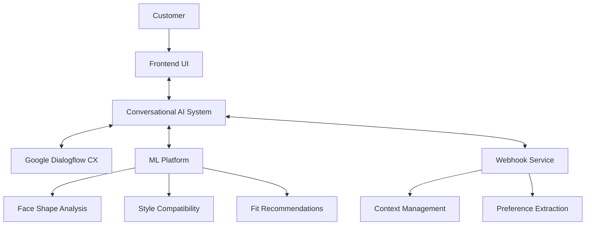

# Conversational AI Integration Plan

## Overview
This document outlines the plan for integrating the EyewearML Conversational AI platform with the main EyewearML platform, focusing on the ML platform integration for a local machine demo.

## Current State Assessment
- Conversational AI system built on Google Dialogflow CX
- Three defined conversation flows: Style Recommendation, Frame Finder, Fit Consultation
- Frontend components: Chat.js, ProductCard.js
- Dialogflow client utilities for backend communication
- Analytics event tracking

## Integration Goals
1. Connect the conversational AI to the ML platform for advanced eyewear recommendations
2. Ensure seamless data flow between systems
3. Create cohesive user experience
4. Deliver a functional local demo

## Architecture

## ML Platform Integration Details

### 1. Core API Connection
- Create ML client library (`src/ml/ml_client.js`)
- Implement model registry access for discovering available ML models
- Develop standardized interfaces for model inference
- Set up error handling and fallback mechanisms

### 2. Face Analysis Integration
- Connect conversation flows to facial analysis models
- Map facial characteristics to frame recommendations
- Develop conversation hooks to trigger analysis at appropriate points
- Create preference extraction from visual features

### 3. Style Compatibility 
- Integrate style recommendation models
- Create bidirectional mapping between conversation terms and style attributes
- Implement relevance scoring for recommendations
- Enhance existing style flow with ML-powered insights

### 4. Webhook Service Enhancements
- Extend handlers for ML integration (`src/webhook/handlers/ml_handlers.js`)
- Implement model inference pipeline
- Create feedback loop for model performance improvement
- Ensure graceful degradation if ML services are unavailable

### 5. Frontend Updates
- Enhance Chat component to display ML-powered recommendations
- Update ProductCard to include ML-derived insights
- Add visual feedback for ML processing
- Implement consistent styling across components

## Implementation Plan

### Week 1: Foundation
- Define API contracts between conversational AI and ML platform
- Create ML client library with basic connectivity
- Set up local development environment for testing
- Implement data models and transformations

### Week 2: Core ML Integration
- Implement model registry access
- Connect basic ML inference to conversation flows
- Create initial face analysis integration
- Develop preliminary style recommendation enhancements

### Week 3: Enhanced Features
- Implement advanced recommendations with ML
- Create rich product presentations with ML insights
- Enhance conversation flows with ML touchpoints
- Add conversation recovery patterns for ML failures

### Week 4: Testing and Demo Preparation
- Test end-to-end user journeys
- Optimize performance for local demo
- Create comprehensive demo script
- Prepare sample data and scenarios

## Local Demo Setup
- Configure environment for local ML model access
- Set up mock catalog data for testing
- Create sample user profiles and preferences
- Implement logging for demonstration purposes

## Testing Strategy
1. **Component Testing**
   - Test ML client library functions
   - Validate conversation flow integration points
   - Verify webhook handlers for ML operations

2. **Integration Testing**
   - Test end-to-end flows with ML components
   - Verify data consistency across system boundaries
   - Test error handling and recovery mechanisms

3. **User Journey Testing**
   - Test complete user scenarios with ML integration
   - Validate experience quality and performance
   - Ensure consistent context across touchpoints

## Metrics and Monitoring
- Response time for ML-enhanced recommendations
- Accuracy of style and fit suggestions
- Conversation completion rates
- Error rates for ML operations
- User satisfaction with recommendations

## Next Steps
1. Review ML platform API documentation
2. Set up development environment for local testing
3. Begin implementation of ML client library
4. Define test scenarios for demo
