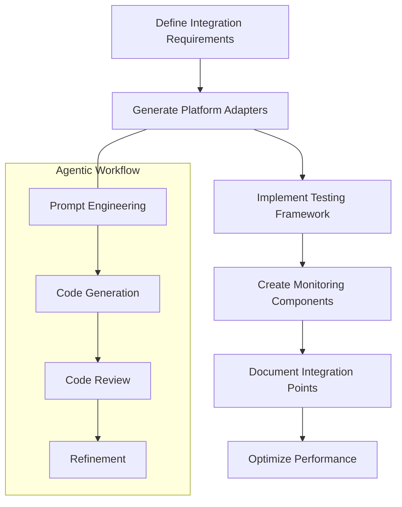

# Agentic Development Approach for E-commerce Integrations

This document outlines how to apply agentic development principles to the Eyewear ML e-commerce integration components. It serves as a companion to the [E-commerce Integration User Journeys and Testing](./ecommerce-integration-user-journeys-and-testing.md) documentation.

## Overview

Eyewear ML uses an agentic development approach for e-commerce integrations, leveraging AI assistants to accelerate development, ensure consistency, and maintain high quality across multiple platform integrations.



## Agentic Prompts for E-commerce Integration

### 1. Platform Adapter Generation

Use these prompt templates to generate platform-specific adapters:

```
# Platform Adapter Generation Prompt

## Context
We are implementing a new adapter for {PLATFORM_NAME} integration with the Eyewear ML system. 
The adapter needs to handle product synchronization, order management, and customer data.

## Current Architecture
Our existing adapters follow this pattern:
```typescript
class PlatformAdapter {
  constructor(config: PlatformConfig) { ... }
  async connect(): Promise<ConnectionStatus> { ... }
  async syncProducts(products: Product[]): Promise<SyncResult> { ... }
  async processOrders(): Promise<OrderResult[]> { ... }
  async handleWebhooks(payload: any): Promise<WebhookResult> { ... }
}
```

## Requirements
- Implement the adapter for {PLATFORM_NAME} following our existing patterns
- Handle {PLATFORM_NAME}'s specific authentication requirements
- Map our product model to {PLATFORM_NAME}'s data model
- Implement proper error handling and retry logic
- Include logging for all operations
- Ensure GDPR compliance for all customer data

## API Documentation
{PLATFORM_API_DOCS}

## Expected Output
Please provide a complete implementation of the {PLATFORM_NAME}Adapter class.
```

### 2. Integration Testing Prompt

```
# Integration Test Generation Prompt

## Context
We need to create end-to-end tests for the {PLATFORM_NAME} integration with Eyewear ML.

## Test Requirements
- Test the complete merchant journey from signup to integration
- Verify synchronization of products between systems
- Test order flow from creation to fulfillment
- Validate webhook handling for inventory updates
- Test error scenarios and recovery

## Existing Test Pattern
```typescript
describe('{PLATFORM_NAME} Integration', () => {
  beforeEach(() => {
    // Setup test environment
  });
  
  it('should authenticate with {PLATFORM_NAME}', async () => {
    // Test authentication flow
  });
  
  it('should sync products to {PLATFORM_NAME}', async () => {
    // Test product sync
  });
  
  // Additional test cases
});
```

## Expected Output
Please generate a complete test suite for the {PLATFORM_NAME} integration.
```

### 3. Dashboard Component Generation

```
# Monitoring Dashboard Component Prompt

## Context
We need to create a monitoring dashboard for merchants to track their {PLATFORM_NAME} integration status.

## Component Requirements
- Display current connection status
- Show recent sync history with timestamps
- Display error rates and common errors
- Visualize API response times
- Provide actionable alerts for issues

## Design System
We use Material UI with the following theme:
```typescript
const theme = {
  palette: {
    primary: {
      main: '#0071e3',
    },
    // Additional theme properties
  }
};
```

## Expected Output
Please provide a React component for the {PLATFORM_NAME} monitoring dashboard.
```

## Multi-Platform Consistency Guidelines

When developing for multiple e-commerce platforms, maintain these principles:

1. **Consistent Interface, Platform-Specific Implementation**
   - All platform adapters must implement the same interface
   - Platform-specific logic should be encapsulated within adapters
   - Common utilities should be shared across adapters

2. **Error Handling Standards**
   - Each platform should map its specific errors to our standardized error types
   - Error messages should follow a consistent format: `[Platform] Error message`
   - Retry logic should be configurable per platform but follow consistent patterns

3. **Authentication Patterns**
   - OAuth flows should use our standard OAuth component
   - API key management should use our secure key storage
   - Refresh token logic should be standardized across platforms

4. **Data Transformation**
   - Maintain a clear separation between platform-specific models and internal models
   - Use typed transformers for data conversion
   - Document field mappings explicitly

## Automated Quality Checks

Implement these automated checks for all platform integrations:

1. **API Contract Validation**
   - Generate OpenAPI specs for platform APIs
   - Validate requests and responses against specs
   - Automated tests for API contract compliance

2. **Performance Monitoring**
   - Track API response times per endpoint
   - Monitor sync durations and item counts
   - Alert on performance degradation

3. **Integration Health Checks**
   - Periodic authentication validation
   - Scheduled lightweight sync operations
   - Webhook delivery confirmation

## Example: Shopify Integration Workflow

This example demonstrates the agentic development workflow for Shopify integration:

1. **Requirement Gathering**
   - Document Shopify-specific requirements
   - Define integration scope and limitations
   - Identify Shopify API versions to support

2. **Prompt Engineering**
   - Create Shopify-specific prompts based on templates
   - Include Shopify API documentation excerpts
   - Specify Shopify-specific error handling

3. **Code Generation**
   - Generate ShopifyAdapter implementation
   - Create Shopify webhook handlers
   - Implement Shopify data transformers

4. **Review and Refinement**
   - Review generated code against best practices
   - Test with sandbox Shopify store
   - Refine implementation with additional prompts

5. **Testing**
   - Generate Shopify-specific tests
   - Implement mock Shopify API responses
   - Create Shopify webhook simulation

6. **Documentation**
   - Generate integration documentation
   - Document Shopify-specific configurations
   - Create merchant setup guides

## Agentic Development Best Practices

When applying the agentic approach to e-commerce integration development:

1. **Start with Platform Analysis**
   - Have AI agents analyze platform APIs and documentation
   - Generate platform comparison reports
   - Identify common patterns and differences

2. **Leverage Existing Patterns**
   - Provide AI with examples of successful integrations
   - Include architecture diagrams and design patterns
   - Share performance benchmarks

3. **Iterative Development**
   - Break integration into smaller, focused tasks
   - Provide feedback on generated code
   - Use AI to refine implementation based on feedback

4. **Testing Focus**
   - Generate comprehensive test cases
   - Create simulation environments for each platform
   - Develop platform-specific regression tests

5. **Documentation Generation**
   - Generate user-facing documentation
   - Create internal technical documentation
   - Maintain API references for each platform

## Performance Considerations

For optimal performance across integrations:

1. **Rate Limiting Management**
   - Document rate limits for each platform
   - Implement platform-specific throttling strategies
   - Create backoff and retry mechanisms

2. **Batch Processing**
   - Optimize batch sizes for each platform
   - Implement chunking strategies for large datasets
   - Support parallel processing where appropriate

3. **Caching Strategy**
   - Define TTLs for different data types
   - Implement platform-specific cache invalidation
   - Support distributed caching for multi-region deployments

## Security Considerations

For secure integrations:

1. **Authentication Security**
   - Use secure storage for API credentials
   - Implement token rotation
   - Audit authentication access

2. **Data Protection**
   - Encrypt sensitive merchant data
   - Implement proper data minimization
   - Document data handling procedures

3. **Webhook Verification**
   - Validate webhook signatures
   - Implement replay attack prevention
   - Log all webhook requests for auditing

## Measuring Integration Success

For each platform integration, track these metrics:

1. **Technical Metrics**
   - Sync success rate
   - API reliability (uptime, response time)
   - Error frequency by type

2. **Business Metrics**
   - Merchant activation rate
   - Daily active integrations
   - Revenue impact per integration

3. **User Experience Metrics**
   - Integration setup time
   - Support ticket volume
   - Merchant satisfaction scores

## Conclusion

The agentic development approach accelerates e-commerce integrations while maintaining high quality and consistency. By leveraging AI assistants for repetitive tasks and code generation, the development team can focus on platform-specific optimizations and business logic, resulting in faster delivery and more robust integrations.
