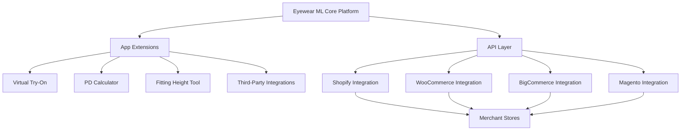

# E-commerce Integration User Journeys and Testing Strategy

This document outlines the user journeys and testing strategy for Eyewear ML's e-commerce integrations, focusing on the component-based architecture and how merchants interact with the platform.

## Component-Based Architecture Overview

Eyewear ML is designed as a modular platform with a plugin-like architecture, similar to WordPress plugins or the Apple App Store model. This design allows retailers to selectively integrate specific components based on their needs.

### Core Platform and Extension Model

1. **Core Platform**: 
   - Base functionality for eyewear management and ML capabilities
   - API infrastructure for third-party integration
   - Authentication and security framework
   - Data storage and synchronization services

2. **App Extensions**:
   - Independently deployable modules
   - Configurable through the merchant dashboard
   - Standard API interfaces for platform communication
   - Isolated functionality with defined dependencies

3. **Integration Types**:
   - **Embedded Modules**: Direct integration of Eyewear ML components into e-commerce platforms
   - **API-Based Integration**: Data exchange between systems through RESTful APIs
   - **Third-Party Provider Connections**: API key integration with external services

4. **Data Flow**:
   - Real-time synchronization between Eyewear ML and e-commerce platforms
   - Event-driven architecture for change propagation
   - Batch processing for historical data migration
   - Cache-based performance optimization

## Merchant User Journeys

The following user journeys represent the key paths that merchants will take when integrating and managing Eyewear ML components with their e-commerce platform.

### 1. Initial Integration Journey

**User**: E-commerce store owner/admin

**Goal**: Set up Eyewear ML integration with their e-commerce platform

**Journey Steps**:

1. **Discovery & Signup**
   - Merchant discovers Eyewear ML through marketplace or direct marketing
   - Creates an account on Eyewear ML platform
   - Completes business profile with store details

2. **Platform Selection & Authentication**
   - Selects their e-commerce platform (Shopify, WooCommerce, etc.)
   - Authorizes the integration via OAuth or API key
   - Reviews and accepts data sharing permissions

3. **App Selection & Configuration**
   - Browses available Eyewear ML apps/modules
   - Selects desired components (Virtual Try-On, PD Calculator, etc.)
   - Configures each component with store-specific settings

4. **Initial Data Synchronization**
   - Reviews product catalog for synchronization
   - Maps product attributes to Eyewear ML framework
   - Initiates initial data import process
   - Verifies successful data transfer

5. **Frontend Integration**
   - Accesses integration code snippets/widgets
   - Places components on store website
   - Tests component appearance and functionality
   - Adjusts design to match store branding

6. **Launch & Verification**
   - Enables the integration in production environment
   - Performs test transactions/interactions
   - Verifies data flow between systems
   - Activates the integration for customers

**Testing Touchpoints**:
- Account creation and authentication
- Platform connection with proper scopes/permissions
- App installation and configuration UI
- Data mapping and synchronization
- Widget/snippet implementation
- End-to-end verification process

### 2. Integration Monitoring Journey

**User**: Store administrator

**Goal**: Monitor performance and health of Eyewear ML integration

**Journey Steps**:

1. **Dashboard Access**
   - Logs into Eyewear ML merchant dashboard
   - Navigates to integration monitoring section
   - Views integration status overview

2. **Performance Monitoring**
   - Reviews key performance metrics
     - API response times
     - Error rates
     - Active user counts
     - Conversion impact
   - Examines trend graphs for seasonal patterns

3. **Synchronization Status**
   - Checks last successful sync timestamp
   - Reviews sync frequency settings
   - Examines product sync status counts
   - Identifies any sync failures

4. **Error Investigation**
   - Filters error logs by severity and type
   - Reviews detailed error messages
   - Identifies patterns in errors
   - Accesses troubleshooting guides

5. **Configuration Adjustment**
   - Modifies sync frequency or batch sizes
   - Updates error notification preferences
   - Adjusts performance thresholds
   - Saves and applies changes

**Testing Touchpoints**:
- Dashboard loading and authentication
- Metrics display accuracy
- Sync status reporting
- Error log filtering and display
- Configuration save and apply functionality

### 3. App Management Journey

**User**: Store marketing manager / merchandiser

**Goal**: Add, remove, or reconfigure Eyewear ML apps

**Journey Steps**:

1. **App Marketplace Navigation**
   - Accesses the Eyewear ML app marketplace
   - Browses available apps with filtering
   - Views app details, screenshots, and pricing
   - Reads customer reviews and ratings

2. **App Installation/Removal**
   - Selects app to install
   - Reviews permissions and data access
   - Completes purchase flow if premium app
   - Confirms installation or removal

3. **App Configuration**
   - Accesses app settings interface
   - Customizes appearance to match brand
   - Sets behavioral parameters
   - Configures user interaction flows

4. **Third-Party API Integration**
   - Navigates to API connection section
   - Enters third-party API credentials
   - Tests connection to external service
   - Saves verified connection

5. **Deployment Management**
   - Previews changes in test environment
   - Schedules deployment timing
   - Publishes changes to production
   - Verifies successful deployment

**Testing Touchpoints**:
- App marketplace navigation and filtering
- Installation and removal workflows
- Configuration interface usability
- API credential validation
- Testing and deployment process

### 4. Analytics and Reporting Journey

**User**: E-commerce analyst / business owner

**Goal**: Assess impact and ROI of Eyewear ML integration

**Journey Steps**:

1. **Analytics Dashboard Access**
   - Navigates to analytics section
   - Sets date range for analysis
   - Views high-level KPI summary
   - Identifies performance trends

2. **Conversion Impact Analysis**
   - Reviews conversion rate changes
   - Examines before/after implementation data
   - Analyzes user engagement metrics
   - Identifies top-performing products

3. **User Behavior Investigation**
   - Views user interaction heatmaps
   - Analyzes feature usage statistics
   - Examines user path flows
   - Identifies drop-off points

4. **Report Generation**
   - Selects metrics for custom report
   - Chooses visualization types
   - Generates report in desired format
   - Schedules recurring reports

5. **Integration ROI Calculation**
   - Views cost vs. revenue impact
   - Analyzes customer acquisition costs
   - Reviews lifetime value changes
   - Examines payback period metrics

**Testing Touchpoints**:
- Analytics dashboard loading and filtering
- Data visualization accuracy
- Report generation functionality
- Export format verification
- ROI calculator accuracy

## Specific Apps and Features Testing

### 1. Virtual Try-On (VTO) Module

**Functionality Testing**:
- Face detection and mapping accuracy
- Frame overlay positioning precision
- Real-time adjustment responsiveness
- Mobile camera integration
- Image upload processing
- Multiple frame comparison view
- Share functionality to social media
- Integration with product catalog

**Performance Testing**:
- Initial load time
- Frame switching speed
- Camera activation time
- Resource usage (CPU, memory, network)
- Concurrent user capacity
- Offline functionality

**Integration Testing**:
- Product detail page embedding
- Cart interaction after try-on
- User preference saving
- Cross-device session continuation

### 2. Pupillary Distance (PD) Calculator

**Functionality Testing**:
- Camera calibration process
- Reference object measurement
- Facial landmark detection
- PD calculation accuracy
- Multiple measurement averaging
- Manual adjustment interface
- Prescription form integration
- Measurement history storage

**Performance Testing**:
- Calculation speed
- Camera frame rate
- Measurement consistency
- Error handling for poor conditions
- Low-light performance

**Integration Testing**:
- Prescription form data transfer
- User profile storage
- Checkout process integration
- Third-party prescription system compatibility

### 3. Fitting Height Measurement Tool

**Functionality Testing**:
- Vertical measurement accuracy
- Frame alignment visualization
- Progressive lens marking
- Bifocal segment positioning
- Reference scale calibration
- Multi-point measurement
- Adjustment interface usability

**Performance Testing**:
- Measurement precision consistency
- Camera resolution requirements
- Processing speed
- Error rate under different conditions

**Integration Testing**:
- Lens customization workflow
- Prescription combination
- Frame compatibility checking
- Lab order form population

### 4. Third-Party VTO Provider Integration

**Functionality Testing**:
- API key validation
- Service availability checking
- Data format transformation
- Asset synchronization
- Event webhook handling
- Error state management
- Fallback mechanism activation

**Performance Testing**:
- API response time
- Bandwidth usage monitoring
- Rate limit compliance
- Cache effectiveness

**Integration Testing**:
- Authentication persistence
- Session handoff seamlessness
- UI consistency with native store
- Analytics data aggregation

## Testing Methodology

### 1. End-to-End Testing Approach

For comprehensive validation of e-commerce integrations, follow these testing workflows:

1. **Complete User Journey Testing**:
   - Create test merchant accounts for each e-commerce platform
   - Develop scripts that follow the user journeys described above
   - Execute journeys using different configurations and apps
   - Validate expected outcomes at each step
   - Document any deviations or unexpected behaviors

2. **Cross-Platform Validation**:
   - Test identical workflows across different e-commerce platforms
   - Verify consistent behavior despite platform differences
   - Document platform-specific limitations or features
   - Ensure synchronization works across all supported platforms

3. **Multi-Device Testing**:
   - Test integration on desktop browsers, tablets, and mobile devices
   - Verify responsive design and functionality adaptation
   - Test native app integration where applicable
   - Ensure consistent user experience across device types

4. **Regression Testing**:
   - Maintain test suite covering all critical paths
   - Execute regression tests before each release
   - Compare results with previous test runs
   - Flag any new issues or regressions

### 2. API Contract Testing

To ensure reliable communication between systems:

1. **Contract Definition**:
   - Document all API endpoints, methods, and data formats
   - Define expected request and response schemas
   - Specify error codes and handling procedures
   - Establish performance expectations

2. **Automated Testing**:
   - Implement automated tests for each API endpoint
   - Validate request formatting and validation
   - Test response structure and data integrity
   - Verify error handling and edge cases

3. **Compatibility Testing**:
   - Test API versioning mechanism
   - Verify backward compatibility for older clients
   - Validate deprecation warnings and grace periods
   - Ensure smooth migration paths for API consumers

4. **Security Testing**:
   - Test authentication mechanisms
   - Verify authorization scopes and permissions
   - Validate input sanitization and validation
   - Test rate limiting and abuse prevention

### 3. UI Component Testing

For frontend integration components:

1. **Visual Testing**:
   - Verify component rendering across browsers and devices
   - Test theme compatibility and custom styling
   - Ensure accessibility compliance (WCAG standards)
   - Validate responsive behavior at different screen sizes

2. **Interaction Testing**:
   - Test user inputs and form submissions
   - Verify drag-and-drop functionality
   - Test keyboard navigation and shortcuts
   - Validate touch interactions on mobile devices

3. **Integration Testing**:
   - Test component embedding in different site templates
   - Verify interactions with other site elements
   - Test loading states and initialization
   - Validate cleanup and resource management

4. **Performance Testing**:
   - Measure load time and initialization speed
   - Test rendering performance with complex data
   - Verify memory usage over extended sessions
   - Test bandwidth usage for assets and data transfer

### 4. Performance and Sync Monitoring

To validate ongoing integration performance:

1. **Baseline Establishment**:
   - Document expected performance metrics
   - Establish acceptable thresholds for key indicators
   - Create monitoring dashboards for visual tracking
   - Set up alerting for threshold violations

2. **Load Testing**:
   - Simulate realistic user loads for each integration type
   - Test progressive load increases to identify breaking points
   - Measure system degradation under high load
   - Identify bottlenecks and optimization opportunities

3. **Sync Performance Testing**:
   - Test synchronization with varying data volumes
   - Measure sync completion times and resource usage
   - Verify data consistency after synchronization
   - Test partial sync recovery after interruption

4. **Long-Running Tests**:
   - Conduct extended testing over multiple days
   - Monitor for resource leaks or degradation
   - Test automatic recovery from temporary failures
   - Verify scheduled tasks execute correctly over time

### 5. Error Injection and Recovery

To validate system resilience:

1. **Controlled Failure Testing**:
   - Simulate network outages between systems
   - Introduce delays in API responses
   - Inject malformed data into the sync process
   - Simulate server failures and restarts

2. **Recovery Validation**:
   - Verify automatic retry mechanisms
   - Test manual recovery procedures
   - Validate data consistency after recovery
   - Measure time to recovery for different failure types

3. **Notification Testing**:
   - Verify error alerts reach appropriate recipients
   - Test escalation procedures for persistent issues
   - Validate diagnostic information in error reports
   - Test self-healing mechanisms where implemented

4. **Edge Case Testing**:
   - Test with extreme data values
   - Simulate rare but possible event sequences
   - Test boundary conditions for all parameters
   - Verify handling of unexpected input combinations

## Test Environment Setup

### 1. Mock E-commerce Platform

To facilitate testing without requiring actual merchant stores:

1. **Platform Simulators**:
   - Develop lightweight simulators for each supported platform
   - Implement critical API endpoints for testing
   - Simulate authentication and authorization flows
   - Provide configurable response behaviors

2. **Data Generation**:
   - Create realistic sample product catalogs
   - Generate varied product attributes and categories
   - Develop tools for bulk data creation
   - Support importing real store data for testing

3. **Event Simulation**:
   - Create tools to generate platform events (orders, inventory changes, etc.)
   - Simulate webhook calls and notifications
   - Support custom event sequences for specific test cases
   - Provide timing controls for event generation

4. **Admin Interface**:
   - Create mock admin interfaces matching real platforms
   - Support configuration changes for testing
   - Provide visibility into simulated platform state
   - Enable controlled error injection

### 2. Test Merchant Accounts

For realistic merchant journey testing:

1. **Account Types**:
   - Create accounts with varying permissions and access levels
   - Set up accounts for different business sizes and types
   - Establish accounts in different geographic regions
   - Create accounts with different subscription levels

2. **Configuration Profiles**:
   - Create profiles with different app selections
   - Establish varied configuration settings
   - Set up different integration combinations
   - Create profiles with specific requirements

3. **Historical Data**:
   - Populate accounts with varying usage history
   - Create accounts with different performance metrics
   - Establish varied error and issue histories
   - Set up accounts at different lifecycle stages

4. **Testing Matrix**:
   - Develop test coverage matrix across account types
   - Ensure all common configurations are tested
   - Prioritize tests based on usage patterns
   - Identify edge cases requiring special attention

### 3. Simulated Customer Data

For realistic customer interaction testing:

1. **User Profiles**:
   - Generate diverse demographic profiles
   - Create varying purchase histories
   - Establish realistic browsing patterns
   - Develop profiles with specific eyewear needs

2. **Behavioral Simulation**:
   - Create scripts simulating typical user behaviors
   - Implement realistic session patterns
   - Simulate different device and browser combinations
   - Create varied interaction sequences

3. **Prescription Data**:
   - Generate realistic prescription datasets
   - Create common prescription combinations
   - Include edge cases and special requirements
   - Develop varied correction needs

4. **Privacy Considerations**:
   - Use synthetic data to avoid privacy concerns
   - Implement proper data handling procedures
   - Ensure test data complies with regulations
   - Avoid using actual customer information

### 4. Synthetic Traffic Generation

For performance and load testing:

1. **Traffic Patterns**:
   - Create realistic daily and weekly traffic patterns
   - Simulate seasonal variations in usage
   - Develop burst traffic scenarios
   - Implement gradual growth patterns

2. **User Simulation**:
   - Deploy headless browsers for realistic user simulation
   - Create varied user behavior profiles
   - Simulate different connection speeds and qualities
   - Replicate common user errors and edge cases

3. **Load Distribution**:
   - Test with geographically distributed traffic
   - Simulate multi-region deployment scenarios
   - Test with varying server configurations
   - Create realistic traffic routing patterns

4. **Monitoring and Analysis**:
   - Implement comprehensive metric collection
   - Create visualization dashboards for test results
   - Develop automated analysis of performance patterns
   - Generate detailed reports for performance insights

## Conclusion

This comprehensive testing strategy ensures that Eyewear ML's e-commerce integrations provide a reliable, high-performance experience for both merchants and their customers. By following these user journeys and testing methodologies, we can validate that the component-based architecture delivers its intended benefits while maintaining system integrity across all supported platforms.

Regular execution of these test procedures should be incorporated into the development lifecycle to catch issues early and ensure continuous quality as the platform evolves.
