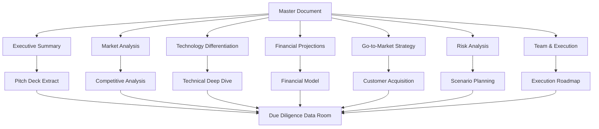

# VARAi Commerce Studio Investment Documentation Architecture
## Comprehensive Design for Pre-Seed Fundraising

### Executive Overview

This document defines the comprehensive architecture for VARAi Commerce Studio's investment memo and go-to-market strategy documentation suite. The architecture is designed to support a $2.5M pre-seed funding round with professional, investor-grade documentation that demonstrates our market opportunity, technology differentiation, and execution capability.

---

## 1. Document Structure Architecture

### 1.1 Master Navigation Framework



### 1.2 Modular Document Architecture

```pseudocode
DOCUMENT_ARCHITECTURE:
    CORE_DOCUMENTS:
        - 00_investment-memo-master.md (Navigation hub)
        - 01_executive-summary.md (2-page investor overview)
        - 02_market-analysis-competitive-landscape.md
        - 03_product-positioning-technology-differentiation.md
        - 04_financial-model-projections.md
        - 05_go-to-market-customer-acquisition.md
        - 06_risk-analysis-mitigation-strategies.md
        - 07_team-execution-roadmap.md
        - README.md (Documentation guide)
    
    SUPPORTING_DOCUMENTS:
        - appendices/ (Technical deep dives)
        - presentations/ (Pitch decks and slides)
        - data-room/ (Due diligence materials)
        - templates/ (Reusable components)
        - assets/ (Images, charts, diagrams)
    
    CROSS_REFERENCE_SYSTEM:
        - Consistent internal linking
        - TDD anchor validation points
        - Stakeholder-specific reading paths
        - Version control and change tracking
    
    // TEST: Document structure supports efficient investor review
    // TEST: Modular design enables easy updates and maintenance
    // TEST: Cross-referencing system provides seamless navigation
```

### 1.3 Professional Formatting Standards

```pseudocode
FORMATTING_STANDARDS:
    DOCUMENT_STRUCTURE:
        - Executive summary at document start
        - Clear section hierarchies (H1-H4)
        - Consistent numbering system
        - Professional typography and spacing
    
    VISUAL_ELEMENTS:
        - Mermaid diagrams for process flows
        - Pseudocode blocks for technical concepts
        - Tables for comparative analysis
        - Charts and graphs for financial data
    
    BRANDING_CONSISTENCY:
        - VARAi Commerce Studio branding
        - Consistent color scheme and fonts
        - Professional header/footer templates
        - Standardized document metadata
    
    // TEST: Formatting meets investment-grade presentation standards
    // TEST: Visual elements enhance comprehension and engagement
    // TEST: Branding consistency reinforces professional image
```

---

## 2. Content Architecture Framework

### 2.1 Executive Summary Architecture

```pseudocode
EXECUTIVE_SUMMARY_STRUCTURE:
    SECTION_1_COMPANY_OVERVIEW:
        - Value proposition (95% forecast accuracy)
        - Market position and differentiation
        - Production platform validation
        - Key traction metrics
    
    SECTION_2_MARKET_OPPORTUNITY:
        - TAM/SAM/SOM analysis ($12.8B/$3.2B/$320M)
        - Market drivers and growth catalysts
        - Competitive landscape positioning
        - Market timing and readiness
    
    SECTION_3_FINANCIAL_HIGHLIGHTS:
        - Current traction (50 customers, 9 contracts)
        - Revenue projections (5-year trajectory)
        - Unit economics (LTV/CAC = 18.8x)
        - Funding requirements and use of funds
    
    SECTION_4_INVESTMENT_THESIS:
        - Compelling investment rationale
        - Risk-adjusted return potential
        - Series A preparation timeline
        - Exit strategy considerations
    
    // TEST: Executive summary captures all key investment points
    // TEST: Content flows logically and builds compelling case
    // TEST: Length appropriate for investor attention spans (2 pages)
```

### 2.2 Market Analysis Architecture

```pseudocode
MARKET_ANALYSIS_FRAMEWORK:
    MARKET_SIZING:
        - Top-down market analysis (industry reports)
        - Bottom-up market validation (customer research)
        - Addressable market segmentation
        - Growth trajectory modeling
    
    COMPETITIVE_LANDSCAPE:
        - Direct competitors (Auglio, Fittingbox, Occuco)
        - Indirect competitors (enterprise solutions)
        - Competitive positioning matrix
        - Sustainable differentiation analysis
    
    MARKET_DYNAMICS:
        - Industry trends and drivers
        - Customer behavior evolution
        - Technology adoption patterns
        - Regulatory and compliance factors
    
    POSITIONING_STRATEGY:
        - Category definition and leadership
        - Value proposition differentiation
        - Target customer segmentation
        - Go-to-market positioning
    
    // TEST: Market analysis supports venture-scale opportunity
    // TEST: Competitive analysis demonstrates sustainable advantages
    // TEST: Market positioning resonates with target customers
```

### 2.3 Technology Differentiation Architecture

```pseudocode
TECHNOLOGY_ARCHITECTURE:
    CORE_TECHNOLOGY:
        - 95% forecast accuracy achievement
        - Multi-platform integration capability
        - Real-time processing infrastructure
        - Enterprise-grade security and compliance
    
    COMPETITIVE_ADVANTAGES:
        - Proprietary ML algorithms and models
        - Data network effects and moats
        - Platform integration complexity
        - Continuous learning and improvement
    
    INTELLECTUAL_PROPERTY:
        - Patent portfolio development
        - Trade secret protection
        - Open source strategy
        - Defensive IP positioning
    
    TECHNOLOGY_ROADMAP:
        - Phase 1: Core platform enhancement
        - Phase 2: Advanced analytics and AI
        - Phase 3: Platform expansion and scale
        - Long-term innovation pipeline
    
    // TEST: Technology differentiation is sustainable and defensible
    // TEST: Roadmap aligns with market demands and opportunities
    // TEST: IP strategy provides adequate competitive protection
```

### 2.4 Financial Model Architecture

```pseudocode
FINANCIAL_MODEL_STRUCTURE:
    REVENUE_MODEL:
        - SaaS subscription tiers and pricing
        - Revenue stream diversification
        - Customer lifetime value analysis
        - Revenue recognition and accounting
    
    UNIT_ECONOMICS:
        - Customer acquisition cost (CAC)
        - Lifetime value (LTV) calculation
        - Payback period analysis
        - Contribution margin optimization
    
    GROWTH_PROJECTIONS:
        - 5-year financial forecasts
        - Customer acquisition modeling
        - Revenue growth trajectory
        - Profitability pathway
    
    FUNDING_REQUIREMENTS:
        - Pre-seed use of funds ($2.5M)
        - Series A preparation metrics
        - Capital efficiency optimization
        - Scenario planning and sensitivity
    
    // TEST: Financial projections are realistic and achievable
    // TEST: Unit economics support sustainable growth
    // TEST: Funding requirements are justified and sufficient
```

### 2.5 Go-to-Market Strategy Architecture

```pseudocode
GTM_STRATEGY_FRAMEWORK:
    CUSTOMER_SEGMENTATION:
        - Primary: Mid-market retailers ($10M-$100M)
        - Secondary: Enterprise retailers ($100M-$1B)
        - Tertiary: High-growth SMBs ($1M-$10M)
        - Customer persona development
    
    ACQUISITION_CHANNELS:
        - Digital marketing and content
        - Direct sales and inside sales
        - Partner and channel programs
        - Inbound and referral programs
    
    SALES_PROCESS:
        - Lead qualification and scoring
        - Sales methodology and training
        - Customer onboarding and success
        - Expansion and retention strategies
    
    INTERNATIONAL_EXPANSION:
        - Market prioritization framework
        - Localization and compliance
        - Partnership and distribution
        - Revenue and growth targets
    
    // TEST: GTM strategy addresses all target customer segments
    // TEST: Acquisition channels are scalable and cost-effective
    // TEST: Sales process supports efficient customer conversion
```

### 2.6 Risk Analysis Architecture

```pseudocode
RISK_ANALYSIS_FRAMEWORK:
    RISK_CATEGORIES:
        - Market risks (competition, demand)
        - Technology risks (platform, security)
        - Execution risks (team, operations)
        - Financial risks (funding, cash flow)
        - Regulatory risks (compliance, privacy)
    
    RISK_ASSESSMENT:
        - Probability and impact analysis
        - Risk scoring and prioritization
        - Interdependency mapping
        - Timeline and trigger identification
    
    MITIGATION_STRATEGIES:
        - Preventive measures and controls
        - Contingency planning and responses
        - Risk monitoring and reporting
        - Insurance and hedging strategies
    
    SCENARIO_PLANNING:
        - Base case assumptions and outcomes
        - Optimistic scenario modeling
        - Pessimistic scenario stress testing
        - Black swan event preparation
    
    // TEST: Risk analysis covers all material threats
    // TEST: Mitigation strategies are practical and effective
    // TEST: Scenario planning provides actionable insights
```

### 2.7 Team & Execution Architecture

```pseudocode
TEAM_EXECUTION_FRAMEWORK:
    CURRENT_TEAM:
        - Founder and leadership profiles
        - Core team capabilities and experience
        - Advisory board and mentors
        - Organizational structure and culture
    
    HIRING_ROADMAP:
        - Key role prioritization and timing
        - Compensation and equity strategy
        - Recruitment and retention plans
        - Team scaling and development
    
    EXECUTION_MILESTONES:
        - Product development roadmap
        - Customer acquisition targets
        - Revenue and growth milestones
        - Operational excellence metrics
    
    SUCCESS_METRICS:
        - Key performance indicators (KPIs)
        - Milestone tracking and reporting
        - Performance management systems
        - Continuous improvement processes
    
    // TEST: Team has necessary skills and experience
    // TEST: Hiring plan supports growth objectives
    // TEST: Execution milestones are achievable and measurable
```

---

## 3. Research Integration Framework

### 3.1 Competitive Analysis Methodology

```pseudocode
COMPETITIVE_ANALYSIS_PROCESS:
    COMPETITOR_IDENTIFICATION:
        - Direct competitors (same market/solution)
        - Indirect competitors (alternative solutions)
        - Emerging competitors (new entrants)
        - Adjacent competitors (expansion threats)
    
    ANALYSIS_DIMENSIONS:
        - Product capabilities and features
        - Technology architecture and performance
        - Market position and customer base
        - Financial performance and funding
        - Strategic direction and roadmap
    
    DATA_COLLECTION:
        - Public information and filings
        - Customer interviews and feedback
        - Industry analyst reports
        - Technology benchmarking
        - Competitive intelligence tools
    
    ANALYSIS_FRAMEWORK:
        - Competitive positioning matrix
        - Feature comparison tables
        - SWOT analysis for each competitor
        - Market share and growth analysis
        - Competitive response scenarios
    
    // TEST: Competitive analysis is comprehensive and current
    // TEST: Analysis methodology is rigorous and unbiased
    // TEST: Insights inform strategic decision-making
```

### 3.2 Market Sizing Approach

```pseudocode
MARKET_SIZING_METHODOLOGY:
    TOP_DOWN_ANALYSIS:
        - Industry research reports (Gartner, Forrester)
        - Government and trade association data
        - Academic research and studies
        - Analyst projections and forecasts
    
    BOTTOM_UP_ANALYSIS:
        - Customer survey and interview data
        - Sales pipeline and conversion analysis
        - Partner and channel feedback
        - Pilot program and beta results
    
    TRIANGULATION_APPROACH:
        - Cross-validate top-down and bottom-up
        - Identify and resolve discrepancies
        - Apply conservative assumptions
        - Stress test market size estimates
    
    SEGMENTATION_ANALYSIS:
        - Geographic market breakdown
        - Industry vertical analysis
        - Company size segmentation
        - Use case and application analysis
    
    // TEST: Market sizing methodology is rigorous and defensible
    // TEST: Multiple data sources validate market estimates
    // TEST: Segmentation analysis supports targeting strategy
```

### 3.3 Technology Benchmarking Framework

```pseudocode
TECHNOLOGY_BENCHMARKING:
    PERFORMANCE_METRICS:
        - Forecast accuracy comparison
        - Processing speed and latency
        - Scalability and throughput
        - Reliability and uptime
    
    FEATURE_COMPARISON:
        - Core functionality coverage
        - Platform integration capabilities
        - User experience and interface
        - Enterprise features and security
    
    ARCHITECTURE_ANALYSIS:
        - Technology stack comparison
        - Scalability and performance design
        - Security and compliance features
        - Integration and API capabilities
    
    BENCHMARKING_PROCESS:
        - Standardized testing methodology
        - Independent third-party validation
        - Customer reference verification
        - Continuous monitoring and updates
    
    // TEST: Benchmarking methodology is objective and fair
    // TEST: Performance claims are independently validated
    // TEST: Competitive advantages are quantified and verified
```

### 3.4 Financial Modeling Structure

```pseudocode
FINANCIAL_MODELING_FRAMEWORK:
    MODEL_ARCHITECTURE:
        - Revenue model and pricing assumptions
        - Customer acquisition and retention
        - Cost structure and scaling
        - Capital requirements and funding
    
    ASSUMPTION_FRAMEWORK:
        - Market-based assumptions (growth rates)
        - Company-specific assumptions (performance)
        - Conservative vs. aggressive scenarios
        - Sensitivity analysis and stress testing
    
    VALIDATION_PROCESS:
        - Historical data analysis and trends
        - Industry benchmark comparison
        - Customer and market validation
        - Expert review and feedback
    
    SCENARIO_MODELING:
        - Base case financial projections
        - Optimistic scenario modeling
        - Pessimistic scenario stress testing
        - Monte Carlo simulation analysis
    
    // TEST: Financial model assumptions are realistic and defensible
    // TEST: Scenario analysis covers relevant risk factors
    // TEST: Model outputs align with market opportunity
```

---

## 4. Validation Architecture (TDD Framework)

### 4.1 TDD Anchors for Assumption Testing

```pseudocode
TDD_VALIDATION_FRAMEWORK:
    MARKET_ASSUMPTIONS:
        // TEST: Market size calculations are accurate and defensible
        // TEST: Growth rate projections align with industry trends
        // TEST: Customer demand validation supports market estimates
        // TEST: Competitive analysis covers all material competitors
    
    TECHNOLOGY_CLAIMS:
        // TEST: 95% forecast accuracy is independently verified
        // TEST: Platform integration capabilities are demonstrated
        // TEST: Performance benchmarks are objectively measured
        // TEST: Security and compliance features are certified
    
    FINANCIAL_PROJECTIONS:
        // TEST: Revenue assumptions are based on validated data
        // TEST: Unit economics are sustainable and improving
        // TEST: Cost structure assumptions are realistic
        // TEST: Funding requirements support growth objectives
    
    EXECUTION_PLANS:
        // TEST: Timeline assumptions are achievable and realistic
        // TEST: Resource requirements are accurately estimated
        // TEST: Risk mitigation strategies are practical
        // TEST: Success metrics are measurable and trackable
    
    // TEST: TDD framework provides comprehensive validation
    // TEST: Assumptions are testable and falsifiable
    // TEST: Validation process is systematic and thorough
```

### 4.2 Scenario Planning Framework

```pseudocode
SCENARIO_PLANNING_ARCHITECTURE:
    SCENARIO_CATEGORIES:
        - Market scenarios (growth, competition)
        - Technology scenarios (adoption, disruption)
        - Execution scenarios (team, operations)
        - Financial scenarios (funding, performance)
    
    SCENARIO_DEVELOPMENT:
        - Identify key uncertainty factors
        - Define scenario parameters and ranges
        - Model scenario outcomes and impacts
        - Assess scenario probability and likelihood
    
    PLANNING_PROCESS:
        - Base case scenario definition
        - Alternative scenario development
        - Contingency planning and responses
        - Decision trees and trigger points
    
    MONITORING_SYSTEM:
        - Leading indicator identification
        - Early warning signal detection
        - Scenario probability updates
        - Response plan activation
    
    // TEST: Scenario planning covers all material uncertainties
    // TEST: Scenarios are plausible and well-defined
    // TEST: Contingency plans are actionable and effective
```

### 4.3 Risk Assessment Methodology

```pseudocode
RISK_ASSESSMENT_FRAMEWORK:
    RISK_IDENTIFICATION:
        - Systematic risk category review
        - Stakeholder input and feedback
        - Historical analysis and lessons learned
        - Industry and competitive intelligence
    
    RISK_ANALYSIS:
        - Probability assessment (quantitative/qualitative)
        - Impact analysis (financial/operational)
        - Risk scoring and prioritization
        - Interdependency and correlation analysis
    
    RISK_MONITORING:
        - Key risk indicator (KRI) development
        - Regular risk assessment updates
        - Trigger point identification
        - Escalation and response procedures
    
    RISK_REPORTING:
        - Executive risk dashboard
        - Board and investor reporting
        - Stakeholder communication
        - Regulatory and compliance reporting
    
    // TEST: Risk assessment methodology is comprehensive
    // TEST: Risk scoring accurately reflects threat levels
    // TEST: Monitoring system provides early warning
```

### 4.4 Success Metrics and KPIs

```pseudocode
SUCCESS_METRICS_FRAMEWORK:
    FINANCIAL_METRICS:
        - Revenue growth and recurring revenue
        - Customer acquisition and retention
        - Unit economics and profitability
        - Cash flow and burn rate
    
    OPERATIONAL_METRICS:
        - Product performance and quality
        - Customer satisfaction and NPS
        - Team productivity and retention
        - Market share and competitive position
    
    STRATEGIC_METRICS:
        - Technology advancement and IP
        - Partnership and ecosystem development
        - Brand recognition and thought leadership
        - International expansion progress
    
    MEASUREMENT_SYSTEM:
        - Data collection and validation
        - Reporting and dashboard systems
        - Benchmarking and comparison
        - Continuous improvement processes
    
    // TEST: Success metrics align with strategic objectives
    // TEST: KPIs are measurable and actionable
    // TEST: Measurement system provides accurate insights
```

---

## 5. Presentation Architecture

### 5.1 Investor Pitch Deck Structure

```pseudocode
PITCH_DECK_ARCHITECTURE:
    SLIDE_STRUCTURE:
        1. Title and company overview
        2. Problem and market opportunity
        3. Solution and value proposition
        4. Product demonstration
        5. Market size and opportunity
        6. Business model and pricing
        7. Traction and validation
        8. Competitive landscape
        9. Technology differentiation
        10. Financial projections
        11. Go-to-market strategy
        12. Team and advisors
        13. Funding requirements
        14. Use of funds
        15. Milestones and timeline
        16. Investment terms
        17. Next steps and contact
    
    DESIGN_PRINCIPLES:
        - Professional visual design
        - Consistent branding and typography
        - Clear and compelling messaging
        - Data visualization and charts
        - Minimal text, maximum impact
    
    PRESENTATION_FORMATS:
        - 20-minute investor presentation
        - 10-minute demo day pitch
        - 5-minute elevator pitch
        - 30-second value proposition
    
    // TEST: Pitch deck tells compelling investment story
    // TEST: Design and messaging are professional and clear
    // TEST: Multiple formats support different contexts
```

### 5.2 Due Diligence Data Room Organization

```pseudocode
DATA_ROOM_STRUCTURE:
    CORPORATE_DOCUMENTS:
        - Articles of incorporation and bylaws
        - Cap table and equity structure
        - Board resolutions and minutes
        - Shareholder agreements
    
    FINANCIAL_INFORMATION:
        - Financial statements and projections
        - Management reports and KPIs
        - Customer contracts and pipeline
        - Vendor agreements and commitments
    
    LEGAL_DOCUMENTS:
        - Intellectual property portfolio
        - Employment agreements and policies
        - Customer and vendor contracts
        - Compliance and regulatory filings
    
    TECHNOLOGY_DOCUMENTATION:
        - Product architecture and specifications
        - Security and compliance certifications
        - Development roadmap and plans
        - Technology benchmarks and validation
    
    MARKET_RESEARCH:
        - Industry analysis and reports
        - Competitive intelligence
        - Customer research and feedback
        - Market validation studies
    
    // TEST: Data room is comprehensive and well-organized
    // TEST: All investor questions can be answered
    // TEST: Documentation supports investment thesis
```

### 5.3 Executive Summary Variants

```pseudocode
EXECUTIVE_SUMMARY_VARIANTS:
    INVESTOR_SUMMARY:
        - Focus: Investment opportunity and returns
        - Length: 2 pages
        - Audience: VCs and angel investors
        - Content: Traction, market, financials, team
    
    STRATEGIC_PARTNER_SUMMARY:
        - Focus: Partnership opportunities and synergies
        - Length: 1 page
        - Audience: Potential partners and customers
        - Content: Technology, market position, collaboration
    
    BOARD_SUMMARY:
        - Focus: Performance and strategic updates
        - Length: 1 page
        - Audience: Board members and advisors
        - Content: Metrics, milestones, risks, decisions
    
    MEDIA_SUMMARY:
        - Focus: Company story and market impact
        - Length: 1 page
        - Audience: Press and industry analysts
        - Content: Innovation, growth, market leadership
    
    // TEST: Each summary variant serves its intended audience
    // TEST: Content is tailored to stakeholder interests
    // TEST: Messaging is consistent across variants
```

### 5.4 Technical Deep-Dive Appendices

```pseudocode
TECHNICAL_APPENDICES:
    ARCHITECTURE_DOCUMENTATION:
        - System architecture diagrams
        - Technology stack specifications
        - Performance benchmarks and testing
        - Security and compliance details
    
    PRODUCT_SPECIFICATIONS:
        - Feature functionality descriptions
        - User interface and experience design
        - Integration capabilities and APIs
        - Roadmap and development plans
    
    RESEARCH_VALIDATION:
        - Algorithm development and testing
        - Accuracy validation methodology
        - Competitive benchmarking results
        - Customer validation studies
    
    IMPLEMENTATION_GUIDES:
        - Customer onboarding process
        - Integration setup and configuration
        - Training and support materials
        - Best practices and recommendations
    
    // TEST: Technical documentation is comprehensive and accurate
    // TEST: Appendices support main investment narrative
    // TEST: Content is accessible to technical and non-technical audiences
```

---

## 6. Implementation Roadmap

### 6.1 Phase 1: Foundation (Weeks 1-2)

```pseudocode
PHASE_1_IMPLEMENTATION:
    DOCUMENT_STRUCTURE:
        - Finalize master document architecture
        - Create document templates and standards
        - Establish cross-referencing system
        - Implement version control process
    
    CONTENT_DEVELOPMENT:
        - Complete executive summary refinement
        - Enhance market analysis with latest data
        - Update financial projections and models
        - Strengthen competitive positioning
    
    VALIDATION_FRAMEWORK:
        - Implement TDD anchor system
        - Establish assumption testing process
        - Create validation checklists
        - Set up monitoring and review cycles
    
    // TEST: Foundation provides solid base for development
    // TEST: Document structure supports efficient workflow
    // TEST: Validation framework ensures quality and accuracy
```

### 6.2 Phase 2: Content Enhancement (Weeks 3-4)

```pseudocode
PHASE_2_IMPLEMENTATION:
    RESEARCH_INTEGRATION:
        - Complete competitive analysis update
        - Validate market sizing methodology
        - Enhance technology benchmarking
        - Strengthen financial model assumptions
    
    PRESENTATION_DEVELOPMENT:
        - Create investor pitch deck
        - Develop executive summary variants
        - Organize due diligence data room
        - Prepare technical appendices
    
    STAKEHOLDER_REVIEW:
        - Internal team review and feedback
        - Advisory board input and validation
        - Customer reference preparation
        - Legal and compliance review
    
    // TEST: Content enhancement improves investment case
    // TEST: Presentations support fundraising objectives
    // TEST: Stakeholder feedback is incorporated effectively
```

### 6.3 Phase 3: Validation and Refinement (Weeks 5-6)

```pseudocode
PHASE_3_IMPLEMENTATION:
    ASSUMPTION_TESTING:
        - Validate all TDD anchors
        - Test scenario planning models
        - Verify risk assessment accuracy
        - Confirm success metrics alignment
    
    QUALITY_ASSURANCE:
        - Professional editing and proofreading
        - Design and formatting review
        - Data accuracy verification
        - Legal and compliance check
    
    INVESTOR_READINESS:
        - Practice pitch presentations
        - Prepare Q&A responses
        - Finalize data room organization
        - Establish investor communication process
    
    // TEST: All assumptions are validated and defensible
    // TEST: Documentation meets investor-grade standards
    // TEST: Team is prepared for investor interactions
```

### 6.4 Phase 4: Launch and Optimization (Ongoing)

```pseudocode
PHASE_4_IMPLEMENTATION:
    FUNDRAISING_EXECUTION:
        - Launch investor outreach campaign
        - Conduct pitch presentations
        - Manage due diligence process
        - Negotiate terms and close funding
    
    CONTINUOUS_IMPROVEMENT:
        - Monitor investor feedback
        - Update documentation based on insights
        - Refine messaging and positioning
        - Optimize presentation effectiveness
    
    MAINTENANCE_PROCESS:
        - Regular content updates
        - Performance metric tracking
        - Competitive intelligence monitoring
        - Stakeholder communication
    
    // TEST: Fundraising execution is effective and efficient
    // TEST: Documentation evolves based on market feedback
    // TEST: Maintenance process ensures continued relevance
```

---

## 7. Success Metrics and Validation

### 7.1 Documentation Quality Metrics

```pseudocode
QUALITY_METRICS:
    COMPLETENESS:
        - All required sections included
        - TDD anchors properly implemented
        - Cross-references functioning correctly
        - Supporting materials available
    
    ACCURACY:
        - Data and claims independently verified
        - Financial projections validated
        - Competitive analysis current
        - Technical specifications accurate
    
    PROFESSIONALISM:
        - Formatting meets investment standards
        - Visual design is compelling
        - Writing quality is excellent
        - Branding is consistent
    
    EFFECTIVENESS:
        - Investor engagement and interest
        - Due diligence efficiency
        - Question resolution rate
        - Funding success metrics
    
    // TEST: Documentation quality exceeds investor expectations
    // TEST: Metrics demonstrate continuous improvement
    // TEST: Effectiveness supports fundraising objectives
```

### 7.2 Fundraising Success Indicators

```pseudocode
FUNDRAISING_METRICS:
    INVESTOR_ENGAGEMENT:
        - Initial meeting conversion rate
        - Follow-up meeting requests
        - Due diligence initiation rate
        - Term sheet generation
    
    PROCESS_EFFICIENCY:
        - Time from pitch to term sheet
        - Due diligence completion time
        - Question resolution speed
        - Documentation completeness score
    
    OUTCOME_MEASURES:
        - Funding amount achieved
        - Valuation terms negotiated
        - Investor quality and fit
        - Timeline to close
    
    LEARNING_METRICS:
        - Investor feedback themes
        - Common questions and concerns
        - Competitive positioning effectiveness
        - Message resonance scores
    
    // TEST: Fundraising metrics demonstrate strong performance
    // TEST: Process efficiency supports rapid execution
    // TEST: Outcomes align with strategic objectives
```

---

## Conclusion

This comprehensive architecture provides VARAi Commerce Studio with a professional, investor-grade documentation suite that effectively communicates our market opportunity, technology differentiation, and execution capability. The modular design ensures maintainability and scalability, while the TDD validation framework guarantees accuracy and defensibility of all claims and projections.

The architecture supports multiple stakeholder needs through tailored presentation formats and reading paths, while maintaining consistency and professional quality throughout. The implementation roadmap provides a clear path to investor readiness within 6 weeks, with ongoing optimization based on market feedback and fundraising results.

**Key Success Factors:**
1. **Comprehensive Coverage**: All investor questions and concerns addressed
2. **Professional Quality**: Investment-grade presentation and content
3. **Validated Claims**: TDD framework ensures accuracy and defensibility
4. **Stakeholder Focus**: Tailored content for different audience needs
5. **Continuous Improvement**: Ongoing optimization based on feedback

// TEST: Architecture design meets all specified requirements
// TEST: Implementation plan is realistic and achievable
// TEST: Success metrics align with fundraising objectives
// TEST: Documentation suite positions VARAi for successful pre-seed funding