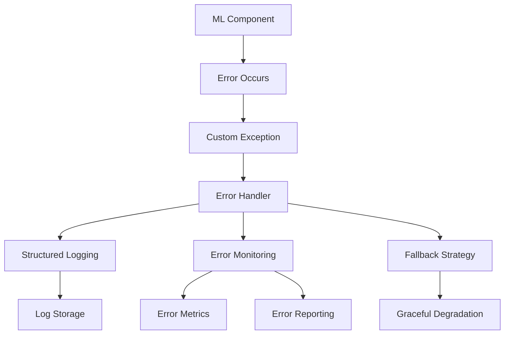

# EyewearML Error Handling System

This document provides an overview of the comprehensive error handling system implemented for the EyewearML platform. The system ensures reliability, robust error reporting, graceful degradation, and better debugging capabilities for the ML pipeline.

## Architecture Overview

The error handling system consists of several key components that work together to provide a comprehensive solution:



## Components

### 1. Custom Exception Hierarchy

We've implemented a domain-specific exception hierarchy that makes it easier to identify, categorize, and handle different types of errors:

- `MLError` - Base class for all ML-related errors
  - `DataError` - Issues with data loading, parsing, validation
  - `ModelError` - Issues with the model itself
    - `InferenceError` - Issues during model inference
    - `TrainingError` - Issues during model training
  - `ValidationError` - Validation failures
  - `ResourceError` - Issues with accessing resources
  - `ConfigurationError` - Issues with configuration
  - `DependencyError` - Issues with dependencies

Each exception captures:
- Error code for categorization and tracking
- Detailed error message
- Additional structured information
- Original exception (if wrapping another exception)
- Traceback information

### 2. Structured Logging

We've extended the standard Python logging system to support structured logging with JSON output:

- `StructuredLogger` - Extended logger with methods for logging structured data
- `JsonFormatter` - JSON formatter for structured log records
- Contextual logging with request IDs and user sessions
- Decorators for logging function execution time and function calls

### 3. Error Handlers

The error handling system provides decorators and context managers for consistent error handling:

- `ErrorHandler` - Base class for error handlers
- `handle_errors` - Decorator for handling errors in functions
- `handle_errors_context` - Context manager for handling errors in blocks
- `log_and_reraise` - Log the error and re-raise it
- `with_fallback` - Call a fallback function if an error occurs
- `handle_gracefully` - Return a default value on error

### 4. Fallback Strategies

For recommendation failures, we've implemented fallback strategies that provide graceful degradation:

- `RecommendationFallbackStrategy` - Enumeration of fallback strategies
  - `DEFAULT` - Default recommendations that work for most users
  - `POPULAR` - Most popular items based on historical data
  - `TRENDING` - Currently trending items
  - `SIMILAR_TO_LAST_VIEWED` - Items similar to what the user last viewed
  - `RANDOM` - Random selection of items
  - `HYBRID` - Combination of multiple strategies

### 5. Error Monitoring

The error monitoring system tracks error frequency and patterns:

- `ErrorMonitor` - Tracks and reports errors
- Collects error statistics by component, operation, and error type
- Calculates error rates over different time windows
- Integrates with centralized monitoring systems
- Stores error details for debugging and analysis

## Usage Examples

### Basic Error Handling

```python
from eyewear_ml.ml.error_handling import with_error_handling, DataError, InferenceError

@with_error_handling
def process_user_preferences(user_id: str) -> Dict[str, Any]:
    # This function will have structured error handling applied
    # Errors will be logged with context and converted to appropriate ML errors
    ...
```

### Custom Error Handling

```python
from eyewear_ml.ml.error_handling import handle_errors, log_and_reraise, MLError

# Handle specific error types differently
@handle_errors(
    handled_exceptions=[ValueError, TypeError],
    error_code="DATA_VALIDATION_ERROR",
    reraise=True
)
def validate_input_data(data: Dict[str, Any]) -> None:
    # Validation logic
    ...

# Log all errors but only re-raise certain types
@log_and_reraise
def train_model(dataset_path: str) -> Model:
    try:
        # Training logic
        ...
    except MLError:
        # Re-raise ML errors
        raise
    except Exception as e:
        # Convert other exceptions to MLError
        raise TrainingError(f"Failed to train model: {str(e)}", 
                            original_exception=e)
```

### Using Fallback Strategies

```python
from eyewear_ml.ml.error_handling import with_fallback
from eyewear_ml.ml.error_handling.fallbacks import get_popular_recommendations

# Fallback to popular recommendations if personalized ones fail
@with_fallback(get_popular_recommendations)
async def get_personalized_recommendations(user_id: str, limit: int = 10) -> List[Dict]:
    # Try to get personalized recommendations
    ...
```

### Monitoring Errors

```python
from eyewear_ml.ml.error_handling import report_error, get_error_metrics
from datetime import timedelta

try:
    # Some operation that might fail
    ...
except Exception as e:
    # Report the error with context
    report_error(
        error=e,
        component="recommendation_engine",
        operation="get_recommendations",
        context={"user_id": user_id, "session_id": session_id},
        severity="error"
    )

# Get error metrics for the last hour
metrics = get_error_metrics(
    component="recommendation_engine",
    time_window=timedelta(hours=1)
)

print(f"Error count: {metrics['total']}")
print(f"Error rate (per minute): {metrics['rates']['5m']}")
```

### Structured Logging

```python
from eyewear_ml.ml.error_handling import get_logger, log_execution_time, log_context

logger = get_logger("recommendation_service")

@log_execution_time(logger)
def compute_recommendations(user_id: str) -> List[Dict]:
    # Function execution time will be logged
    ...

async def handle_request(request):
    # Add context to all logs in this request
    with log_context(user_id=request.user_id, session_id=request.session_id):
        # All logs will include the user_id and session_id
        logger.structured_info("Processing recommendation request", {
            "request_id": request.id,
            "parameters": request.parameters
        })
        
        # Process request
        ...
```

## Integration with ML Components

The error handling system integrates with key ML components:

1. **Model Training Pipeline**: Captures and reports training errors, logs training progress
2. **Feature Engineering**: Validates input data, handles missing values, reports data quality issues
3. **Recommendation Service**: Provides fallback recommendations on errors, maintains availability
4. **Model Registry**: Tracks model errors, integrates with model versioning
5. **Evaluation Pipeline**: Logs evaluation metrics, monitors model performance

## Future Improvements

Future improvements to the error handling system could include:

1. Integration with a visual error monitoring dashboard
2. Automated error classification using machine learning
3. Enhanced alerting with real-time notifications
4. Deeper integration with CI/CD for test case generation
5. A/B testing integration for error rate comparison between versions
