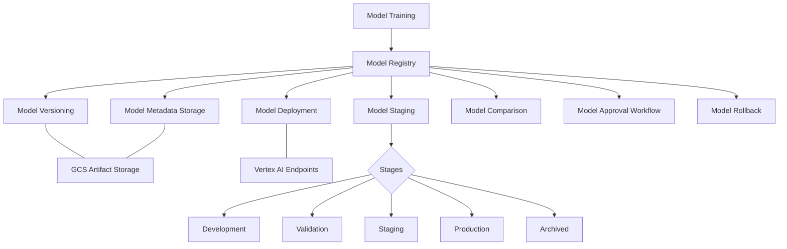

# EyewearML Model Registry

This document provides an overview of the Model Registry implementation for the EyewearML platform. The Model Registry is a critical component of the ML operations infrastructure, enabling proper versioning, governance, and lifecycle management of machine learning models.

## Architecture Overview

The Model Registry provides the following key capabilities:



## Components

The Model Registry consists of several key components:

1. **Registry**: Central management system for models
2. **Metadata Storage**: Stores detailed information about each model version
3. **Artifact Storage**: Stores the actual model artifacts
4. **Staging System**: Tracks the lifecycle stage of each model version
5. **Deployment Integration**: Manages model deployment to endpoints
6. **CLI**: Command-line interface for interacting with the registry

## Implementation

The Model Registry is implemented using the following modules:

### `config.py`

Defines configuration and constants for the Model Registry, including:
- `ModelStage` enum for model lifecycle stages
- `RegistryConfig` dataclass for registry configuration

### `metadata.py`

Defines data structures for storing model metadata:
- `ModelPerformance` class for tracking model metrics
- `ModelMetadata` class for comprehensive model information

### `registry.py`

Implements the core `ModelRegistry` class that provides:
- Model registration and versioning
- Model retrieval and loading
- Version management
- Deployment to Vertex AI
- Model comparison and selection
- Promotion and approval workflows

### `integration.py`

Provides utilities for integrating the Model Registry with the training pipeline:
- `register_trained_model()` function for registering trained models
- `train_and_register_model()` function for end-to-end training and registration

### `cli.py`

Implements a command-line interface for interacting with the Model Registry:
- List models and versions
- Get detailed model information
- Promote models through lifecycle stages
- Deploy models to endpoints
- Compare model versions
- Rollback to previous versions

## Usage Examples

### Basic Training and Registration

```python
from eyewear_ml.ml.registry.integration import train_and_register_model
from eyewear_ml.ml.model import EyewearModelConfig

# Train and register a model in one step
model, metadata = train_and_register_model(
    tfrecord_paths=["gs://bucket/data/training.tfrecord"],
    model_name="eyewear_recommender",
    config=EyewearModelConfig(),
    description="Eyewear recommendation model",
    tags=["recommendation", "eyewear"],
    promote_to_staging=True  # Automatically promote to staging
)

print(f"Model registered with ID: {metadata.model_id}")
print(f"Model version: {metadata.version}")
```

### Working with the Registry Directly

```python
from eyewear_ml.ml.registry import ModelRegistry, RegistryConfig, ModelStage

# Initialize registry
config = RegistryConfig(project_id="my-project", bucket_name="my-bucket")
registry = ModelRegistry(config)

# List all models
models = registry.list_models()
print(f"Available models: {models}")

# Get the latest production version of a model
metadata = registry.get_model_metadata(
    model_name="eyewear_recommender",
    stage=ModelStage.PRODUCTION
)

# Load the model
model, metadata = registry.load_model(
    model_name="eyewear_recommender",
    stage=ModelStage.PRODUCTION
)

# Make predictions
predictions = model.predict(...)

# Promote a model to production
metadata = registry.promote_model(
    model_name="eyewear_recommender",
    version="v1.2.0",
    target_stage=ModelStage.PRODUCTION,
    approved_by="john.smith@example.com"
)

# Deploy a model to an endpoint
model, endpoint, metadata = registry.deploy_model(
    model_name="eyewear_recommender",
    version="v1.2.0",
    endpoint_name="eyewear-recommender-endpoint"
)
```

### Using the CLI

```bash
# List all models
python -m eyewear_ml.ml.registry.cli list-models

# List versions of a specific model
python -m eyewear_ml.ml.registry.cli list-versions eyewear_recommender

# Get detailed information about a model version
python -m eyewear_ml.ml.registry.cli get-model eyewear_recommender --version v1.2.0

# Promote a model to a new stage
python -m eyewear_ml.ml.registry.cli promote eyewear_recommender v1.2.0 production --approved-by "john.smith@example.com"

# Deploy a model to an endpoint
python -m eyewear_ml.ml.registry.cli deploy eyewear_recommender --version v1.2.0 --endpoint-name eyewear-recommender-endpoint

# Compare multiple model versions
python -m eyewear_ml.ml.registry.cli compare eyewear_recommender v1.1.0 v1.2.0 v1.3.0

# Rollback to a previous version
python -m eyewear_ml.ml.registry.cli rollback eyewear_recommender v1.1.0 --endpoint-name eyewear-recommender-endpoint
```

## Versioning Strategy

The Model Registry supports two versioning strategies:

1. **Auto-increment** (e.g., v1, v2, v3): Simple sequential numbering
2. **Semantic Versioning** (e.g., v1.2.3): Follows semver conventions with major.minor.patch format

The versioning strategy is configurable in the `RegistryConfig`.

## Model Lifecycle

Models in the registry progress through the following lifecycle stages:

1. **Development**: Initial development and training
2. **Validation**: Undergoing validation and testing
3. **Staging**: Ready for deployment to staging environments
4. **Production**: Deployed to production environments
5. **Archived**: No longer in use

Promotion between stages can require approval, which is tracked in the model metadata.

## Metadata Storage

Model metadata is stored in Google Cloud Storage alongside the model artifacts. Each model version has its own metadata file in JSON format.

## Integration with Vertex AI

The Model Registry integrates with Google Cloud Vertex AI for model deployment:

1. Models are registered in the Model Registry
2. Model artifacts are stored in Google Cloud Storage
3. Models can be deployed to Vertex AI endpoints
4. Deployment information is tracked in model metadata

## Next Steps and Improvements

Future improvements to the Model Registry could include:

1. Integration with data quality monitoring
2. Addition of feedback loops for model retraining
3. Enhanced approval workflows with email notifications
4. Web UI for easier interaction with the registry
5. Multi-cloud support for deployment
