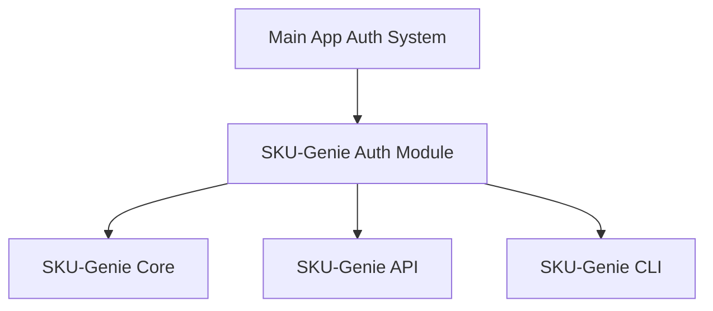

# SKU-Genie Authentication Integration Plan

## Current State Analysis

### Main Application Auth System
- Uses a comprehensive RBAC system with:
  - Hierarchical roles (SUPER_ADMIN, CLIENT_ADMIN, BRAND_MANAGER, VIEWER)
  - Granular permissions at system, client, and brand levels
  - JWT-based authentication with token management
  - UserContext model that includes user_id, role, client_id, and brand_id

### SKU-Genie Auth System
- Has a simpler permission model described in the technical specification:
  - Basic Permission enum (READ, WRITE, ADMIN)
  - Resource enum (CLIENT, DATA_SOURCE, SCHEMA, etc.)
  - Database-based permission checking
- Currently not integrated with the main application's auth system

## Integration Plan

### 1. Create a SKU-Genie Auth Module



#### 1.1 Create a new file: `src/sku_genie/auth/auth_adapter.py`

This adapter will bridge the main application's auth system with SKU-Genie:

```python
from typing import Optional, Dict, Any
from src.auth.rbac import Role, Permission, UserContext, RBACManager
from src.auth.auth import AuthManager

class SKUGenieResource:
    """SKU-Genie specific resources"""
    CLIENT = "client"
    DATA_SOURCE = "data_source"
    SCHEMA = "schema"
    IMPORT = "import"
    QUALITY = "quality"
    MAINTENANCE = "maintenance"

class SKUGenieAuthAdapter:
    """Adapter for integrating with the main application's auth system"""
    
    def __init__(self, auth_manager: AuthManager, rbac_manager: RBACManager):
        self.auth_manager = auth_manager
        self.rbac_manager = rbac_manager
        
        # Map SKU-Genie resources to main app permissions
        self.resource_permission_map = {
            SKUGenieResource.CLIENT: {
                "read": Permission.VIEW_REPORTS,
                "write": Permission.MANAGE_BRANDS,
                "admin": Permission.MANAGE_CLIENT_USERS
            },
            SKUGenieResource.DATA_SOURCE: {
                "read": Permission.VIEW_REPORTS,
                "write": Permission.MANAGE_PRODUCTS,
                "admin": Permission.MANAGE_BRANDS
            },
            SKUGenieResource.SCHEMA: {
                "read": Permission.VIEW_REPORTS,
                "write": Permission.MANAGE_PRODUCTS,
                "admin": Permission.CUSTOMIZE_REPORTS
            },
            SKUGenieResource.IMPORT: {
                "read": Permission.VIEW_REPORTS,
                "write": Permission.MANAGE_PRODUCTS,
                "admin": Permission.MANAGE_BRANDS
            },
            SKUGenieResource.QUALITY: {
                "read": Permission.VIEW_REPORTS,
                "write": Permission.MANAGE_PRODUCTS,
                "admin": Permission.CUSTOMIZE_REPORTS
            },
            SKUGenieResource.MAINTENANCE: {
                "read": Permission.VIEW_REPORTS,
                "write": Permission.MANAGE_PRODUCTS,
                "admin": Permission.MANAGE_SYSTEM
            }
        }
    
    def verify_token(self, token: str) -> Optional[UserContext]:
        """Verify JWT token and return user context"""
        return self.auth_manager.verify_token(token)
    
    def check_permission(self, user_context: UserContext, resource: str, 
                        action: str, client_id: Optional[str] = None,
                        brand_id: Optional[str] = None) -> bool:
        """Check if user has permission for the specified resource and action"""
        # First check if user has access to the client/brand scope
        if not self.rbac_manager.validate_access_scope(user_context, client_id, brand_id):
            return False
        
        # Then check specific permission
        if resource in self.resource_permission_map and action in self.resource_permission_map[resource]:
            required_permission = self.resource_permission_map[resource][action]
            return self.rbac_manager.has_permission(user_context, required_permission)
        
        return False
```

### 2. Modify SKU-Genie Database Operations

#### 2.1 Update `src/sku_genie/core/database.py` to include user context in operations

Add a user_context parameter to database operations that require permission checks:

```python
async def get_client(self, client_id: str, user_context: Optional[UserContext] = None) -> Optional[Dict[str, Any]]:
    """
    Get a client by ID.
    
    Args:
        client_id: ID of the client
        user_context: User context for permission checking
        
    Returns:
        Client document or None if not found or not authorized
    """
    try:
        await self.ensure_connected()
        
        # If user_context is provided, check permissions
        if user_context:
            auth_adapter = SKUGenieAuthAdapter(auth_manager, rbac_manager)
            if not auth_adapter.check_permission(
                user_context, 
                SKUGenieResource.CLIENT, 
                "read", 
                client_id
            ):
                logger.warning(f"User {user_context.user_id} not authorized to access client {client_id}")
                return None
        
        return await self.db.clients.find_one({"client_id": client_id})
    except Exception as e:
        logger.error(f"Failed to get client {client_id}: {str(e)}")
        raise DatabaseError(f"Failed to get client: {str(e)}")
```

### 3. Update SKU-Genie API Endpoints

#### 3.1 Create a new file: `src/sku_genie/api/auth_middleware.py`

```python
from functools import wraps
from flask import request, jsonify, g
from src.auth.auth import AuthManager
from src.auth.rbac import RBACManager
from src.sku_genie.auth.auth_adapter import SKUGenieAuthAdapter, SKUGenieResource

auth_manager = AuthManager(secret_key="${SECRET_KEY_1}")
rbac_manager = RBACManager()
auth_adapter = SKUGenieAuthAdapter(auth_manager, rbac_manager)

def auth_required(resource, action):
    """Middleware to check authentication and authorization"""
    def decorator(f):
        @wraps(f)
        def decorated_function(*args, **kwargs):
            # Get token from Authorization header
            auth_header = request.headers.get('Authorization')
            if not auth_header or not auth_header.startswith('Bearer '):
                return jsonify({"error": "Missing or invalid authorization header"}), 401
            
            token = auth_header.split(' ')[1]
            user_context = auth_adapter.verify_token(token)
            
            if not user_context:
                return jsonify({"error": "Invalid or expired token"}), 401
            
            # Store user context in Flask's g object
            g.user_context = user_context
            
            # Check permission for the resource and action
            client_id = kwargs.get('client_id') or request.args.get('client_id')
            brand_id = kwargs.get('brand_id') or request.args.get('brand_id')
            
            if not auth_adapter.check_permission(user_context, resource, action, client_id, brand_id):
                return jsonify({"error": "Not authorized"}), 403
            
            return f(*args, **kwargs)
        return decorated_function
    return decorator
```

#### 3.2 Update API endpoints to use the auth middleware

```python
from flask import Blueprint, jsonify, request, g
from src.sku_genie.api.auth_middleware import auth_required
from src.sku_genie.auth.auth_adapter import SKUGenieResource
from src.sku_genie.core.database import get_database

api = Blueprint('sku_genie_api', __name__)

@api.route('/clients/<client_id>', methods=['GET'])
@auth_required(SKUGenieResource.CLIENT, "read")
async def get_client(client_id):
    db = await get_database()
    client = await db.get_client(client_id, g.user_context)
    
    if not client:
        return jsonify({"error": "Client not found or not authorized"}), 404
    
    return jsonify(client)

@api.route('/clients/<client_id>/data-sources', methods=['POST'])
@auth_required(SKUGenieResource.DATA_SOURCE, "write")
async def add_data_source(client_id):
    db = await get_database()
    data = request.json
    
    # Add user_context to the operation
    result = await db.add_data_source(client_id, data, g.user_context)
    
    return jsonify(result)
```

### 4. Update SKU-Genie CLI

Modify the CLI to accept authentication tokens and pass them to the operations:

```python
def main():
    """Main entry point for the SKU-Genie CLI."""
    parser = argparse.ArgumentParser(description="SKU-Genie: Multi-Source Data Quality Management System")
    
    # Add authentication options
    parser.add_argument("--token", help="Authentication token")
    
    # Rest of the CLI code...
    
    # Parse arguments
    args = parser.parse_args()
    
    # Initialize auth if token provided
    user_context = None
    if args.token:
        auth_manager = AuthManager(secret_key="${SECRET_KEY_1}")
        user_context = auth_manager.verify_token(args.token)
        if not user_context:
            print("Error: Invalid or expired token")
            return
    
    # Execute command with user context
    if args.command == "client":
        if args.client_command == "create":
            result = asyncio.run(create_client(args, user_context))
        # Rest of the commands...
```

### 5. Create Database Migration for User Roles

Create a migration script to update the database schema for user roles:

```python
async def migrate_user_roles():
    """Migrate user roles to the new RBAC system"""
    db = await get_database()
    
    # Create a new collection for user roles if it doesn't exist
    if "user_roles" not in await db.db.list_collection_names():
        await db.db.create_collection("user_roles")
    
    # Create indexes
    await db.db.user_roles.create_index([("user_id", 1), ("client_id", 1)], unique=True)
    
    # Add sample roles if needed for testing
    # This would be removed in production
    sample_roles = [
        {
            "user_id": "1",
            "role": "super_admin",
            "client_id": None,
            "brand_id": None
        },
        {
            "user_id": "2",
            "role": "client_admin",
            "client_id": "client1",
            "brand_id": None
        }
    ]
    
    for role in sample_roles:
        await db.db.user_roles.update_one(
            {"user_id": role["user_id"], "client_id": role["client_id"]},
            {"$set": role},
            upsert=True
        )
    
    print("User roles migration completed")
```

## Implementation Roadmap

1. **Phase 1: Auth Adapter Implementation**
   - Create the SKU-Genie auth adapter
   - Implement permission mapping
   - Unit test the adapter

2. **Phase 2: Database Layer Integration**
   - Update database operations to include user context
   - Add permission checks to CRUD operations
   - Test database operations with different user roles

3. **Phase 3: API Integration**
   - Implement auth middleware
   - Update API endpoints to use the middleware
   - Test API endpoints with different user roles

4. **Phase 4: CLI Integration**
   - Update CLI to accept authentication tokens
   - Pass user context to operations
   - Test CLI with different user roles

5. **Phase 5: Testing and Documentation**
   - End-to-end testing
   - Update documentation
   - Create examples for different user roles