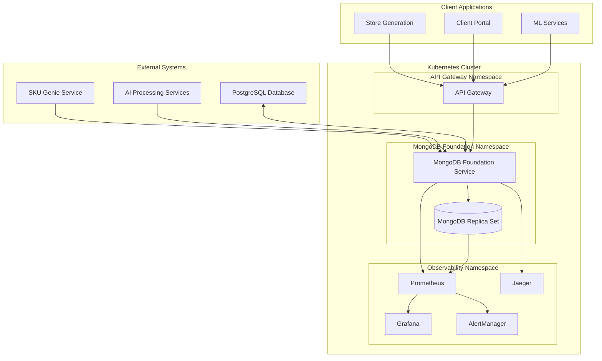
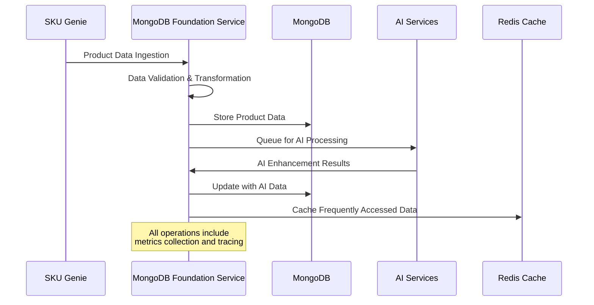
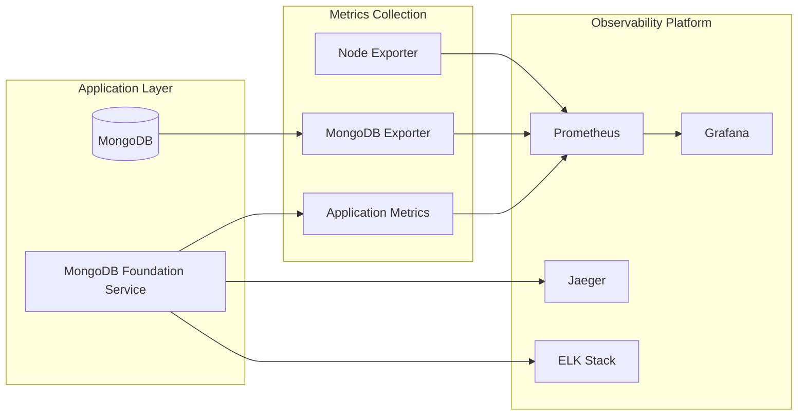
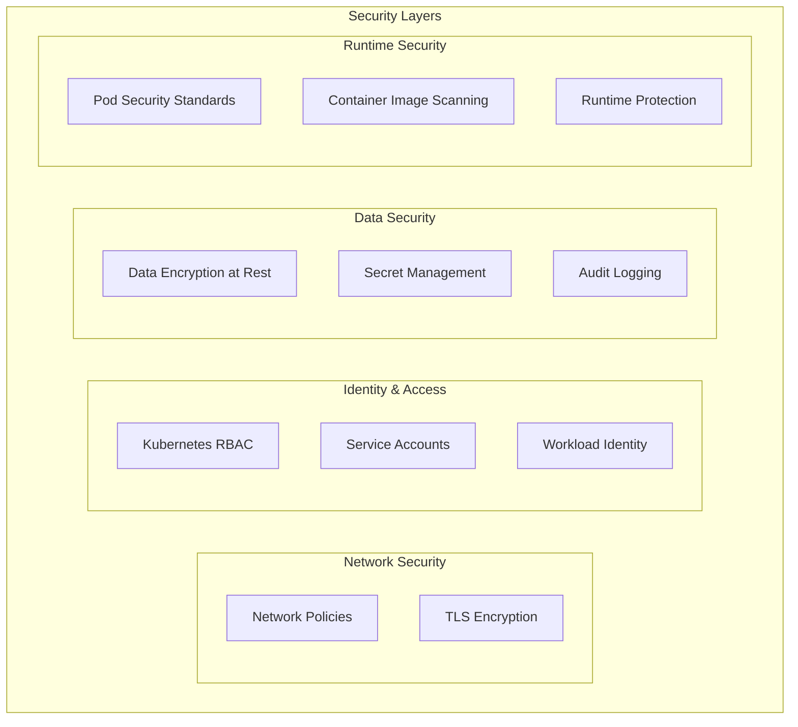
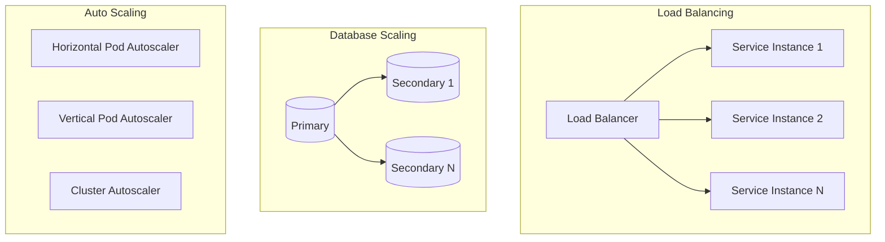
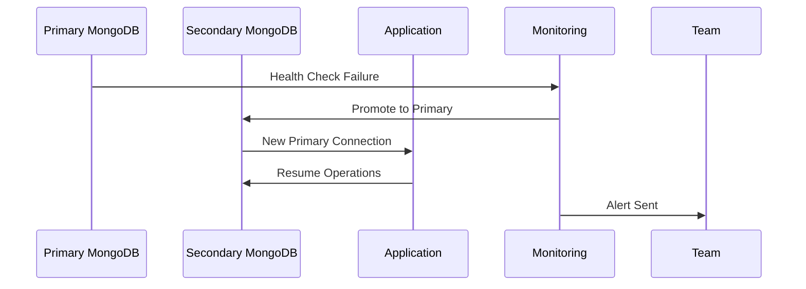

# MongoDB Foundation Service - Technical Architecture

## Executive Summary

This document defines the technical architecture for the MongoDB Foundation Service deployment within the eyewear ML platform ecosystem. It establishes the architectural patterns, component interactions, and technical decisions that support the comprehensive deployment and monitoring strategy.

## Architecture Overview

### System Context Diagram



## Component Architecture

### 1. MongoDB Foundation Service Components

#### 1.1 Core Service Architecture

```typescript
// Service Architecture Pattern
interface MongoDBFoundationService {
  // Data Access Layer
  repositories: {
    productRepository: ProductRepository;
    userRepository: UserRepository;
    analyticsRepository: AnalyticsRepository;
  };
  
  // Business Logic Layer
  services: {
    skuGenieIntegrationService: SKUGenieIntegrationService;
    aiProcessingService: AIProcessingService;
    dataValidationService: DataValidationService;
  };
  
  // API Layer
  controllers: {
    productController: ProductController;
    healthController: HealthController;
    metricsController: MetricsController;
  };
  
  // Infrastructure Layer
  infrastructure: {
    mongoConnection: MongoConnection;
    cacheManager: CacheManager;
    messageQueue: MessageQueue;
  };
}
```

#### 1.2 Data Flow Architecture



### 2. Database Architecture

#### 2.1 MongoDB Replica Set Design

```yaml
# MongoDB Deployment Architecture
ReplicaSet:
  name: rs0
  members:
    - primary: mongodb-foundation-0
      priority: 2
      votes: 1
    - secondary: mongodb-foundation-1
      priority: 1
      votes: 1
    - secondary: mongodb-foundation-2
      priority: 1
      votes: 1
  
  configuration:
    readPreference: secondaryPreferred
    writeConcern: majority
    readConcern: majority
```

#### 2.2 Data Model Architecture

```javascript
// Core Collections Schema
const schemas = {
  products: {
    _id: ObjectId,
    sku: String, // Indexed
    name: String,
    brand: String, // Indexed
    category: String, // Indexed
    specifications: {
      frameShape: String,
      material: String,
      color: String,
      size: Object
    },
    aiEnhancements: {
      faceShapeCompatibility: [String],
      styleRecommendations: [Object],
      processedAt: Date
    },
    metadata: {
      source: String, // 'sku-genie', 'manual', etc.
      version: Number,
      createdAt: Date,
      updatedAt: Date
    }
  },
  
  analytics: {
    _id: ObjectId,
    productId: ObjectId, // Indexed
    eventType: String, // Indexed
    userId: String,
    sessionId: String,
    data: Object,
    timestamp: Date // TTL Index (30 days)
  },
  
  processingQueue: {
    _id: ObjectId,
    productId: ObjectId,
    taskType: String, // 'ai-enhancement', 'validation', etc.
    status: String, // 'pending', 'processing', 'completed', 'failed'
    priority: Number,
    createdAt: Date,
    processedAt: Date,
    error: String
  }
};
```

### 3. Monitoring Architecture

#### 3.1 Observability Stack Integration



#### 3.2 Metrics Architecture

```typescript
// Metrics Collection Strategy
interface MetricsArchitecture {
  // Application Metrics
  applicationMetrics: {
    httpRequestDuration: HistogramMetric;
    httpRequestsTotal: CounterMetric;
    activeConnections: GaugeMetric;
    errorRate: CounterMetric;
  };
  
  // Business Metrics
  businessMetrics: {
    skuGenieIngestionRate: GaugeMetric;
    aiProcessingDuration: HistogramMetric;
    dataQualityScore: HistogramMetric;
    conflictResolutionCount: CounterMetric;
  };
  
  // Infrastructure Metrics
  infrastructureMetrics: {
    mongoQueryDuration: HistogramMetric;
    mongoOperationsTotal: CounterMetric;
    connectionPoolUtilization: GaugeMetric;
    cacheHitRate: GaugeMetric;
  };
}
```

## Deployment Architecture

### 1. Container Architecture

```dockerfile
# Multi-stage build architecture
FROM node:18-alpine AS dependencies
WORKDIR /app
COPY package*.json ./
RUN npm ci --only=production

FROM node:18-alpine AS build
WORKDIR /app
COPY . .
RUN npm run build

FROM node:18-alpine AS runtime
RUN addgroup -g 1001 -S nodejs && \
    adduser -S mongodb-foundation -u 1001 -G nodejs

WORKDIR /app
COPY --from=dependencies /app/node_modules ./node_modules
COPY --from=build /app/dist ./dist
COPY --chown=mongodb-foundation:nodejs package*.json ./

USER mongodb-foundation
EXPOSE 3000
HEALTHCHECK --interval=30s --timeout=3s CMD curl -f http://localhost:3000/health
CMD ["node", "dist/index.js"]
```

### 2. Kubernetes Deployment Architecture

#### 2.1 Resource Allocation Strategy

```yaml
# Resource allocation based on workload patterns
resources:
  mongodb-foundation-service:
    requests:
      memory: "512Mi"
      cpu: "250m"
    limits:
      memory: "1Gi"
      cpu: "500m"
    replicas: 3
    
  mongodb:
    requests:
      memory: "2Gi"
      cpu: "500m"
    limits:
      memory: "4Gi"
      cpu: "1000m"
    replicas: 3
    storage: "100Gi"
```

#### 2.2 High Availability Architecture

```yaml
# HA Configuration
highAvailability:
  podDisruptionBudget:
    minAvailable: 2
  
  affinity:
    podAntiAffinity:
      preferredDuringSchedulingIgnoredDuringExecution:
      - weight: 100
        podAffinityTerm:
          labelSelector:
            matchExpressions:
            - key: app
              operator: In
              values: [mongodb-foundation]
          topologyKey: kubernetes.io/hostname
  
  horizontalPodAutoscaler:
    minReplicas: 3
    maxReplicas: 10
    metrics:
    - type: Resource
      resource:
        name: cpu
        target:
          type: Utilization
          averageUtilization: 70
```

## Security Architecture

### 1. Zero Trust Security Model



### 2. Secret Management Architecture

```yaml
# Secret management flow
secretManagement:
  externalSecretsOperator:
    provider: googleSecretManager
    refreshInterval: 1h
    
  secretStores:
    - name: mongodb-credentials
      keys:
        - mongodb-username
        - mongodb-password
        - mongodb-uri
        
  encryption:
    atRest: googleCloudKMS
    inTransit: TLS1.3
```

## Performance Architecture

### 1. Caching Strategy

```typescript
// Multi-layer caching architecture
interface CachingArchitecture {
  // Application Level Cache
  applicationCache: {
    type: 'Redis';
    ttl: 300; // 5 minutes
    maxMemory: '512MB';
    evictionPolicy: 'allkeys-lru';
  };
  
  // Database Level Cache
  databaseCache: {
    mongodbCache: {
      wiredTigerCacheSizeGB: 2;
      indexCache: 'enabled';
    };
  };
  
  // CDN Cache
  cdnCache: {
    staticAssets: {
      ttl: 86400; // 24 hours
      compression: 'gzip';
    };
  };
}
```

### 2. Query Optimization Strategy

```javascript
// Database optimization architecture
const indexStrategy = {
  // Core indexes for frequent queries
  productIndexes: [
    { sku: 1 }, // Unique index
    { brand: 1, category: 1 }, // Compound index
    { 'metadata.createdAt': 1 }, // Time-based queries
    { 'aiEnhancements.faceShapeCompatibility': 1 } // AI queries
  ],
  
  // Analytics indexes
  analyticsIndexes: [
    { productId: 1, timestamp: -1 }, // Time series queries
    { eventType: 1, timestamp: -1 }, // Event-based analytics
    { timestamp: 1, expireAfterSeconds: 2592000 } // TTL index (30 days)
  ]
};
```

## Integration Architecture

### 1. External System Integration

```typescript
// Integration patterns
interface IntegrationArchitecture {
  // SKU Genie Integration
  skuGenieIntegration: {
    pattern: 'EventDriven';
    protocol: 'HTTP/REST';
    resilience: {
      retryPolicy: ExponentialBackoff;
      circuitBreaker: Enabled;
      timeout: 30000;
    };
  };
  
  // AI Services Integration
  aiServicesIntegration: {
    pattern: 'AsyncMessaging';
    protocol: 'MessageQueue';
    queueManager: 'GoogleCloudTasks';
    batchProcessing: Enabled;
  };
  
  // PostgreSQL Synchronization
  postgresqlSync: {
    pattern: 'ChangeDataCapture';
    frequency: 'RealTime';
    conflictResolution: 'LastWriteWins';
  };
}
```

### 2. API Gateway Integration

```yaml
# API Gateway routing configuration
apiGateway:
  routes:
    - path: /api/v1/products
      service: mongodb-foundation-service
      methods: [GET, POST, PUT, DELETE]
      rateLimit: 1000/minute
      authentication: required
      
    - path: /api/v1/health
      service: mongodb-foundation-service
      methods: [GET]
      authentication: none
      
    - path: /api/v1/metrics
      service: mongodb-foundation-service
      methods: [GET]
      authentication: monitoring
```

## Scalability Architecture

### 1. Horizontal Scaling Strategy



### 2. Performance Targets

| Component | Metric | Target | Scaling Trigger |
|-----------|--------|--------|-----------------|
| Service Instances | CPU Utilization | < 70% | Scale at 70% |
| MongoDB | Memory Usage | < 80% | Add read replicas |
| Response Time | 95th Percentile | < 500ms | Scale horizontally |
| Throughput | Requests/sec | 1000+ | Auto-scale pods |

## Disaster Recovery Architecture

### 1. Backup Strategy

```yaml
# Backup and recovery architecture
backupStrategy:
  mongodb:
    type: continuousBackup
    frequency: every15minutes
    retention: 30days
    encryption: googleCloudKMS
    
  kubernetes:
    etcdBackup:
      frequency: daily
      retention: 7days
    
    veleroBackup:
      schedule: "0 2 * * *"
      includeClusterResources: true
```

### 2. Failover Strategy



## Implementation Priorities

### Phase 1: Core Infrastructure (Days 1-7)
1. Deploy MongoDB replica set with basic monitoring
2. Implement service mesh and network policies
3. Set up secret management and RBAC

### Phase 2: Advanced Observability (Days 8-14)
1. Complete metrics collection and dashboards
2. Implement distributed tracing
3. Configure intelligent alerting

### Phase 3: Production Readiness (Days 15-21)
1. Performance optimization and load testing
2. Security hardening and compliance
3. Documentation and operational procedures

This technical architecture provides the foundation for a robust, scalable, and observable MongoDB Foundation Service that integrates seamlessly with the existing eyewear ML platform ecosystem.