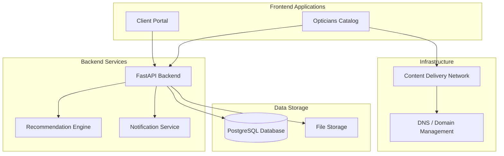
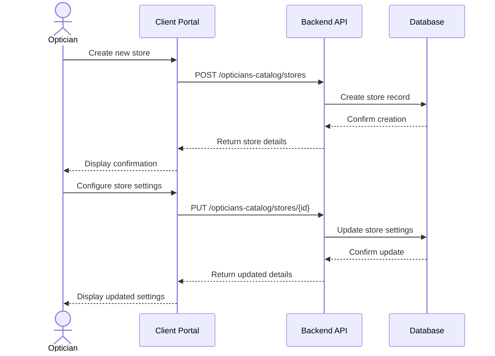
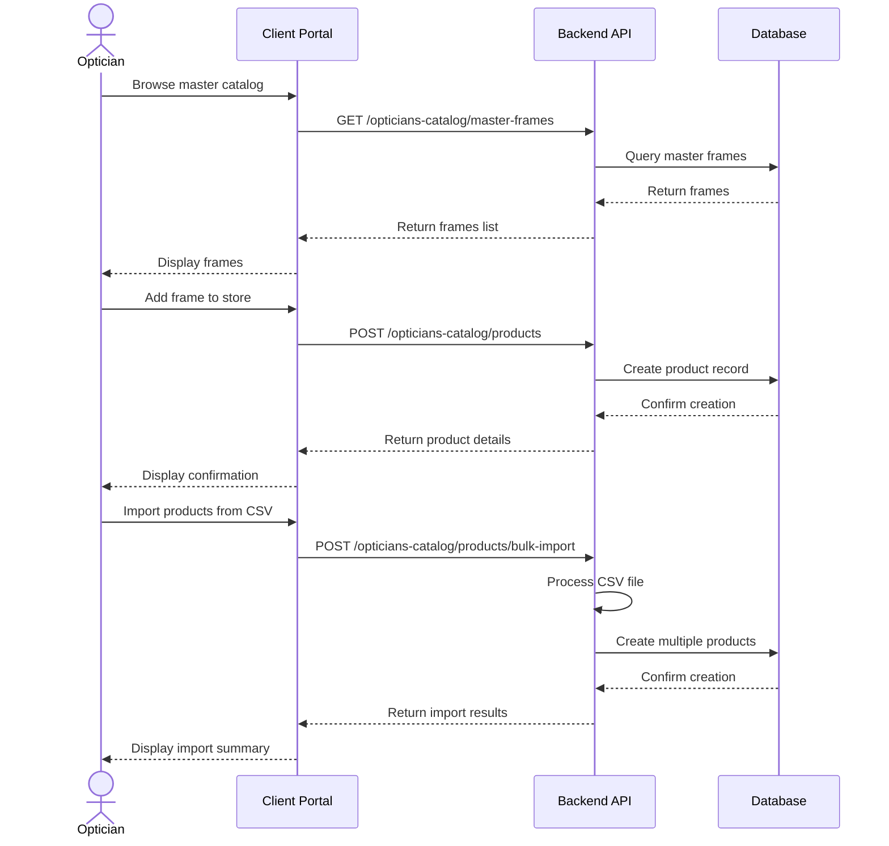
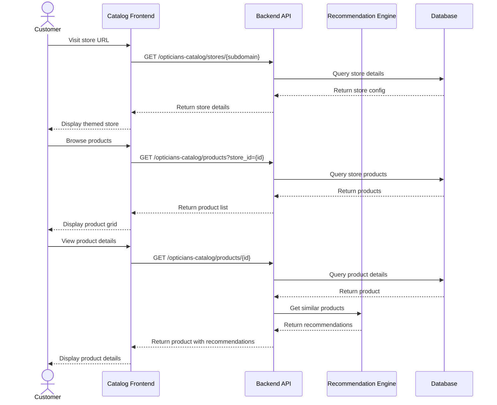
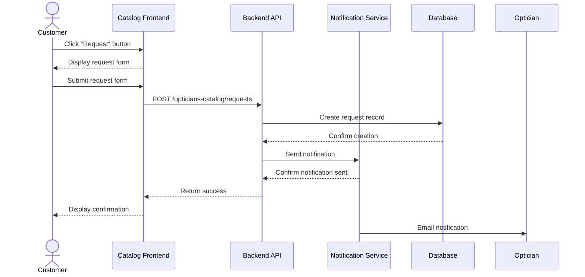

# Opticians Catalog Technical Architecture

This document outlines the technical architecture for the Opticians Catalog feature, including system components, data flow, and technology choices.

## System Architecture Overview

## Component Details

### Frontend Applications

1. **Client Portal Extensions**
   - Technology: React + TypeScript (extending existing client portal)
   - Purpose: Admin interface for opticians to manage their catalog
   - Key Components:
     - Store dashboard
     - Product management
     - Request management
     - Store settings and customization

2. **Customer-Facing Catalog**
   - Technology: React + TypeScript (new standalone application)
   - Purpose: Public-facing browseable catalog for customers
   - Key Components:
     - Dynamic theming based on store settings
     - Product browsing and search
     - Product detail views
     - Request/reservation form
     - Recommendation display

### Backend Services

1. **FastAPI Backend**
   - Technology: Python + FastAPI (extending existing API)
   - Purpose: Core business logic and data management
   - Key Components:
     - Store management API
     - Product management API
     - Request management API
     - Form template and page customization API
     - Master frame database integration
     - CSV/Excel import service

2. **Recommendation Engine**
   - Technology: Existing ML infrastructure
   - Purpose: Generate personalized product recommendations
   - Integration Points:
     - Product recommendation API
     - User preference tracking
     - Recommendation performance analytics

3. **Notification Service**
   - Technology: Python + Message Queue (RabbitMQ/Redis)
   - Purpose: Handle notifications for new requests and updates
   - Key Components:
     - Email notifications
     - In-app notifications
     - Optional SMS integration

### Data Storage

1. **PostgreSQL Database**
   - Purpose: Primary data storage
   - Key Data:
     - Optician store information
     - Product catalog
     - Customer requests
     - Analytics data
     - Form templates and page customizations

2. **File Storage**
   - Technology: S3-compatible object storage
   - Purpose: Store uploaded files and assets
   - Key Data:
     - Store logos and images
     - Product images
     - Imported CSV/Excel files
     - Generated exports

### Infrastructure

1. **DNS / Domain Management**
   - Purpose: Handle custom domains and subdomains
   - Key Components:
     - Subdomain routing (storex.ourplatform.com)
     - Custom domain verification
     - SSL certificate management

2. **Content Delivery Network**
   - Purpose: Deliver static assets and improve performance
   - Key Components:
     - Asset caching
     - Image optimization
     - Global distribution

## Data Flow

### Store Creation and Setup

### Product Management

### Customer Catalog Browsing

### Request Submission

## Technology Stack

### Frontend
- **Framework**: React 18+
- **Language**: TypeScript
- **State Management**: React Context API / Redux
- **Styling**: CSS Modules / Styled Components
- **UI Components**: Custom components based on existing design system
- **Build Tool**: Vite
- **Testing**: Jest + React Testing Library

### Backend
- **Framework**: FastAPI
- **Language**: Python 3.9+
- **ORM**: SQLAlchemy
- **API Documentation**: OpenAPI / Swagger
- **Authentication**: JWT (existing auth system)
- **File Processing**: Pandas for CSV/Excel
- **Testing**: Pytest

### Database
- **Primary Database**: PostgreSQL
- **Migrations**: Alembic
- **File Storage**: S3-compatible object storage

### Infrastructure
- **Hosting**: Existing cloud infrastructure
- **CI/CD**: Existing pipeline with extensions
- **Monitoring**: Existing monitoring with new metrics
- **Logging**: Structured logging with context

## Security Considerations

1. **Authentication and Authorization**
   - Leverage existing auth system
   - Role-based access control for optician vs. customer
   - Store-specific permissions

2. **Data Protection**
   - Secure storage of customer information
   - Optional encryption for prescription data
   - GDPR compliance for customer requests

3. **Domain Security**
   - Domain verification for custom domains
   - SSL certificates for all domains
   - Protection against domain spoofing

4. **API Security**
   - Rate limiting
   - Input validation
   - CSRF protection
   - Security headers

## Scalability Considerations

1. **Database Scaling**
   - Efficient indexing for store-specific queries
   - Potential sharding by store for large deployments
   - Read replicas for analytics queries

2. **Frontend Performance**
   - Code splitting for catalog application
   - Static asset optimization
   - Lazy loading of product images

3. **API Performance**
   - Caching for store configuration and product data
   - Pagination for large product catalogs
   - Background processing for imports and exports

4. **Multi-tenancy**
   - Isolation between different optician stores
   - Resource limits per store
   - Monitoring for abnormal usage patterns
