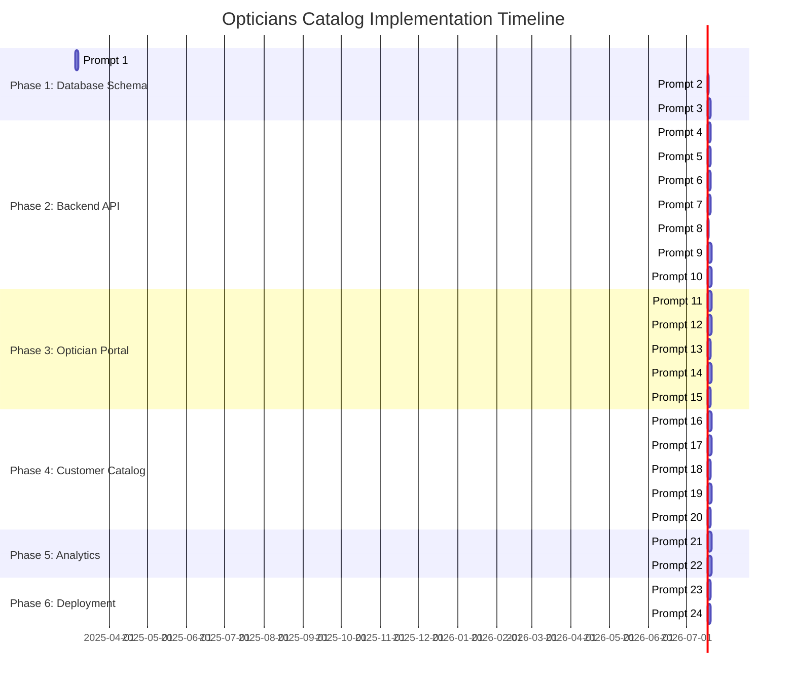

# Opticians Catalog Implementation Timeline

This document provides an estimated timeline for implementing the Opticians Catalog feature based on the project plan. The timeline is organized by phase and includes estimated durations for each prompt.

## Timeline Overview

## Detailed Timeline Breakdown

### Phase 1: Database Schema and Core Models (5 days)
- **Prompt 1: Database Models** (2 days)
  - Day 1: Design and implement core models
  - Day 2: Implement relationships and validation
- **Prompt 2: Database Migrations** (1 day)
  - Create and test migration scripts
- **Prompt 3: Pydantic Models** (2 days)
  - Day 1: Create base and input models
  - Day 2: Create response models and validation

### Phase 2: Backend API Implementation (15 days)
- **Prompt 4: Store Management API** (2 days)
  - Day 1: Implement CRUD endpoints
  - Day 2: Add validation and testing
- **Prompt 5: Product Management API** (2 days)
  - Day 1: Implement CRUD endpoints
  - Day 2: Add validation and testing
- **Prompt 6: Request Management API** (2 days)
  - Day 1: Implement CRUD endpoints
  - Day 2: Add validation and testing
- **Prompt 7: Form Template and Page Customization APIs** (2 days)
  - Day 1: Implement form template endpoints
  - Day 2: Implement page customization endpoints
- **Prompt 8: Master Frame Database Integration** (1 day)
  - Implement search and filtering
- **Prompt 9: CSV/Excel Import Service** (3 days)
  - Day 1: Implement file upload and parsing
  - Day 2: Add validation and mapping
  - Day 3: Add error handling and batch processing
- **Prompt 10: Notification System** (3 days)
  - Day 1: Implement notification types
  - Day 2: Implement delivery methods
  - Day 3: Add preferences and settings

### Phase 3: Optician Portal Frontend (13 days)
- **Prompt 11: Store Dashboard Components** (3 days)
  - Day 1: Create dashboard layout
  - Day 2: Implement summary widgets
  - Day 3: Add activity feed
- **Prompt 12: Product Management UI** (3 days)
  - Day 1: Create product listing
  - Day 2: Implement product detail/edit form
  - Day 3: Add master catalog browser
- **Prompt 13: Request Management UI** (2 days)
  - Day 1: Create request listing
  - Day 2: Implement request detail view
- **Prompt 14: Store Settings UI** (3 days)
  - Day 1: Implement general settings
  - Day 2: Add appearance settings
  - Day 3: Create form template editor
- **Prompt 15: Integrate with Client Portal** (2 days)
  - Day 1: Add navigation and routes
  - Day 2: Implement permission checks

### Phase 4: Customer-Facing Catalog (13 days)
- **Prompt 16: Create Catalog Frontend Structure** (3 days)
  - Day 1: Set up application structure
  - Day 2: Implement domain routing
  - Day 3: Create base layout components
- **Prompt 17: Implement Product Browsing Experience** (3 days)
  - Day 1: Create homepage
  - Day 2: Implement product listing
  - Day 3: Add search functionality
- **Prompt 18: Implement Product Detail Page** (2 days)
  - Day 1: Create product gallery
  - Day 2: Implement product information display
- **Prompt 19: Implement Request Form and Flow** (3 days)
  - Day 1: Create multi-step form
  - Day 2: Add validation
  - Day 3: Implement submission handling
- **Prompt 20: Implement Recommendation Integration** (2 days)
  - Day 1: Create recommendation components
  - Day 2: Implement tracking and preference capture

### Phase 5: Analytics and Reporting (6 days)
- **Prompt 21: Implement Catalog Analytics Tracking** (3 days)
  - Day 1: Implement tracking events
  - Day 2: Create data aggregation
  - Day 3: Implement storage
- **Prompt 22: Create Analytics Dashboard for Opticians** (3 days)
  - Day 1: Create overview dashboard
  - Day 2: Implement detailed reports
  - Day 3: Add export functionality

### Phase 6: Deployment and Infrastructure (4 days)
- **Prompt 23: Implement Subdomain/Custom Domain Handling** (2 days)
  - Day 1: Implement subdomain routing
  - Day 2: Create domain verification
- **Prompt 24: Create Deployment Pipeline Updates** (2 days)
  - Day 1: Update build steps
  - Day 2: Configure domain handling

## Total Estimated Duration: 56 working days (approximately 11-12 weeks)

## Assumptions and Notes

1. This timeline assumes:
   - One developer working on each prompt at a time
   - No significant blockers or dependencies outside the project
   - Availability of necessary resources and infrastructure

2. Parallel work:
   - Some prompts could be worked on in parallel with additional developers
   - Backend and frontend work could be parallelized after Phase 2

3. Testing and QA:
   - Each prompt includes time for unit testing
   - Additional time should be allocated for QA and integration testing
   - User acceptance testing should be scheduled after each phase

4. Adjustments:
   - Timeline should be reviewed and adjusted after each phase
   - Additional time may be needed for addressing feedback and refinements
