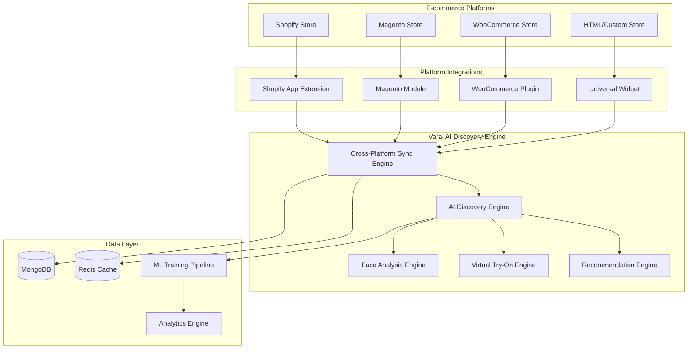

# Platform Integration Pseudocode Overview
## Agent 3: Platform Integration Pseudocode Agent

## Document Information
- **Document Type**: Platform Integration Overview
- **System**: EyewearML Varai AI Discovery
- **Version**: 1.0
- **Date**: January 2025
- **Author**: Agent 3 - Platform Integration Pseudocode Agent

## Executive Summary

This document provides a comprehensive overview of the platform integration pseudocode for Varai AI discovery across all e-commerce platforms. The pseudocode is organized into specialized documents for better maintainability and focused implementation guidance.

## Document Structure

### Core Integration Documents

1. **[Shopify AI Discovery Enhancement](platform-integration-pseudocode.md#1-shopify-ai-discovery-enhancement-pseudocode)**
   - Enhanced Shopping Assistant with AI Discovery
   - Shopify App Extension Integration
   - Liquid Template Integration
   - Webhook Management

2. **[Magento Module Extension](platform-integration-pseudocode.md#2-magento-module-extension-pseudocode)**
   - Magento Module Structure
   - AI Discovery Block Classes
   - Controller Implementation
   - Layout XML Integration

3. **[WooCommerce Plugin Enhancement](woocommerce-integration-pseudocode.md)**
   - Complete WooCommerce plugin structure
   - WordPress action hooks integration
   - Shortcode implementation
   - Admin interface

4. **[HTML/Custom Store Widget](html-widget-integration-pseudocode.md)**
   - Universal widget implementation
   - Cross-browser compatibility
   - Responsive design
   - Product detection algorithms

5. **[Cross-Platform Data Synchronization](cross-platform-synchronization-pseudocode.md)**
   - Central synchronization engine
   - Platform-specific connectors
   - Conflict resolution strategies
   - Real-time event processing

## Architecture Overview

### High-Level Integration Architecture



## Implementation Priorities

### Phase 1: Foundation (Weeks 1-2)
1. **Shopify Integration** - Highest priority due to market share (32%)
   - Enhanced Shopping Assistant
   - Basic face analysis integration
   - Product recommendation engine

2. **HTML Widget** - Universal compatibility for custom stores (29% market)
   - Core widget functionality
   - Face analysis implementation
   - Basic product detection

### Phase 2: Core Platforms (Weeks 3-4)
3. **WooCommerce Plugin** - WordPress ecosystem (28% market)
   - Plugin architecture
   - WordPress hooks integration
   - Admin interface

4. **Cross-Platform Sync** - Data consistency across platforms
   - Central synchronization engine
   - Real-time event processing
   - Conflict resolution

### Phase 3: Advanced Features (Weeks 5-6)
5. **Magento Module** - Enterprise focus (7% market)
   - Complex module architecture
   - Advanced customization options
   - Enterprise-grade features

6. **Virtual Try-On Integration** - Enhanced user experience
   - 3D rendering engine
   - Real-time face tracking
   - Cross-platform compatibility

### Phase 4: Optimization (Weeks 7-8)
7. **Performance Optimization** - Scalability and speed
   - Caching strategies
   - CDN integration
   - Mobile optimization

8. **Analytics and ML** - Intelligence and insights
   - Advanced analytics
   - ML model training
   - Predictive recommendations

## Key Features by Platform

### Shopify Integration Features
- ✅ Enhanced Shopping Assistant with AI Discovery
- ✅ Face analysis using MediaPipe
- ✅ Personalized frame recommendations (max 8)
- ✅ Virtual try-on integration
- ✅ Liquid template integration
- ✅ App Store compliance
- ✅ Webhook-based real-time sync
- ✅ Mobile-responsive design

### WooCommerce Integration Features
- ✅ WordPress plugin architecture
- ✅ WooCommerce hooks integration
- ✅ Shortcode support for flexible placement
- ✅ Admin settings interface
- ✅ Multi-language support
- ✅ Product attribute mapping
- ✅ Cart integration
- ✅ Analytics tracking

### Magento Integration Features
- ✅ Magento 2 module structure
- ✅ Layout XML integration
- ✅ Block and controller architecture
- ✅ Admin configuration
- ✅ Multi-store support
- ✅ Advanced caching
- ✅ Enterprise features
- ✅ API integration

### HTML Widget Features
- ✅ Universal compatibility
- ✅ No dependencies on specific platforms
- ✅ Automatic product detection
- ✅ Responsive design
- ✅ Cross-browser support
- ✅ Customizable styling
- ✅ Event-driven architecture
- ✅ Privacy-compliant processing

### Cross-Platform Sync Features
- ✅ Real-time data synchronization
- ✅ Conflict resolution strategies
- ✅ Event-driven architecture
- ✅ Platform-specific connectors
- ✅ MongoDB central storage
- ✅ Redis caching layer
- ✅ ML training data collection
- ✅ Analytics aggregation

## Technical Specifications

### Performance Requirements
- **Widget Load Time**: <2 seconds
- **Face Analysis**: <5 seconds
- **Recommendations**: <3 seconds
- **Virtual Try-On**: <1 second activation
- **API Response**: <500ms (95th percentile)
- **Mobile Performance**: 90+ Lighthouse score

### Scalability Targets
- **Concurrent Users**: 10,000+
- **API Requests**: 1M+ per day
- **Data Sync Latency**: <100ms for critical events
- **Uptime**: 99.9% SLA
- **Error Rate**: <1% under normal load

### Security and Privacy
- **Data Encryption**: TLS 1.3 in transit, AES-256 at rest
- **Face Analysis**: Client-side processing, no image storage
- **GDPR/CCPA**: Full compliance with privacy regulations
- **Authentication**: OAuth 2.0 for platform APIs
- **API Security**: Rate limiting, input validation

## Error Handling and Fallback Logic

### Face Analysis Fallbacks
```typescript
FUNCTION handleFaceAnalysisError(error) {
  SWITCH (error.type) {
    CASE 'camera_permission_denied':
      RETURN this.showManualMeasurementOption()
    CASE 'no_face_detected':
      RETURN this.showRetryWithInstructions()
    CASE 'poor_lighting':
      RETURN this.showLightingGuidance()
    CASE 'mediapipe_load_failed':
      RETURN this.fallbackToBasicRecommendations()
    DEFAULT:
      RETURN this.showGenericErrorWithSupport()
  }
}
```

### API Fallbacks
```typescript
FUNCTION handleAPIError(error, operation) {
  SWITCH (operation) {
    CASE 'recommendations':
      RETURN this.getCachedRecommendations() || this.getBasicRecommendations()
    CASE 'face_analysis':
      RETURN this.useLocalAnalysis() || this.skipAnalysis()
    CASE 'virtual_try_on':
      RETURN this.show2DPreview() || this.showProductImages()
    DEFAULT:
      RETURN this.showOfflineMode()
  }
}
```

### Offline Mode Support
```typescript
FUNCTION enableOfflineMode() {
  // Cache essential data
  this.cacheProductCatalog()
  this.cacheRecommendationEngine()
  
  // Switch to local processing
  this.useLocalFaceAnalysis()
  this.useBasicRecommendations()
  
  // Queue sync operations
  this.queuePendingOperations()
  
  // Show offline indicator
  this.showOfflineIndicator()
}
```

## Testing Strategy

### Unit Testing
- Individual component testing
- Mock API responses
- Error condition simulation
- Performance benchmarking

### Integration Testing
- Cross-platform compatibility
- API integration testing
- Webhook processing
- Data synchronization

### End-to-End Testing
- Complete user journeys
- Multi-platform scenarios
- Performance under load
- Security penetration testing

### Browser Compatibility Testing
- Chrome (latest 3 versions)
- Firefox (latest 3 versions)
- Safari (latest 2 versions)
- Edge (latest 2 versions)
- Mobile browsers (iOS 14+, Android 8+)

## Deployment Strategy

### Staging Environment
1. Deploy to staging environment
2. Run automated test suite
3. Manual QA testing
4. Performance validation
5. Security audit

### Production Deployment
1. Blue-green deployment strategy
2. Gradual rollout (10% → 50% → 100%)
3. Real-time monitoring
4. Rollback capability
5. Post-deployment validation

### Platform-Specific Deployment
- **Shopify**: App Store submission and review process
- **WooCommerce**: WordPress Plugin Directory submission
- **Magento**: Marketplace submission and validation
- **HTML Widget**: CDN deployment and version management

## Monitoring and Analytics

### Key Metrics
- Widget load times and performance
- Face analysis success rates
- Recommendation click-through rates
- Virtual try-on engagement
- Conversion rates by platform
- Error rates and types
- User satisfaction scores

### Alerting
- Performance degradation alerts
- Error rate threshold alerts
- API availability monitoring
- Security incident detection
- Capacity planning alerts

## Conclusion

This comprehensive platform integration pseudocode provides a solid foundation for implementing Varai AI discovery across all major e-commerce platforms. The modular approach ensures maintainability while the detailed specifications enable consistent implementation across different platform architectures.

The phased implementation strategy prioritizes high-impact platforms while building the necessary infrastructure for cross-platform data synchronization and advanced AI features. The emphasis on performance, security, and user experience ensures a successful deployment that meets both technical and business requirements.

## Related Documents

- [Shopify AI Discovery Requirements](../specifications/shopify-ai-discovery-requirements.md)
- [Cross-Platform Integration Matrix](../specifications/cross-platform-integration-matrix.md)
- [Data Synchronization Specification](../specifications/data-synchronization-spec.md)
- [Performance Optimization Specification](../specifications/performance-optimization-spec.md)
- [Privacy Data Flow Specification](../specifications/privacy-data-flow-spec.md)