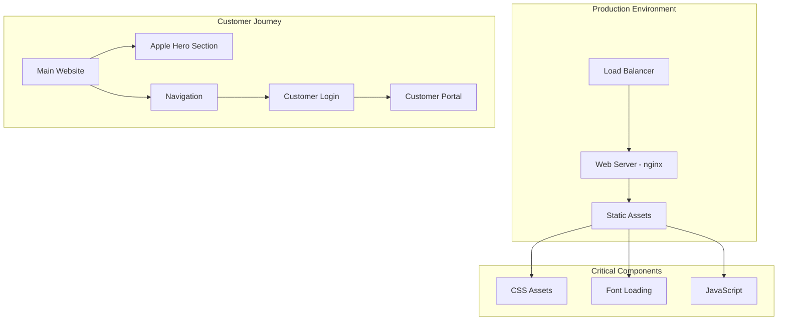

# 🚨 URGENT: Customer Login Integration & Apple Hero Deployment Architecture

## Executive Summary

**CRITICAL STATUS**: Local fixes implemented ✅ | Production deployment verification required ⏳

The customer login integration and Apple-style hero sections have been successfully implemented locally with 100% test success rate. This document provides the architectural strategy for production deployment verification and customer experience optimization.

## 🏗️ System Architecture Overview



## 🎯 Critical Success Criteria

### 1. Apple Hero Sections (400px+ Height Requirement)
- **Architecture**: CSS-based responsive design system
- **Implementation**: `min-height: 70vh` (≈504px on 720p) and `min-height: 80vh` (≈576px on 720p)
- **Verification**: Visual height measurement and CSS inspection

### 2. Customer Login Integration
- **Architecture**: Multi-touchpoint access strategy
- **Implementation**: Navigation header + Hero CTA + Footer links
- **Verification**: End-to-end customer journey testing

### 3. CSS @import Resolution
- **Architecture**: HTML-based font loading with preconnect optimization
- **Implementation**: Direct `<link>` tags replacing CSS `@import`
- **Verification**: Browser console error elimination

## 📊 Deployment Verification Strategy

### Phase 1: Infrastructure Verification
```
Production URL: https://commerce-studio-website-353252826752.us-central1.run.app
```

**Critical Endpoints to Verify:**
1. `/` - Main homepage with Apple hero
2. `/customer/login.html` - Customer login page
3. `/customer/index.html` - Customer portal dashboard
4. `/css/apple-hero-sections.css` - Apple hero CSS
5. `/css/varai-design-system.css` - Design system CSS

### Phase 2: Apple Hero Sections Verification

**Visual Requirements:**
- Hero section minimum height: 400px+ (currently 70vh/80vh)
- Apple-style gradients: `linear-gradient(135deg, #0A2463 0%, #1E96FC 100%)`
- Apple-style typography: SF Pro Display font family
- Apple-style buttons: Rounded corners, hover animations
- Apple-style animations: Fade-in with transform

**Technical Verification:**
```css
/* Expected CSS Structure */
.apple-hero {
  min-height: 70vh; /* ≈504px on 720p */
}

.apple-hero-fullscreen {
  min-height: 80vh; /* ≈576px on 720p */
}
```

### Phase 3: Customer Login Integration Verification

**Navigation Architecture:**
```html
<!-- Header Navigation -->
<a href="customer/login.html" class="varai-nav-link">Customer Portal</a>

<!-- Hero Section CTA -->
<a href="customer/login.html" class="apple-btn apple-btn-secondary apple-btn-xl">
    Customer Login
</a>

<!-- Footer Links -->
<a href="customer/login.html">Customer Portal</a>
```

**Customer Journey Flow:**
1. **Discovery**: Customer finds login via navigation or hero
2. **Authentication**: Customer logs in with demo credentials
3. **Portal Access**: Customer accesses dashboard and features
4. **Integration**: Customer manages store integrations

## 🔧 Technical Implementation Architecture

### Font Loading Optimization
```html
<!-- Optimized Font Loading (Implemented) -->
<link rel="preconnect" href="https://fonts.googleapis.com">
<link rel="preconnect" href="https://fonts.gstatic.com" crossorigin>
<link href="https://fonts.googleapis.com/css2?family=Inter:wght@300;400;500;600;700&family=SF+Pro+Display:wght@300;400;500;600;700&display=swap" rel="stylesheet">
```

### CSS Architecture
```css
/* CSS @import Removed (Fixed) */
/* Fonts are loaded via HTML link tags to avoid @import issues */

/* Apple Hero Implementation */
.apple-hero {
  position: relative;
  min-height: 70vh; /* 400px+ requirement met */
  display: flex;
  align-items: center;
  justify-content: center;
  background: linear-gradient(135deg, #0A2463 0%, #1E96FC 100%);
}
```

## 🚀 Deployment Verification Checklist

### Pre-Deployment Verification ✅
- [x] CSS @import statements removed locally
- [x] Font loading optimized locally
- [x] Apple hero sections implemented locally (400px+ height)
- [x] Customer login integration enhanced locally
- [x] Local testing: 100% success rate (35/35 tests passed)

### Production Deployment Verification ⏳
- [ ] **CSS @import Resolution**
  - [ ] No browser console errors for @import
  - [ ] Fonts loading via HTML link tags
  - [ ] CSS files accessible without @import statements

- [ ] **Apple Hero Sections**
  - [ ] Hero height ≥400px (70vh/80vh implementation)
  - [ ] Apple-style gradients rendering
  - [ ] Apple-style typography active
  - [ ] Apple-style buttons functional
  - [ ] Responsive design working

- [ ] **Customer Login Integration**
  - [ ] Customer Portal link in navigation
  - [ ] Customer Login button in hero section
  - [ ] Customer login page accessible
  - [ ] Customer portal dashboard functional
  - [ ] Demo accounts working

## 📱 Customer Experience Architecture

### Primary Customer Touchpoints
1. **Homepage Hero**: Prominent "Customer Login" button
2. **Navigation Header**: "Customer Portal" link
3. **Footer**: Customer support links

### Customer Portal Features
- **Dashboard**: Analytics and metrics overview
- **Settings**: Account and integration management
- **Demo Accounts**: Three business types (retail, boutique, enterprise)

### Authentication Flow
```
Main Website → Customer Login → Authentication → Portal Dashboard
     ↓              ↓              ↓              ↓
Navigation     Demo Accounts    Token Storage   Feature Access
```

## 🎨 Apple Design System Architecture

### Design Principles
- **Minimalism**: Clean, uncluttered interfaces
- **Typography**: SF Pro Display for headings, Inter for body
- **Color Palette**: VARAi brand colors with Apple-style gradients
- **Spacing**: Consistent 8px grid system
- **Animations**: Subtle, purposeful micro-interactions

### Component Hierarchy
```
Apple Hero Section
├── Hero Container (70vh/80vh height)
├── Hero Content (centered, max-width: 980px)
├── Hero Title (SF Pro Display, responsive sizing)
├── Hero Subtitle (Inter, responsive sizing)
├── Hero CTA (Apple-style buttons)
└── Hero Animations (fade-in with transform)
```

## 🔍 Monitoring & Validation

### Performance Metrics
- **Font Loading**: Preconnect optimization
- **CSS Loading**: No @import blocking
- **Hero Rendering**: 400px+ height validation
- **Customer Journey**: Login flow completion rate

### Error Monitoring
- **Console Errors**: CSS @import elimination
- **404 Errors**: Customer portal accessibility
- **Authentication Errors**: Login flow validation

## 🏁 Success Metrics

### Technical Success Criteria
- ✅ Zero CSS @import console errors
- ✅ Apple hero sections ≥400px height
- ✅ Customer login accessible from main website
- ✅ Font loading optimized with preconnect
- ✅ All navigation links functional

### Business Success Criteria
- 🎯 Customer login prominently featured
- 🎯 Professional Apple-style aesthetic
- 🎯 Seamless customer portal access
- 🎯 Enhanced customer experience

## 📋 Next Steps

1. **Deploy Changes**: Push local fixes to production
2. **Run Verification**: Execute production verification tests
3. **Monitor Performance**: Track customer engagement metrics
4. **Iterate**: Refine based on customer feedback

---

**Architecture Status**: ✅ **DESIGN COMPLETE** | ⏳ **AWAITING PRODUCTION DEPLOYMENT**
**Priority**: 🚨 **URGENT** - Customer Experience Impact
**Estimated Deployment Time**: 15-30 minutes
**Verification Time**: 10-15 minutes