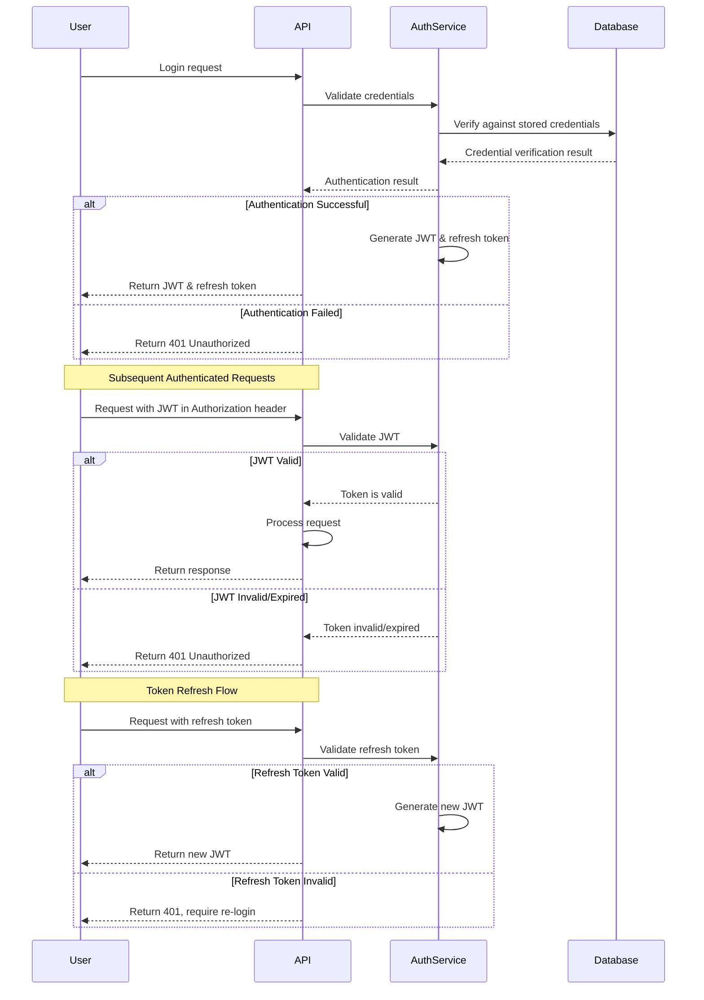
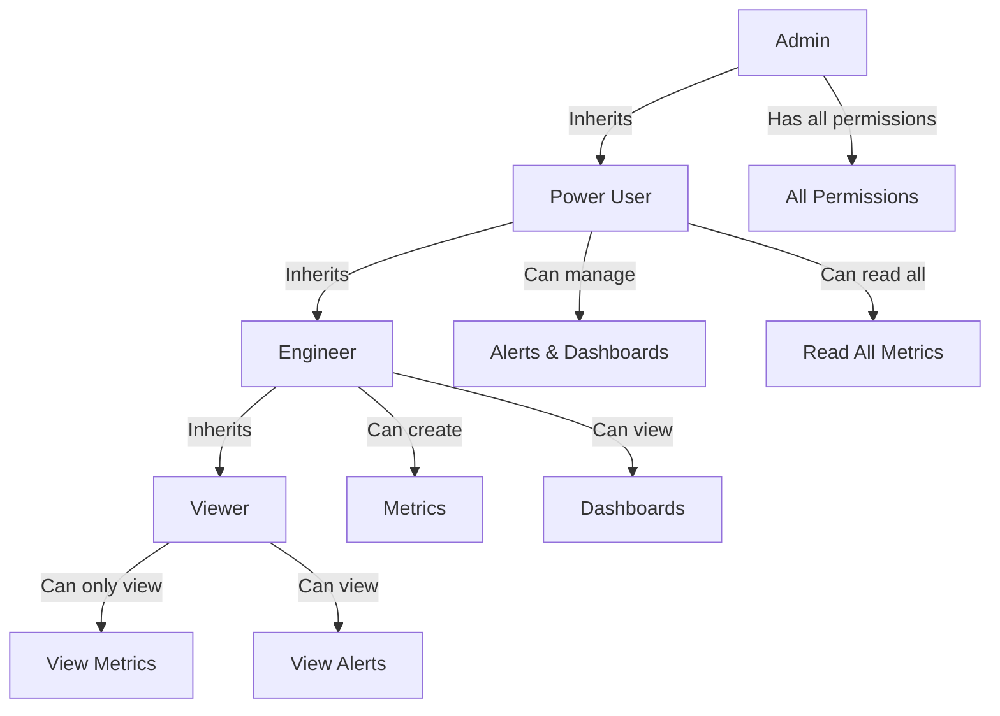
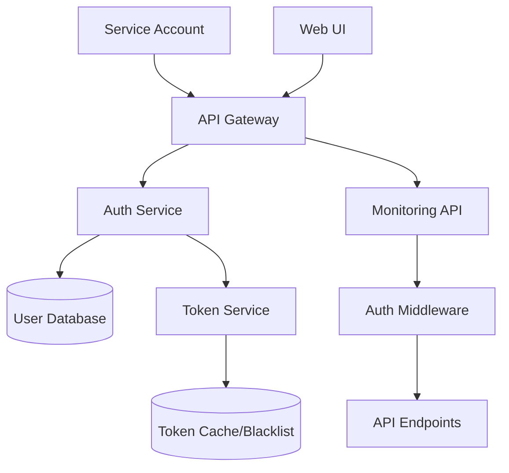
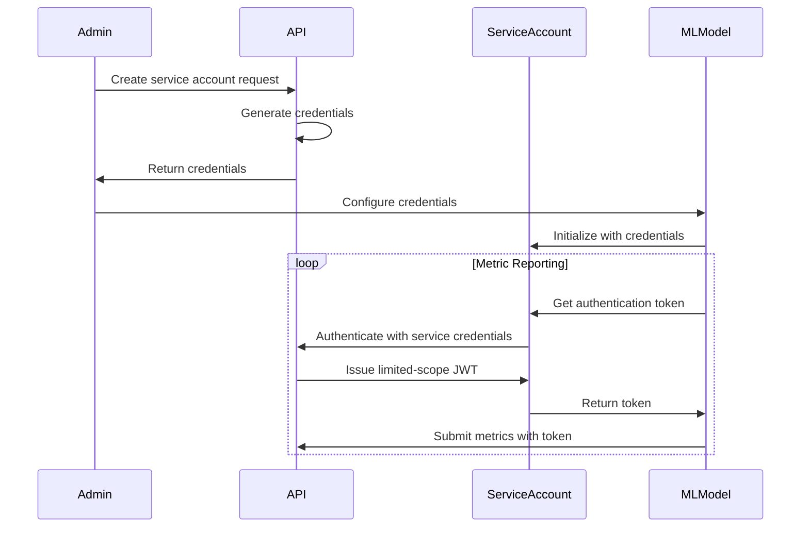
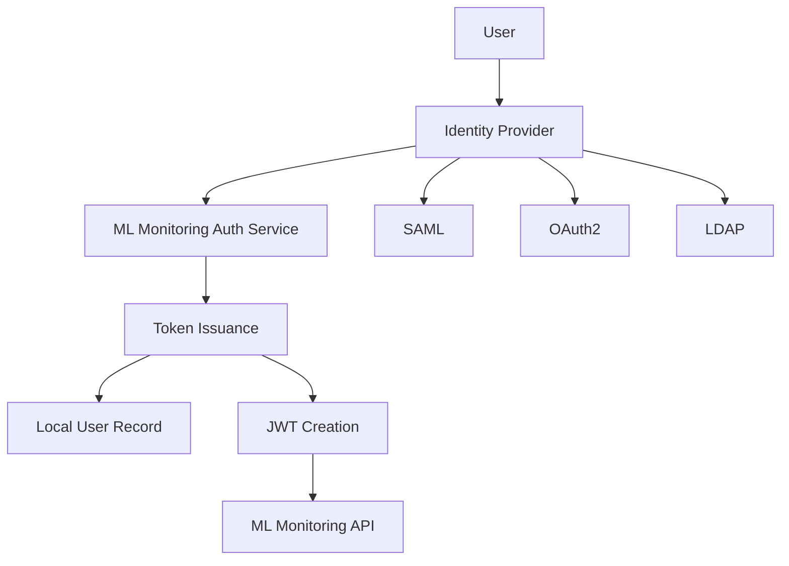

# ML Monitoring System Authentication and Authorization Design

## Executive Summary

This document outlines the design for implementing a robust authentication and authorization system for the ML Monitoring API. The design aims to secure the API endpoints while ensuring a good user experience for both human users accessing through the web interface and programmatic access from ML services.

Based on the security review findings, we've designed a comprehensive auth system using JWT-based authentication and role-based access control (RBAC), with secure token handling, proper session management, and detailed audit logging.

## Authentication Design

### Authentication Method Selection

After evaluating several authentication options, we recommend implementing **JWT (JSON Web Tokens)** for the following reasons:

| Authentication Method | Pros | Cons | Recommendation |
|----------------------|------|------|----------------|
| **JWT** | - Stateless<br>- Good for microservices<br>- Easily integrated with FastAPI<br>- Supports service-to-service auth | - Token revocation requires additional infrastructure<br>- Size limitations | **Selected** |
| OAuth 2.0 | - Industry standard<br>- Support for 3rd party auth | - More complex implementation<br>- Overhead for simple use cases | Not selected for initial implementation |
| API Keys | - Simple to implement<br>- Good for service access | - Less secure for user authentication<br>- No built-in expiration | Not selected for primary auth |
| Session Cookies | - Well understood<br>- Built-in browser support | - CSRF vulnerabilities<br>- Not suitable for APIs | Not selected |

### JWT Implementation Details

#### Token Structure

JWT tokens will include the following claims:

```json
{
  "sub": "user:123",       // Subject (user ID)
  "iss": "ml-monitoring",  // Issuer
  "iat": 1615247472,       // Issued at time
  "exp": 1615251072,       // Expiration time (1 hour)
  "roles": ["admin", "viewer"],  // User roles
  "permissions": ["metrics:read", "alerts:write"],  // Granular permissions
  "jti": "unique-token-id" // Unique token ID for revocation
}
```

#### Token Lifetime Management

- **Access tokens**: Short-lived (1 hour) for regular API access
- **Refresh tokens**: Longer-lived (7 days) for obtaining new access tokens
- **Token revocation**: Implemented via a Redis-based blocklist for revoked tokens

#### Auth Flow Sequence Diagram



## Authorization Design

### Role-Based Access Control (RBAC)

The system will implement a three-level authorization model:

1. **Roles**: High-level groupings of permissions (Admin, Engineer, Viewer, etc.)
2. **Permissions**: Specific actions a user can perform (read:metrics, create:alerts, etc.)
3. **Resource Access**: Limitations on which resources a user can access (models, environments)

#### Role Hierarchy



#### Default Roles

| Role | Description | Default Permissions |
|------|-------------|---------------------|
| **Admin** | System administrator | All permissions |
| **PowerUser** | Team lead who can configure monitoring | Read all metrics, create/manage alerts and dashboards |
| **Engineer** | ML Engineer who uploads metrics | Create metrics, view dashboards, view/create alerts |
| **Viewer** | Read-only access | View metrics and alerts |
| **Service** | Used by ML services for automated reporting | Create metrics for specific models |

### Permission Schema

Permissions will follow the format: `<action>:<resource>` with optional resource qualifiers.

Examples:
- `read:metrics`: Can read all metrics
- `read:metrics:model-x`: Can read metrics for model-x
- `create:alerts`: Can create alert rules
- `manage:dashboards`: Can create, update, delete dashboards

### Resource Access Control

Resources will be restricted by:

1. **Ownership**: Users have full access to resources they create
2. **Team**: Users have access to resources owned by their team
3. **Environment**: Users may have limited access to certain environments (prod vs. dev)
4. **Model**: Access can be restricted to specific ML models

## User Management

### User Data Model

```typescript
interface User {
  id: string;             // Unique identifier
  username: string;       // Username for login
  email: string;          // Email address
  password_hash: string;  // Bcrypt-hashed password
  roles: string[];        // Array of role IDs
  active: boolean;        // Whether user account is active
  last_login: Date;       // Last login timestamp
  created_at: Date;       // Creation timestamp
  updated_at: Date;       // Last update timestamp
  team_id?: string;       // Team affiliation
  service_account: boolean; // Whether this is a service account
}

interface Role {
  id: string;             // Role identifier
  name: string;           // Human-readable name
  description: string;    // Role description
  permissions: string[];  // Array of permissions
}

interface Team {
  id: string;             // Team identifier
  name: string;           // Team name
  members: string[];      // Array of user IDs
  resources: {            // Resources owned by team
    models: string[],     // Model IDs
    dashboards: string[], // Dashboard IDs
  }
}
```

### User Management API Endpoints

| Endpoint | Method | Description | Required Role |
|----------|--------|-------------|--------------|
| `/auth/login` | POST | Authenticate user credentials | None |
| `/auth/refresh` | POST | Refresh access token | None (valid refresh token) |
| `/auth/logout` | POST | Invalidate tokens | None (valid token) |
| `/users` | GET | List users | Admin |
| `/users/{id}` | GET | Get user details | Admin or Self |
| `/users` | POST | Create new user | Admin |
| `/users/{id}` | PUT | Update user | Admin or Self |
| `/users/{id}` | DELETE | Delete user | Admin |
| `/roles` | GET | List available roles | Admin |
| `/teams` | GET | List teams | Admin or Team Member |
| `/teams/{id}` | GET | Get team details | Admin or Team Member |

## Secure Token Handling

### Token Storage

- Frontend: 
  - Access tokens stored in memory (not in localStorage)
  - Refresh tokens stored in HttpOnly cookies with Secure flag
- Backend:
  - Token signing keys stored in secure key management system
  - Refresh token hashes stored in database

### Secret Management

- JWT signing keys stored in environment variables for development
- In production, keys stored in a secret management system (AWS Secrets Manager, HashiCorp Vault, etc.)
- Rotation of signing keys every 90 days with seamless transition period

## Implementation Architecture



## Service Account Authentication

For ML services that need to report metrics automatically:

1. **Service Accounts**: Special user accounts marked as service accounts
2. **Long-lived API Keys**: As an alternative to JWTs for simple integrations
3. **OAuth2 Client Credentials Flow**: For more complex service-to-service authentication

### Service Account Provisioning Flow



## API Protection Mechanisms

### Request Security

- All requests will use HTTPS
- API endpoints protected by authentication middleware
- Sensitive operations require revalidation

### Rate Limiting

Rate limiting will be implemented at multiple levels:

1. **Global rate limits**: Prevent overall API abuse
2. **User-based limits**: Prevent single user from overwhelming the system
3. **Endpoint-specific limits**: Higher limits for metrics submission, lower for admin actions

### CORS Configuration

- Restrict cross-origin requests to approved domains
- Implement proper pre-flight handling
- Limit exposed headers to minimum necessary

## Implementation Plan

### Phase 1: Core Authentication

1. Setup user database schema and initial migration
2. Implement JWT generation and validation
3. Create login, refresh, and logout endpoints
4. Implement auth middleware for API protection

### Phase 2: Authorization System

1. Implement role and permission models
2. Create role assignment API
3. Add permission checking to API endpoints
4. Implement resource access controls

### Phase 3: Advanced Features

1. Add service account support
2. Implement token revocation
3. Add audit logging for auth events
4. Create user management interface

## Integration Options

The authentication system can be integrated with existing enterprise identity systems:

### SAML/OAuth Integration

For organizations with existing identity providers:

1. **SAML Integration**: Support enterprise SSO
2. **OAuth Providers**: Allow login via Google, GitHub, etc.
3. **AD/LDAP**: Authenticate against corporate directories

### Identity Federation



## Security Considerations

### Password Security

- Use bcrypt or Argon2 for password hashing
- Enforce password complexity requirements
- Implement account lockout after failed attempts

### Token Security

- Short-lived access tokens (1 hour maximum)
- Implement proper token revocation
- Include IP and user-agent validation when appropriate

### Session Management

- Automatic session timeout after inactivity
- Ability to view and terminate active sessions
- Session revocation on password change

## Audit Logging

All authentication and authorization events will be logged:

- Login attempts (successful and failed)
- Token refreshes and revocations
- Permission changes
- Resource access
- Administrative actions

Logs will include:
- Timestamp
- User ID
- Action
- Status
- Source IP
- User-Agent
- Request ID for correlation

## Recommendations and Best Practices

1. **Implement defense in depth**: Multiple security layers instead of relying solely on authentication
2. **Follow the principle of least privilege**: Grant minimum necessary permissions
3. **Security monitoring**: Watch for suspicious auth patterns
4. **Regular security reviews**: Audit auth implementation quarterly
5. **Keep dependencies updated**: Especially auth-related libraries

## Appendix A: FastAPI Implementation Examples

### Authentication Middleware

```python
from fastapi import Depends, FastAPI, HTTPException, status
from fastapi.security import OAuth2PasswordBearer
from jose import JWTError, jwt
from pydantic import BaseModel
from datetime import datetime, timedelta

# to get a string like this run:
# openssl rand -hex 32
SECRET_KEY = "${SECRET_KEY_2}"
ALGORITHM = "HS256"
ACCESS_TOKEN_EXPIRE_MINUTES = 60

oauth2_scheme = OAuth2PasswordBearer(tokenUrl="token")

class Token(BaseModel):
    access_token: str
    token_type: str
    
class TokenData(BaseModel):
    username: str = None
    roles: list = []
    permissions: list = []

def create_access_token(data: dict, expires_delta: timedelta = None):
    to_encode = data.copy()
    if expires_delta:
        expire = datetime.utcnow() + expires_delta
    else:
        expire = datetime.utcnow() + timedelta(minutes=15)
    to_encode.update({"exp": expire})
    encoded_jwt = jwt.encode(to_encode, SECRET_KEY, algorithm=ALGORITHM)
    return encoded_jwt

async def get_current_user(token: str = Depends(oauth2_scheme)):
    credentials_exception = HTTPException(
        status_code=status.HTTP_401_UNAUTHORIZED,
        detail="Could not validate credentials",
        headers={"WWW-Authenticate": "Bearer"},
    )
    try:
        payload = jwt.decode(token, SECRET_KEY, algorithms=[ALGORITHM])
        username: str = payload.get("sub")
        if username is None:
            raise credentials_exception
        token_data = TokenData(
            username=username,
            roles=payload.get("roles", []),
            permissions=payload.get("permissions", [])
        )
    except JWTError:
        raise credentials_exception
    user = get_user(token_data.username)
    if user is None:
        raise credentials_exception
    return user
```

### Authorization Decorator

```python
from functools import wraps
from fastapi import HTTPException, status

def requires_permission(permission: str):
    def decorator(func):
        @wraps(func)
        async def wrapper(*args, current_user=Depends(get_current_user), **kwargs):
            if not has_permission(current_user, permission):
                raise HTTPException(
                    status_code=status.HTTP_403_FORBIDDEN,
                    detail="Not enough permissions"
                )
            return await func(*args, current_user=current_user, **kwargs)
        return wrapper
    return decorator

# Example usage
@app.get("/metrics")
@requires_permission("read:metrics")
async def get_metrics(current_user: User = Depends(get_current_user)):
    # Only users with "read:metrics" permission can access this endpoint
    return {"metrics": get_user_accessible_metrics(current_user)}
```

## Appendix B: Integration Testing Scenarios

To validate the authentication and authorization implementation, the following test scenarios should be included:

1. **Authentication Tests**:
   - User can successfully log in with valid credentials
   - Login fails with invalid credentials
   - Access token can be refreshed with valid refresh token
   - Token validation rejects expired/invalid tokens
   - Logout properly invalidates tokens

2. **Authorization Tests**:
   - Users can only access endpoints they have permission for
   - Role inheritance works correctly
   - Resource-level permissions restrict access appropriately
   - Permission checks properly handle edge cases

3. **Integration Tests**:
   - Service accounts can authenticate and submit metrics
   - Web UI can perform full authentication flow
   - Rate limiting prevents abuse
   - Audit logs capture all relevant events
