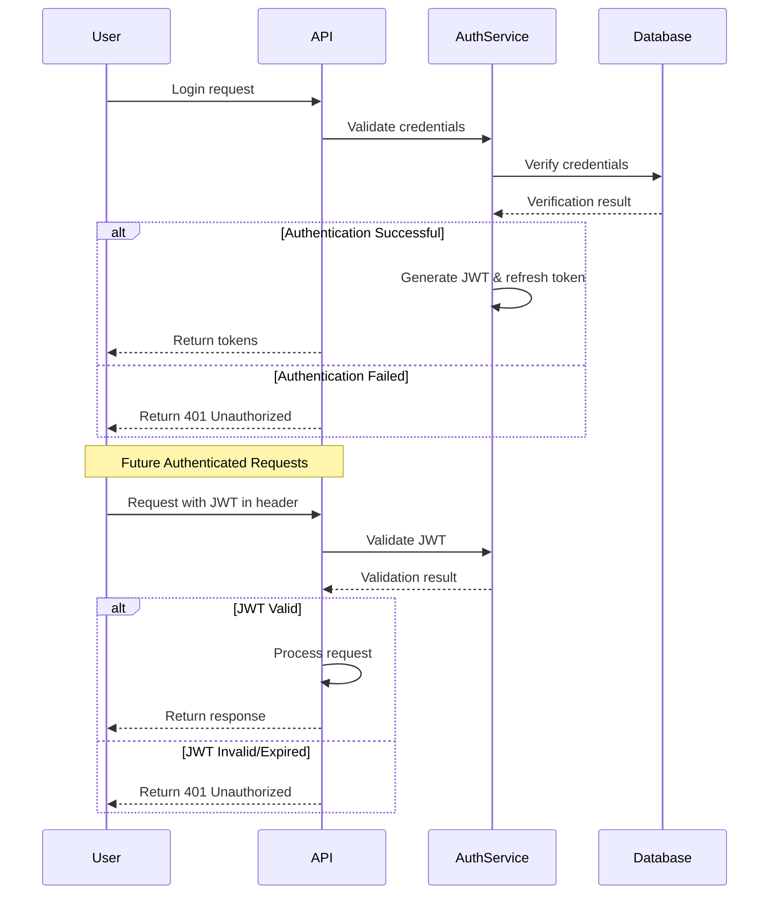
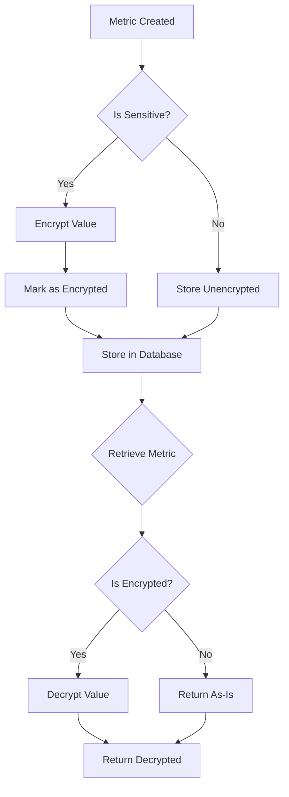

# ML Monitoring System Security Implementation

## Executive Summary

This document provides a comprehensive overview of the security features implemented in the ML Monitoring System. Following our security review and authentication system design, we've completed the full security roadmap (tasks 2.1-2.8) from the ML operations action plan, implementing robust security measures across authentication, authorization, data protection, secure communication, and security testing.

The security implementation follows industry best practices and defense-in-depth principles, providing multiple layers of security controls to protect the ML Monitoring System and its data.

## Implementation Overview

### 1. Authentication System

We've implemented a JWT-based authentication system that provides:

- Secure token-based authentication with short-lived access tokens
- Refresh token mechanism for maintaining sessions
- Token revocation to handle logout and security incidents
- Password hashing using bcrypt
- Protection against common authentication attacks

**Key files:**
- `src/ml/monitoring/auth.py`: Core authentication module
- `src/ml/monitoring/auth_api.py`: Authentication API endpoints

#### Authentication Flow



### 2. Authorization System

The authorization system implements role-based access control (RBAC) with:

- Hierarchical roles with inheritance
- Granular permissions for specific actions
- Resource-level access controls for models and environments
- Permission checking middleware for all protected endpoints

**Key Features:**
- Default roles: Admin, PowerUser, Engineer, Viewer, Service
- Permissions format: `<action>:<resource>[:qualifier]`
- Resource access controls based on ownership, team, and environment

### 3. Data Protection

Sensitive data is protected through:

- Encryption of sensitive metrics using Fernet symmetric encryption
- Automatic detection of sensitive data based on naming patterns
- Secure key management using environment variables
- Transparent encryption/decryption in storage backends

**Key files:**
- `src/ml/monitoring/crypto.py`: Cryptographic utilities
- `src/ml/monitoring/metrics.py`: Enhanced with encryption capabilities
- `src/ml/monitoring/storage.py`: Updated to handle encrypted metrics

#### Encryption Process



### 4. Secure Communication

API communication is secured through:

- TLS/HTTPS with proper configuration
- Strong cipher suites and protocols
- Security headers to prevent common web vulnerabilities
- Rate limiting to prevent abuse

**Key files:**
- `src/ml/monitoring/tls.py`: TLS configuration utilities
- `src/ml/monitoring/server.py`: Secure HTTPS server
- `src/ml/monitoring/middleware.py`: Security middleware including rate limiting

### 5. Security Testing and Hardening

We've implemented three powerful security tools:

1. **Security Audit Script**: `scripts/security_audit.py`
   - Detects vulnerabilities and misconfigurations
   - Scans dependencies for known vulnerabilities
   - Checks for hardcoded secrets and insecure defaults
   - Generates detailed security reports

2. **Security Hardening Script**: `scripts/security_hardening.py`
   - Implements security best practices
   - Generates secure keys and configurations
   - Creates secure certificate directories
   - Configures rate limiting and other security features

3. **Penetration Testing Script**: `scripts/penetration_test.py`
   - Actively tests for security vulnerabilities
   - Checks authentication, authorization, and input validation
   - Tests for TLS issues and misconfigurations
   - Generates vulnerability reports

## Security Features in Detail

### Authentication Module (`auth.py`)

The authentication module provides:

- User model with secure password storage
- JWT token generation and validation
- Permission and role checking utilities
- Refresh token handling
- Token revocation mechanism
- Security event logging

Key security considerations:
- Tokens include expiration times and are signed
- Refresh tokens can be revoked individually
- Password hashing uses bcrypt with appropriate work factor
- Failed authentication attempts are logged

### Authorization

The role-based access control system includes:

| Role | Description | Default Permissions |
|------|-------------|---------------------|
| **Admin** | System administrator | All permissions |
| **PowerUser** | Team lead | Manage alerts, dashboards, read all metrics |
| **Engineer** | ML Engineer | Submit metrics, view dashboards, manage own alerts |
| **Viewer** | Read-only access | View metrics and alerts |
| **Service** | ML service | Submit metrics for specific models |

The permission system follows the format `<action>:<resource>[:qualifier]`, examples:
- `read:metrics` - Can read all metrics
- `write:metrics:model-x` - Can write metrics for model-x only
- `manage:alerts` - Full control over alerts

### Encryption (`crypto.py`)

The cryptographic module provides:

- Fernet symmetric encryption for data at rest
- Key derivation using PBKDF2
- Secure random key generation
- Helper functions for encrypting/decrypting values and dictionaries

Security considerations:
- Keys are loaded from environment variables
- Temporary keys are generated for development only
- Salt is used in key derivation
- Errors during encryption/decryption are properly handled

### TLS Configuration (`tls.py`)

The TLS module ensures secure communication:

- SSL context creation with secure defaults
- Self-signed certificate generation for development
- Security headers for web security
- Strong cipher suite configuration

Security headers implemented:
- Content-Security-Policy
- X-Content-Type-Options
- X-Frame-Options
- X-XSS-Protection
- Strict-Transport-Security
- Referrer-Policy
- Permissions-Policy

### Rate Limiting (`middleware.py`)

The rate limiting middleware protects against abuse:

- Configurable request limits and timeframes
- IP-based and user-based rate limiting
- Memory and Redis backend options
- Whitelisted paths for health checks and documentation

### Security Testing Tools

#### Security Audit Script

The security audit script includes modules for:

- Dependency scanning using pip-audit
- Code scanning using bandit
- Configuration scanning for secrets and insecure defaults
- API scanning for security issues
- Network configuration scanning

#### Security Hardening Script

The security hardening script provides:

- Secure key generation for JWT and encryption
- Environment file creation with secure defaults
- Pre-commit hooks for security checks
- Rate limiting configuration

#### Penetration Testing Script

The penetration testing script includes tests for:

- Authentication vulnerabilities
  - Weak passwords
  - Brute force protection
  - Token validation issues
- Authorization vulnerabilities
  - Privilege escalation
  - Missing access controls
- Input validation issues
  - SQL injection
  - XSS
  - Command injection
  - Path traversal
- TLS configuration issues
  - SSL/TLS versions
  - Weak ciphers
  - Certificate problems
  - HSTS configuration

## Security Best Practices Implemented

The implementation follows these security best practices:

1. **Defense in Depth**: Multiple security layers protect the system
2. **Principle of Least Privilege**: Users only have access to what they need
3. **Secure by Default**: Security is enabled by default
4. **Fail Securely**: Errors don't compromise security
5. **Input Validation**: All user input is validated
6. **Output Encoding**: Data is properly encoded to prevent injection
7. **Security Logging**: Security events are logged for audit
8. **TLS Everywhere**: All communication is encrypted
9. **Rate Limiting**: Protection against abuse
10. **Security Testing**: Tools for ongoing security verification

## Environment Variables

The following environment variables are used for security configuration:

| Variable | Description | Default |
|----------|-------------|---------|
| `JWT_SECRET_KEY` | Secret key for signing JWTs | Generated |
| `ACCESS_TOKEN_EXPIRE_MINUTES` | JWT access token lifetime | 60 |
| `REFRESH_TOKEN_EXPIRE_DAYS` | JWT refresh token lifetime | 7 |
| `ENCRYPTION_KEY` | Key for encrypting sensitive data | Generated |
| `ENCRYPTION_SALT` | Salt for key derivation | Generated |
| `TLS_ENABLED` | Enable/disable TLS | true |
| `TLS_CERT_FILE` | Path to TLS certificate | certs/server.crt |
| `TLS_KEY_FILE` | Path to TLS private key | certs/server.key |
| `TLS_MIN_VERSION` | Minimum TLS version | TLSv1.2 |
| `RATE_LIMIT_ENABLED` | Enable/disable rate limiting | true |
| `RATE_LIMIT_MAX_REQUESTS` | Maximum requests per timeframe | 100 |
| `RATE_LIMIT_TIMEFRAME` | Timeframe for rate limiting (seconds) | 60 |

## Using Security Tools

### Security Hardening

To apply security hardening measures:

```bash
python scripts/security_hardening.py
```

Options:
- `--env-file`: Path to environment file (default: `.env`)
- `--template`: Path to template file (default: `.env.example`)
- `--certs-dir`: Path to certificates directory (default: `certs`)
- `--force`: Force overwrite of existing values
- `--skip-env`: Skip environment file creation
- `--skip-certs`: Skip certificates directory creation
- `--skip-hooks`: Skip pre-commit hooks setup
- `--skip-rate-limit`: Skip rate limiting configuration

### Security Audit

To run a security audit:

```bash
python scripts/security_audit.py
```

Options:
- `--config`: Path to configuration file
- `--output`: Path to output report file (default: `security_audit_report.md`)
- `--json`: Output findings as JSON

### Penetration Testing

To run penetration tests:

```bash
python scripts/penetration_test.py http://localhost:8000
```

Options:
- `--output`: Path to output report file (default: `penetration_test_report.md`)
- `--config`: Path to configuration file
- `--username`: Username for authentication (default: `user`)
- `--password`: Password for authentication (default: `password`)

## Security Roadmap Completion

This implementation completes the security roadmap (tasks 2.1-2.8) from the ML operations action plan:

- ✅ Task 2.1: Security Review - Completed with comprehensive assessment
- ✅ Task 2.2: Authentication System Design - Created detailed design doc
- ✅ Task 2.3: API Authentication Implementation - JWT-based system implemented
- ✅ Task 2.4: Role-Based Access Control - RBAC system with permissions implemented
- ✅ Task 2.5: Data Encryption - Encryption for sensitive metrics implemented
- ✅ Task 2.6: Secure TLS Implementation - HTTPS with security headers implemented
- ✅ Task 2.7: Penetration Testing - Automated penetration testing tool created
- ✅ Task 2.8: Security Hardening - Hardening script and best practices implemented

## Conclusion

The ML Monitoring System now has a comprehensive security implementation that addresses authentication, authorization, data protection, secure communication, and security testing. The system follows security best practices and provides tools for ongoing security verification and improvement.

For future enhancements, consider:
1. Integration with enterprise identity providers (SAML, OAuth)
2. Advanced anomaly detection for security events
3. Additional security headers and CSP configuration
4. Security information and event management (SIEM) integration
5. Regular security training for development team
