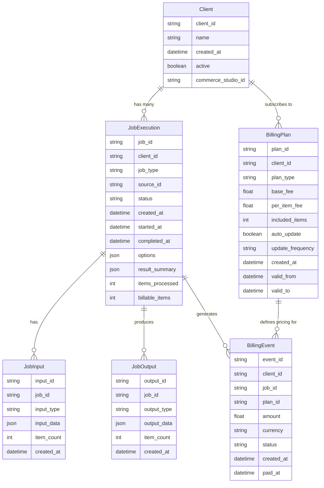
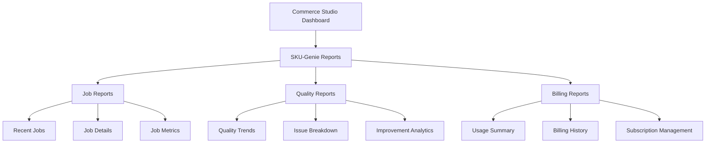
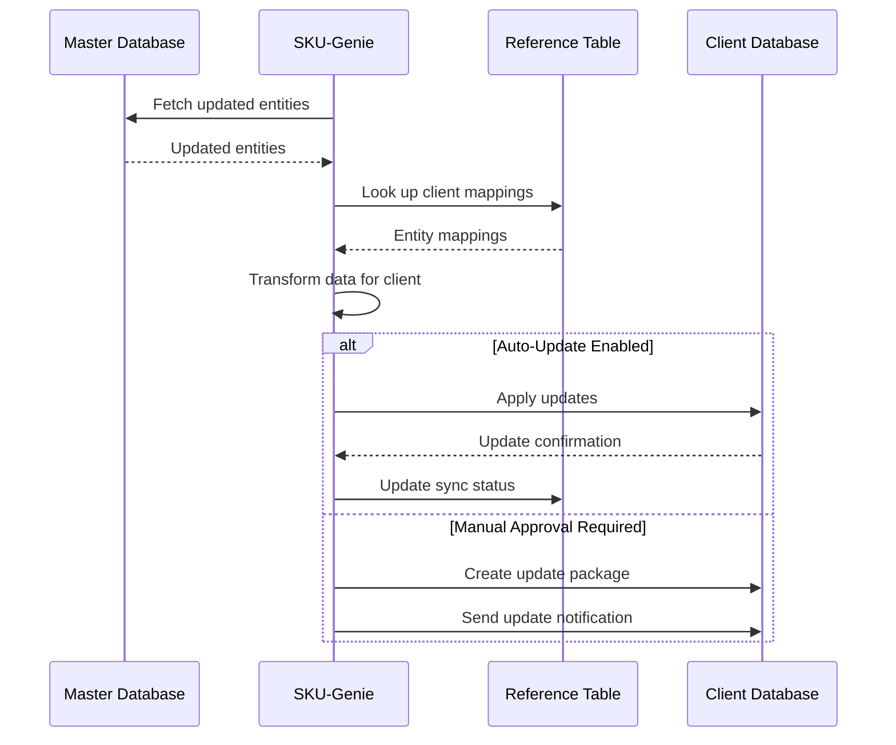
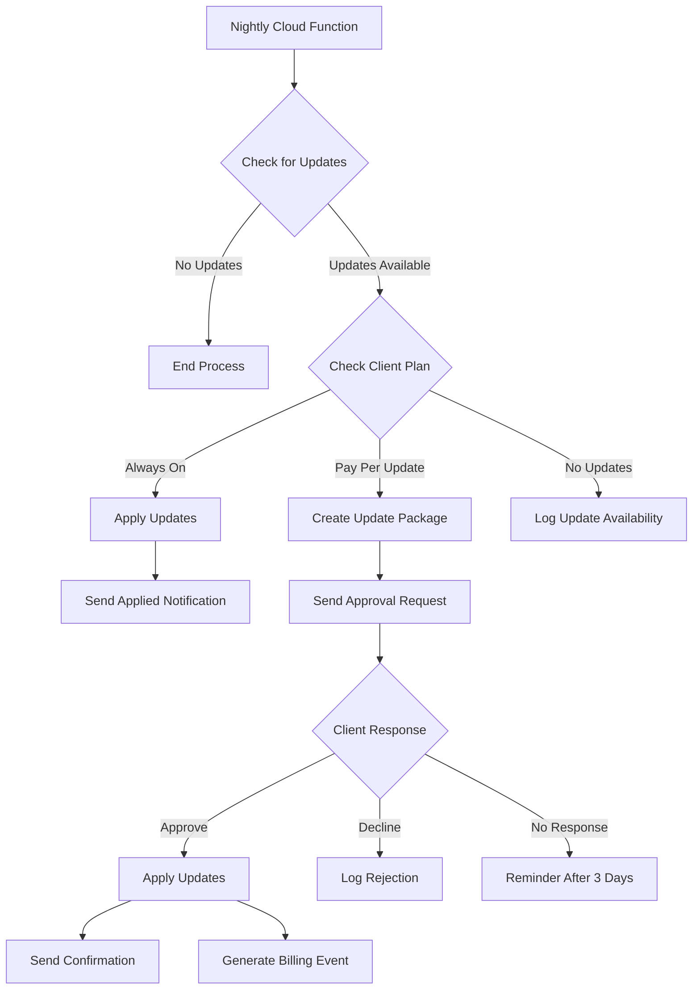
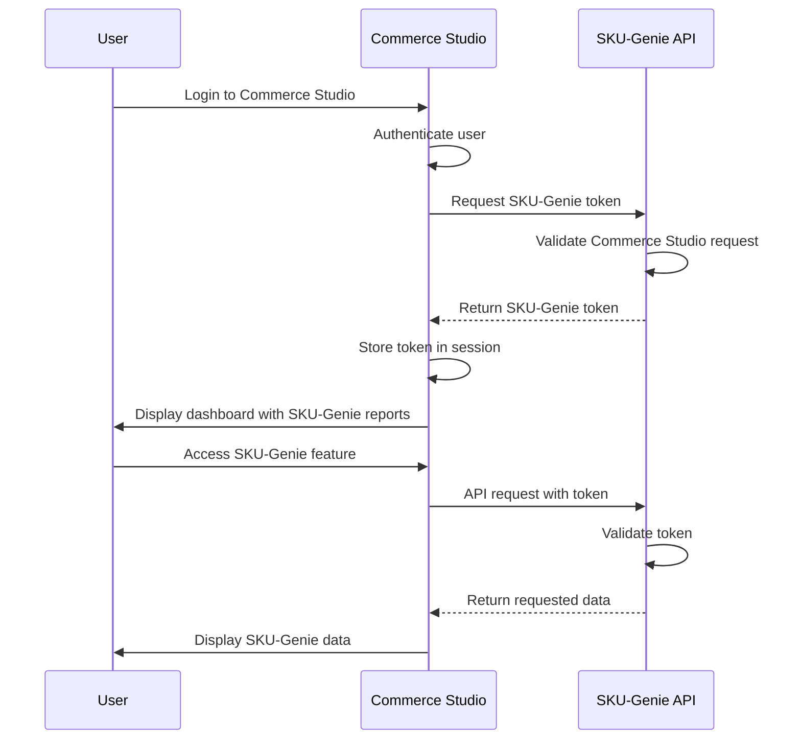

# SKU-Genie Billing and Updates System

## Overview

This document outlines the billing, reporting, and update management features of the SKU-Genie system. These components are essential for monetizing the data quality service, providing transparency to clients, and managing ongoing data updates.

## Billing and Usage Tracking

### Job Tracking Database Schema



### Billing Plans

SKU-Genie will support multiple billing plans to accommodate different client needs:

1. **Basic Plan**
   - Pay per update
   - Manual approval required for updates
   - Base fee + per-item fee
   - Basic reporting

2. **Standard Plan**
   - Scheduled updates (weekly/monthly)
   - Automatic approval for minor updates
   - Monthly subscription + reduced per-item fee
   - Standard reporting

3. **Premium Plan**
   - Always-on updates
   - Fully automatic updates
   - Higher monthly subscription with unlimited items
   - Advanced reporting and analytics

### Usage Calculation Logic

```python
def calculate_billing_amount(job_execution, billing_plan):
    """Calculate billing amount for a job execution"""
    
    # Get billable items
    billable_items = job_execution.billable_items
    
    # Calculate base amount
    amount = billing_plan.base_fee
    
    # Calculate per-item fee
    if billable_items > billing_plan.included_items:
        excess_items = billable_items - billing_plan.included_items
        amount += excess_items * billing_plan.per_item_fee
    
    # Apply plan discounts
    if billing_plan.plan_type == "premium":
        # Premium plans have unlimited items
        amount = billing_plan.base_fee
    
    return amount
```

## Client-Facing Reporting

### Report Types

1. **Job Execution Reports**
   - Summary of each job execution
   - Items processed, fixed, and rejected
   - Quality metrics before and after
   - Execution time and resources used

2. **Quality Trend Reports**
   - Data quality metrics over time
   - Issue types and frequencies
   - Improvement trends
   - Comparison with industry benchmarks

3. **Billing Reports**
   - Usage summary
   - Billing events
   - Subscription details
   - Payment history

### Report Access

Reports will be accessible through:

1. **Commerce Studio Integration**
   - Embedded reports in Commerce Studio dashboard
   - Single sign-on authentication
   - Role-based access control

2. **API Access**
   - REST API endpoints for programmatic access
   - Authentication via API keys
   - Rate limiting and usage tracking

3. **Email Reports**
   - Scheduled email reports
   - Customizable report content
   - PDF and Excel formats

### Report Dashboard



## Client-Master Database Reference

### Reference Table Schema

```sql
CREATE TABLE client_database_reference (
    reference_id VARCHAR(36) PRIMARY KEY,
    client_id VARCHAR(36) NOT NULL,
    master_database_id VARCHAR(36) NOT NULL,
    client_database_id VARCHAR(36) NOT NULL,
    sync_status VARCHAR(20) NOT NULL,
    last_sync_at TIMESTAMP,
    created_at TIMESTAMP NOT NULL,
    updated_at TIMESTAMP NOT NULL,
    FOREIGN KEY (client_id) REFERENCES clients(client_id)
);

CREATE TABLE entity_mapping (
    mapping_id VARCHAR(36) PRIMARY KEY,
    reference_id VARCHAR(36) NOT NULL,
    entity_type VARCHAR(50) NOT NULL,
    master_entity_id VARCHAR(36) NOT NULL,
    client_entity_id VARCHAR(36) NOT NULL,
    created_at TIMESTAMP NOT NULL,
    updated_at TIMESTAMP NOT NULL,
    FOREIGN KEY (reference_id) REFERENCES client_database_reference(reference_id)
);

CREATE INDEX idx_entity_mapping_master ON entity_mapping(master_entity_id);
CREATE INDEX idx_entity_mapping_client ON entity_mapping(client_entity_id);
```

### Synchronization Process



## Update Notification and Management

### Update Types

1. **Critical Updates**
   - Security-related updates
   - Data corrections for critical fields
   - Always pushed to clients (with notification)

2. **Standard Updates**
   - Regular data quality improvements
   - New product additions
   - Pushed based on client subscription

3. **Optional Updates**
   - Cosmetic improvements
   - Non-essential field updates
   - Pushed only with explicit approval

### Cloud Function for Nightly Updates

```python
def nightly_update_check():
    """Cloud function to check for updates and notify clients"""
    
    # Get all active clients
    clients = db.clients.find({"active": True})
    
    for client in clients:
        # Check for updates since last sync
        updates = check_for_updates(client.client_id)
        
        if not updates:
            continue
        
        # Get client's billing plan
        billing_plan = db.billing_plans.find_one({"client_id": client.client_id, "active": True})
        
        if billing_plan.auto_update:
            # Apply updates automatically
            apply_updates(client.client_id, updates)
            send_update_notification(client.client_id, updates, "applied")
        else:
            # Send notification for manual approval
            send_update_notification(client.client_id, updates, "pending")
            create_update_package(client.client_id, updates)
```

### Update Notification System



### Update Package Structure

```json
{
  "update_id": "550e8400-e29b-41d4-a716-446655440000",
  "client_id": "acme-eyewear",
  "created_at": "2025-04-08T12:00:00Z",
  "expires_at": "2025-04-15T12:00:00Z",
  "update_type": "standard",
  "summary": {
    "new_items": 25,
    "modified_items": 50,
    "deleted_items": 5
  },
  "details": {
    "products": {
      "new": 20,
      "modified": 40,
      "deleted": 5
    },
    "images": {
      "new": 5,
      "modified": 10,
      "deleted": 0
    }
  },
  "estimated_cost": 15.75,
  "approval_url": "https://commerce-studio.example.com/updates/550e8400-e29b-41d4-a716-446655440000/approve"
}
```

## Subscription Management

### Subscription Plans API

```python
@router.post("/clients/{client_id}/subscriptions")
async def create_subscription(
    client_id: str,
    subscription: SubscriptionCreate,
    db: Database = Depends(get_db)
):
    """Create a new subscription for a client"""
    
    # Validate client
    client = await db.clients.find_one({"client_id": client_id})
    if not client:
        raise HTTPException(status_code=404, detail=f"Client {client_id} not found")
    
    # Check for existing active subscription
    existing = await db.billing_plans.find_one({
        "client_id": client_id,
        "active": True
    })
    
    if existing:
        # Deactivate existing subscription
        await db.billing_plans.update_one(
            {"plan_id": existing["plan_id"]},
            {"$set": {"active": False, "valid_to": datetime.now()}}
        )
    
    # Create new subscription
    plan = BillingPlan(
        plan_id=str(uuid.uuid4()),
        client_id=client_id,
        plan_type=subscription.plan_type,
        base_fee=get_base_fee(subscription.plan_type),
        per_item_fee=get_per_item_fee(subscription.plan_type),
        included_items=get_included_items(subscription.plan_type),
        auto_update=subscription.auto_update,
        update_frequency=subscription.update_frequency,
        created_at=datetime.now(),
        valid_from=datetime.now(),
        valid_to=None,
        active=True
    )
    
    await db.billing_plans.insert_one(plan.dict())
    
    return plan
```

### Subscription Management UI

The Commerce Studio dashboard will include a subscription management interface that allows clients to:

1. View current subscription details
2. Upgrade or downgrade subscription
3. Change update preferences
4. View billing history
5. Download invoices

## Integration with Commerce Studio

### Authentication Flow



### Embedded Reports

Commerce Studio will embed SKU-Genie reports using:

1. **iFrame Integration**
   - Secure URL with authentication token
   - Responsive design for different screen sizes
   - Customizable appearance to match Commerce Studio UI

2. **Direct API Integration**
   - Commerce Studio fetches data from SKU-Genie API
   - Renders reports using Commerce Studio UI components
   - Consistent user experience across the platform

## Implementation Considerations

### Security

1. **Data Isolation**
   - Strict separation between client data
   - Role-based access control
   - Audit logging for all data access

2. **Secure Communications**
   - TLS encryption for all API communications
   - Signed requests between services
   - Token-based authentication with short expiry

### Scalability

1. **Database Sharding**
   - Shard by client_id for horizontal scaling
   - Separate billing and usage data from operational data
   - Time-based partitioning for historical data

2. **Asynchronous Processing**
   - Queue-based update processing
   - Background workers for billing calculations
   - Scheduled tasks for report generation

### Compliance

1. **Billing Records**
   - Maintain detailed billing records for audit purposes
   - Comply with financial regulations for digital services
   - Support for tax calculations based on client location

2. **Data Retention**
   - Clear policies for usage data retention
   - Options for clients to export and delete historical data
   - Compliance with data protection regulations

## Next Steps

1. **Database Schema Updates**
   - Add billing and usage tracking tables
   - Create client-master reference tables
   - Implement entity mapping structure

2. **API Development**
   - Develop subscription management endpoints
   - Create reporting API
   - Implement update notification system

3. **Commerce Studio Integration**
   - Develop authentication integration
   - Create embedded reporting components
   - Implement subscription management UI

4. **Cloud Functions**
   - Implement nightly update check
   - Create billing calculation functions
   - Develop notification delivery system