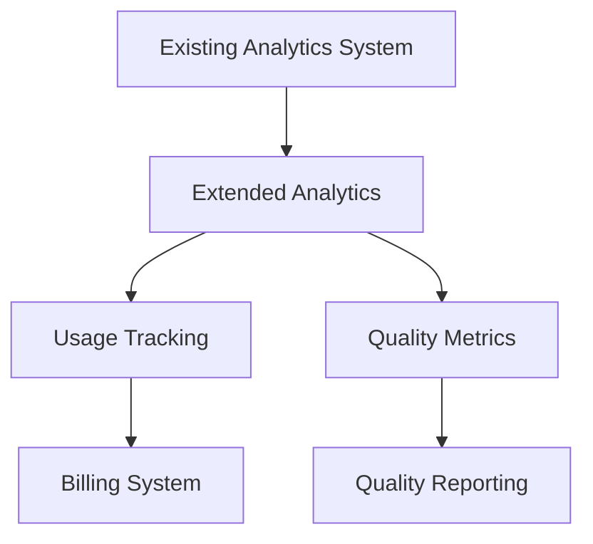
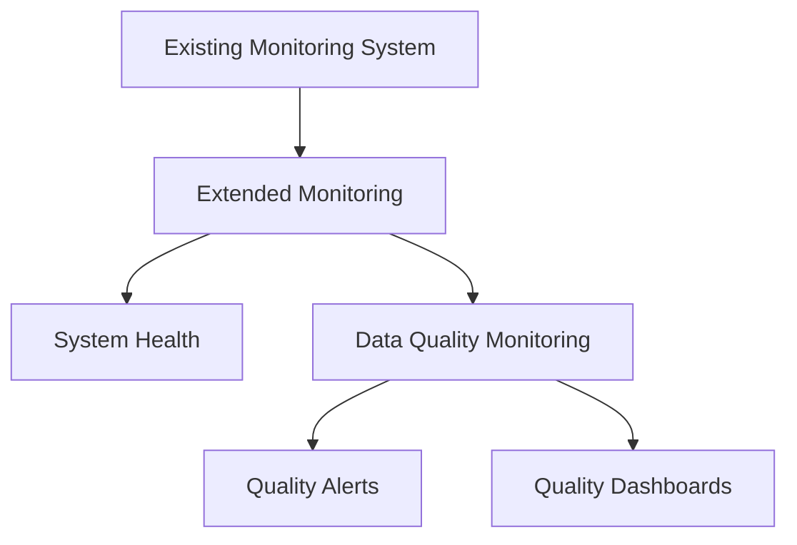
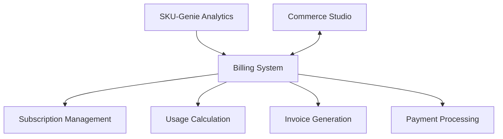
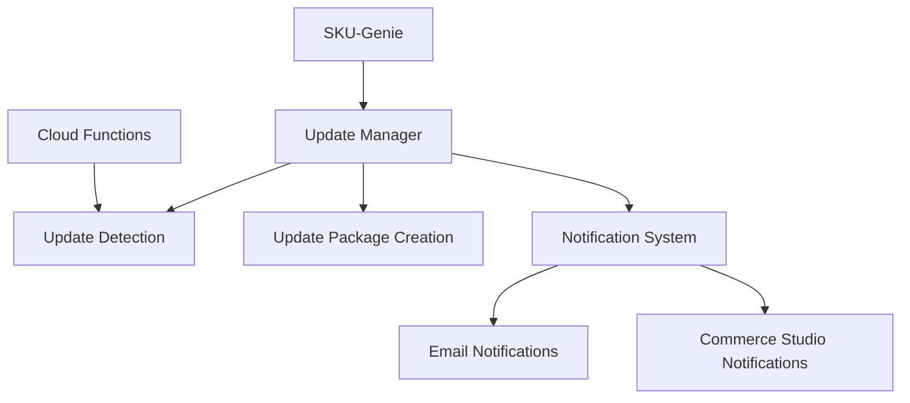

# SKU-Genie Integration with Existing Systems

## Overview

This document outlines how SKU-Genie will integrate with existing systems in the eyewear-ml platform, particularly focusing on analytics, monitoring, and the new billing and updates functionality.

## Existing Systems Analysis

After analyzing the codebase, we've identified the following relevant systems:

### 1. Analytics System

The platform has a comprehensive analytics system in `src/api/services/analytics_service.py` and `src/api/routers/analytics.py`. This system:

- Tracks user activities (page views, product views, search terms, etc.)
- Stores data in the `catalog_analytics` table
- Provides APIs for retrieving and analyzing the data
- Supports date range filtering and aggregation

### 2. Monitoring System

There's a monitoring system in `src/ml/monitoring/` that:

- Tracks system metrics (CPU usage, memory usage, disk usage, etc.)
- Collects and stores metrics data
- Provides visualization through dashboards
- Supports alerting based on thresholds

### 3. No Existing Billing System

The codebase doesn't have an explicit billing or subscription management system. There are some payment-related code in the E2E tests, but these appear to be for testing purposes only.

## Integration Strategy

### 1. Analytics Integration

SKU-Genie will extend the existing analytics system to track usage relevant for billing and data quality metrics:



#### Implementation Approach

1. **Extend the `CatalogAnalytics` Model**:

```python
# Add to src/api/models/opticians_catalog.py
class SKUGenieAnalytics(Base):
    """SKU-Genie analytics model for the database."""
    __tablename__ = "skugenie_analytics"
    
    id = Column(String, primary_key=True, index=True)
    client_id = Column(String, ForeignKey("clients.id"), index=True)
    date = Column(Date, index=True)
    
    # Usage metrics
    items_processed = Column(Integer, default=0)
    items_fixed = Column(Integer, default=0)
    quality_score_before = Column(Float, default=0.0)
    quality_score_after = Column(Float, default=0.0)
    
    # Job metrics
    job_count = Column(Integer, default=0)
    job_duration_seconds = Column(Integer, default=0)
    
    # Source metrics
    source_type = Column(String)
    source_items = Column(Integer, default=0)
    
    # Billing metrics
    billable_items = Column(Integer, default=0)
    
    # Timestamps
    created_at = Column(DateTime, default=datetime.utcnow)
    updated_at = Column(DateTime, default=datetime.utcnow, onupdate=datetime.utcnow)
    
    # Relationships
    client = relationship("Client", back_populates="skugenie_analytics")
```

2. **Create a `SKUGenieAnalyticsService`**:

```python
# New file: src/api/services/skugenie_analytics_service.py
class SKUGenieAnalyticsService:
    """Service for handling SKU-Genie analytics operations."""
    
    def __init__(self, db: Session):
        self.db = db
    
    async def track_job_execution(
        self,
        client_id: str,
        job_id: str,
        source_type: str,
        items_processed: int,
        items_fixed: int,
        quality_score_before: float,
        quality_score_after: float,
        duration_seconds: int,
        billable_items: int
    ) -> bool:
        """
        Track a job execution for billing and analytics purposes.
        """
        try:
            today = date.today()
            
            # Get or create analytics record for today
            analytics = await self.get_or_create_daily_analytics(client_id, today)
            
            # Update metrics
            analytics.items_processed += items_processed
            analytics.items_fixed += items_fixed
            analytics.job_count += 1
            analytics.job_duration_seconds += duration_seconds
            analytics.billable_items += billable_items
            
            # Update quality scores (weighted average)
            total_items = analytics.items_processed
            previous_items = total_items - items_processed
            
            if previous_items > 0:
                analytics.quality_score_before = (
                    (analytics.quality_score_before * previous_items + quality_score_before * items_processed) / 
                    total_items
                )
                analytics.quality_score_after = (
                    (analytics.quality_score_after * previous_items + quality_score_after * items_processed) / 
                    total_items
                )
            else:
                analytics.quality_score_before = quality_score_before
                analytics.quality_score_after = quality_score_after
            
            # Update source metrics
            if analytics.source_type == source_type:
                analytics.source_items += items_processed
            elif not analytics.source_type:
                analytics.source_type = source_type
                analytics.source_items = items_processed
            
            self.db.commit()
            self.db.refresh(analytics)
            
            return True
            
        except Exception as e:
            logger.error(f"Error tracking job execution: {str(e)}", exc_info=True)
            self.db.rollback()
            return False
    
    async def get_or_create_daily_analytics(
        self,
        client_id: str,
        day: date
    ) -> SKUGenieAnalytics:
        """
        Get or create analytics record for a specific client and date.
        """
        # Check if analytics record exists for this date
        analytics = self.db.query(SKUGenieAnalytics).filter(
            and_(
                SKUGenieAnalytics.client_id == client_id,
                SKUGenieAnalytics.date == day
            )
        ).first()
        
        # If not, create a new one
        if not analytics:
            analytics = SKUGenieAnalytics(
                id=str(uuid.uuid4()),
                client_id=client_id,
                date=day,
                items_processed=0,
                items_fixed=0,
                quality_score_before=0.0,
                quality_score_after=0.0,
                job_count=0,
                job_duration_seconds=0,
                billable_items=0
            )
            self.db.add(analytics)
            self.db.commit()
            self.db.refresh(analytics)
        
        return analytics
```

3. **Add Analytics API Endpoints**:

```python
# Add to src/api/routers/analytics.py
@router.get("/skugenie/analytics", response_model=SKUGenieAnalyticsListResponse)
async def get_skugenie_analytics(
    client_id: str,
    start_date: date,
    end_date: date,
    db: Session = Depends(get_db)
):
    """
    Get SKU-Genie analytics data for a client within a date range.
    """
    try:
        analytics_service = SKUGenieAnalyticsService(db)
        
        result = await analytics_service.get_analytics(
            client_id=client_id,
            start_date=start_date,
            end_date=end_date
        )
        
        return {
            "status": "success",
            "message": "SKU-Genie analytics data retrieved successfully",
            "analytics": result["analytics"],
            "total": result["total"]
        }
        
    except Exception as e:
        logger.error(f"Error retrieving SKU-Genie analytics data: {str(e)}", exc_info=True)
        raise HTTPException(status_code=500, detail=f"Error retrieving SKU-Genie analytics data: {str(e)}")
```

### 2. Monitoring Integration

SKU-Genie will leverage the existing monitoring system for system health metrics and extend it for data quality monitoring:



#### Implementation Approach

1. **Extend the Metrics Collector**:

```python
# Add to src/ml/monitoring/collectors.py
class DataQualityCollector(BatchMetricCollector):
    """Collector for data quality metrics."""
    
    def __init__(
        self,
        storage: Optional[MetricStorage] = None,
        collection_interval: int = 3600,  # Default to hourly
        **kwargs
    ):
        super().__init__(storage=storage, collection_interval=collection_interval, **kwargs)
        self.client_metrics = {}
    
    def record_quality_metric(
        self,
        client_id: str,
        metric_name: str,
        value: float,
        description: str = "",
        **kwargs
    ):
        """Record a data quality metric."""
        # Create metric
        metric = DataQualityMetric(
            name=metric_name,
            value=value,
            description=description,
            client_id=client_id,
            timestamp=datetime.now(),
            **kwargs
        )
        
        # Add to batch
        if client_id not in self.client_metrics:
            self.client_metrics[client_id] = []
        
        self.client_metrics[client_id].append(metric)
        
        # Store immediately if storage is available
        if self.storage:
            self.storage.store_metric(metric)
    
    async def flush(self):
        """Flush all metrics to storage."""
        if not self.storage:
            return
        
        for client_id, metrics in self.client_metrics.items():
            for metric in metrics:
                await self.storage.store_metric(metric)
        
        # Clear metrics
        self.client_metrics = {}
```

2. **Create Data Quality Metrics**:

```python
# Add to src/ml/monitoring/metrics.py
class DataQualityMetric(Metric):
    """Metric for data quality."""
    
    def __init__(
        self,
        name: str,
        value: float,
        description: str = "",
        client_id: str = "",
        collection: str = "",
        field: str = "",
        timestamp: Optional[datetime] = None,
        **kwargs
    ):
        super().__init__(name=name, value=value, description=description, timestamp=timestamp, **kwargs)
        self.client_id = client_id
        self.collection = collection
        self.field = field
        self.metric_type = "data_quality"
```

3. **Add Quality Dashboard Components**:

```python
# Add to src/ml/monitoring/dashboard.py
def create_data_quality_dashboard(
    storage: MetricStorage,
    client_id: str,
    environment: str = "prod",
    start_time: Optional[datetime] = None,
    end_time: Optional[datetime] = None,
    height: int = 8,
    width: int = 12
) -> Dashboard:
    """Create a data quality dashboard for a client."""
    dashboard = Dashboard(title=f"Data Quality Dashboard - {client_id}")
    
    # Add overall quality score chart
    dashboard.add_component(
        metric_chart(
            storage=storage,
            metric_name="quality_score",
            environment=environment,
            client_id=client_id,
            start_time=start_time,
            end_time=end_time,
            height=4,
            description="Overall quality score over time"
        )
    )
    
    # Add missing fields chart
    dashboard.add_component(
        metric_chart(
            storage=storage,
            metric_name="missing_fields_percentage",
            environment=environment,
            client_id=client_id,
            start_time=start_time,
            end_time=end_time,
            height=4,
            description="Percentage of records with missing fields"
        )
    )
    
    # Add invalid values chart
    dashboard.add_component(
        metric_chart(
            storage=storage,
            metric_name="invalid_values_percentage",
            environment=environment,
            client_id=client_id,
            start_time=start_time,
            end_time=end_time,
            height=4,
            description="Percentage of records with invalid values"
        )
    )
    
    return dashboard
```

### 3. New Billing System

Since there's no existing billing system, SKU-Genie will implement a new one that integrates with the extended analytics system:



#### Implementation Approach

1. **Create Billing Models**:

```python
# New file: src/api/models/billing.py
class BillingPlan(Base):
    """Billing plan model for the database."""
    __tablename__ = "billing_plans"
    
    id = Column(String, primary_key=True, index=True)
    name = Column(String, nullable=False)
    description = Column(String)
    
    # Pricing
    base_fee = Column(Float, nullable=False)
    per_item_fee = Column(Float, nullable=False)
    included_items = Column(Integer, nullable=False, default=0)
    
    # Update settings
    auto_update = Column(Boolean, nullable=False, default=False)
    update_frequency = Column(String)  # daily, weekly, monthly
    
    # Timestamps
    created_at = Column(DateTime, default=datetime.utcnow)
    updated_at = Column(DateTime, default=datetime.utcnow, onupdate=datetime.utcnow)
    
    # Relationships
    subscriptions = relationship("Subscription", back_populates="plan")

class Subscription(Base):
    """Subscription model for the database."""
    __tablename__ = "subscriptions"
    
    id = Column(String, primary_key=True, index=True)
    client_id = Column(String, ForeignKey("clients.id"), index=True)
    plan_id = Column(String, ForeignKey("billing_plans.id"), index=True)
    
    # Status
    active = Column(Boolean, nullable=False, default=True)
    
    # Dates
    start_date = Column(Date, nullable=False)
    end_date = Column(Date)
    
    # Timestamps
    created_at = Column(DateTime, default=datetime.utcnow)
    updated_at = Column(DateTime, default=datetime.utcnow, onupdate=datetime.utcnow)
    
    # Relationships
    client = relationship("Client", back_populates="subscriptions")
    plan = relationship("BillingPlan", back_populates="subscriptions")
    billing_events = relationship("BillingEvent", back_populates="subscription")

class BillingEvent(Base):
    """Billing event model for the database."""
    __tablename__ = "billing_events"
    
    id = Column(String, primary_key=True, index=True)
    subscription_id = Column(String, ForeignKey("subscriptions.id"), index=True)
    
    # Billing details
    amount = Column(Float, nullable=False)
    currency = Column(String, nullable=False, default="USD")
    description = Column(String)
    
    # Usage details
    period_start = Column(Date, nullable=False)
    period_end = Column(Date, nullable=False)
    items_processed = Column(Integer, nullable=False, default=0)
    billable_items = Column(Integer, nullable=False, default=0)
    
    # Status
    status = Column(String, nullable=False)  # pending, paid, failed
    
    # Timestamps
    created_at = Column(DateTime, default=datetime.utcnow)
    updated_at = Column(DateTime, default=datetime.utcnow, onupdate=datetime.utcnow)
    paid_at = Column(DateTime)
    
    # Relationships
    subscription = relationship("Subscription", back_populates="billing_events")
```

2. **Create Billing Service**:

```python
# New file: src/api/services/billing_service.py
class BillingService:
    """Service for handling billing operations."""
    
    def __init__(self, db: Session):
        self.db = db
    
    async def create_subscription(
        self,
        client_id: str,
        plan_id: str,
        start_date: Optional[date] = None
    ) -> Subscription:
        """
        Create a new subscription for a client.
        """
        # Check if client exists
        client = self.db.query(Client).filter(Client.id == client_id).first()
        if not client:
            raise ValueError(f"Client {client_id} not found")
        
        # Check if plan exists
        plan = self.db.query(BillingPlan).filter(BillingPlan.id == plan_id).first()
        if not plan:
            raise ValueError(f"Billing plan {plan_id} not found")
        
        # Check if client already has an active subscription
        existing = self.db.query(Subscription).filter(
            and_(
                Subscription.client_id == client_id,
                Subscription.active == True
            )
        ).first()
        
        if existing:
            # Deactivate existing subscription
            existing.active = False
            existing.end_date = start_date or date.today()
            self.db.commit()
        
        # Create new subscription
        subscription = Subscription(
            id=str(uuid.uuid4()),
            client_id=client_id,
            plan_id=plan_id,
            active=True,
            start_date=start_date or date.today()
        )
        
        self.db.add(subscription)
        self.db.commit()
        self.db.refresh(subscription)
        
        return subscription
    
    async def generate_billing_event(
        self,
        subscription_id: str,
        period_start: date,
        period_end: date
    ) -> BillingEvent:
        """
        Generate a billing event for a subscription period.
        """
        # Get subscription
        subscription = self.db.query(Subscription).filter(Subscription.id == subscription_id).first()
        if not subscription:
            raise ValueError(f"Subscription {subscription_id} not found")
        
        # Get plan
        plan = subscription.plan
        
        # Get usage for the period
        analytics_service = SKUGenieAnalyticsService(self.db)
        usage = await analytics_service.get_usage_for_period(
            client_id=subscription.client_id,
            start_date=period_start,
            end_date=period_end
        )
        
        # Calculate billable amount
        base_fee = plan.base_fee
        billable_items = max(0, usage["billable_items"] - plan.included_items)
        item_fee = billable_items * plan.per_item_fee
        total_amount = base_fee + item_fee
        
        # Create billing event
        billing_event = BillingEvent(
            id=str(uuid.uuid4()),
            subscription_id=subscription_id,
            amount=total_amount,
            currency="USD",
            description=f"SKU-Genie subscription for {period_start} to {period_end}",
            period_start=period_start,
            period_end=period_end,
            items_processed=usage["items_processed"],
            billable_items=usage["billable_items"],
            status="pending"
        )
        
        self.db.add(billing_event)
        self.db.commit()
        self.db.refresh(billing_event)
        
        return billing_event
```

3. **Add Billing API Endpoints**:

```python
# New file: src/api/routers/billing.py
@router.post("/subscriptions", response_model=SubscriptionResponse)
async def create_subscription(
    subscription: SubscriptionCreate,
    db: Session = Depends(get_db)
):
    """
    Create a new subscription for a client.
    """
    try:
        billing_service = BillingService(db)
        
        result = await billing_service.create_subscription(
            client_id=subscription.client_id,
            plan_id=subscription.plan_id,
            start_date=subscription.start_date
        )
        
        return {
            "status": "success",
            "message": "Subscription created successfully",
            "subscription": result
        }
        
    except Exception as e:
        logger.error(f"Error creating subscription: {str(e)}", exc_info=True)
        raise HTTPException(status_code=500, detail=f"Error creating subscription: {str(e)}")
```

### 4. Update Notification System

SKU-Genie will implement a new update notification system that integrates with the existing monitoring system:



#### Implementation Approach

1. **Create Update Models**:

```python
# New file: src/api/models/updates.py
class ClientDatabaseReference(Base):
    """Client database reference model."""
    __tablename__ = "client_database_references"
    
    id = Column(String, primary_key=True, index=True)
    client_id = Column(String, ForeignKey("clients.id"), index=True)
    master_database_id = Column(String, nullable=False)
    client_database_id = Column(String, nullable=False)
    
    # Status
    sync_status = Column(String, nullable=False)  # synced, pending, failed
    last_sync_at = Column(DateTime)
    
    # Timestamps
    created_at = Column(DateTime, default=datetime.utcnow)
    updated_at = Column(DateTime, default=datetime.utcnow, onupdate=datetime.utcnow)
    
    # Relationships
    client = relationship("Client", back_populates="database_references")
    entity_mappings = relationship("EntityMapping", back_populates="reference")
    updates = relationship("Update", back_populates="reference")

class EntityMapping(Base):
    """Entity mapping model."""
    __tablename__ = "entity_mappings"
    
    id = Column(String, primary_key=True, index=True)
    reference_id = Column(String, ForeignKey("client_database_references.id"), index=True)
    
    # Mapping details
    entity_type = Column(String, nullable=False)
    master_entity_id = Column(String, nullable=False, index=True)
    client_entity_id = Column(String, nullable=False, index=True)
    
    # Timestamps
    created_at = Column(DateTime, default=datetime.utcnow)
    updated_at = Column(DateTime, default=datetime.utcnow, onupdate=datetime.utcnow)
    
    # Relationships
    reference = relationship("ClientDatabaseReference", back_populates="entity_mappings")

class Update(Base):
    """Update model."""
    __tablename__ = "updates"
    
    id = Column(String, primary_key=True, index=True)
    reference_id = Column(String, ForeignKey("client_database_references.id"), index=True)
    
    # Update details
    update_type = Column(String, nullable=False)  # critical, standard, optional
    description = Column(String)
    
    # Content
    new_items = Column(Integer, default=0)
    modified_items = Column(Integer, default=0)
    deleted_items = Column(Integer, default=0)
    
    # Status
    status = Column(String, nullable=False)  # pending, approved, rejected, applied
    
    # Timestamps
    created_at = Column(DateTime, default=datetime.utcnow)
    updated_at = Column(DateTime, default=datetime.utcnow, onupdate=datetime.utcnow)
    approved_at = Column(DateTime)
    applied_at = Column(DateTime)
    
    # Relationships
    reference = relationship("ClientDatabaseReference", back_populates="updates")
```

2. **Create Update Service**:

```python
# New file: src/api/services/update_service.py
class UpdateService:
    """Service for handling update operations."""
    
    def __init__(self, db: Session):
        self.db = db
    
    async def check_for_updates(
        self,
        client_id: str
    ) -> List[Dict[str, Any]]:
        """
        Check for updates for a client.
        """
        # Get client database references
        references = self.db.query(ClientDatabaseReference).filter(
            ClientDatabaseReference.client_id == client_id
        ).all()
        
        updates = []
        
        for reference in references:
            # Check for changes in master database
            master_changes = await self._get_master_changes(reference.master_database_id, reference.last_sync_at)
            
            if master_changes["new_items"] > 0 or master_changes["modified_items"] > 0 or master_changes["deleted_items"] > 0:
                # Create update
                update = Update(
                    id=str(uuid.uuid4()),
                    reference_id=reference.id,
                    update_type=self._determine_update_type(master_changes),
                    description=f"Update with {master_changes['new_items']} new items, {master_changes['modified_items']} modified items, and {master_changes['deleted_items']} deleted items",
                    new_items=master_changes["new_items"],
                    modified_items=master_changes["modified_items"],
                    deleted_items=master_changes["deleted_items"],
                    status="pending"
                )
                
                self.db.add(update)
                self.db.commit()
                self.db.refresh(update)
                
                updates.append(update)
        
        return updates
    
    async def approve_update(
        self,
        update_id: str
    ) -> Update:
        """
        Approve an update.
        """
        # Get update
        update = self.db.query(Update).filter(Update.id == update_id).first()
        if not update:
            raise ValueError(f"Update {update_id} not found")
        
        # Check if update is pending
        if update.status != "pending":
            raise ValueError(f"Update {update_id} is not pending")
        
        # Update status
        update.status = "approved"
        update.approved_at = datetime.now()
        
        self.db.commit()
        self.db.refresh(update)
        
        return update
    
    async def apply_update(
        self,
        update_id: str
    ) -> Update:
        """
        Apply an update.
        """
        # Get update
        update = self.db.query(Update).filter(Update.id == update_id).first()
        if not update:
            raise ValueError(f"Update {update_id} not found")
        
        # Check if update is approved
        if update.status != "approved":
            raise ValueError(f"Update {update_id} is not approved")
        
        # Get reference
        reference = update.reference
        
        # Apply changes
        await self._apply_changes(reference, update)
        
        # Update status
        update.status = "applied"
        update.applied_at = datetime.now()
        
        # Update reference
        reference.sync_status = "synced"
        reference.last_sync_at = datetime.now()
        
        self.db.commit()
        self.db.refresh(update)
        
        return update
```

3. **Add Update API Endpoints**:

```python
# New file: src/api/routers/updates.py
@router.get("/clients/{client_id}/updates", response_model=UpdateListResponse)
async def get_updates(
    client_id: str,
    status: Optional[str] = None,
    db: Session = Depends(get_db)
):
    """
    Get updates for a client.
    """
    try:
        # Build query
        query = db.query(Update).join(ClientDatabaseReference).filter(
            ClientDatabaseReference.client_id == client_id
        )
        
        if status:
            query = query.filter(Update.status == status)
        
        # Execute query
        updates = query.order_by(Update.created_at.desc()).all()
        
        return {
            "status": "success",
            "message": "Updates retrieved successfully",
            "updates": updates,
            "total": len(updates)
        }
        
    except Exception as e:
        logger.error(f"Error retrieving updates: {str(e)}", exc_info=True)
        raise HTTPException(status_code=500, detail=f"Error retrieving updates: {str(e)}")
```

## Integration Points Summary

### 1. Analytics Integration

- Extend the existing analytics system with SKU-Genie specific metrics
- Track usage for billing purposes
- Monitor data quality metrics

### 2. Monitoring Integration

- Leverage the existing monitoring system for system health
- Add data quality monitoring
- Implement alerts for quality issues

### 3. New Billing System

- Create new models for billing plans, subscriptions, and billing events
- Implement usage-based billing
- Integrate with Commerce Studio for client visibility

### 4. Update Notification System

- Create models for client-master database references
- Implement update detection and notification
- Support different update types and approval workflows

## Next Steps

1. **Database Schema Updates**
   - Create migration for new tables
   - Add relationships to existing models

2. **Service Implementation**
   - Implement analytics extensions
   - Create billing services
   - Develop update notification system

3. **API Development**
   - Add new endpoints for billing and updates
   - Integrate with existing API structure

4. **Commerce Studio Integration**
   - Develop authentication integration
   - Create embedded reporting components
   - Implement subscription management UI