# Task: Develop SKU-Genie - Multi-Source Data Quality Management System

## Context
- The eyewear-ml platform currently imports data from Apify and stores it in MongoDB Atlas
- We've identified issues with data quality, including missing required fields and inconsistencies
- New clients often connect with poor data hygiene from various sources (manual uploads, Shopify, etc.)
- We need a comprehensive solution to clean, normalize, and maintain data quality
- Clients need visibility into data quality and the ability to manage updates
- We need to track usage for billing purposes and offer different update subscription plans
- This will be implemented as a new branch in our codebase

## Objective
Develop SKU-Genie, a comprehensive data quality management system that handles data from multiple sources, fixes quality issues, maintains data integrity on an ongoing basis, provides client reporting, and manages billing and updates.

## Requirements

### Functional Requirements
- Support multiple data sources (Apify, manual uploads, Shopify, client APIs)
- Fix missing required fields in MongoDB collections
- Handle data inconsistencies between source data and our database
- Provide data validation against predefined schemas
- Normalize field values (e.g., frameShape, frameMaterial)
- Support client onboarding with initial data cleaning
- Provide ongoing data maintenance and quality assurance
- Generate data quality reports and metrics
- Track usage for billing purposes
- Manage client subscriptions and billing
- Provide client-facing reports in Commerce Studio
- Maintain reference between client and master databases
- Notify clients about available updates
- Support different update subscription plans (always on, pay per update, no updates)

### Non-Functional Requirements
- Performance: Handle large datasets efficiently (10,000+ products)
- Security: Ensure secure handling of client data
- Scalability: Support multiple clients with different data schemas
- Maintainability: Well-documented code with comprehensive tests
- Usability: Simple interfaces for both developers and end-users
- Reliability: Ensure accurate billing and update notifications
- Integrability: Seamless integration with Commerce Studio

## Constraints
- Must integrate with existing eyewear-ml platform
- Must work with MongoDB Atlas as the primary database
- Must support the existing data schema with minimal changes
- Must be implemented as a Python module within the current codebase
- Must follow the project's coding standards and best practices
- Must integrate with Commerce Studio for client-facing features

## Architecture

The SKU-Genie system will consist of the following core components:

```mermaid
graph TD
    A[eyewear-ml Platform] --> B[SKU-Genie]
    
    B --> C[Data Source Adapters]
    B --> D[Data Quality Engine]
    B --> E[Synchronization Manager]
    B --> F[Maintenance Module]
    B --> G[Billing System]
    B --> H[Update Manager]
    
    C --> C1[Apify Adapter]
    C --> C2[Manual Upload Adapter]
    C --> C3[Shopify Adapter]
    C --> C4[Client API Adapter]
    
    D --> D1[Field Repair]
    D --> D2[Schema Validation]
    D --> D3[Data Normalization]
    D --> D4[Relationship Verification]
    
    E --> E1[Conflict Resolution]
    E --> E2[Deduplication]
    E --> E3[Batch Processing]
    
    F --> F1[Scheduled Audits]
    F --> F2[Quality Metrics]
    F --> F3[Automated Fixes]
    
    G --> G1[Usage Tracking]
    G --> G2[Subscription Management]
    G --> G3[Client Reporting]
    
    H --> H1[Update Notification]
    H --> H2[Update Packages]
    H --> H3[Client-Master Reference]
    
    I[(MongoDB Atlas)] <--> B
    J[Commerce Studio] <--> B
```



### 1. Data Source Adapters
Interfaces with various data sources and standardizes input formats:
- Apify Adapter: Process data from Apify imports
- Manual Upload Adapter: Handle CSV/Excel uploads from HTML store
- Shopify Adapter: Synchronize product data from Shopify stores
- Client API Adapter: Process data from client APIs and integrations

### 2. Data Quality Engine
Ensures data meets quality standards regardless of source:
- Field Repair: Fix missing or invalid required fields
- Schema Validation: Validate against predefined schemas
- Data Normalization: Standardize values and formats
- Relationship Verification: Ensure data relationships are valid

### 3. Synchronization Manager
Handles data merging and conflict resolution:
- Conflict Resolution: Resolve conflicts between data sources
- Deduplication: Identify and merge duplicate records
- Batch Processing: Efficiently process large datasets
- Change Tracking: Track data changes for auditing

### 4. Maintenance Module
Maintains data quality over time:
- Scheduled Audits: Regularly check data quality
- Quality Metrics: Track data quality metrics over time
- Automated Fixes: Apply fixes to common issues automatically
- Notification System: Alert on quality issues

### 5. Billing System
Manages client billing and usage tracking:
- Usage Tracking: Track billable operations and items
- Subscription Management: Manage client subscription plans
- Client Reporting: Generate billing and usage reports
- Integration with Commerce Studio: Display billing information

### 6. Update Manager
Handles client database updates:
- Update Notification: Notify clients about available updates
- Update Packages: Create and apply update packages
- Client-Master Reference: Maintain reference between client and master databases
- Cloud Functions: Run nightly update checks

## Implementation Plan

### Phase 1: Foundation (2 weeks)
1. Set up project structure and repository branch
2. Define core interfaces and data models
3. Implement database connection layer
4. Create basic schema validation framework
5. Develop initial test suite

### Phase 2: Data Source Adapters (3 weeks)
1. Implement Apify adapter (leveraging existing code)
2. Develop manual upload adapter for HTML store
3. Create Shopify integration adapter
4. Build client API adapter framework
5. Implement adapter testing suite

### Phase 3: Data Quality Engine (4 weeks)
1. Develop field repair algorithms
2. Implement schema validation system
3. Create data normalization engine
4. Build relationship verification system
5. Develop quality metrics and reporting

### Phase 4: Synchronization & Maintenance (3 weeks)
1. Implement conflict resolution strategies
2. Develop deduplication algorithms
3. Create scheduled maintenance system
4. Build quality metrics dashboard
5. Implement notification system

### Phase 5: Billing & Updates (3 weeks)
1. Implement usage tracking system
2. Develop subscription management
3. Create client reporting system
4. Build client-master database reference
5. Implement update notification system

### Phase 6: Integration & Testing (2 weeks)
1. Integrate with Commerce Studio
2. Develop comprehensive test suite
3. Create documentation
4. Perform performance optimization
5. Conduct security review

## Data Models

### Client Configuration

```python
class ClientConfig:
    client_id: str
    name: str
    created_at: datetime
    active: bool = True
    data_sources: List[DataSourceConfig]
    schemas: Dict[str, SchemaConfig]
    quality_settings: QualitySettings
    notification_settings: NotificationSettings
    billing_plan: BillingPlan
    update_settings: UpdateSettings
```

### Data Source Configuration

```python
class DataSourceConfig:
    source_id: str
    source_type: Literal["apify", "manual", "shopify", "api"]
    connection_details: Dict[str, Any]
    sync_frequency: str  # cron expression
    priority: int  # for conflict resolution
```

### Product Schema

```python
class ProductSchema:
    base_schema: Dict[str, Any]  # Common for all clients
    client_extensions: Dict[str, Any]  # Client-specific fields
    required_fields: List[str]
    validation_rules: Dict[str, ValidationRule]
    normalization_rules: Dict[str, NormalizationRule]
```

### Validation Rule

```python
class ValidationRule:
    field_name: str
    rule_type: str  # "required", "type", "format", "range", etc.
    parameters: Dict[str, Any]
    error_message: str
    fix_strategy: Optional[str]
```

### Quality Report

```python
class QualityReport:
    client_id: str
    timestamp: datetime
    source_type: str
    items_processed: int
    items_with_issues: int
    issues_by_type: Dict[str, int]
    fixed_issues: int
    quality_score: float
    recommendations: List[str]
```

### Billing Plan

```python
class BillingPlan:
    plan_id: str
    client_id: str
    plan_type: str  # "basic", "standard", "premium"
    base_fee: float
    per_item_fee: float
    included_items: int
    auto_update: bool
    update_frequency: str  # "daily", "weekly", "monthly"
    created_at: datetime
    valid_from: datetime
    valid_to: Optional[datetime]
    active: bool
```

### Update Settings

```python
class UpdateSettings:
    client_id: str
    auto_update: bool
    update_types: List[str]  # "critical", "standard", "optional"
    notification_email: str
    approval_required: bool
    update_frequency: str  # "daily", "weekly", "monthly"
```

## API Design

### Core API Endpoints

```python
# Client management
@router.post("/clients/")
async def create_client(client: ClientCreate) -> Client

# Data source management
@router.post("/clients/{client_id}/data-sources/")
async def add_data_source(client_id: str, data_source: DataSourceCreate) -> DataSource

# Data import and processing
@router.post("/clients/{client_id}/import/")
async def import_data(client_id: str, source_id: str, options: ImportOptions) -> ImportResult

# Data quality management
@router.post("/clients/{client_id}/validate/")
async def validate_data(client_id: str, options: ValidationOptions) -> ValidationResult

@router.post("/clients/{client_id}/fix/")
async def fix_data(client_id: str, options: FixOptions) -> FixResult

# Maintenance
@router.post("/clients/{client_id}/maintenance/schedule/")
async def schedule_maintenance(client_id: str, schedule: MaintenanceSchedule) -> MaintenanceJob

@router.get("/clients/{client_id}/quality-report/")
async def get_quality_report(client_id: str, time_range: TimeRange) -> QualityReport

# Billing
@router.post("/clients/{client_id}/subscriptions/")
async def create_subscription(client_id: str, subscription: SubscriptionCreate) -> Subscription

@router.get("/clients/{client_id}/billing-report/")
async def get_billing_report(client_id: str, month: str) -> BillingReport

# Updates
@router.get("/clients/{client_id}/updates/")
async def get_available_updates(client_id: str) -> List[Update]

@router.post("/clients/{client_id}/updates/{update_id}/approve/")
async def approve_update(client_id: str, update_id: str) -> UpdateResult
```

## Command-Line Interface

```bash
# Client management
sku-genie client create --name "Acme Eyewear"
sku-genie client list

# Data source management
sku-genie source add --client-id acme-eyewear --type shopify --shop-url "https://acme-eyewear.myshopify.com"
sku-genie source list --client-id acme-eyewear

# Data import and processing
sku-genie import --client-id acme-eyewear --source-id shopify-1
sku-genie validate --client-id acme-eyewear
sku-genie fix --client-id acme-eyewear

# Maintenance
sku-genie maintenance schedule --client-id acme-eyewear --frequency "0 0 * * *"
sku-genie report --client-id acme-eyewear

# Billing
sku-genie subscription create --client-id acme-eyewear --plan premium
sku-genie billing report --client-id acme-eyewear --month 2025-04

# Updates
sku-genie update check --client-id acme-eyewear
sku-genie update apply --client-id acme-eyewear --update-id update-123
```

## Integration with Existing Systems

### Integration with MongoDB Atlas

SKU-Genie will use the existing MongoDB connection infrastructure with enhancements:
- Connection pooling for improved performance
- Batch operations for efficient processing
- Indexing strategies for faster queries
- Aggregation pipelines for data analysis

### Integration with Apify

SKU-Genie will leverage the existing Apify import process:
- Pre-processing hooks for initial data validation
- Post-processing hooks for data cleaning and normalization
- Quality metrics collection during import
- Issue detection and reporting

### Integration with HTML Store

SKU-Genie will enhance the HTML store with:
- Data validation during manual uploads
- Feedback on data quality issues
- Guided data correction workflows
- Batch update capabilities

### Integration with Shopify

SKU-Genie will provide Shopify integration through:
- Shopify API client for data synchronization
- Mapping configuration for field translation
- Conflict resolution for product updates
- Scheduled synchronization jobs

### Integration with Commerce Studio

SKU-Genie will integrate with Commerce Studio for client-facing features:
- Embedded reports in Commerce Studio dashboard
- Subscription management interface
- Update notification and approval workflow
- Billing and usage information

## Testing Strategy

### Unit Tests
- Test each component in isolation
- Mock external dependencies
- Verify correct behavior for various inputs
- Test error handling and edge cases

### Integration Tests
- Test interactions between components
- Verify correct data flow through the system
- Test database operations with test database
- Verify API endpoints behavior

### End-to-End Tests
- Test complete workflows from data import to quality reporting
- Verify system behavior with real-world data
- Test performance with large datasets
- Verify integration with external systems

### Performance Tests
- Measure processing time for various dataset sizes
- Identify bottlenecks and optimization opportunities
- Verify scalability with multiple clients
- Test concurrent operations

## Deployment Strategy

### Development
- Create a new branch for SKU-Genie development
- Set up CI/CD pipeline for automated testing
- Use feature flags for incremental development
- Maintain comprehensive documentation

### Staging
- Deploy to staging environment for testing
- Perform integration testing with real data
- Validate performance and scalability
- Conduct security review

### Production
- Deploy to production using blue-green deployment
- Monitor system performance and resource usage
- Collect feedback from initial users
- Iterate based on real-world usage

## Monitoring and Maintenance

### Monitoring
- Track key performance metrics
- Monitor data quality scores over time
- Alert on quality issues beyond thresholds
- Track system resource usage
- Monitor billing accuracy

### Maintenance
- Regular database maintenance
- Scheduled data quality audits
- Performance optimization
- Schema and rule updates
- Billing system audits

## Next Steps

1. Create a new branch in the eyewear-ml repository for SKU-Genie
2. Set up the initial project structure following the architecture outlined above
3. Implement the core interfaces and data models
4. Develop the first data source adapter (Apify) leveraging existing code
5. Create a basic CLI for testing the core functionality

## Questions

1. Are there specific data quality issues we should prioritize?
2. What metrics should we use to measure data quality?
3. How should we handle client-specific data schemas and validation rules?
4. What level of automation should we implement for data fixes?
5. How should we integrate with the existing authentication and authorization system?
6. What billing models should we support beyond the proposed plans?
7. How should we handle updates that might break client integrations?
8. What level of reporting do clients need in Commerce Studio?