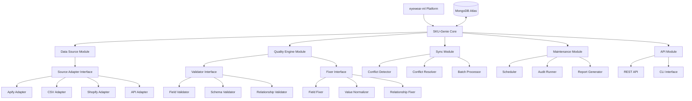

# SKU-Genie Technical Specification

## Overview

This document provides detailed technical specifications for the SKU-Genie data quality management system. It expands on the project plan with implementation details, design patterns, and technical considerations.

## System Architecture

### Component Diagram



## Core Interfaces

### Source Adapter Interface

```python
class SourceAdapter(ABC):
    """Base interface for all source adapters"""
    
    @abstractmethod
    async def connect(self, config: Dict[str, Any]) -> bool:
        """Connect to the data source"""
        pass
    
    @abstractmethod
    async def test_connection(self) -> bool:
        """Test the connection to the data source"""
        pass
    
    @abstractmethod
    async def fetch_data(self, options: Dict[str, Any]) -> AsyncIterator[Dict[str, Any]]:
        """Fetch data from the source as an async iterator"""
        pass
    
    @abstractmethod
    async def get_schema(self) -> Dict[str, Any]:
        """Get the schema of the data source"""
        pass
    
    @abstractmethod
    async def close(self) -> None:
        """Close the connection to the data source"""
        pass
```

### Validator Interface

```python
class Validator(ABC):
    """Base interface for all validators"""
    
    @abstractmethod
    async def validate(self, data: Dict[str, Any], schema: Dict[str, Any]) -> ValidationResult:
        """Validate data against schema"""
        pass
```

### Fixer Interface

```python
class Fixer(ABC):
    """Base interface for all fixers"""
    
    @abstractmethod
    async def fix(self, data: Dict[str, Any], issues: List[ValidationIssue], schema: Dict[str, Any]) -> FixResult:
        """Fix validation issues in data"""
        pass
```

## Key Data Models

### Client Configuration

```python
class ClientConfig:
    client_id: str
    name: str
    created_at: datetime
    active: bool = True
    data_sources: List[DataSourceConfig] = []
    schemas: Dict[str, SchemaConfig] = {}
    quality_settings: QualitySettings
    notification_settings: NotificationSettings
```

### Data Source Configuration

```python
class DataSourceConfig:
    source_id: str
    source_type: Literal["apify", "manual", "shopify", "api"]
    connection_details: Dict[str, Any]
    sync_frequency: str  # cron expression
    priority: int  # for conflict resolution
```

### Schema Configuration

```python
class SchemaConfig:
    required_fields: List[str]
    field_types: Dict[str, str]
    field_formats: Dict[str, str]
    field_values: Dict[str, List[Any]]
    normalization_rules: Dict[str, NormalizationRule]
```

### Validation Result

```python
class ValidationIssue:
    field: str
    issue_type: str
    message: str
    severity: str

class ValidationResult:
    valid: bool
    issues: List[ValidationIssue]
```

### Fix Result

```python
class FixResult:
    original_data: Dict[str, Any]
    fixed_data: Dict[str, Any]
    fixed_issues: List[ValidationIssue]
    unfixed_issues: List[ValidationIssue]
```

## Implementation Details

### Apify Adapter Implementation

```python
class ApifyAdapter(SourceAdapter):
    """Adapter for Apify data source"""
    
    async def connect(self, config: Dict[str, Any]) -> bool:
        self.api_token = config.get("api_token")
        self.dataset_id = config.get("dataset_id")
        self.client = ApifyClient(self.api_token)
        return await self.test_connection()
    
    async def test_connection(self) -> bool:
        try:
            dataset = await self.client.dataset(self.dataset_id).get()
            return dataset is not None
        except Exception as e:
            logger.error(f"Failed to connect to Apify: {str(e)}")
            return False
    
    async def fetch_data(self, options: Dict[str, Any]) -> AsyncIterator[Dict[str, Any]]:
        limit = options.get("limit", 1000)
        offset = options.get("offset", 0)
        
        while True:
            items = await self.client.dataset(self.dataset_id).list_items(
                limit=limit,
                offset=offset
            ).items()
            
            if not items:
                break
                
            for item in items:
                yield self._transform_item(item)
                
            offset += limit
            
            if len(items) < limit:
                break
    
    async def get_schema(self) -> Dict[str, Any]:
        # Infer schema from a sample of items
        sample = await self.client.dataset(self.dataset_id).list_items(limit=10).items()
        return self._infer_schema(sample)
    
    async def close(self) -> None:
        # No explicit close needed for Apify client
        pass
    
    def _transform_item(self, item: Dict[str, Any]) -> Dict[str, Any]:
        """Transform Apify item to standard format"""
        # Implementation specific to Apify data structure
        return {
            "id": item.get("id"),
            "brand": item.get("brand"),
            "frameShape": item.get("frameShape"),
            "frameMaterial": item.get("frameMaterial"),
            "frameWidth": self._extract_measurement(item, "width"),
            "images": item.get("images", []),
            "source": "apify",
            "source_id": item.get("id"),
            "last_updated": datetime.now().isoformat()
        }
```

### Field Validator Implementation

```python
class FieldValidator(Validator):
    """Validator for field-level validation"""
    
    async def validate(self, data: Dict[str, Any], schema: Dict[str, Any]) -> ValidationResult:
        issues = []
        
        # Check required fields
        for field in schema.get("required_fields", []):
            if field not in data or data[field] is None:
                issues.append(ValidationIssue(
                    field=field,
                    issue_type="missing_required_field",
                    message=f"Required field '{field}' is missing",
                    severity="error"
                ))
        
        # Check field types
        for field, field_type in schema.get("field_types", {}).items():
            if field in data and data[field] is not None:
                if not self._validate_field_type(data[field], field_type):
                    issues.append(ValidationIssue(
                        field=field,
                        issue_type="invalid_field_type",
                        message=f"Field '{field}' has invalid type, expected {field_type}",
                        severity="error"
                    ))
        
        # Check field formats
        for field, field_format in schema.get("field_formats", {}).items():
            if field in data and data[field] is not None:
                if not self._validate_field_format(data[field], field_format):
                    issues.append(ValidationIssue(
                        field=field,
                        issue_type="invalid_field_format",
                        message=f"Field '{field}' has invalid format, expected {field_format}",
                        severity="error"
                    ))
        
        # Check field values
        for field, field_values in schema.get("field_values", {}).items():
            if field in data and data[field] is not None:
                if not self._validate_field_value(data[field], field_values):
                    issues.append(ValidationIssue(
                        field=field,
                        issue_type="invalid_field_value",
                        message=f"Field '{field}' has invalid value, expected one of {field_values}",
                        severity="error"
                    ))
        
        return ValidationResult(
            valid=len(issues) == 0,
            issues=issues
        )
```

### Field Fixer Implementation

```python
class FieldFixer(Fixer):
    """Fixer for field-level issues"""
    
    async def fix(self, data: Dict[str, Any], issues: List[ValidationIssue], schema: Dict[str, Any]) -> FixResult:
        fixed_issues = []
        unfixed_issues = []
        
        for issue in issues:
            if issue.issue_type == "missing_required_field":
                if self._fix_missing_field(data, issue.field, schema):
                    fixed_issues.append(issue)
                else:
                    unfixed_issues.append(issue)
            elif issue.issue_type == "invalid_field_type":
                if self._fix_invalid_type(data, issue.field, schema):
                    fixed_issues.append(issue)
                else:
                    unfixed_issues.append(issue)
            elif issue.issue_type == "invalid_field_format":
                if self._fix_invalid_format(data, issue.field, schema):
                    fixed_issues.append(issue)
                else:
                    unfixed_issues.append(issue)
            elif issue.issue_type == "invalid_field_value":
                if self._fix_invalid_value(data, issue.field, schema):
                    fixed_issues.append(issue)
                else:
                    unfixed_issues.append(issue)
            else:
                unfixed_issues.append(issue)
        
        return FixResult(
            original_data=copy.deepcopy(data),
            fixed_data=data,
            fixed_issues=fixed_issues,
            unfixed_issues=unfixed_issues
        )
```

## Database Schema

### Collections

#### client_configs

```json
{
  "client_id": "acme-eyewear",
  "name": "Acme Eyewear",
  "created_at": "2025-04-08T12:00:00Z",
  "active": true,
  "data_sources": [
    {
      "source_id": "shopify-1",
      "source_type": "shopify",
      "connection_details": {
        "shop_url": "https://acme-eyewear.myshopify.com",
        "api_key": "...",
        "api_password": "..."
      },
      "sync_frequency": "0 0 * * *",
      "priority": 1
    }
  ],
  "schemas": {
    "products": {
      "required_fields": ["brand", "frameShape", "frameMaterial", "frameWidth", "images"],
      "field_types": {
        "brand": "string",
        "frameShape": "enum:round,square,oval,rectangle,cat-eye",
        "frameMaterial": "enum:metal,plastic,acetate,titanium,mixed",
        "frameWidth": "number:mm",
        "images": "array:string:url"
      },
      "normalization_rules": {
        "frameShape": {
          "pattern_map": {
            "circular|circle|round": "round",
            "rectangular|rectangle": "rectangle",
            "oval|elliptical": "oval"
          }
        },
        "frameMaterial": {
          "pattern_map": {
            "plastic|nylon": "plastic",
            "metal|alloy": "metal",
            "acetate|cellulose acetate": "acetate"
          }
        }
      }
    }
  },
  "quality_settings": {
    "auto_fix": true,
    "quality_threshold": 0.8,
    "conflict_resolution_strategy": "newest_wins"
  },
  "notification_settings": {
    "email": "admin@acme-eyewear.com",
    "notify_on_import": true,
    "notify_on_quality_issues": true,
    "notify_on_maintenance": true
  }
}
```

#### import_jobs

```json
{
  "job_id": "550e8400-e29b-41d4-a716-446655440000",
  "client_id": "acme-eyewear",
  "source_id": "shopify-1",
  "status": "completed",
  "created_at": "2025-04-08T12:00:00Z",
  "started_at": "2025-04-08T12:00:05Z",
  "completed_at": "2025-04-08T12:05:30Z",
  "options": {
    "limit": 1000,
    "validate": true,
    "fix": true
  },
  "result": {
    "total_items": 500,
    "imported_items": 500,
    "items_with_issues": 50,
    "fixed_items": 45,
    "unfixed_items": 5,
    "quality_score": 0.91
  }
}
```

## Performance Considerations

### Batch Processing

For large datasets, SKU-Genie uses batch processing to efficiently handle data:

```python
async def process_in_batches(self, data_iterator, batch_size, processor_func):
    """Process data in batches"""
    batch = []
    
    async for item in data_iterator:
        batch.append(item)
        
        if len(batch) >= batch_size:
            await processor_func(batch)
            batch = []
    
    # Process remaining items
    if batch:
        await processor_func(batch)
```

### Indexing Strategy

To optimize database queries, SKU-Genie creates the following indexes:

```python
# Create indexes
await db.products.create_index([("client_id", 1)])
await db.products.create_index([("client_id", 1), ("source", 1)])
await db.products.create_index([("client_id", 1), ("brand", 1)])
await db.products.create_index([("client_id", 1), ("frameShape", 1)])
await db.products.create_index([("client_id", 1), ("frameMaterial", 1)])
```

### Caching

SKU-Genie implements caching for frequently accessed data:

```python
class SchemaCache:
    """Cache for client schemas"""
    
    def __init__(self, ttl_seconds=300):
        self.cache = {}
        self.ttl_seconds = ttl_seconds
    
    async def get(self, client_id, collection):
        """Get schema from cache or database"""
        cache_key = f"{client_id}:{collection}"
        
        if cache_key in self.cache:
            entry = self.cache[cache_key]
            if entry["expires_at"] > time.time():
                return entry["schema"]
            else:
                del self.cache[cache_key]
        
        # Get from database
        client_config = await db.client_configs.find_one({"client_id": client_id})
        if not client_config or collection not in client_config["schemas"]:
            return None
        
        schema = client_config["schemas"][collection]
        
        # Store in cache
        self.cache[cache_key] = {
            "schema": schema,
            "expires_at": time.time() + self.ttl_seconds
        }
        
        return schema
```

## Security Considerations

### Authentication and Authorization

SKU-Genie integrates with the existing eyewear-ml authentication system and implements role-based access control:

```python
class Permission(str, Enum):
    READ = "read"
    WRITE = "write"
    ADMIN = "admin"

class Resource(str, Enum):
    CLIENT = "client"
    DATA_SOURCE = "data_source"
    SCHEMA = "schema"
    IMPORT = "import"
    QUALITY = "quality"
    MAINTENANCE = "maintenance"

async def check_permission(user_id, client_id, resource, permission):
    """Check if user has permission for resource"""
    user_role = await db.user_roles.find_one({
        "user_id": user_id,
        "client_id": client_id
    })
    
    if not user_role:
        return False
    
    if user_role["role"] == "admin":
        return True
    
    if resource in user_role["permissions"]:
        return permission in user_role["permissions"][resource]
    
    return False
```

### Sensitive Data Handling

SKU-Genie implements secure handling of sensitive data:

```python
class SecureConnectionDetails:
    """Secure handling of connection details"""
    
    @staticmethod
    def encrypt(details):
        """Encrypt connection details"""
        # Implementation for encrypting connection details
        pass
    
    @staticmethod
    def decrypt(encrypted_details):
        """Decrypt connection details"""
        # Implementation for decrypting connection details
        pass
```

## Next Steps

1. Create a new branch in the eyewear-ml repository for SKU-Genie
2. Set up the initial project structure following the architecture outlined above
3. Implement the core interfaces and data models
4. Develop the first data source adapter (Apify) leveraging existing code
5. Create a basic CLI for testing the core functionality
