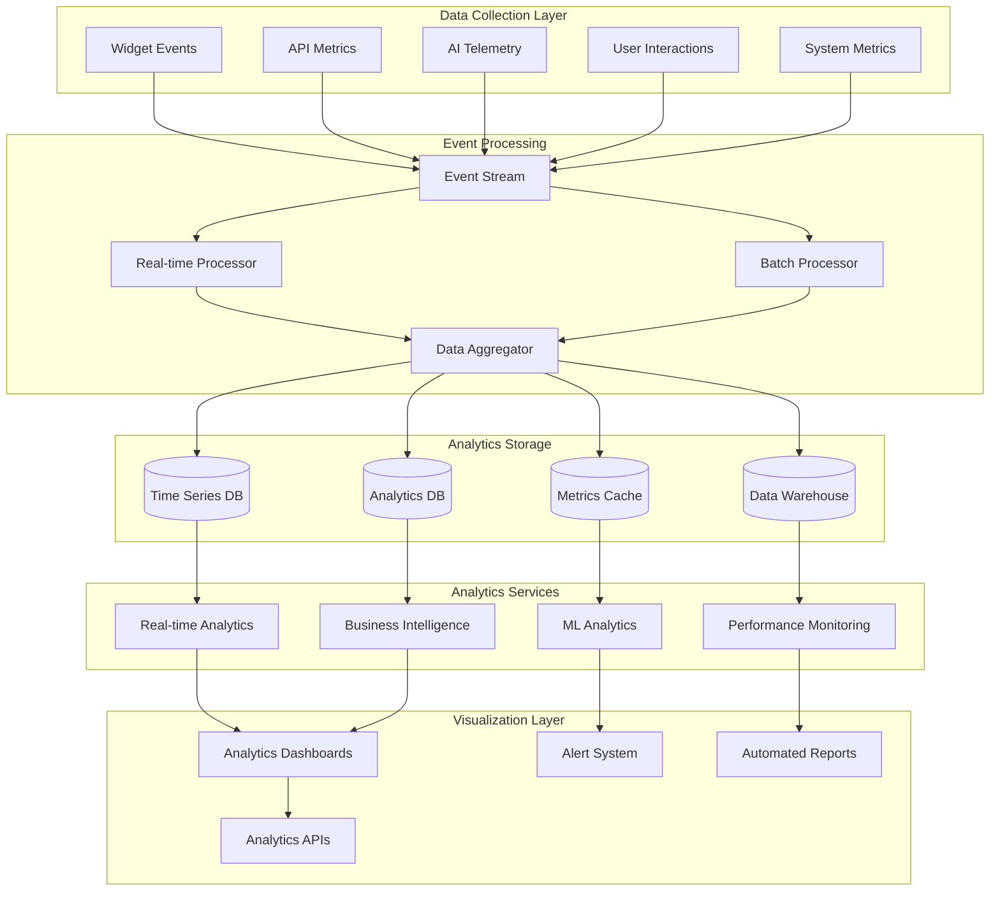

# Analytics and Monitoring Data Models Specification
## AI Discovery E-commerce Integration

## Document Information
- **Document Type**: Analytics and Monitoring Data Models Specification
- **System**: EyewearML Varai AI Discovery
- **Version**: 1.0
- **Date**: January 2025
- **Author**: Agent 2 - Data Architecture Specification Agent

## Executive Summary

This document defines comprehensive analytics and monitoring data models for the AI discovery e-commerce integration, providing real-time insights into system performance, user behavior, AI effectiveness, and business metrics. The specifications build upon the existing analytics infrastructure while introducing AI-specific monitoring and cross-platform analytics capabilities.

## Analytics Data Architecture



## Core Analytics Data Models

### 1. User Journey Analytics

```typescript
interface UserJourneyAnalytics {
  // Session tracking
  sessionTracking: {
    collection: 'analytics_user_sessions';
    schema: {
      sessionId: string;
      userId?: string; // Optional for anonymous users
      storeId: string;
      platform: 'shopify' | 'magento' | 'woocommerce' | 'html';
      timestamp: Date;
      
      // Session metadata
      sessionMetadata: {
        deviceType: 'mobile' | 'desktop' | 'tablet';
        browser: string;
        operatingSystem: string;
        screenResolution: string;
        userAgent: string;
        ipAddress: string; // Hashed for privacy
        geolocation: {
          country: string;
          region: string;
          city?: string;
        };
      };
      
      // Journey progression
      journeyStages: {
        stageId: string;
        stageName: 'landing' | 'widget_interaction' | 'face_analysis' | 'recommendations' | 'virtual_try_on' | 'product_view' | 'add_to_cart' | 'checkout' | 'purchase';
        timestamp: Date;
        duration: number; // Time spent in stage (ms)
        interactions: number; // Number of interactions in stage
        exitPoint?: boolean; // Did user exit at this stage
      }[];
      
      // Session outcomes
      sessionOutcome: {
        completed: boolean;
        conversionType?: 'purchase' | 'add_to_cart' | 'save_for_later' | 'email_signup';
        conversionValue?: number;
        recommendationsViewed: number;
        virtualTryOnsUsed: number;
        totalDuration: number;
        bounceRate: boolean;
      };
      
      // Privacy compliance
      privacyMetadata: {
        consentLevel: 'basic' | 'enhanced' | 'research';
        dataRetentionDays: number;
        anonymized: boolean;
        region: 'EU' | 'NA';
      };
    };
    
    indexes: [
      { sessionId: 1 },
      { userId: 1, timestamp: -1 },
      { storeId: 1, timestamp: -1 },
      { platform: 1, timestamp: -1 },
      { 'sessionOutcome.conversionType': 1, timestamp: -1 },
      { 'privacyMetadata.region': 1, timestamp: -1 }
    ];
  };
  
  // Interaction events
  interactionEvents: {
    collection: 'analytics_interaction_events';
    schema: {
      eventId: string;
      sessionId: string;
      userId?: string;
      timestamp: Date;
      
      // Event details
      eventType: 'click' | 'view' | 'hover' | 'scroll' | 'input' | 'gesture';
      eventCategory: 'widget' | 'product' | 'recommendation' | 'ui_element';
      eventAction: string; // Specific action taken
      eventLabel?: string; // Additional context
      
      // Element details
      elementDetails: {
        elementId?: string;
        elementType: string;
        elementText?: string;
        elementPosition: { x: number; y: number };
        pageUrl: string;
        referrer?: string;
      };
      
      // Context data
      contextData: {
        currentStage: string;
        previousStage?: string;
        timeInStage: number;
        cumulativeTime: number;
        interactionSequence: number;
      };
      
      // Custom properties
      customProperties: Record<string, any>;
    };
    
    indexes: [
      { eventId: 1 },
      { sessionId: 1, timestamp: 1 },
      { eventType: 1, timestamp: -1 },
      { eventCategory: 1, eventAction: 1 },
      { timestamp: -1 }
    ];
  };
}
```

### 2. AI Performance Analytics

```typescript
interface AIPerformanceAnalytics {
  // Face analysis performance
  faceAnalysisMetrics: {
    collection: 'analytics_face_analysis';
    schema: {
      analysisId: string;
      sessionId: string;
      userId?: string;
      timestamp: Date;
      
      // Performance metrics
      performanceMetrics: {
        totalProcessingTime: number; // End-to-end time (ms)
        clientProcessingTime?: number; // Client-side processing (ms)
        serverProcessingTime?: number; // Server-side processing (ms)
        networkLatency: number; // Network round-trip time (ms)
        
        // Processing breakdown
        processingBreakdown: {
          imageCapture: number;
          mediapipeProcessing: number;
          featureExtraction: number;
          measurementCalculation: number;
          faceShapeClassification: number;
          qualityValidation: number;
        };
      };
      
      // Quality metrics
      qualityMetrics: {
        imageQuality: {
          resolution: { width: number; height: number };
          brightness: number; // 0-1 scale
          contrast: number; // 0-1 scale
          sharpness: number; // 0-1 scale
          faceDetectionConfidence: number; // 0-1 scale
        };
        
        measurementAccuracy: {
          pupillaryDistanceConfidence: number;
          faceWidthConfidence: number;
          faceShapeConfidence: number;
          overallAccuracy: number;
        };
        
        processingSuccess: {
          successful: boolean;
          errorType?: string;
          errorMessage?: string;
          retryCount: number;
        };
      };
      
      // Results data (anonymized)
      resultsData: {
        faceShape: 'oval' | 'round' | 'square' | 'heart' | 'diamond' | 'oblong';
        measurementRanges: {
          pupillaryDistance: 'small' | 'medium' | 'large';
          faceWidth: 'narrow' | 'medium' | 'wide';
          bridgeWidth: 'narrow' | 'medium' | 'wide';
        };
        recommendationCount: number;
      };
      
      // Technical metadata
      technicalMetadata: {
        processingLocation: 'client' | 'edge' | 'server';
        modelVersion: string;
        deviceCapabilities: {
          webgl: boolean;
          webAssembly: boolean;
          camera: boolean;
          performance: 'low' | 'medium' | 'high';
        };
      };
    };
    
    indexes: [
      { analysisId: 1 },
      { sessionId: 1, timestamp: 1 },
      { 'performanceMetrics.totalProcessingTime': 1 },
      { 'qualityMetrics.processingSuccess.successful': 1 },
      { 'resultsData.faceShape': 1 },
      { timestamp: -1 }
    ];
  };
  
  // Recommendation performance
  recommendationMetrics: {
    collection: 'analytics_recommendations';
    schema: {
      recommendationId: string;
      sessionId: string;
      userId?: string;
      timestamp: Date;
      
      // Input context
      inputContext: {
        faceShape?: string;
        userPreferences: {
          stylePreferences: string[];
          brandPreferences: string[];
          priceRange: { min: number; max: number };
          colorPreferences: string[];
        };
        sessionContext: {
          platform: string;
          deviceType: string;
          timeOfDay: 'morning' | 'afternoon' | 'evening';
          dayOfWeek: string;
        };
      };
      
      // Generation performance
      generationMetrics: {
        totalGenerationTime: number; // Total time to generate recommendations (ms)
        algorithmBreakdown: {
          dataRetrieval: number;
          featureMatching: number;
          scoringCalculation: number;
          ranking: number;
          filtering: number;
        };
        
        cachePerformance: {
          cacheHit: boolean;
          cacheKey?: string;
          cacheGenerationTime?: number;
        };
      };
      
      // Recommendation results
      recommendationResults: {
        totalRecommendations: number;
        recommendationScores: {
          averageScore: number;
          scoreDistribution: number[]; // Score buckets
          topScore: number;
          scoreVariance: number;
        };
        
        diversityMetrics: {
          brandDiversity: number; // Number of unique brands
          styleDiversity: number; // Number of unique styles
          priceRangeCoverage: number; // Price range coverage
        };
      };
      
      // User engagement
      engagementMetrics: {
        viewedRecommendations: number;
        clickedRecommendations: number;
        virtualTryOnUsage: number;
        addedToCart: number;
        purchased: number;
        
        engagementTiming: {
          timeToFirstClick: number;
          timeToFirstVTO: number;
          timeToAddCart: number;
          totalEngagementTime: number;
        };
      };
      
      // Quality feedback
      qualityFeedback: {
        userRating?: number; // 1-5 scale
        relevanceScore?: number; // Calculated relevance
        diversityScore?: number; // Calculated diversity
        noveltyScore?: number; // How novel/surprising recommendations were
      };
    };
    
    indexes: [
      { recommendationId: 1 },
      { sessionId: 1, timestamp: 1 },
      { 'generationMetrics.totalGenerationTime': 1 },
      { 'engagementMetrics.clickedRecommendations': 1 },
      { 'qualityFeedback.userRating': 1 },
      { timestamp: -1 }
    ];
  };
  
  // Conversation AI metrics
  conversationMetrics: {
    collection: 'analytics_conversations';
    schema: {
      conversationId: string;
      sessionId: string;
      userId?: string;
      timestamp: Date;
      
      // Conversation flow
      conversationFlow: {
        totalTurns: number;
        userTurns: number;
        aiTurns: number;
        averageUserMessageLength: number;
        averageAiResponseLength: number;
        
        turnDetails: {
          turnNumber: number;
          speaker: 'user' | 'ai';
          messageLength: number;
          processingTime?: number; // For AI responses
          intent?: string; // Detected user intent
          confidence?: number; // Intent confidence
          entities?: Record<string, any>; // Extracted entities
        }[];
      };
      
      // Performance metrics
      performanceMetrics: {
        averageResponseTime: number;
        maxResponseTime: number;
        totalConversationTime: number;
        
        nlpPerformance: {
          intentRecognitionAccuracy: number;
          entityExtractionAccuracy: number;
          contextMaintenanceScore: number;
        };
      };
      
      // Conversation outcomes
      conversationOutcomes: {
        completed: boolean;
        goalAchieved: boolean;
        userSatisfaction?: number; // 1-5 scale
        
        businessOutcomes: {
          recommendationsGenerated: boolean;
          faceAnalysisCompleted: boolean;
          virtualTryOnUsed: boolean;
          productsPurchased: number;
          leadGenerated: boolean;
        };
        
        conversationQuality: {
          coherenceScore: number; // How coherent was the conversation
          helpfulnessScore: number; // How helpful was the AI
          naturalness Score: number; // How natural did the conversation feel
        };
      };
      
      // Error tracking
      errorTracking: {
        errors: {
          errorType: string;
          errorMessage: string;
          turnNumber: number;
          recovered: boolean;
        }[];
        
        fallbackUsage: {
          fallbackTriggered: boolean;
          fallbackType: string;
          fallbackSuccess: boolean;
        }[];
      };
    };
    
    indexes: [
      { conversationId: 1 },
      { sessionId: 1, timestamp: 1 },
      { 'conversationOutcomes.completed': 1 },
      { 'conversationOutcomes.userSatisfaction': 1 },
      { 'performanceMetrics.averageResponseTime': 1 },
      { timestamp: -1 }
    ];
  };
}
```

### 3. Business Intelligence Data Models

```typescript
interface BusinessIntelligenceModels {
  // Conversion analytics
  conversionAnalytics: {
    collection: 'analytics_conversions';
    schema: {
      conversionId: string;
      sessionId: string;
      userId?: string;
      storeId: string;
      timestamp: Date;
      
      // Conversion details
      conversionDetails: {
        conversionType: 'purchase' | 'add_to_cart' | 'save_for_later' | 'email_signup' | 'virtual_try_on';
        conversionValue: number; // Monetary value
        conversionCurrency: string;
        
        // Product details
        products: {
          productId: string;
          productName: string;
          brand: string;
          category: string;
          price: number;
          quantity: number;
          recommended: boolean; // Was this product recommended by AI
          recommendationRank?: number; // Position in recommendations
        }[];
      };
      
      // Attribution data
      attributionData: {
        aiDiscoveryUsed: boolean;
        faceAnalysisUsed: boolean;
        recommendationsViewed: number;
        virtualTryOnUsed: boolean;
        
        // Journey attribution
        touchpoints: {
          touchpointType: 'organic_search' | 'paid_search' | 'social' | 'direct' | 'referral' | 'email';
          timestamp: Date;
          source: string;
          medium: string;
          campaign?: string;
        }[];
        
        // AI contribution
        aiContribution: {
          faceAnalysisInfluence: number; // 0-1 scale
          recommendationInfluence: number; // 0-1 scale
          conversationInfluence: number; // 0-1 scale
          overallAiInfluence: number; // 0-1 scale
        };
      };
      
      // Customer data
      customerData: {
        customerType: 'new' | 'returning' | 'vip';
        customerSegment?: string;
        lifetimeValue?: number;
        previousPurchases: number;
        
        // Demographics (anonymized)
        demographics: {
          ageRange?: 'under_25' | '25_34' | '35_44' | '45_54' | '55_plus';
          genderPreference?: 'masculine' | 'feminine' | 'unisex';
          locationRegion: string;
        };
      };
      
      // Performance metrics
      performanceMetrics: {
        timeToConversion: number; // Time from first interaction to conversion
        sessionCount: number; // Number of sessions before conversion
        touchpointCount: number; // Number of touchpoints before conversion
        
        // AI efficiency
        aiEfficiency: {
          recommendationAccuracy: number; // How accurate were recommendations
          faceAnalysisAccuracy: number; // How accurate was face analysis
          conversationEffectiveness: number; // How effective was conversation
        };
      };
    };
    
    indexes: [
      { conversionId: 1 },
      { sessionId: 1 },
      { storeId: 1, timestamp: -1 },
      { 'conversionDetails.conversionType': 1, timestamp: -1 },
      { 'attributionData.aiDiscoveryUsed': 1 },
      { 'customerData.customerType': 1 },
      { timestamp: -1 }
    ];
  };
  
  // Revenue analytics
  revenueAnalytics: {
    collection: 'analytics_revenue';
    schema: {
      revenueId: string;
      storeId: string;
      timestamp: Date;
      
      // Revenue breakdown
      revenueBreakdown: {
        totalRevenue: number;
        aiAttributedRevenue: number; // Revenue attributed to AI discovery
        traditionalRevenue: number; // Revenue from traditional search/browse
        
        // AI contribution breakdown
        aiContribution: {
          faceAnalysisRevenue: number;
          recommendationRevenue: number;
          conversationRevenue: number;
          virtualTryOnRevenue: number;
        };
        
        // Product category breakdown
        categoryBreakdown: {
          category: string;
          revenue: number;
          aiAttributedRevenue: number;
          units: number;
          averageOrderValue: number;
        }[];
      };
      
      // Performance metrics
      performanceMetrics: {
        conversionRate: number; // Overall conversion rate
        aiConversionRate: number; // AI-assisted conversion rate
        traditionalConversionRate: number; // Traditional conversion rate
        
        // Revenue efficiency
        revenuePerSession: number;
        revenuePerUser: number;
        aiRevenueMultiplier: number; // AI revenue vs traditional revenue multiplier
        
        // Customer metrics
        averageOrderValue: number;
        aiAverageOrderValue: number;
        customerLifetimeValue: number;
        repeatPurchaseRate: number;
      };
      
      // Time-based analysis
      timeAnalysis: {
        hourOfDay: number;
        dayOfWeek: number;
        monthOfYear: number;
        seasonality: 'spring' | 'summer' | 'fall' | 'winter';
        
        // Performance by time
        timePerformance: {
          peakHours: number[];
          peakDays: string[];
          seasonalTrends: Record<string, number>;
        };
      };
    };
    
    indexes: [
      { revenueId: 1 },
      { storeId: 1, timestamp: -1 },
      { 'timeAnalysis.hourOfDay': 1 },
      { 'timeAnalysis.dayOfWeek': 1 },
      { timestamp: -1 }
    ];
  };
  
  // Customer analytics
  customerAnalytics: {
    collection: 'analytics_customers';
    schema: {
      customerId: string;
      storeId: string;
      timestamp: Date;
      
      // Customer profile
      customerProfile: {
        customerType: 'new' | 'returning' | 'vip';
        registrationDate?: Date;
        firstPurchaseDate?: Date;
        lastActivityDate: Date;
        
        // Engagement metrics
        engagementMetrics: {
          totalSessions: number;
          totalPageViews: number;
          averageSessionDuration: number;
          bounceRate: number;
          
          // AI engagement
          aiEngagement: {
            faceAnalysisUsage: number;
            recommendationInteractions: number;
            conversationSessions: number;
            virtualTryOnUsage: number;
          };
        };
      };
      
      // Purchase behavior
      purchaseBehavior: {
        totalPurchases: number;
        totalSpent: number;
        averageOrderValue: number;
        
        // Purchase patterns
        purchasePatterns: {
          preferredCategories: string[];
          preferredBrands: string[];
          priceRangePreference: { min: number; max: number };
          seasonalPatterns: Record<string, number>;
        };
        
        // AI influence on purchases
        aiInfluence: {
          aiAssistedPurchases: number;
          aiRecommendationPurchases: number;
          faceAnalysisInfluencedPurchases: number;
          conversationInfluencedPurchases: number;
        };
      };
      
      // Preferences and insights
      preferencesInsights: {
        // Inferred preferences
        inferredPreferences: {
          faceShape?: string;
          stylePreferences: string[];
          colorPreferences: string[];
          materialPreferences: string[];
        };
        
        // Behavioral insights
        behavioralInsights: {
          shoppingPattern: 'browser' | 'researcher' | 'impulse_buyer' | 'deal_seeker';
          decisionSpeed: 'fast' | 'medium' | 'slow';
          pricesensitivity: 'low' | 'medium' | 'high';
          brandLoyalty: 'low' | 'medium' | 'high';
        };
        
        // AI interaction patterns
        aiInteractionPatterns: {
          preferredInteractionType: 'conversation' | 'recommendations' | 'face_analysis';
          aiTrustLevel: 'low' | 'medium' | 'high';
          feedbackFrequency: number;
          aiSatisfactionScore: number;
        };
      };
    };
    
    indexes: [
      { customerId: 1 },
      { storeId: 1, timestamp: -1 },
      { 'customerProfile.customerType': 1 },
      { 'purchaseBehavior.totalSpent': -1 },
      { 'customerProfile.lastActivityDate': -1 },
      { timestamp: -1 }
    ];
  };
}
```

### 4. System Performance Monitoring Models

```typescript
interface SystemPerformanceModels {
  // API performance metrics
  apiPerformanceMetrics: {
    collection: 'monitoring_api_performance';
    schema: {
      metricId: string;
      timestamp: Date;
      
      // Endpoint details
      endpointDetails: {
        endpoint: string;
        method: 'GET' | 'POST' | 'PUT' | 'DELETE';
        service: string;
        version: string;
      };
      
      // Performance metrics
      performanceMetrics: {
        responseTime: {
          p50: number;
          p95: number;
          p99: number;
          max: number;
          average: number;
        };
        
        throughput: {
          requestsPerSecond: number;
          requestsPerMinute: number;
          concurrentRequests: number;
        };
        
        errorMetrics: {
          errorRate: number;
          errorCount: number;
          errorTypes: Record<string, number>;
          timeoutRate: number;
        };
      };
      
      // Resource utilization
      resourceUtilization: {
        cpuUsage: number;
        memoryUsage: number;
        diskIO: number;
        networkIO: number;
        
        // Service-specific resources
        serviceResources: {
          connectionPoolUsage: number;
          cacheHitRate: number;
          queueDepth: number;
          workerUtilization: number;
        };
      };
      
      // Geographic distribution
      geographicMetrics: {
        region: string;
        responseTime: number;
        errorRate: number;
        throughput: number;
      }[];
    };
    
    indexes: [
      { metricId: 1 },
      { 'endpointDetails.endpoint': 1, timestamp: -1 },
      { 'endpointDetails.service': 1, timestamp: -1 },
      { 'performanceMetrics.responseTime.p95': 1 },
      { timestamp: -1 }
    ];
  };
  
  // Database performance metrics
  databasePerformanceMetrics: {
    collection: 'monitoring_database_performance';
    schema: {
      metricId: string;
      timestamp: Date;
      
      // Database details
      databaseDetails: {
        databaseType: 'mongodb' | 'redis';
        instance: string;
        cluster: string;
        shard?: string;
      };
      
      // Query performance
      queryPerformance: {
        slowQueries: {
          query: string;
          executionTime: number;
          frequency: number;
          indexUsed: boolean;
        }[];
        
        queryMetrics: {
          averageQueryTime: number;
          p95QueryTime: number;
          queriesPerSecond: number;
          indexHitRatio: number;
        };
      };
      
      // Resource metrics
      resourceMetrics: {
        cpuUsage: number;
        memoryUsage: number;
        diskUsage: number;
        networkIO: number;
        
        // Database-specific metrics
        databaseSpecific: {
          connectionCount: number;
          lockWaitTime: number;
          cacheHitRatio: number;
          replicationLag?: number;
        };
      };
      
      // Storage metrics
      storageMetrics: {
        totalSize: number;
        dataSize: number;
        indexSize: number;
        growthRate: number;
        
        // Performance impact
        storagePerformance: {
          readLatency: number;
          writeLatency: number;
          iops: number;
          throughput: number;
        };
      };
    };
    
    indexes: [
      { metricId: 1 },
      { 'databaseDetails.databaseType': 1, timestamp: -1 },
      { 'databaseDetails.instance': 1, timestamp: -1 },
      { 'queryPerformance.queryMetrics.p95QueryTime': 1 },
      { timestamp: -1 }
    ];
  };
  
  // Infrastructure monitoring
  infrastructureMonitoring: {
    collection: 'monitoring_infrastructure';
    schema: {
      metricId: string;
      timestamp: Date;
      
      // Infrastructure details
      infrastructureDetails: {
        resourceType: 'compute' | 'storage' | 'network' | 'cache';
        resourceId: string;
        region: string;
        availabilityZone: string;
      };
      
      // Health metrics
      healthMetrics: {
        status: 'healthy' | 'warning' | 'critical' | 'unknown';
        uptime: number;
        availability: number;
        
        // Health checks
        healthChecks: {
          checkName: string;
          status: 'pass' | 'fail' | 'warn';
          responseTime: number;
          lastCheck: Date;
        }[];
      };
      
      // Performance metrics
      performanceMetrics: {
        cpuUtilization: number;
        memoryUtilization: number;
        diskUtilization: number;
        networkUtilization: number;
        
        // Load metrics
        loadMetrics: {
          loadAverage: number[];
          requestQueue: number;
          activeConnections: number;
          processingTime: number;
        };
      };
      
      // Scaling metrics
      scalingMetrics: {
        currentInstances: number;
        targetInstances: number;
        scalingEvents: {
          eventType: 'scale_up' | 'scale_down';
          timestamp: Date;
          reason: string;
          instanceChange: number;
        }[];
        
        // Auto-scaling performance
        autoScalingPerformance: {
          scaleUpTime: number;
          scaleDownTime: number;
          scalingAccuracy: number;
          costEfficiency: number;
        };
      };
    };
    
    indexes: [
      { metricId: 1 },
      { 'infrastructureDetails.resourceType': 1, timestamp: -1 },
      { 'infrastructureDetails.region': 1, timestamp: -1 },
      { 'healthMetrics.status': 1, timestamp: -1 },
      { timestamp: -1 }
    ];
  };
}
```

### 5. Real-time Analytics and Alerting

```typescript
interface RealTimeAnalytics {
  // Real-time dashboards
  realTimeDashboards: {
    // Executive dashboard
    executiveDashboard: {
      metrics: [
        'total_active_users',
        'conversion_rate_last_hour',
        'revenue_last_24_hours',
        'ai_discovery_usage_rate',
        'system_health_score'
      ];
      updateInterval: '30_seconds';
      alertThresholds: {
        conversionRateDrops: '20_percent_below_baseline';
        systemHealthDegrades: 'below_95_percent';
        aiUsageDrops: '30_percent_below_baseline';
      };
    };
    
    // Operations dashboard
    operationsDashboard: {
      metrics: [
        'api_response_times',
        'error_rates',
        'database_performance',
        'cache_hit_rates',
        'infrastructure_utilization'
      ];
      updateInterval: '10_seconds';
      alertThresholds: {
        highLatency: 'p95_over_500ms';
        highErrorRate: 'over_5_percent';
        lowCacheHit
        lowCacheHitRate: 'below_80_percent';
        highResourceUsage: 'cpu_or_memory_over_85_percent';
      };
    };
    
    // AI performance dashboard
    aiPerformanceDashboard: {
      metrics: [
        'face_analysis_success_rate',
        'recommendation_generation_time',
        'conversation_completion_rate',
        'ai_accuracy_scores',
        'user_satisfaction_ratings'
      ];
      updateInterval: '1_minute';
      alertThresholds: {
        lowSuccessRate: 'below_95_percent';
        slowGeneration: 'over_2_seconds';
        lowSatisfaction: 'below_4_0_rating';
      };
    };
  };
  
  // Alert management
  alertManagement: {
    alertRules: {
      // Performance alerts
      performanceAlerts: [
        {
          name: 'high_api_latency';
          condition: 'p95_response_time > 500ms for 5 minutes';
          severity: 'warning';
          channels: ['slack', 'email'];
        },
        {
          name: 'high_error_rate';
          condition: 'error_rate > 5% for 2 minutes';
          severity: 'critical';
          channels: ['slack', 'email', 'pagerduty'];
        }
      ];
      
      // Business alerts
      businessAlerts: [
        {
          name: 'conversion_rate_drop';
          condition: 'conversion_rate < baseline * 0.8 for 30 minutes';
          severity: 'warning';
          channels: ['slack', 'email'];
        },
        {
          name: 'revenue_anomaly';
          condition: 'hourly_revenue < baseline * 0.5';
          severity: 'critical';
          channels: ['slack', 'email'];
        }
      ];
      
      // AI alerts
      aiAlerts: [
        {
          name: 'face_analysis_failure_spike';
          condition: 'face_analysis_failure_rate > 10% for 10 minutes';
          severity: 'warning';
          channels: ['slack'];
        },
        {
          name: 'recommendation_quality_drop';
          condition: 'recommendation_ctr < baseline * 0.7 for 1 hour';
          severity: 'warning';
          channels: ['slack', 'email'];
        }
      ];
    };
    
    alertEscalation: {
      escalationLevels: [
        {
          level: 1;
          timeToEscalate: '15_minutes';
          channels: ['slack'];
        },
        {
          level: 2;
          timeToEscalate: '30_minutes';
          channels: ['email', 'phone'];
        },
        {
          level: 3;
          timeToEscalate: '60_minutes';
          channels: ['pagerduty', 'manager_notification'];
        }
      ];
    };
  };
}
```

### 6. Data Aggregation and Reporting

```typescript
interface DataAggregationReporting {
  // Automated reporting
  automatedReporting: {
    // Daily reports
    dailyReports: {
      executiveSummary: {
        schedule: '09:00_UTC_daily';
        recipients: ['executives', 'product_managers'];
        content: [
          'daily_active_users',
          'conversion_rates',
          'revenue_summary',
          'ai_performance_summary',
          'top_performing_products'
        ];
        format: 'pdf_and_email';
      };
      
      operationalReport: {
        schedule: '08:00_UTC_daily';
        recipients: ['operations_team', 'engineering_team'];
        content: [
          'system_performance_summary',
          'error_analysis',
          'infrastructure_utilization',
          'database_performance',
          'security_incidents'
        ];
        format: 'dashboard_link_and_email';
      };
      
      aiPerformanceReport: {
        schedule: '10:00_UTC_daily';
        recipients: ['ai_team', 'product_managers'];
        content: [
          'face_analysis_metrics',
          'recommendation_performance',
          'conversation_quality',
          'model_accuracy_trends',
          'user_feedback_summary'
        ];
        format: 'interactive_dashboard';
      };
    };
    
    // Weekly reports
    weeklyReports: {
      businessIntelligence: {
        schedule: 'monday_09:00_UTC';
        recipients: ['business_stakeholders', 'executives'];
        content: [
          'weekly_revenue_analysis',
          'customer_acquisition_metrics',
          'product_performance_analysis',
          'market_trends',
          'competitive_analysis'
        ];
        format: 'comprehensive_pdf_report';
      };
      
      technicalPerformance: {
        schedule: 'monday_08:00_UTC';
        recipients: ['engineering_team', 'devops_team'];
        content: [
          'system_reliability_metrics',
          'performance_trend_analysis',
          'capacity_planning_recommendations',
          'technical_debt_assessment',
          'security_posture_review'
        ];
        format: 'technical_dashboard';
      };
    };
    
    // Monthly reports
    monthlyReports: {
      strategicAnalysis: {
        schedule: 'first_monday_09:00_UTC';
        recipients: ['c_suite', 'board_members'];
        content: [
          'monthly_business_performance',
          'ai_roi_analysis',
          'customer_satisfaction_trends',
          'market_position_analysis',
          'strategic_recommendations'
        ];
        format: 'executive_presentation';
      };
    };
  };
  
  // Data aggregation pipelines
  aggregationPipelines: {
    // Real-time aggregation
    realTimeAggregation: {
      userActivityAggregation: {
        inputSources: ['user_sessions', 'interaction_events'];
        aggregationWindow: '1_minute';
        outputMetrics: [
          'active_users_count',
          'session_duration_average',
          'interaction_rate',
          'bounce_rate'
        ];
        storage: 'time_series_database';
      };
      
      systemPerformanceAggregation: {
        inputSources: ['api_metrics', 'infrastructure_metrics'];
        aggregationWindow: '30_seconds';
        outputMetrics: [
          'response_time_percentiles',
          'error_rate',
          'throughput',
          'resource_utilization'
        ];
        storage: 'metrics_cache';
      };
    };
    
    // Batch aggregation
    batchAggregation: {
      dailyBusinessMetrics: {
        schedule: '01:00_UTC_daily';
        inputSources: ['conversions', 'revenue', 'customer_data'];
        outputMetrics: [
          'daily_revenue',
          'conversion_rates_by_segment',
          'customer_acquisition_cost',
          'lifetime_value_trends'
        ];
        storage: 'analytics_warehouse';
      };
      
      weeklyTrendAnalysis: {
        schedule: 'sunday_02:00_UTC';
        inputSources: ['daily_aggregates', 'user_behavior'];
        outputMetrics: [
          'weekly_growth_rates',
          'seasonal_patterns',
          'cohort_analysis',
          'retention_metrics'
        ];
        storage: 'business_intelligence_database';
      };
    };
  };
  
  // Custom analytics
  customAnalytics: {
    // A/B testing analytics
    abTestingAnalytics: {
      testTracking: {
        collection: 'analytics_ab_tests';
        schema: {
          testId: string;
          testName: string;
          variant: string;
          userId: string;
          sessionId: string;
          timestamp: Date;
          
          testDetails: {
            testType: 'ui_change' | 'algorithm_change' | 'feature_toggle';
            hypothesis: string;
            startDate: Date;
            endDate: Date;
            targetMetric: string;
          };
          
          userExperience: {
            variantExperience: string;
            interactionData: Record<string, any>;
            conversionEvent?: string;
            conversionValue?: number;
          };
        };
      };
      
      testAnalysis: {
        statisticalSignificance: 'bayesian_analysis';
        minimumSampleSize: 1000;
        confidenceLevel: 0.95;
        
        metrics: [
          'conversion_rate',
          'average_order_value',
          'user_engagement',
          'retention_rate'
        ];
      };
    };
    
    // Cohort analysis
    cohortAnalysis: {
      userCohorts: {
        cohortDefinition: 'monthly_registration_cohorts';
        retentionPeriods: ['1_day', '7_days', '30_days', '90_days', '365_days'];
        
        cohortMetrics: [
          'retention_rate',
          'revenue_per_cohort',
          'engagement_metrics',
          'churn_rate'
        ];
        
        segmentation: [
          'acquisition_channel',
          'geographic_region',
          'device_type',
          'ai_usage_level'
        ];
      };
    };
    
    // Funnel analysis
    funnelAnalysis: {
      conversionFunnels: {
        aiDiscoveryFunnel: {
          steps: [
            'widget_interaction',
            'face_analysis_start',
            'face_analysis_complete',
            'recommendations_view',
            'product_click',
            'add_to_cart',
            'checkout_start',
            'purchase_complete'
          ];
          
          analysis: [
            'step_conversion_rates',
            'drop_off_points',
            'time_between_steps',
            'segment_performance'
          ];
        };
        
        traditionalFunnel: {
          steps: [
            'landing_page',
            'product_browse',
            'product_view',
            'add_to_cart',
            'checkout_start',
            'purchase_complete'
          ];
          
          comparison: 'ai_vs_traditional_performance';
        };
      };
    };
  };
}
```

## Data Privacy and Compliance in Analytics

### 1. Privacy-Compliant Analytics

```typescript
interface PrivacyCompliantAnalytics {
  // Data anonymization for analytics
  analyticsAnonymization: {
    userIdentification: {
      anonymizationMethod: 'k_anonymity_with_l_diversity';
      minimumGroupSize: 5;
      sensitiveAttributes: ['face_measurements', 'purchase_history'];
      
      identifierHandling: {
        userIds: 'hash_with_salt';
        sessionIds: 'temporary_anonymous_tokens';
        ipAddresses: 'geographic_region_only';
        deviceFingerprints: 'device_category_only';
      };
    };
    
    dataMinimization: {
      retentionPolicies: {
        rawEvents: '90_days';
        aggregatedMetrics: '2_years';
        anonymizedTrends: 'indefinite';
      };
      
      dataReduction: {
        personalData: 'remove_after_aggregation';
        behavioralData: 'anonymize_after_30_days';
        transactionalData: 'pseudonymize_personal_identifiers';
      };
    };
  };
  
  // Consent-based analytics
  consentBasedAnalytics: {
    consentLevels: {
      essential: {
        dataTypes: ['basic_usage_metrics', 'error_tracking'];
        retention: '30_days';
        sharing: 'none';
      };
      
      functional: {
        dataTypes: ['user_journey', 'performance_metrics'];
        retention: '90_days';
        sharing: 'anonymized_aggregates';
      };
      
      analytics: {
        dataTypes: ['detailed_behavior', 'conversion_tracking'];
        retention: '1_year';
        sharing: 'anonymized_research';
      };
      
      research: {
        dataTypes: ['full_dataset'];
        retention: '2_years';
        sharing: 'anonymized_ml_training';
      };
    };
    
    consentEnforcement: {
      dataCollection: 'consent_required_before_collection';
      dataProcessing: 'process_only_consented_data';
      dataSharing: 'share_only_with_explicit_consent';
      dataRetention: 'delete_when_consent_withdrawn';
    };
  };
  
  // Regional compliance
  regionalCompliance: {
    gdprCompliance: {
      dataSubjectRights: {
        rightOfAccess: 'provide_analytics_data_export';
        rightToRectification: 'correct_inaccurate_analytics_data';
        rightToErasure: 'delete_personal_analytics_data';
        rightToPortability: 'export_in_machine_readable_format';
      };
      
      legalBasis: {
        legitimateInterest: 'business_analytics_and_improvement';
        consent: 'detailed_behavioral_analysis';
        contract: 'service_performance_monitoring';
      };
    };
    
    ccpaCompliance: {
      consumerRights: {
        rightToKnow: 'disclose_analytics_data_categories';
        rightToDelete: 'delete_personal_information_in_analytics';
        rightToOptOut: 'opt_out_of_analytics_data_sale';
      };
      
      dataCategories: [
        'identifiers',
        'commercial_information',
        'internet_activity',
        'geolocation_data',
        'inferences'
      ];
    };
  };
}
```

### 2. Data Quality and Validation

```typescript
interface DataQualityValidation {
  // Data quality monitoring
  dataQualityMonitoring: {
    dataValidationRules: {
      completeness: {
        requiredFields: ['timestamp', 'sessionId', 'eventType'];
        missingDataThreshold: '5_percent_maximum';
        alertOnMissingData: true;
      };
      
      accuracy: {
        dataTypeValidation: 'strict_schema_validation';
        rangeValidation: 'validate_numeric_ranges';
        formatValidation: 'validate_date_and_string_formats';
      };
      
      consistency: {
        crossFieldValidation: 'validate_field_relationships';
        temporalConsistency: 'validate_timestamp_sequences';
        referentialIntegrity: 'validate_foreign_key_relationships';
      };
      
      timeliness: {
        dataFreshness: 'data_should_be_under_5_minutes_old';
        processingLatency: 'processing_should_complete_under_1_minute';
        alertOnDelays: true;
      };
    };
    
    dataQualityMetrics: {
      qualityScore: {
        calculation: 'weighted_average_of_quality_dimensions';
        dimensions: ['completeness', 'accuracy', 'consistency', 'timeliness'];
        weights: [0.3, 0.3, 0.2, 0.2];
        targetScore: 0.95;
      };
      
      qualityTrends: {
        monitoring: 'track_quality_score_over_time';
        alerting: 'alert_on_quality_degradation';
        reporting: 'include_in_daily_quality_reports';
      };
    };
  };
  
  // Data lineage and governance
  dataLineageGovernance: {
    dataLineage: {
      sourceTracking: 'track_data_from_source_to_analytics';
      transformationTracking: 'document_all_data_transformations';
      usageTracking: 'track_how_data_is_used_in_analytics';
      
      lineageVisualization: {
        tooling: 'data_lineage_visualization_dashboard';
        granularity: 'field_level_lineage_tracking';
        updateFrequency: 'real_time_lineage_updates';
      };
    };
    
    dataGovernance: {
      dataClassification: {
        sensitivityLevels: ['public', 'internal', 'confidential', 'restricted'];
        handlingRequirements: 'different_handling_per_sensitivity_level';
        accessControls: 'role_based_access_per_classification';
      };
      
      dataOwnership: {
        dataOwners: 'assign_owners_to_each_data_domain';
        responsibilities: 'define_owner_responsibilities';
        accountability: 'track_data_quality_accountability';
      };
    };
  };
}
```

## Implementation Roadmap

### Phase 1: Foundation Analytics (Weeks 1-2)
1. **Core Data Models**: Implement basic user journey and interaction tracking
2. **Real-time Metrics**: Deploy real-time performance monitoring
3. **Basic Dashboards**: Create operational and executive dashboards
4. **Privacy Framework**: Implement consent-based analytics collection

### Phase 2: AI-Specific Analytics (Weeks 3-4)
1. **AI Performance Tracking**: Deploy face analysis and recommendation metrics
2. **Conversation Analytics**: Implement conversation quality monitoring
3. **Business Intelligence**: Deploy conversion and revenue analytics
4. **Automated Alerting**: Implement performance and business alerts

### Phase 3: Advanced Analytics (Weeks 5-6)
1. **Predictive Analytics**: Deploy forecasting and trend analysis
2. **Customer Analytics**: Implement cohort and funnel analysis
3. **A/B Testing**: Deploy experimentation analytics framework
4. **Data Quality**: Implement comprehensive data validation

### Phase 4: Optimization and Reporting (Weeks 7-8)
1. **Automated Reporting**: Deploy scheduled reports and insights
2. **Advanced Visualizations**: Create interactive analytics dashboards
3. **Data Governance**: Implement complete data lineage and governance
4. **Performance Optimization**: Optimize analytics pipeline performance

## Success Metrics

### Analytics Performance
- **Data Processing Latency**: < 1 minute for real-time metrics
- **Dashboard Load Time**: < 3 seconds for all dashboards
- **Data Quality Score**: > 95% across all data sources
- **Analytics Availability**: 99.9% uptime for analytics services

### Business Intelligence
- **Insight Generation**: Daily automated insights and recommendations
- **Decision Support**: 80% of business decisions supported by analytics
- **ROI Measurement**: Clear AI ROI measurement and attribution
- **User Adoption**: 90% of stakeholders actively using analytics

### Privacy and Compliance
- **Privacy Compliance**: 100% GDPR/CCPA compliance for analytics
- **Data Minimization**: 90% reduction in stored personal data
- **Consent Management**: 100% consent-based data processing
- **Audit Readiness**: Complete audit trail for all data processing

This comprehensive analytics and monitoring data models specification provides the foundation for building a robust, privacy-compliant, and insightful analytics system that supports data-driven decision making for the AI discovery e-commerce integration.