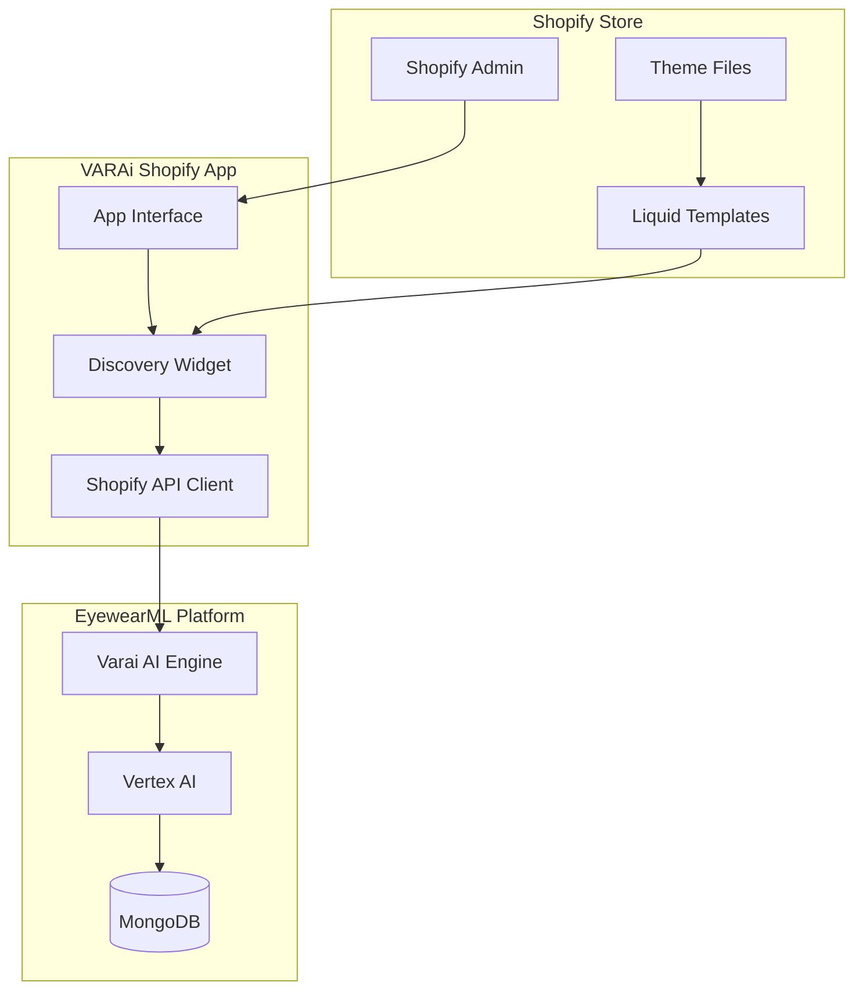
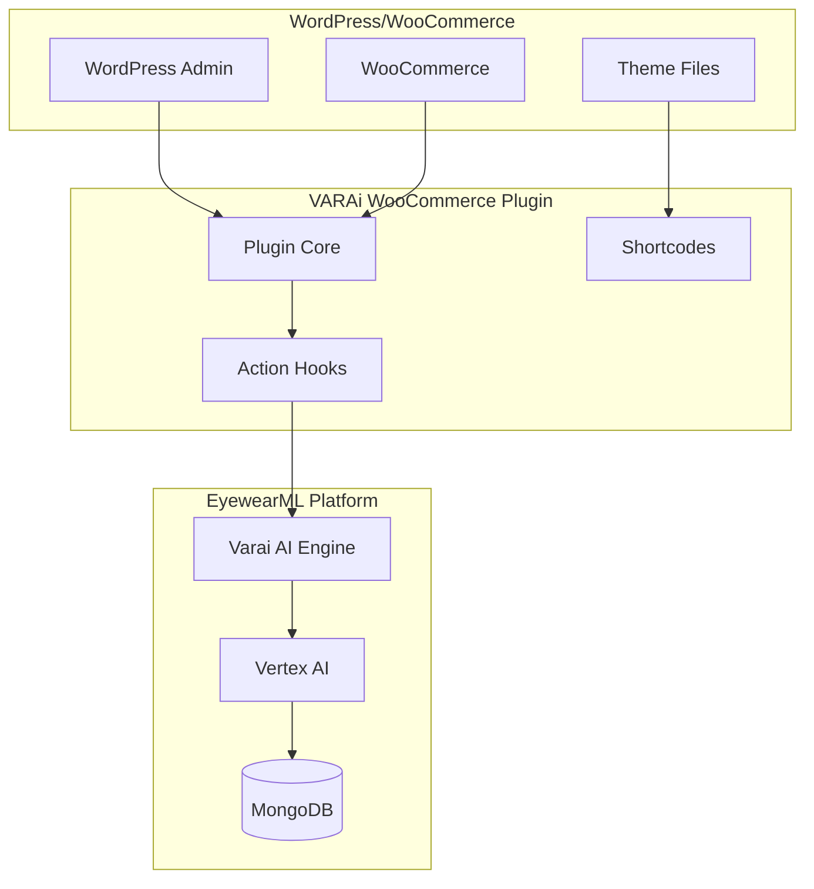
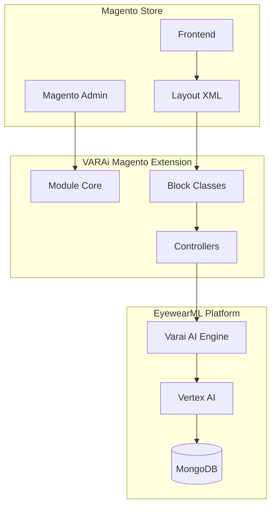
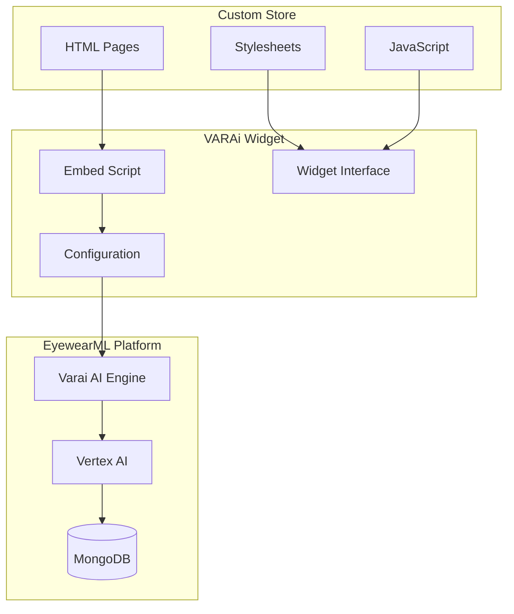

# Cross-Platform Integration Matrix
## EyewearML AI Discovery E-commerce Integration

## Document Information
- **Document Type**: Integration Requirements Matrix
- **System**: EyewearML Varai AI Discovery
- **Version**: 1.0
- **Date**: January 2025
- **Author**: Agent 1 - Requirements Analysis Agent

## Executive Summary

This matrix defines the integration requirements, capabilities, and constraints across all supported e-commerce platforms for EyewearML's AI Discovery system. It ensures consistent functionality while accommodating platform-specific limitations and opportunities.

## Platform Overview

| Platform | Market Share | Integration Type | Complexity | Priority |
|----------|-------------|------------------|------------|----------|
| Shopify | 32% | Native App | Medium | High |
| WooCommerce | 28% | WordPress Plugin | Low | High |
| Magento | 7% | Extension | High | Medium |
| BigCommerce | 4% | App | Medium | Medium |
| HTML/Custom | 29% | Widget Embed | Low | High |

## Feature Compatibility Matrix

### Core AI Discovery Features

| Feature | Shopify | WooCommerce | Magento | BigCommerce | HTML/Custom |
|---------|---------|-------------|---------|-------------|-------------|
| **Face Analysis** | ✅ Full | ✅ Full | ✅ Full | ✅ Full | ✅ Full |
| **AI Chatbot** | ✅ Native | ✅ Plugin | ✅ Module | ✅ App | ✅ Widget |
| **Virtual Try-On** | ✅ Embedded | ✅ Shortcode | ✅ Block | ✅ Widget | ✅ Iframe |
| **Personalized Recommendations** | ✅ Full | ✅ Full | ✅ Full | ✅ Full | ✅ Full |
| **Analytics Tracking** | ✅ Native | ✅ Hooks | ✅ Events | ✅ API | ✅ JS Events |
| **Mobile Optimization** | ✅ Responsive | ✅ Responsive | ✅ Responsive | ✅ Responsive | ✅ Responsive |

### Platform-Specific Capabilities

| Capability | Shopify | WooCommerce | Magento | BigCommerce | HTML/Custom |
|------------|---------|-------------|---------|-------------|-------------|
| **Theme Integration** | Liquid Templates | PHP Hooks | XML Layout | Stencil | CSS/JS |
| **Admin Dashboard** | App Interface | WP Admin | Magento Admin | Control Panel | Standalone |
| **Product Sync** | Admin API | WC API | REST API | Store API | Manual/API |
| **Customer Data** | Customer API | User Meta | Customer Entity | Customer API | Local Storage |
| **Order Tracking** | Webhook | Action Hooks | Observer | Webhook | Custom Events |
| **Payment Integration** | Native | WooCommerce | Built-in | Native | Third-party |

### Technical Implementation Matrix

| Component | Shopify | WooCommerce | Magento | BigCommerce | HTML/Custom |
|-----------|---------|-------------|---------|-------------|-------------|
| **Frontend Framework** | React/Polaris | jQuery/React | Knockout.js | Handlebars | Vanilla JS/React |
| **Backend Language** | Node.js | PHP | PHP | Node.js/PHP | Any |
| **Database Integration** | External API | MySQL | MySQL | External API | External API |
| **Authentication** | OAuth 2.0 | WordPress Auth | Magento Auth | OAuth 2.0 | API Key |
| **Deployment Method** | App Store | Plugin Directory | Marketplace | App Store | CDN/Self-hosted |

## Integration Architecture by Platform

### Shopify Integration Architecture

### WooCommerce Integration Architecture

### Magento Integration Architecture

### HTML/Custom Store Architecture

## Data Synchronization Matrix

### Product Data Synchronization

| Data Type | Shopify | WooCommerce | Magento | BigCommerce | HTML/Custom |
|-----------|---------|-------------|---------|-------------|-------------|
| **Product Catalog** | Admin API | REST API | REST API | Store API | Manual Import |
| **Inventory Levels** | Webhook | Action Hook | Observer | Webhook | Polling API |
| **Pricing Updates** | Webhook | Action Hook | Observer | Webhook | Manual Update |
| **Product Images** | CDN URLs | Media Library | Media Storage | CDN URLs | External URLs |
| **Variants/Options** | Variant API | Product Meta | Configurable | Option Sets | Custom Fields |
| **Categories** | Collection API | Taxonomy | Category Tree | Category API | Tag System |

### Customer Data Synchronization

| Data Type | Shopify | WooCommerce | Magento | BigCommerce | HTML/Custom |
|-----------|---------|-------------|---------|-------------|-------------|
| **Customer Profiles** | Customer API | User Meta | Customer Entity | Customer API | Local Storage |
| **Preferences** | Metafields | User Meta | Customer Attributes | Custom Fields | Cookies/Storage |
| **Purchase History** | Order API | Order Meta | Order History | Order API | External Tracking |
| **Face Analysis Data** | App Data | Transient | Session Storage | App Data | Session Storage |
| **Recommendations** | App Data | Post Meta | Cache | App Data | Local Cache |

### Order and Analytics Synchronization

| Data Type | Shopify | WooCommerce | Magento | BigCommerce | HTML/Custom |
|-----------|---------|-------------|---------|-------------|-------------|
| **Order Creation** | Webhook | Action Hook | Observer | Webhook | API Call |
| **Order Updates** | Webhook | Action Hook | Observer | Webhook | Polling |
| **Payment Status** | Webhook | Payment Hook | Payment Observer | Webhook | Payment Gateway |
| **Analytics Events** | App Analytics | Custom Events | Custom Events | Analytics API | Google Analytics |
| **Conversion Tracking** | Pixel API | WooCommerce Analytics | Magento Analytics | Analytics API | Custom Tracking |

## Installation and Setup Matrix

### Installation Methods

| Platform | Installation Method | Approval Process | Time to Deploy |
|----------|-------------------|------------------|----------------|
| **Shopify** | App Store | Shopify Review (2-4 weeks) | 1-click install |
| **WooCommerce** | Plugin Directory | WordPress Review (1-2 weeks) | 1-click install |
| **Magento** | Marketplace | Magento Review (2-3 weeks) | Composer install |
| **BigCommerce** | App Store | BigCommerce Review (2-4 weeks) | 1-click install |
| **HTML/Custom** | Script Embed | No approval | Immediate |

### Configuration Requirements

| Configuration | Shopify | WooCommerce | Magento | BigCommerce | HTML/Custom |
|---------------|---------|-------------|---------|-------------|-------------|
| **API Keys** | Auto-generated | Manual entry | Manual entry | Auto-generated | Manual entry |
| **Webhook Setup** | Automatic | Manual | Manual | Automatic | Manual |
| **Theme Integration** | Guided | Manual | Manual | Guided | Manual |
| **Product Mapping** | Automatic | Semi-automatic | Manual | Automatic | Manual |
| **Analytics Setup** | Automatic | Manual | Manual | Automatic | Manual |

## Performance Optimization Matrix

### Loading Performance

| Metric | Shopify | WooCommerce | Magento | BigCommerce | HTML/Custom |
|--------|---------|-------------|---------|-------------|-------------|
| **Initial Load Time** | <2s | <3s | <4s | <2s | <1s |
| **Widget Render Time** | <1s | <1.5s | <2s | <1s | <0.5s |
| **Face Analysis Time** | <5s | <5s | <5s | <5s | <5s |
| **Recommendation Time** | <3s | <3s | <3s | <3s | <3s |
| **Mobile Performance** | 90+ | 85+ | 80+ | 90+ | 95+ |

### Scalability Considerations

| Factor | Shopify | WooCommerce | Magento | BigCommerce | HTML/Custom |
|--------|---------|-------------|---------|-------------|-------------|
| **Concurrent Users** | 10,000+ | 1,000+ | 5,000+ | 10,000+ | Unlimited |
| **Database Load** | External | Shared | Shared | External | External |
| **CDN Support** | Built-in | Plugin | Extension | Built-in | Required |
| **Caching Strategy** | App-level | WordPress | Magento | App-level | Browser |
| **Auto-scaling** | Platform | Hosting | Hosting | Platform | Custom |

## Security and Compliance Matrix

### Security Features

| Security Aspect | Shopify | WooCommerce | Magento | BigCommerce | HTML/Custom |
|-----------------|---------|-------------|---------|-------------|-------------|
| **Data Encryption** | TLS 1.3 | TLS 1.2+ | TLS 1.2+ | TLS 1.3 | TLS 1.3 |
| **Authentication** | OAuth 2.0 | WordPress Auth | Magento Auth | OAuth 2.0 | API Key |
| **PCI Compliance** | Built-in | Extension | Built-in | Built-in | Third-party |
| **GDPR Compliance** | App-level | Plugin | Extension | App-level | Custom |
| **Data Storage** | Platform | Database | Database | Platform | External |

### Privacy Compliance

| Privacy Feature | Shopify | WooCommerce | Magento | BigCommerce | HTML/Custom |
|-----------------|---------|-------------|---------|-------------|-------------|
| **Consent Management** | ✅ | ✅ | ✅ | ✅ | ✅ |
| **Data Deletion** | ✅ | ✅ | ✅ | ✅ | ✅ |
| **Data Portability** | ✅ | ✅ | ✅ | ✅ | ✅ |
| **Cookie Management** | ✅ | ✅ | ✅ | ✅ | ✅ |
| **Face Data Handling** | Client-side | Client-side | Client-side | Client-side | Client-side |

## Analytics and Reporting Matrix

### Available Metrics

| Metric Category | Shopify | WooCommerce | Magento | BigCommerce | HTML/Custom |
|-----------------|---------|-------------|---------|-------------|-------------|
| **Discovery Analytics** | ✅ Full | ✅ Full | ✅ Full | ✅ Full | ✅ Full |
| **Conversion Tracking** | ✅ Native | ✅ Enhanced | ✅ Enhanced | ✅ Native | ✅ Custom |
| **Customer Journey** | ✅ Detailed | ✅ Detailed | ✅ Detailed | ✅ Detailed | ✅ Basic |
| **Revenue Attribution** | ✅ Native | ✅ Plugin | ✅ Extension | ✅ Native | ✅ Custom |
| **A/B Testing** | ✅ Built-in | ✅ Plugin | ✅ Extension | ✅ Built-in | ✅ Custom |

### Reporting Capabilities

| Report Type | Shopify | WooCommerce | Magento | BigCommerce | HTML/Custom |
|-------------|---------|-------------|---------|-------------|-------------|
| **Real-time Dashboard** | ✅ | ✅ | ✅ | ✅ | ✅ |
| **Historical Reports** | ✅ | ✅ | ✅ | ✅ | ✅ |
| **Custom Reports** | ✅ | ✅ | ✅ | ✅ | ✅ |
| **Export Capabilities** | ✅ | ✅ | ✅ | ✅ | ✅ |
| **API Access** | ✅ | ✅ | ✅ | ✅ | ✅ |

## Customization and Branding Matrix

### Customization Options

| Customization | Shopify | WooCommerce | Magento | BigCommerce | HTML/Custom |
|---------------|---------|-------------|---------|-------------|-------------|
| **Color Themes** | ✅ Full | ✅ Full | ✅ Full | ✅ Full | ✅ Full |
| **Logo Integration** | ✅ | ✅ | ✅ | ✅ | ✅ |
| **Custom CSS** | ✅ | ✅ | ✅ | ✅ | ✅ |
| **Widget Positioning** | ✅ | ✅ | ✅ | ✅ | ✅ |
| **Conversation Flow** | ✅ | ✅ | ✅ | ✅ | ✅ |
| **Language Support** | ✅ Multi | ✅ Multi | ✅ Multi | ✅ Multi | ✅ Multi |

### Brand Integration

| Integration | Shopify | WooCommerce | Magento | BigCommerce | HTML/Custom |
|-------------|---------|-------------|---------|-------------|-------------|
| **Theme Compatibility** | ✅ Auto | ✅ Manual | ✅ Manual | ✅ Auto | ✅ Custom |
| **Font Matching** | ✅ | ✅ | ✅ | ✅ | ✅ |
| **Style Inheritance** | ✅ | ✅ | ✅ | ✅ | ✅ |
| **Responsive Design** | ✅ | ✅ | ✅ | ✅ | ✅ |
| **Mobile Optimization** | ✅ | ✅ | ✅ | ✅ | ✅ |

## Support and Maintenance Matrix

### Support Channels

| Support Type | Shopify | WooCommerce | Magento | BigCommerce | HTML/Custom |
|--------------|---------|-------------|---------|-------------|-------------|
| **Documentation** | ✅ Comprehensive | ✅ Comprehensive | ✅ Comprehensive | ✅ Comprehensive | ✅ Comprehensive |
| **Video Tutorials** | ✅ | ✅ | ✅ | ✅ | ✅ |
| **Live Chat** | ✅ | ✅ | ✅ | ✅ | ✅ |
| **Email Support** | ✅ | ✅ | ✅ | ✅ | ✅ |
| **Phone Support** | ✅ Premium | ✅ Premium | ✅ Premium | ✅ Premium | ✅ Premium |

### Maintenance Requirements

| Maintenance | Shopify | WooCommerce | Magento | BigCommerce | HTML/Custom |
|-------------|---------|-------------|---------|-------------|-------------|
| **Auto Updates** | ✅ | ✅ | ❌ | ✅ | ❌ |
| **Compatibility Testing** | Platform | Manual | Manual | Platform | Manual |
| **Security Patches** | Automatic | Manual | Manual | Automatic | Manual |
| **Performance Monitoring** | Built-in | Plugin | Extension | Built-in | Custom |
| **Backup Management** | Platform | Plugin | Extension | Platform | Custom |

## Migration and Upgrade Matrix

### Data Migration

| Migration Type | From/To | Complexity | Estimated Time | Data Preservation |
|----------------|---------|------------|----------------|-------------------|
| **Shopify → WooCommerce** | High | 2-4 weeks | 95% |
| **WooCommerce → Shopify** | Medium | 1-2 weeks | 90% |
| **Magento → Shopify** | High | 3-4 weeks | 85% |
| **BigCommerce → Shopify** | Medium | 1-2 weeks | 95% |
| **HTML → Any Platform** | Low | 1 week | 100% |

### Upgrade Paths

| Current Version | Target Version | Compatibility | Migration Required |
|-----------------|----------------|---------------|-------------------|
| **Legacy Widget** | AI Discovery v1.0 | ✅ | Automatic |
| **Basic Chatbot** | AI Discovery v1.0 | ✅ | Configuration |
| **Custom Integration** | AI Discovery v1.0 | ⚠️ | Manual |
| **Competitor Solution** | AI Discovery v1.0 | ❌ | Full Migration |

## Cost and Licensing Matrix

### Pricing Models

| Platform | Installation Cost | Monthly Fee | Transaction Fee | Enterprise |
|----------|------------------|-------------|-----------------|------------|
| **Shopify** | Free | $29-299/month | 0.5-2% | Custom |
| **WooCommerce** | Free | $0-99/month | 0% | Custom |
| **Magento** | Free | $0-199/month | 0% | Custom |
| **BigCommerce** | Free | $29-399/month | 0% | Custom |
| **HTML/Custom** | Free | $19-199/month | 0% | Custom |

### Feature Tiers

| Feature | Basic | Professional | Enterprise |
|---------|-------|-------------|------------|
| **Face Analysis** | ✅ | ✅ | ✅ |
| **AI Recommendations** | ✅ | ✅ | ✅ |
| **Virtual Try-On** | ✅ | ✅ | ✅ |
| **Analytics Dashboard** | Basic | Advanced | Custom |
| **API Access** | Limited | Full | Unlimited |
| **Custom Branding** | ❌ | ✅ | ✅ |
| **White Label** | ❌ | ❌ | ✅ |
| **Priority Support** | ❌ | ✅ | ✅ |

## Implementation Priority Matrix

### Development Priority

| Platform | Business Impact | Technical Complexity | Resource Requirement | Priority Score |
|----------|----------------|---------------------|---------------------|----------------|
| **Shopify** | High (32% market) | Medium | 3 developers × 8 weeks | 9/10 |
| **HTML/Custom** | High (29% market) | Low | 2 developers × 4 weeks | 8/10 |
| **WooCommerce** | High (28% market) | Low | 2 developers × 6 weeks | 8/10 |
| **Magento** | Medium (7% market) | High | 4 developers × 10 weeks | 6/10 |
| **BigCommerce** | Medium (4% market) | Medium | 3 developers × 8 weeks | 5/10 |

### Launch Sequence

| Phase | Platform | Timeline | Dependencies |
|-------|----------|----------|--------------|
| **Phase 1** | Shopify | Weeks 1-8 | Core AI engine |
| **Phase 2** | HTML/Custom | Weeks 4-8 | Widget framework |
| **Phase 3** | WooCommerce | Weeks 6-12 | WordPress integration |
| **Phase 4** | Magento | Weeks 10-20 | Complex architecture |
| **Phase 5** | BigCommerce | Weeks 16-24 | Market validation |

## Quality Assurance Matrix

### Testing Requirements

| Test Type | Shopify | WooCommerce | Magento | BigCommerce | HTML/Custom |
|-----------|---------|-------------|---------|-------------|-------------|
| **Unit Testing** | ✅ 90%+ | ✅ 90%+ | ✅ 90%+ | ✅ 90%+ | ✅ 90%+ |
| **Integration Testing** | ✅ Required | ✅ Required | ✅ Required | ✅ Required | ✅ Required |
| **Performance Testing** | ✅ Load | ✅ Load | ✅ Load | ✅ Load | ✅ Load |
| **Security Testing** | ✅ Penetration | ✅ Penetration | ✅ Penetration | ✅ Penetration | ✅ Penetration |
| **Accessibility Testing** | ✅ WCAG 2.1 | ✅ WCAG 2.1 | ✅ WCAG 2.1 | ✅ WCAG 2.1 | ✅ WCAG 2.1 |

### Browser Compatibility

| Browser | Shopify | WooCommerce | Magento | BigCommerce | HTML/Custom |
|---------|---------|-------------|---------|-------------|-------------|
| **Chrome** | ✅ Latest 3 | ✅ Latest 3 | ✅ Latest 3 | ✅ Latest 3 | ✅ Latest 3 |
| **Firefox** | ✅ Latest 3 | ✅ Latest 3 | ✅ Latest 3 | ✅ Latest 3 | ✅ Latest 3 |
| **Safari** | ✅ Latest 2 | ✅ Latest 2 | ✅ Latest 2 | ✅ Latest 2 | ✅ Latest 2 |
| **Edge** | ✅ Latest 2 | ✅ Latest 2 | ✅ Latest 2 | ✅ Latest 2 | ✅ Latest 2 |
| **Mobile Safari** | ✅ iOS 14+ | ✅ iOS 14+ | ✅ iOS 14+ | ✅ iOS 14+ | ✅ iOS 14+ |
| **Chrome Mobile** | ✅ Android 8+ | ✅ Android 8+ | ✅ Android 8+ | ✅ Android 8+ | ✅ Android 8+ |

## Success Metrics by Platform

### Conversion Metrics

| Platform | Current Baseline | Target Improvement | Success Threshold |
|----------|------------------|-------------------|-------------------|
| **Shopify** | 2.5% | +40% (3.5%) | >3.0% |
| **WooCommerce** | 2.1% | +40% (2.9%) | >2.5% |
| **Magento** | 1.8% | +40% (2.5%) | >2.2% |
| **BigCommerce** | 2.3% | +40% (3.2%) | >2.8% |
| **HTML/Custom** | 1.5% | +40% (2.1%) | >1.8% |

### Engagement Metrics

| Platform | VTO Engagement | Session Duration | Return Rate |
|----------|----------------|------------------|-------------|
| **Shopify** | >60% | >5 minutes | >30% |
| **WooCommerce** | >55% | >4 minutes | >25% |
| **Magento** | >50% | >4 minutes | >25% |
| **BigCommerce** | >60% | >5 minutes | >30% |
| **HTML/Custom** | >65% | >6 minutes | >35% |

## Risk Assessment by Platform

### Technical Risks

| Risk | Shopify | WooCommerce | Magento | BigCommerce | HTML/Custom |
|------|---------|-------------|---------|-------------|-------------|
| **API Limitations** | Medium | Low | High | Medium | Low |
| **Theme Conflicts** | Medium | High | High | Medium | Low |
| **Performance Impact** | Low | Medium | High | Low | Low |
| **Security Vulnerabilities** | Low | Medium | High | Low | Medium |
| **Maintenance Overhead** | Low | Medium | High | Low | High |

### Business Risks

| Risk | Shopify | WooCommerce | Magento | BigCommerce | HTML/Custom |
|------|---------|-------------|---------|-------------|-------------|
| **Market Acceptance** | Low | Medium | High | Medium | Low |
| **Competitive Response** | High | Medium | Low | Medium | Low |
| **Platform Changes** | Medium | Low | High | Medium | Low |
| **Support Burden** | Low | Medium | High | Low | High |
| **Revenue Impact** | Low | Low | Medium | Low | Medium |

## Conclusion

This cross-platform integration matrix provides a comprehensive framework for implementing EyewearML's AI Discovery system across all major e-commerce platforms. The matrix identifies:

1. **Platform Priorities**: Shopify and HTML/Custom stores offer the highest ROI
2. **Technical Complexity**: Magento requires the most development effort
3. **Feature Parity**: Core AI features can be implemented consistently across all platforms
4. **Performance Targets**: Platform-specific optimizations needed for optimal user experience
5. **Risk Mitigation**: Proactive identification of platform-specific challenges

The implementation should follow the phased approach outlined, starting with Shopify and HTML/Custom stores to capture the largest market segments quickly, then expanding to WooCommerce, Magento, and BigCommerce based on market demand and resource availability.

Success will be measured through platform-specific KPIs while maintaining consistent core functionality and user experience across all integrations.